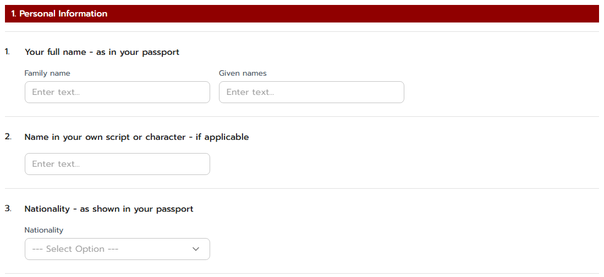
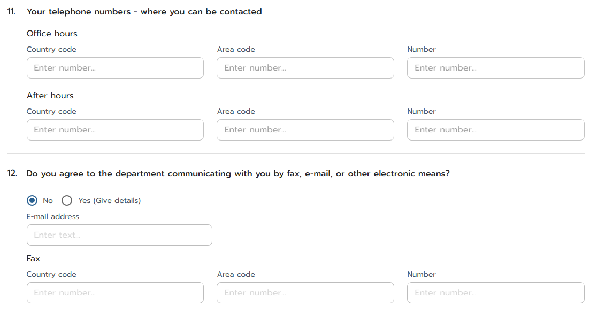
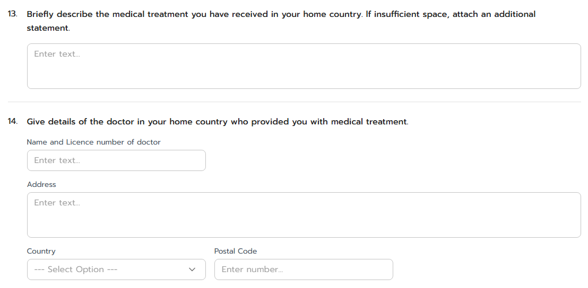
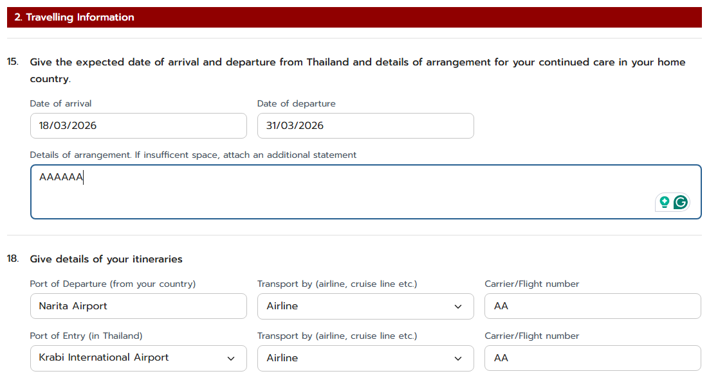
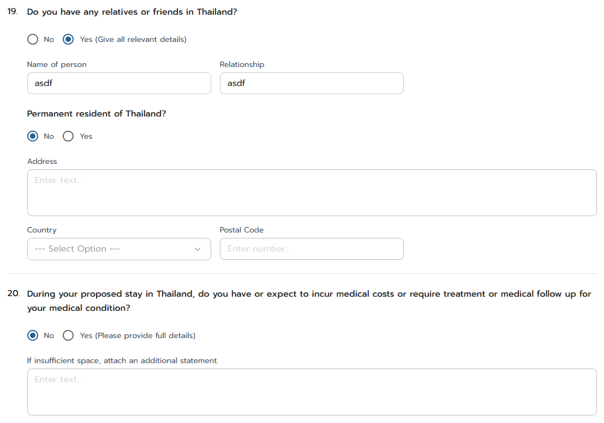
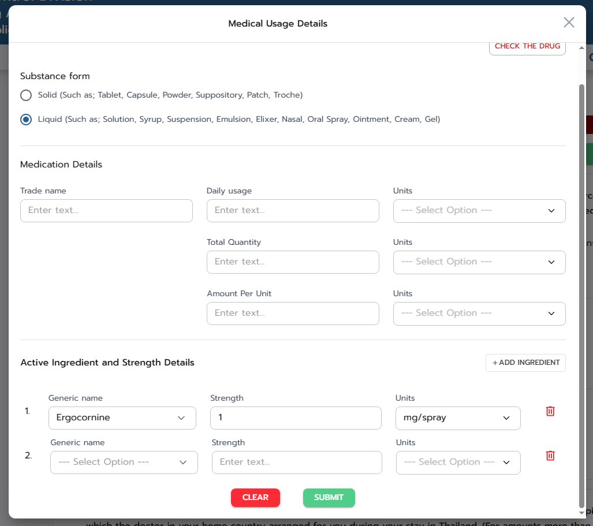
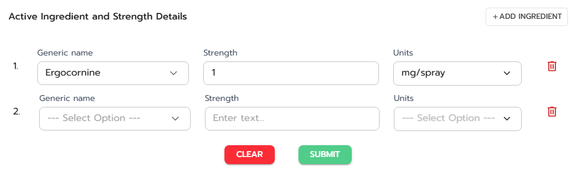

## Application for an **inbound carrying** by traveller under treatment of medical preparations containing substances under control of the single convention on narcotic drugs, 1961 and the convention on psychotropic substances, 1971 [IC-1]
## Application for an **outbound carrying** by traveller under treatment of medical preparations containing substances under control of the single convention on narcotic drugs, 1961 and the convention on psychotropic substances, 1971 [OC-1]

---

#### (dbo.MasterRequisitionType Id = 23, 24)
### Links

- [Figma Group Doc](https://www.figma.com/design/0YEqdcSpC2hZKulzEl54LH/-FDA68--Group-Doc)
- [Data Dic - Master Data real](https://docs.google.com/spreadsheets/d/1WpRC41tmqyOc8zVaxTVuwLxGgmi7inZATo8_LcCTXgE)
- [FDA68 ScreenList Permit](https://docs.google.com/spreadsheets/d/1uKgx0P44X8NDJTdI_bmBAwMmZmILhjkv0fHYKaZywnI/)
- [FDA68 Data Dic - Permit real](https://docs.google.com/spreadsheets/d/12esKmz91FjovuOuxEVzF6tZDfe5Rdw_e_PAKkgL0ksU/)

- [Figma ยาติดตัว (FigJam)](https://www.figma.com/board/8Dw8uO6ERmYhbAsToiOZgm/%E0%B8%A2%E0%B8%B2%E0%B8%95%E0%B8%B4%E0%B8%94%E0%B8%95%E0%B8%B1%E0%B8%A7)

- [UAT URL - https://permitfortraveler.vercel.app](https://permitfortraveler.vercel.app)

#### เอกสารจากเจ้าหน้าที่
- [รวม Link เอกสารแนบ](https://docs.google.com/spreadsheets/d/1Tnz5E6aaWrrCA9C2pav3H_k-QUgSM0WpExkef0Ws-gI)
  - [03 ยาติดตัว](https://docs.google.com/spreadsheets/d/10X0-dsu49gNVBW77nDRY51Gh2whJQVaxbaBYPRsJlrM)
- [NARCO_list_update_15_09_2025_NEW.pdf](Documents\ICOC\DRUGLIST\NARCO_list_update_15_09_2025_NEW.pdf)
- [PHYCHO_list_update_25_07_2025.pdf](Documents\ICOC\DRUGLIST\PHYCHO_list_update_25_07_2025.pdf)

## ประเภทการคำขอ

| ลำดับ | ประเภทการคำขอ |
|:---:|:---:|
| 1 | IC-1 |
| 2 | OC-1 |

#### ตารางที่เกี่ยวข้อง (IC-1, OC-1)

| ลำดับ | ชื่อตาราง | คำอธิบาย | ตาราง | ข้อมูล |
|:---:|---|---|:---:|:---:|
| 1 | `TravelerPermitUser` | ผู้สมัครใช้งานระบบ Permit for traveler Carrying Narcotics | ✔ ทำตารางแล้ว | Transaction |
| 2 | `Requisition` | คำขอ | ✔ ทำตารางแล้ว | Transaction |
| 3 | `RequisitionTraveler` | ข้อมูลผู้สมัครใช้งานระบบ | ✔ ทำตารางแล้ว | Transaction |
| 4 | `RequisitionMedicationItem` | รายการยาที่ขอในคำขอยาติดตัว | ✔ ทำตารางแล้ว | Transaction |
| 5 | `RequisitionMedicationIngredient` | ส่วนประกอบของยาที่ขอในคำขอยาติดตัว | ✔ ทำตารางแล้ว | Transaction |
| 6 | `MasterMedicationUnit` | หน่วยของยาที่ขอในคำขอยาติดตัว | ✔ ทำตารางแล้ว | ✔ เพิ่มข้อมูลแล้ว (54 records) |
| 7 | `MasterNarcoticDrugForTraveler` | ยา/สารเสพติดสำหรับผู้เดินทาง | ✔ ทำตารางแล้ว | ✔ เพิ่มข้อมูลแล้ว (126 records) |
| 8 | `MasterTravelerPort` | ท่า/สนามบินของการเดินทาง | ✔ ทำตารางแล้ว | ✔ เพิ่มข้อมูลแล้ว |
| 9 | `LicenseTraveler` | ใบอนุญาต | ❌ ยังไม่ทำตาราง | Transaction |
| 10 | `LicenseMedicationItem` | รายการยาที่ขอในใบอนุญาต | ❌ ยังไม่ทำตาราง | Transaction |

## 🔷 Field Condition (IC-1, OC-1)

### ตาราง Requisition

| ลำดับ | Label | Table.Field | Condition | Remark |
|:---:|---|---|---|---|
| 1 | ผู้สร้าง | `Requisition`.`CreateBy` | ผู้สร้าง อ้างอิง `TravelerPermitUser`.`Id` |  |
| 2 | วันที่สร้าง | `Requisition`.`CreateOn` | วันที่สร้าง |  |
| 3 | ผู้แก้ไข | `Requisition`.`UpdateBy` | ผู้แก้ไข อ้างอิง `TravelerPermitUser`.`Id` |  |
| 4 | วันที่แก้ไข | `Requisition`.`UpdateOn` | วันที่แก้ไข |  |
| 5 | เลขที่คำขอ | `Requisition`.`RequisitionNo` | เลขที่คำขอ |  |
| 6 | ประเภทคำขอ | `Requisition`.`TravelerPermitUserId` | ประเภทคำขอ อ้างอิง `MasterRequisitionType`.`Id`   IC = `23`   OC = `24` |  |
| 7 | OperationType | `Requisition`.`OperationTypeId` | ส่ง ?? | |
| 8 | Status | `Requisition`.`Status` | ส่ง 1 ?? |  |

<!-- 1-3 -->

### ตาราง RequisitionTraveler รายละเอียดนักท่องเที่ยว

| ลำดับ | Label | Table.Field | Data type | Condition | Remark |
|:---:|---|---|---|---|---|
| u | ผู้สร้าง | `RequisitionTraveler`.`CreateBy` | ผู้สร้าง อ้างอิง `TravelerPermitUser`.`Id` |  |
| v | วันที่สร้าง | `RequisitionTraveler`.`CreateOn` | วันที่สร้าง |  |
| w | ผู้แก้ไข | `RequisitionTraveler`.`UpdateBy` | ผู้แก้ไข อ้างอิง `TravelerPermitUser`.`Id` |  |
| x | วันที่แก้ไข | `RequisitionTraveler`.`UpdateOn` | วันที่แก้ไข |  |
| y | คำขอ | `RequisitionTraveler`.`RequisitionId` | int | คำขอ อ้างอิง `Requisition`.`Id` |  |
| z | ข้อมูลผู้สมัครใช้งานระบบ | `RequisitionTraveler`.`TravelerPermitUserId` | int | ข้อมูลผู้สมัครใช้งานระบบ Permit for traveler Carrying Narcotics อ้างอิง `TravelerPermitUser`.`Id` | |
| 1 | FamilyName | `RequisitionTraveler`.`FamilyName` | varchar(255) | นามสกุลของผู้เดินทาง | |
| 2 | GivenName | `RequisitionTraveler`.`GivenName` | varchar(255) | ชื่อตัวของผู้เดินทาง | |
| 3 | Name in your own script or character - if applicable | `RequisitionTraveler`.`NativeName` | varchar(255) | ชื่อ–นามสกุลตามภาษาเจ้าของประเทศ | |
| 4 | Nationality - as shown in your passport | `RequisitionTraveler`.`NationalityId` | int | สัญชาติ อ้างอิง `MasterNationality`.`Id` | |

<!-- 4-7 -->

| ลำดับ | Label | Table.Field | Data type | Condition | Remark |
|:---:|---|---|---|---|---|
| 5 | Passport number | `RequisitionTraveler`.`PassportNo` | varchar(50) | | |
| 6 | Country of Passport | `RequisitionTraveler`.`PassportCountryId` | int | ประเทศของพาสปอร์ต อ้างอิง `MasterCountry`.`Id` | |
| 7 | Date of issue | `RequisitionTraveler`.`PassportIssueDate` | Date time | วันที่ออกหนังสือเดินทาง | |
| 8 | Date of expiry | `RequisitionTraveler`.`PassportExpiryDate` | Date time |วันที่หนังสือเดินทางหมดอายุ | |
| 9 | Issuing authority / Place of issue as shown in your passport | `RequisitionTraveler`.`PassportIssuePlace` | varchar(500) | สถานที่ออกหนังสือเดินทาง | |
| 10 | Sex | `RequisitionTraveler`.`Sex` | char(1) | เพศของผู้เดินทาง (1=ชาย, 2=หญิง) | |
| 11 | Date of birth | `RequisitionTraveler`.`BirthDate` | Date time | วันเดือนปีเกิดของผู้เดินทาง | |
| 12 | Place of birth : Town/city | `RequisitionTraveler`.`BirthCity` | varchar(500) | เมืองที่เกิด | |
| 13 | Place of birth : Country | `RequisitionTraveler`.`BirthCountryId` | int | ประเทศที่เกิด อ้างอิง `MasterCountry`.`Id` | |

<!-- 8-10 -->

| ลำดับ | Label | Table.Field | Data type | Condition | Remark |
|:---:|---|---|---|---|---|
| 14 | Country where you live | `RequisitionTraveler`.`ResidenceCountryId` | int | ประเทศพำนัก อ้างอิง `MasterCountry`.`Id` | |
| 15 | Your current residential address : Current Address | `RequisitionTraveler`.`ResidentialAddress` | varchar(1000) | ที่อยู่ปัจจุบันของผู้เดินทาง | |
| 16 | Your current residential address : Country | `RequisitionTraveler`.`ResidentialCountryId` | int | ประเทศของที่อยู่ปัจจุบัน อ้างอิง `MasterCountry.Id` | |
| 17 | Your current residential address : Postal Code | `RequisitionTraveler`.`ResidentialPostalCode` | varchar(20) | รหัสไปรษณีย์ของที่อยู่ปัจจุบัน | |
| 18 | If the same as your residential address, write 'AS ABOVE'. | `RequisitionTraveler`.`IsCorrespondenceSame` | bit | ระบุว่าที่อยู่สำหรับติดต่อเป็นที่เดียวกับที่อยู่ปัจจุบันหรือไม่ `(1=ใช่,0=ไม่ใช่)` | **ทำ radio button เพิ่ม จากหน้าจอปัจจุบัน** |
| 19 | Address for correspondence : Current Address | `RequisitionTraveler`.`CorrespondenceAddress` | varchar(1000) | ถ้า IsCorrespondenceSame = `1` ให้ Disable text area แล้วเติมคำว่า "AS ABOVE" และบันทึกคำว่า "AS ABOVE" ลงในฐานข้อมูล | |
| 20 | Address for correspondence : Country | `RequisitionTraveler`.`CorrespondenceCountryId` | int | ประเทศของที่อยู่สำหรับติดต่อ อ้างอิง `MasterCountry.Id`   ถ้า IsCorrespondenceSame = `1` ให้ Disable | |
| 21 | Address for correspondence : Postal Code | `RequisitionTraveler`.`CorrespondencePostalCode` | varchar(20) | ถ้า IsCorrespondenceSame = `1` ให้ Disable | |

<!-- 11-12 -->

| ลำดับ | Label | Table.Field | Data type | Condition | Remark |
|:---:|---|---|---|---|---|
| 22 | telephone numbers : Office hours Country Code | `RequisitionTraveler`.`OfficePhoneCountryCode` | varchar(10) | รหัสประเทศของเบอร์โทรศัพท์ในเวลาราชการ | |
| 23 | telephone numbers : Office hours Area Code | `RequisitionTraveler`.`OfficePhoneAreaCode` | varchar(10) | รหัสพื้นที่ของเบอร์โทรศัพท์ในเวลาราชการ | |
| 24 | telephone numbers : Office hours Number | `RequisitionTraveler`.`OfficePhoneNumber` | varchar(50) | เบอร์โทรศัพท์ในเวลาราชการ | |
| 25 | telephone numbers : After hours Country Code | `RequisitionTraveler`.`AfterHourPhoneCountryCode` | varchar(10) | รหัสประเทศของเบอร์โทรศัพท์นอกเวลาราชการ | |
| 26 | telephone numbers : After hours Area Code | `RequisitionTraveler`.`AfterHourPhoneAreaCode` | varchar(10) | รหัสพื้นที่ของเบอร์โทรศัพท์นอกเวลาราชการ | |
| 27 | telephone numbers : After hours Number | `RequisitionTraveler`.`AfterHourPhoneNumber` | varchar(50) | เบอร์โทรศัพท์นอกเวลาราชการ | |
| 28 | department communicating : Email | `RequisitionTraveler`.`Email` | varchar(255) | อีเมล | |
| 29 | department communicating : Fax Country Code | `RequisitionTraveler`.`FaxCountryCode` | varchar(10) | รหัสประเทศของเบอร์โทรสาร | |
| 30 | department communicating : Fax Area Code | `RequisitionTraveler`.`FaxAreaCode` | varchar(10) | รหัสพื้นที่ของเบอร์โทรสาร | |
| 31 | department communicating : Fax Number | `RequisitionTraveler`.`FaxNumber` | varchar(50) | เบอร์โทรสาร | |
| 32 | Allow Electronic Contact | `RequisitionTraveler`.`AllowElectronicContact` | bit | อนุญาตให้ติดต่อทางอิเล็กทรอนิกส์หรือไม่ (1=ใช่,0=ไม่ใช่) | |

<!-- 13-14 -->

| ลำดับ | Label | Table.Field | Data type | Condition | Remark |
|:---:|---|---|---|---|---|
| 33 | Briefly describe the medical treatment you have received in your home country. lf insufficient space, attach an additional statement. | `RequisitionTraveler`.`MedicalTreatmentDetail` | nvarchar(2000) | รายละเอียดการรักษาทางการแพทย์ที่ผู้เดินทางได้รับในประเทศต้นทาง | |
| 34 | details of the doctor : Name and Licence number of doctor | `RequisitionTraveler`.`DoctorNameAndLicense` | varchar(255) | ชื่อและใบอนุญาตของแพทย์ผู้ให้การรักษา | |
| 35 | details of the doctor : Address | `RequisitionTraveler`.`DoctorAddress` | varchar(1000) | ที่อยู่ของแพทย์ผู้ให้การรักษา | |
| 36 | details of the doctor : Country | `RequisitionTraveler`.`DoctorCountryId` | int | ประเทศของแพทย์ผู้ให้การรักษา อ้างอิง `MasterCountry`.`Id` | |
| 37 | details of the doctor : Postal Code | `RequisitionTraveler`.`DoctorPostalCode` | varchar(20) | รหัสไปรษณีย์ของแพทย์ผู้ให้การรักษา | |

<!-- 15, 18 -->

| ลำดับ | Label | Table.Field | Data type | Condition | Remark |
|:---:|---|---|---|---|---|
| 38 | Give the expected date of arrival and departure from Thailand : Date of arrival | `RequisitionTraveler`.`ArrivalDate` | datetime |วันที่เดินทางมาถึงประเทศไทย | |
| 39 | Give the expected date of arrival and departure from Thailand : Date of departure | `RequisitionTraveler`.`DepartureDate` | datetime |วันที่เดินทางออกจากประเทศไทย | |
| 40 | Give the expected date of arrival and departure from Thailand : Details of arrangement | `RequisitionTraveler`.`ArrangementDetail` | varchar(2000) | รายละเอียดการจัดการดูแลรักษาต่อในประเทศต้นทาง | |
| 41 | Give details of your itineraries : Port of Departure (from your country) | `RequisitionTraveler`.`DeparturePort` | varchar(255) | ท่า/สนามบินต้นทางในประเทศต้นทาง | |
| 42 | Give details of your itineraries : Transport by | `RequisitionTraveler`.`DeparturePortId` | int | ท่า/สนามบินต้นทางในประเทศต้นทาง อ้างอิง `MasterTravelerPort`.`Id` | |
| 43 | Give details of your itineraries : Carrier/Flight number | `RequisitionTraveler`.`DepartureTransportBy` | char(1) | ประเภทการเดินทางขาออก (A=Airline, B=Bus / Coach Operator, C=Cruise Line, F=Ferry Operator, P=Private Vehicle, T=Train Operator) | |
| 44 | DepartureCarrierAndFlightNumber | `RequisitionTraveler`.`DepartureCarrierAndFlightNumber` | varchar(255) | ชื่อสายการบินหรือผู้ให้บริการขนส่งขาออก และหมายเลขเที่ยวบินหรือหมายเลขพาหนะขาออก | |
| 45 | Give details of your itineraries : Port of Entry (in Thailand) | `RequisitionTraveler`.`EntryPort` | varchar(255) | ท่า/สนามบินที่เดินทางเข้า | |
| 46 | Give details of your itineraries : Transport by | `RequisitionTraveler`.`EntryPortId` | int | ท่า/สนามบินที่เดินทางเข้า อ้างอิง `MasterTravelerPort`.`Id` | |
| 47 | Give details of your itineraries : Carrier/Flight number | `RequisitionTraveler`.`EntryTransportBy` | char(1) | ประเภทการเดินทางเข้า (A=Airline, B=Bus / Coach Operator, C=Cruise Line, F=Ferry Operator, P=Private Vehicle, T=Train Operator) | |
| 48 | EntryCarrierAndFlightNumber | `RequisitionTraveler`.`EntryCarrierAndFlightNumber` | varchar(255) | ชื่อสายการบินหรือผู้ให้บริการขนส่งขาเข้า และหมายเลขเที่ยวบินหรือหมายเลขพาหนะขาเข้า | |

<!-- 19, 20 -->

| ลำดับ | Label | Table.Field | Data type | Condition | Remark |
|:---:|---|---|---|---|---|
| 49 | any relatives or friends in Thailand? | `RequisitionTraveler`.`HasRelativeInThailand` | bit | ระบุว่าผู้เดินทางมีญาติหรือเพื่อนอยู่ในประเทศไทยหรือไม่ (1=มี, 0=ไม่มี) | |
| 50 | Name of person | `RequisitionTraveler`.`ThailandContactName` | varchar(255) | ชื่อญาติหรือเพื่อนที่ติดต่อได้ในประเทศไทย | |
| 51 | Relationship | `RequisitionTraveler`.`ThailandContactRelationship` | varchar(100) | ความสัมพันธ์กับผู้เดินทาง | |
| 52 | Permanent resident of Thailand? | `RequisitionTraveler`.`ThailandContactIsPermanentResident` | bit | ระบุว่าผู้นั้นเป็นผู้มีถิ่นที่อยู่ในประเทศไทยหรือไม่ (1=ใช่, 0=ไม่ใช่) | |
| 53 | Address | `RequisitionTraveler`.`ThailandContactAddress` | varchar(1000) | ที่อยู่ของผู้นั้น | |
| 54 | Country | `RequisitionTraveler`.`ThailandContactCountryId` | int | ประเทศของผู้นั้น อ้างอิง `MasterCountry`.`Id` | |
| 55 | Postal Code | `RequisitionTraveler`.`ThailandContactPostalCode` | varchar(20) | รหัสไปรษณีย์ของผู้นั้น | |
| 56 | During your proposed stay in Thailand, do you have or expect to incur medical costs or require treatment or medical follow up for your medical condition? | `RequisitionTraveler`.`HasMedicalCostInThailand` | bit | ระบุว่าผู้เดินทางมีหรือคาดว่าจะมีค่าใช้จ่ายด้านการรักษาในประเทศไทยหรือไม่ (1=มี, 0=ไม่มี) | **OC-1 ไม่มีส่วนนี้** |
| 57 | If insufficient space, attach an additional statement. | `RequisitionTraveler`.`MedicalCostInThailandDetail` | varchar(2000) | รายละเอียดค่าใช้จ่ายหรือการรักษาทางการแพทย์ในประเทศไทย | **OC-1 ไม่มีส่วนนี้** |

### ตาราง RequisitionMedicationItem รายการยาที่ขอในคำขอยาติดตัว

| ลำดับ | Label | Table.Field | Data type | Condition | Remark |
|:---:|---|---|---|---|---|
| u | Id | `RequisitionMedicationItem`.`Id` | int |  |  |
| v | ผู้สร้าง | `RequisitionMedicationItem`.`CreateBy` | int | ผู้สร้าง อ้างอิง `TravelerPermitUser`.`Id` |  |
| w | วันที่สร้าง | `RequisitionMedicationItem`.`CreateOn` | Date time | วันที่สร้าง |  |
| x | ผู้แก้ไข | `RequisitionMedicationItem`.`UpdateBy` | int | ผู้แก้ไข อ้างอิง `TravelerPermitUser`.`Id` |  |
| y | วันที่แก้ไข | `RequisitionMedicationItem`.`UpdateOn` | Date time | วันที่แก้ไข |  |
| z | คำขอ | `RequisitionMedicationItem`.`RequisitionId` | int | คำขอ อ้างอิง `Requisition`.`Id` |  |
| 1 | RequisitionId | `RequisitionMedicationItem`.`RequisitionId` | int | คำขอ อ้างอิง `Requisition`.`Id` |  |
| 2 | Substance form | `RequisitionMedicationItem`.`SubstanceForm` | char(1) | รูปแบบของยา `(S=Solid, L=Liquid)` |  |
| 3 | Trade name | `RequisitionMedicationItem`.`TradeName` | varchar(255) | ชื่อการค้า |  |
| 4 | Daily Usage | `RequisitionMedicationItem`.`DailyUsage` | decimal(18,2) | ปริมาณที่ใช้ต่อวัน |  |
| 5 | Daily Usage Unit | `RequisitionMedicationItem`.`DailyUsageUnitId` | int | หน่วยของปริมาณที่ใช้ต่อวัน อ้างอิง `MasterMedicationUnit`.`Id` |  |
| 6 | Total Quantity | `RequisitionMedicationItem`.`TotalQuantity` | decimal(18,2) | ปริมาณที่ใช้รวม |  |
| 7 | Total Quantity Unit | `RequisitionMedicationItem`.`TotalQuantityUnitId` | int | หน่วยของปริมาณที่ใช้รวม อ้างอิง `MasterMedicationUnit`.`Id` |  |
| 8 | Amount Per Unit | `RequisitionMedicationItem`.`AmountPerUnit` | decimal(18,2) | ปริมาณต่อหน่วย |  |
| 9 | Amount Per Unit Unit | `RequisitionMedicationItem`.`AmountPerUnitUnitId` | int | หน่วยของปริมาณต่อหน่วย อ้างอิง `MasterMedicationUnit`.`Id` |  |

### ตาราง RequisitionMedicationIngredient ส่วนประกอบของยาที่ขอในคำขอยาติดตัว

| ลำดับ | Label | Table.Field | Data type | Condition | Remark |
|:---:|---|---|---|---|---|
| v | Id | `RequisitionMedicationIngredient`.`Id` | int |  |  |
| w | ผู้สร้าง | `RequisitionMedicationIngredient`.`CreateBy` | int | ผู้สร้าง อ้างอิง `TravelerPermitUser`.`Id` |  |
| x | วันที่สร้าง | `RequisitionMedicationIngredient`.`CreateOn` | Date time | วันที่สร้าง |  |
| y | ผู้แก้ไข | `RequisitionMedicationIngredient`.`UpdateBy` | int | ผู้แก้ไข อ้างอิง `TravelerPermitUser`.`Id` |  |
| z | วันที่แก้ไข | `RequisitionMedicationIngredient`.`UpdateOn` | Date time | วันที่แก้ไข |  |
| 1 | รายการยาที่ขอในคำขอยาติดตัว | `RequisitionMedicationIngredient`.`RequisitionMedicationItemId` | int | รายการยาที่ขอในคำขอยาติดตัว อ้างอิง `RequisitionMedicationItem`.`Id` |  |
| 2 | Generic name | `RequisitionMedicationIngredient`.`GenericNameId` | int | ชื่อสามัญ อ้างอิง `MasterNarcoticDrugForTraveler`.`Id` |  |
| 3 | Strength | `RequisitionMedicationIngredient`.`Strength` | varchar(255) | ความแรง |  |
| 4 | Units | `RequisitionMedicationIngredient`.`GenericUnitId` | int | หน่วยของความแรง อ้างอิง `MasterMedicationUnit`.`Id`|  |

### ตาราง MasterMedicationUnit หน่วยของยาที่ขอในคำขอยาติดตัว

| ลำดับ | Label | Table.Field | Data type | Not null | Description | Condition | Remark |
|:---:|---|---|---|:---:|---|---|---|
| v | Id | `MasterMedicationUnit`.`Id` | int | Y | รหัสอ้างอิงที่ใช้ในระบบ | | |
| w | ผู้สร้าง | `MasterMedicationUnit`.`CreateBy` | int | N | ผู้สร้าง อ้างอิง `SystemUser`.`Id` | | |
| x | วันที่สร้าง | `MasterMedicationUnit`.`CreateOn` | datetime | N | วันที่สร้าง | | |
| y | ผู้แก้ไข | `MasterMedicationUnit`.`UpdateBy` | int | N | ผู้แก้ไข อ้างอิง `SystemUser`.`Id` | | |
| z | วันที่แก้ไข | `MasterMedicationUnit`.`UpdateOn` | datetime | N | วันที่แก้ไข | | |
| 1 | หน่วย | `MasterMedicationUnit`.`UnitName` | varchar(255) | N | หน่วยของยา | | |
| 2 | เป็นหน่วยของยารูปแบบของแข็ง | `MasterMedicationUnit`.`IsSolidUnit` | bit | N | เป็นหน่วยของยารูปแบบของแข็ง (1=ใช่, 0=ไม่ใช่) | | |
| 3 | เป็นหน่วยของยารูปแบบของเหลว | `MasterMedicationUnit`.`IsLiquidUnit` | bit | N | เป็นหน่วยของยารูปแบบของเหลว (1=ใช่, 0=ไม่ใช่) | | |
| 4 | ใช้เป็นหน่วย Daily Usage | `MasterMedicationUnit`.`IsDailyUsageUnit` | bit | N | แสดงใน dropdown Daily Usage (1=ใช่, 0=ไม่ใช่) | filter `WHERE IsDailyUsageUnit = 1` ร่วมกับ `IsSolidUnit` หรือ `IsLiquidUnit` ตาม `RequisitionMedicationItem`.`SubstanceForm` | |
| 5 | ใช้เป็นหน่วย Total Quantity | `MasterMedicationUnit`.`IsTotalQuantityUnit` | bit | N | แสดงใน dropdown Total Quantity (1=ใช่, 0=ไม่ใช่) | filter `WHERE IsTotalQuantityUnit = 1` ร่วมกับ `IsSolidUnit` หรือ `IsLiquidUnit` ตาม `RequisitionMedicationItem`.`SubstanceForm` | |
| 6 | ใช้เป็นหน่วย Amount Per Unit | `MasterMedicationUnit`.`IsAmountPerUnitUnit` | bit | N | แสดงใน dropdown Amount Per Unit เฉพาะ Liquid (1=ใช่, 0=ไม่ใช่) | filter `WHERE IsAmountPerUnitUnit = 1 AND IsLiquidUnit = 1` แสดง field นี้เฉพาะเมื่อ `SubstanceForm = 'L'` | |
| 7 | ใช้เป็นหน่วย Strength | `MasterMedicationUnit`.`IsStrengthUnit` | bit | N | แสดงใน dropdown Strength ของ Ingredient (1=ใช่, 0=ไม่ใช่) | filter `WHERE IsStrengthUnit = 1` ร่วมกับ `IsSolidUnit` หรือ `IsLiquidUnit` ตาม `SubstanceForm` ของ parent `RequisitionMedicationItem` | |

> `mcg/hr` ใช้ได้ทั้ง Solid และ Liquid (patch transdermal)

### ตาราง MasterNarcoticDrugForTraveler ยา/สารเสพติดสำหรับผู้เดินทาง

| ลำดับ | Label | Table.Field | Data type | Not null | Description | Condition | Remark |
|:---:|---|---|---|:---:|---|---|---|
| v | Id | `MasterNarcoticDrugForTraveler`.`Id` | int | Y | รหัสอ้างอิงที่ใช้ในระบบ | | |
| w | ผู้สร้าง | `MasterNarcoticDrugForTraveler`.`CreateBy` | int | N | ผู้สร้าง อ้างอิง `SystemUser`.`Id` | | |
| x | วันที่สร้าง | `MasterNarcoticDrugForTraveler`.`CreateOn` | datetime | N | วันที่สร้าง | | |
| y | ผู้แก้ไข | `MasterNarcoticDrugForTraveler`.`UpdateBy` | int | N | ผู้แก้ไข อ้างอิง `SystemUser`.`Id` | | |
| z | วันที่แก้ไข | `MasterNarcoticDrugForTraveler`.`UpdateOn` | datetime | N | วันที่แก้ไข | | |
| 1 | ชื่อยา/สารเสพติด | `MasterNarcoticDrugForTraveler`.`NarcoticName` | varchar(255) | N | ชื่อยา/สารเสพติด | | |
| 2 | ประเภท | `MasterNarcoticDrugForTraveler`.`NarcoticTypeId` | int | N | ประเภท อ้างอิง `MasterNarcoticType`.`Id` | | |
| 3 | ใช้งาน | `MasterNarcoticDrugForTraveler`.`Active` | bit | N | ใช้งาน (1=ใช้งาน, 0=ไม่ใช้งาน) | | |
| 4 | หมายเหตุ | `MasterNarcoticDrugForTraveler`.`Remark` | nvarchar(100) | N | หมายเหตุ | | |

### ตาราง MasterTravelerPort ท่า/สนามบินของการเดินทาง

| ลำดับ | Label | Table.Field | Data type | Not null | Description | Condition | Remark |
|:---:|---|---|---|:---:|---|---|---|
| v | Id | `MasterTravelerPort`.`Id` | int | Y | รหัสอ้างอิงที่ใช้ในระบบ | | |
| w | ผู้สร้าง | `MasterTravelerPort`.`CreateBy` | int | N | ผู้สร้าง อ้างอิง `SystemUser`.`Id` | | |
| x | วันที่สร้าง | `MasterTravelerPort`.`CreateOn` | datetime | N | วันที่สร้าง | | |
| y | ผู้แก้ไข | `MasterTravelerPort`.`UpdateBy` | int | N | ผู้แก้ไข อ้างอิง `SystemUser`.`Id` | | |
| z | วันที่แก้ไข | `MasterTravelerPort`.`UpdateOn` | datetime | N | วันที่แก้ไข | | |
| 1 | ชื่อท่า/สนามบิน | `MasterTravelerPort`.`PortNameEn` | varchar(255) | N | ชื่อท่า/สนามบิน | | |
| 2 | ประเภทการเดินทาง | `MasterTravelerPort`.`TransportTypeId` | int | N | ประเภทการเดินทาง อ้างอิง `MasterTransportType`.`Id` | | |
| 3 | จังหวัด | `MasterTravelerPort`.`ProvinceId` | int | N | จังหวัด อ้างอิง `MasterProvince`.`Id` | | |
| 4 | ใช้งาน | `MasterTravelerPort`.`Active` | bit | N | ใช้งาน (1=ใช้งาน, 0=ไม่ใช้งาน) | | |