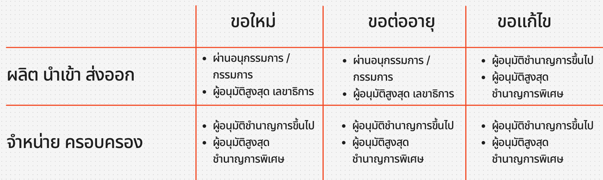
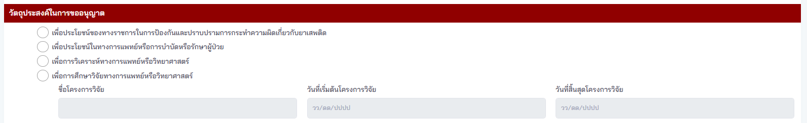
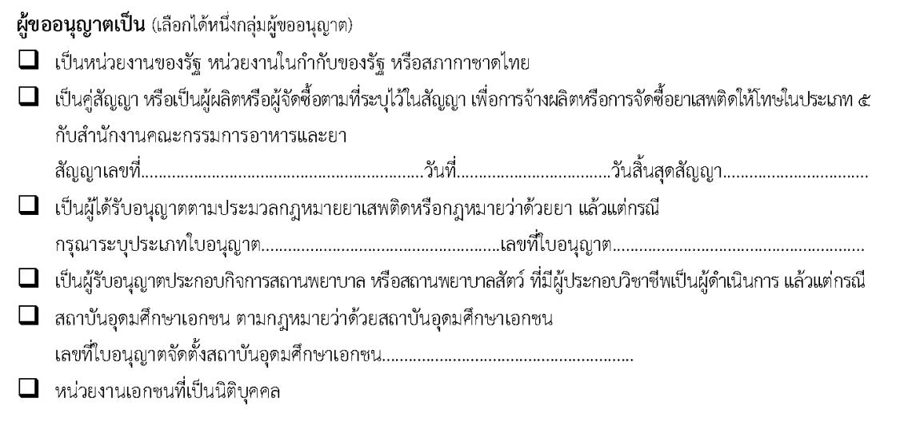
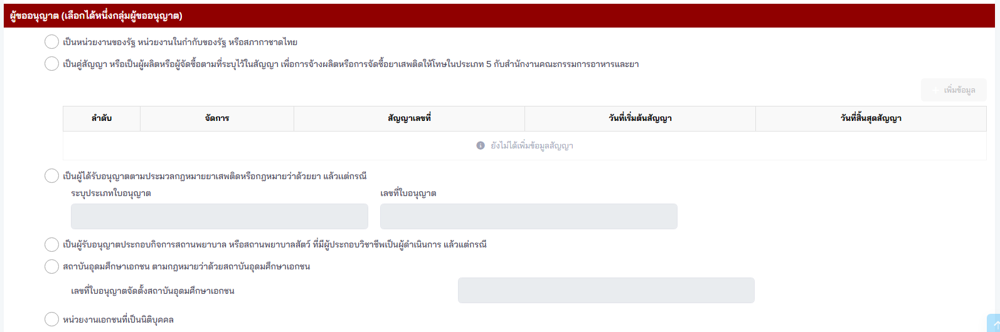
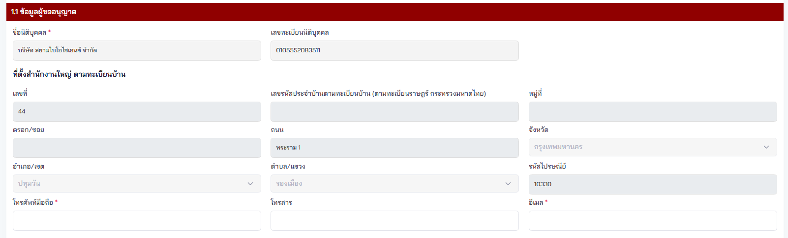
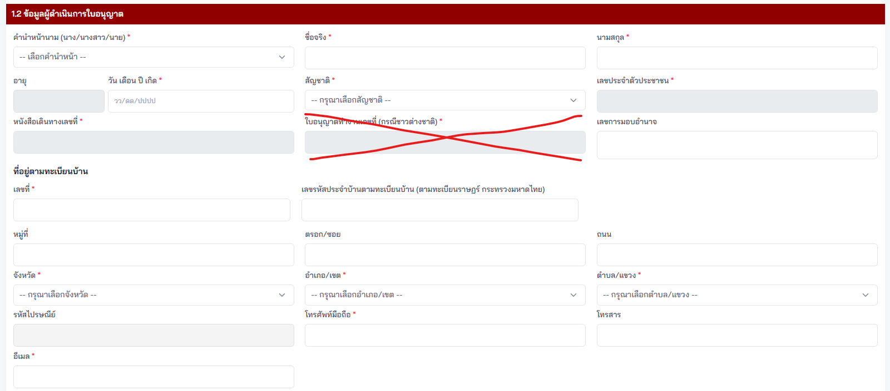
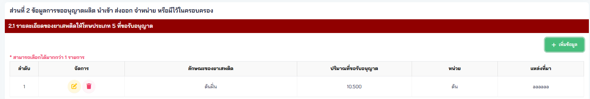
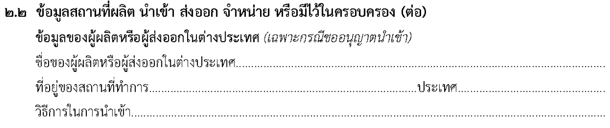
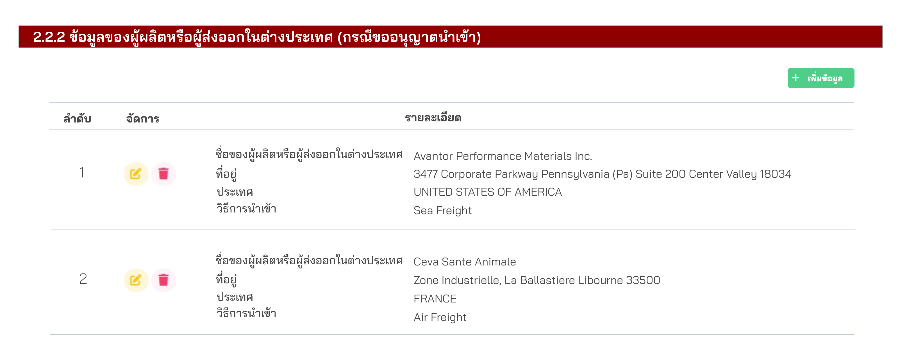
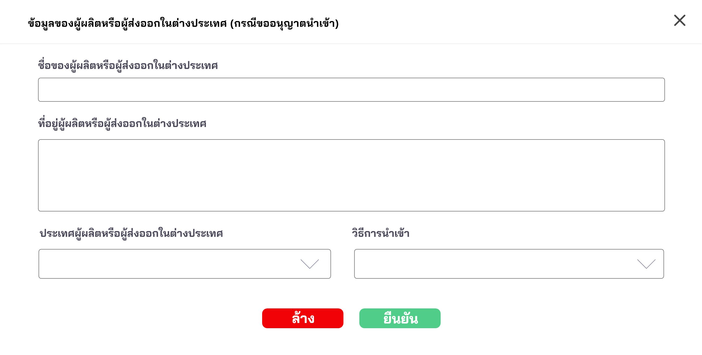

## คำขอรับใบอนุญาต คำขอต่ออายุใบอนุญาต คำขอรับใบแทนใบอนุญาตผลิต นำเข้าส่งออก จำหน่าย หรือมีไว้ในครอบครองยาเสพติดให้โทษในประเภท ๕ ที่มิใช่สารสกัดจากทุกส่วนของพืชกัญชาหรือกัญชง [ยส.5-1]

---

<style scoped>
table {
  font-size: 13px;
}
li {
  font-size: 13px;
}
</style>

#### (dbo.MasterRequisitionType Id = 20)
### Links

- [Figma Group Doc](https://www.figma.com/design/0YEqdcSpC2hZKulzEl54LH/-FDA68--Group-Doc)
- [Data Dic - Master Data real](https://docs.google.com/spreadsheets/d/1WpRC41tmqyOc8zVaxTVuwLxGgmi7inZATo8_LcCTXgE)
- [FDA68_สรุปวัตถุประสงค์ ผู้อนุญาต และผู้อนุมัติ ในใบคำขอ](https://docs.google.com/spreadsheets/d/1B366oiRjTmnY7Jvt0lpH9ORXbmOgJaLXcYDHmDST8Qo)

- [Figma ยส.5](https://www.figma.com/board/EWDQbpKKq9Rh4AkENTVOQG/%E0%B8%A2%E0%B8%AA5---%E0%B9%84%E0%B8%A1%E0%B9%88%E0%B9%84%E0%B8%94%E0%B9%89%E0%B8%95%E0%B8%B2%E0%B8%A1%E0%B9%81%E0%B8%9C%E0%B8%99?t=kvjSziK881AvYaUS-6)

#### เอกสารจากเจ้าหน้าที่
- [รวม Link เอกสารแนบ](https://docs.google.com/spreadsheets/d/1Tnz5E6aaWrrCA9C2pav3H_k-QUgSM0WpExkef0Ws-gI)
  - [09 ยส.5_ใบหลัก](https://docs.google.com/spreadsheets/d/101t7PIrUSOWUupRA9zun1rpiM7VyNDPXd1j7yJxnhh8)

## ❗ เงื่อนไข ยส.5    
### ประเภทการขอ (ยส.5)

| ลำดับ | ประเภทการขอ | LicenseGetById |
|:---:|---|:---:|
| 1 | ขอใหม่ |  |
| 2 | ขอแก้ไข | ✅ |
| 3 | ขอต่ออายุ | ✅ |
| 4 | ขอยกเลิก | ✅ |
| 5 | ขอใบแทน | ✅ |

<!-- 
ผู้ขออนุญาต
- เป็นหน่วยงานของรัฐ หน่วยงานในกำกับของรัฐ หรือสภากาชาดไทย
- เป็นคู่สัญญา หรือเป็นผู้ผลิตหรือผู้จัดซื้อตามที่ระบุไว้ในสัญญา เพื่อการจ้างผลิตหรือการจัดซื้อยาเสพติดให้โทษในประเภท 5 กับสำนักงานคณะกรรมการอาหารและยา
- เป็นผู้ได้รับอนุญาตตามประมวลกฎหมายยาเสพติดหรือกฎหมายว่าด้วยยา แล้วเเต่กรณี
- เป็นผู้รับอนุญาตประกอบกิจการสถานพยาบาล หรือสถานพยาบาลสัตว์ ที่มีผู้ประกอบวิชาชีพเป็นผู้ดำเนินการ แล้วแต่กรณี
- สถาบันอุดมศึกษาเอกชน ตามกฎหมายว่าด้วยสถาบันอุดมศึกษาเอกชน
- หน่วยงานเอกชนที่เป็นนิติบุคคล
-->

### Narcotic 5 Condition

- [[FDA68] Narcotic 5 Condition](https://docs.google.com/spreadsheets/d/1i5sP9T74M53AdxnZHyuO5b7oZ94tSXAChSi8A99lHAg)

### วัตถุประสงค์ / สาร

| วัตถุประสงค์ / สาร | ฝิ่น <br> Opium 🌿 | เห็ดขี้ควาย <br> Magic mushroom 🍄 |
|---|:---:|:---:|
| 1. เพื่อประโยชน์ของทางราชการในการป้องกันและปราบปรามการกระทำความผิดเกี่ยวกับยาเสพติด | ✅ | ✅ |
| 2. เพื่อประโยชน์ในทางการแพทย์หรือการบำบัดหรือรักษาผู้ป่วย | ✅ | เลือกได้ ก็ต่อเมือ <br> หลังวันที่ 23 ก.ค. 2572 |
| 3. เพื่อการวิเคราะห์ทางการแพทย์หรือวิทยาศาสตร์ | ✅ | ✅ |
| 4. เพื่อการศึกษาวิจัยทางการแพทย์หรือวิทยาศาสตร์ | ✅ | ✅ |

### วัตถุประสงค์ / การดำเนินการ

| ผู้ขออนุญาต / การดำเนินการ | ผลิต | นำเข้า | Condition |
|---|:---:|:---:|:---:|
| 2. เพื่อประโยชน์ในทางการแพทย์หรือการบำบัดหรือรักษาผู้ป่วย | หน่วยงานรัฐ <br> ได้รับการยกเว้น 23 ก.ค. 2568 - 23 ก.ค. 2572 | หน่วยงานรัฐ <br> ได้รับการยกเว้น 23 ก.ค. 2568 - 23 ก.ค. 2572 | ฝิ่น เท่านั้น <br> Opium only 🌿 |

### วัตถุประสงค์ในการขออนุญาต + ประเภทการขอ + flow (ยส.5-1)



## 🔷 Field Condition

### การดำเนินการ + วัตถุประสงค์ในการขออนุญาต + ประเภทผู้ขออนุญาต (ยส.5-1)


| ลำดับ | Label | Table.Field | Condition | Remark |
|:---:|---|---|---|---|
| 1 | การดำเนินการ | `Requisition`.`OperationTypeId` |  | การดำเนินการ อ้างอิง `MasterOperationType`.`Id` <br> 1 - ผลิต, 3 - นำเข้า, 4 - ส่งออก, 5 - จำหน่าย <br> 7 - ครอบครอง, 8 - ผลิตโดยการปลูก, 9 - ผลิตที่มิใช่การปลูก |
| 1 | การดำเนินการ | `Requisition`.`OperationType` |  | ประเภทการดำเนินการ (00 - อื่น ๆ, 01 - ผลิต, 02 - ผลิตส่งออก, 03 - นำเข้า, <br> 04 - ส่งออก, 05 - จำหน่าย, 06 - จำหน่ายขายส่ง, 07 - ครอบครอง) |
| 2 | ชนิดของยาเสพติดให้โทษในประเภท 5 | `Requisition`.`NarcoticPlantId` |  | ประเภทของพืชเสพติด อ้างอิง `MasterNarcoticPlant`.`Id` <br> 1 - ฝิ่น, 2 - เห็ดขี้ควาย, 99 - อื่นๆ |
| 3 | ชนิดของพืชเสพติดประเภท 5 กรณีเป็นอื่นๆ | `Requisition`.`NarcoticPlantRemark` |  |  |



| ลำดับ | Label | Table.Field | Condition | Remark |
|:---:|---|---|---|---|
| 4 | วัตถุประสงค์ในการขออนุญาต | `Requisition`.`ObjectiveId` |  | วัตถุประสงค์ อ้างอิง `MasterObjective`.`Id` <br> โดย Where จาก `MasterObjective`.`RequisitionTypeId` = `20` <br> 20 - เพื่อประโยชน์ของทางราชการในการป้องกันและปราบปรามการกระทำความผิดเกี่ยวกับยาเสพติด <br> 21 - เพื่อประโยชน์ในทางการแพทย์หรือการบำบัดหรือรักษาผู้ป่วย <br> 22 - เพื่อการวิเคราะห์ทางการแพทย์หรือวิทยาศาสตร์ <br> 23 - เพื่อการศึกษาวิจัยทางการแพทย์หรือวิทยาศาสตร์ |
| 4.1 | ชื่อโครงการวิจัย |  | ถ้าเลือก `MasterObjective`.`Id` = 23 - เพื่อการศึกษาวิจัยทางการแพทย์หรือวิทยาศาสตร์ |  |
| 4.2 | วันที่เริ่มต้นโครงการวิจัย |  | ถ้าเลือก `MasterObjective`.`Id` = 23 - เพื่อการศึกษาวิจัยทางการแพทย์หรือวิทยาศาสตร์ |  |
| 4.3 | วันที่สิ้นสุดโครงการวิจัย |  | ถ้าเลือก `MasterObjective`.`Id` = 23 - เพื่อการศึกษาวิจัยทางการแพทย์หรือวิทยาศาสตร์ |  |




| ลำดับ | Label | Table.Field | Condition | Remark |
|:---:|---|---|---|---|
| 5 | ผู้ขออนุญาต | `RequisitionObjectiveApplicantDetail`.`ApplicantTypeId` |  | ประเภทผู้ขออนุญาต อ้างอิง `MasterApplicantType`.`Id` โดย Where จาก `MasterObjective`.`RequisitionTypeId` = `20` <br> 16 - เป็นหน่วยงานของรัฐ หน่วยงานในกำกับของรัฐ หรือ สภากาชาดไทย <br> 17 - เป็นคู่สัญญา หรือเป็นผู้ผลิตหรือผู้จัดซื้อตามที่ระบุไว้ในสัญญา เพื่อการจ้างผลิตหรือการจัดซื้อยาเสพติดให้โทษในประเภท ๕ กับสำนักงานคณะกรรมการอาหารและยา <br> 18 - เป็นผู้ได้รับอนุญาตตามประมวลกฎหมายยาเสพติดหรือกฎหมายว่าด้วยยา แล้วแต่กรณี <br> 19 - เป็นผู้รับอนุญาตประกอบกิจการสถานพยาบาล หรือสถานพยาบาลสัตว์ ที่มีผู้ประกอบวิชาชีพเป็นผู้ดำเนินการ แล้วแต่กรณี <br> 20 - สถาบันอุดมศึกษาเอกชน ตามกฎหมายว่าด้วยสถาบันอุดมศึกษาเอกชน <br> 21 - หน่วยงานเอกชนที่เป็นนิติบุคคล |
| 5.1 | สัญญาเลขที่ | `RequisitionObjectiveApplicantDetail`.`ApplicantContractNumber` | กรณีเลือกวัตถุประสงค์ เป็น `17 - เป็นคู่สัญญา หรือเป็นผู้ผลิตหรือผู้จัดซื้อตามที่ระบุไว้ในสัญญา เพื่อการจ้างผลิตหรือการจัดซื้อยาเสพติดให้โทษในประเภท ๕ กับสำนักงานคณะกรรมการอาหารและยา` |  |
| 5.2 | วันที่เริ่มต้นสัญญา | `RequisitionObjectiveApplicantDetail`.`ApplicantContractStartDate` | กรณีเลือกวัตถุประสงค์ เป็น `17 - เป็นคู่สัญญา หรือเป็นผู้ผลิตหรือผู้จัดซื้อตามที่ระบุไว้ในสัญญา เพื่อการจ้างผลิตหรือการจัดซื้อยาเสพติดให้โทษในประเภท ๕ กับสำนักงานคณะกรรมการอาหารและยา` |  |
| 5.3 | วันที่สิ้นสุดสัญญา | `RequisitionObjectiveApplicantDetail`.`ApplicantContractEndDate` | กรณีเลือกวัตถุประสงค์ เป็น `17 - เป็นคู่สัญญา หรือเป็นผู้ผลิตหรือผู้จัดซื้อตามที่ระบุไว้ในสัญญา เพื่อการจ้างผลิตหรือการจัดซื้อยาเสพติดให้โทษในประเภท ๕ กับสำนักงานคณะกรรมการอาหารและยา` |  |
| 6.1 | ระบุประเภทใบอนุญาต | `RequisitionObjectiveApplicantDetail`.`Applic  antLicenseTypeId` | กรณีเลือกวัตถุประสงค์ เป็น `18 - เป็นผู้ได้รับอนุญาตตามประมวลกฎหมายยาเสพติดหรือกฎหมายว่าด้วยยา แล้วแต่กรณี` | Dropdown ประเภทใบอนุญาตที่อ้างอิง อ้างอิง `MasterLicenseType`.`Id` |
| 6.2 | เลขที่ใบอนุญาต | `RequisitionObjectiveApplicantDetail`.`ApplicantLicenseNumber` | กรณีเลือกวัตถุประสงค์ เป็น `18 - เป็นผู้ได้รับอนุญาตตามประมวลกฎหมายยาเสพติดหรือกฎหมายว่าด้วยยา แล้วแต่กรณี` |  |
| 7 | เลขที่ใบอนุญาตจัดตั้งสถาบันอุดมศึกษาเอกชน | `RequisitionObjectiveApplicantDetail`.`ApplicantPrivateUniversityLicenseNumber` | กรณีเลือกวัตถุประสงค์ เป็น `20 - สถาบันอุดมศึกษาเอกชน ตามกฎหมายว่าด้วยสถาบันอุดมศึกษาเอกชน` |  |

### 1.1 ข้อมูลผู้ขอรับใบอนุญาต (ยส.5-1)



| ลำดับ | Label | Table.Field | Condition | Remark |
|:---:|---|---|---|---|
| 0 | - | `Requisition`.`ParticipantTypeId` | ส่ง 1 - ผู้ขออนุญาต ตาม `MasterParticipantType`.`Id` | |
| 1 | ชื่อผู้ขออนุญาต | `Requisition`.`FullName` <br>`Requisition`.`JuristicName` | | - ลงคู่กับ juristicName |
| 2 | เลขทะเบียนนิติบุคคล | `Requisition`.`TaxId` | | - กองยาลง TaxId |
| 3 | เลขที่ (ที่ตั้งสำนักงานใหญ่) | `RequisitionParticipantAddress`.`HouseNo` | | |
| 4 | เลขรหัสประจำบ้านตามทะเบียนบ้าน (สำนักงานใหญ่) | `RequisitionParticipantAddress`.`HouseCode` | - Cannot over 11 digits | - Need separator `(0000-000000-0)` |
| 5 | หมู่ที่ | `RequisitionParticipantAddress`.`VillageNo` | | |
| 6 | ตรอก/ซอย | `RequisitionParticipantAddress`.`Lane` | | |
| 7 | ถนน | `RequisitionParticipantAddress`.`Street` | | |
| 8 | จังหวัด | `RequisitionParticipantAddress`.`ProvinceId` | | |
| 9 | อำเภอ/เขต | `RequisitionParticipantAddress`.`AmphurId` | | |
| 10 | ตำบล/แขวง | `RequisitionParticipantAddress`.`TambonId` | | |
| 11 | รหัสไปรษณีย์ | `RequisitionParticipantAddress`.`Postcode` | | |
| 12 | โทรศัพท์มือถือ | `RequisitionParticipantAddress`.`Phone` | Free text | Required field |
| 13 | โทรสาร | `RequisitionParticipantAddress`.`Fax` | Free text | Not required field |
| 14 | อีเมล | `RequisitionParticipantAddress`.`Email` | Type Email | Not required field | |
| X | ที่อยู่แบบเต็ม | `RequisitionParticipant`.`FullAddress` | | - เอา ParticipantAddress ทุกอันมาต่อกันแล้วคั่นด้วยคำว่า "และ" |
| Z | ที่อยู่แบบเต็ม | `RequisitionParticipantAddress`.`FullAddress` | | - เอาทุก field มา concat กัน, ถ้าไม่มีค่าให้เป็น ชื่อหัวข้อ + '-' |

### 1.2 ข้อมูลผู้ดำเนินการใบอนุญาต (ยส.5-1)



| ลำดับ | Label | Table.Field | Condition | Remark |
|:---:|---|---|---|---|
| 0 | - | `RequisitionParticipant`.`ParticipantTypeId` | ส่ง 2 - ผู้ดำเนินการ ตาม `MasterParticipantType`.`Id` | |
| 1 | คำนำหน้านาม | `RequisitionParticipant`.`PrefixId` | | |
| 2 | ชื่อจริง | `RequisitionParticipant`.`FirstName` | | |
| 3 | นามสกุล | `RequisitionParticipant`.`LastName` | | |
| 4 | อายุ | `RequisitionParticipant`.`Age` | | |
| 5 | วัน เดือน ปี เกิด | `RequisitionParticipant`.`BirthDate` | | |
| 6 | สัญชาติ | `RequisitionParticipant`.`NationalityId` | | |
| 7 | เลขประจำตัวประชาชน | `RequisitionParticipant`.`IdentificationNo` | เก็บเฉพาะเลขบัตรประชาชนเท่านั้น | - Cannot over 13 digits <br> - Need separator `(0-0000-00000-00-0)` |
| 8 | หนังสือเดินทางเลขที่ | `RequisitionParticipant`.`NumberOtherIdcard` | (กอง ต.) แต่ OtherIdCard ไม่ต้องส่งอะไรไป | |
| ~~9~~ | ~~ใบอนุญาตทำงานเลขที่ (กรณีชาวต่างชาติ)~~ | ~~`RequisitionParticipant`.`WorkPermit`~~ | | |
| 10 | เลขการมอบอำนาจออนไลน์ | `RequisitionParticipant`.`PowerOfAttorneyNo` | | |
| 11 | เลขที่ | `RequisitionParticipantAddress`.`HouseNo` | - Can type text เพื่อให้รองรับ อาคาร ชั้น ห้อง | |
| 12 | เลขรหัสประจำบ้านตามทะเบียนบ้าน (ตามทะเบียนราษฎร์ กระทรวงมหาดไทย) | `RequisitionParticipantAddress`.`HouseCode` | - Cannot over 11 digits | - Need separator `(0000-000000-0)` |
| 13 | หมู่ที่ | `RequisitionParticipantAddress`.`VillageNo` | | |
| 14 | ตรอก/ซอย | `RequisitionParticipantAddress`.`Lane` | | |
| 15 | ถนน | `RequisitionParticipantAddress`.`Street` | | |
| 16 | จังหวัด | `RequisitionParticipantAddress`.`ProvinceId` | | |
| 17 | อำเภอ/เขต | `RequisitionParticipantAddress`.`AmphurId` | | |
| 18 | ตำบล/แขวง | `RequisitionParticipantAddress`.`TambonId` | | |
| 19 | รหัสไปรษณีย์ | `RequisitionParticipantAddress`.`Postcode` | | |
| 20 | โทรศัพท์มือถือ | `RequisitionParticipantAddress`.`Phone` | | |
| 21 | โทรสาร | `RequisitionParticipantAddress`.`Fax` | | |
| 22 | อีเมล | `RequisitionParticipantAddress`.`Email` | | |

### 2.1 รายละเอียดของยาเสพติดให้โทษประเภท 5 ที่ขอรับอนุญาต



| ลำดับ | Label | Table.Field | Condition | Remark |
|:---:|---|---|---|---|
| 1 | - | `RequisitionItemDetail`.`NarcoticTypeId` | ส่ง 5 - ยาเสพติดให้โทษประเภท 5 ตาม `MasterNarcoticType`.`Id` | |

### 2.2 ข้อมูลสถานที่ผลิต นำเข้า ส่งออก จำหน่าย หรือมีไว้ในครอบครอง


| ลำดับ | Label | Table.Field | Condition | Remark |
|:---:|---|---|---|---|
| 0 | - | `RequisitionParticipant`.`ParticipantTypeId` | ส่ง 3 - สถานที่ขออนุญาต ตาม `MasterParticipantType`.`Id` | |
| 1 | ชื่อสถานที่ | `RequisitionParticipant`.`LocationName` | | |
| 2 | เลขที่ | `RequisitionParticipantAddress`.`HouseNo` | - Can type text เพื่อให้รองรับ อาคาร ชั้น ห้อง | |
| 3 | เลขรหัสประจำบ้านตามทะเบียนบ้าน (ตามทะเบียนราษฎร์ กระทรวงมหาดไทย) | `RequisitionParticipantAddress`.`HouseCode` | - Cannot over 11 digits | - Need separator `(0000-000000-0)` |
| 4 | หมู่ที่ | `RequisitionParticipantAddress`.`VillageNo` | | |
| 5 | ตรอก/ซอย | `RequisitionParticipantAddress`.`Lane` | | |
| 6 | ถนน | `RequisitionParticipantAddress`.`Street` | | |
| 7 | จังหวัด | `RequisitionParticipantAddress`.`ProvinceId` | | |
| 8 | อำเภอ/เขต | `RequisitionParticipantAddress`.`AmphurId` | | |
| 9 | ตำบล/แขวง | `RequisitionParticipantAddress`.`TambonId` | | |
| 10 | รหัสไปรษณีย์ | `RequisitionParticipantAddress`.`Postcode` | | |
| 11 | โทรศัพท์มือถือ | `RequisitionParticipantAddress`.`Phone` | | |
| 12 | โทรสาร | `RequisitionParticipantAddress`.`Fax` | | |
| 13 | อีเมล | `RequisitionParticipantAddress`.`Email` | | |

#### 2.2.1 ข้อมูลสถานที่ปลูก (เฉพาะกรณีขออนุญาตผลิต โดยการปลูก)
*Show on (เฉพาะกรณีขออนุญาตผลิต โดยการปลูก) only*


| ลำดับ | Label | Table.Field | Condition | Remark |
|:---:|---|---|---|---|
| 1 | ขนาดพื้นที่ปลูก (หน่วย : ตารางเมตร) | `RequisitionItemDetail`.`CultivationAreaSize` | | - Decimal with 4 digits (100.5432) |
| 2 | ละติจูด | `RequisitionItemDetail`.`Latitude` | | - Decimal with 6 digits (100.654321) |
| 3 | ลองจิจูด | `RequisitionItemDetail`.`Longitude` | | - Decimal with 6 digits (100.654321) |

#### 2.2.2 ข้อมูลของผู้ผลิตหรือผู้ส่งออกในต่างประเทศ (เฉพาะกรณีขออนุญาตนำเข้า)





*Show on operation type import only | แสดงเมื่อเลือก OperationType เป็น **นำเข้า***

| ลำดับ | Label | Table.Field | Condition | Remark |
|:---:|---|---|---|---|
| x | - | `RequisitionParticipant`.`RequisitionId` |  |  |
| 0 | - | `RequisitionParticipant`.`ParticipantTypeId` | ส่ง 12 - ผู้นำเข้าในต่างประเทศ ตาม `MasterParticipantType`.`Id` | |
| 1 | ชื่อผู้ผลิตหรือผู้ส่งออกในต่างประเทศ | `RequisitionParticipant`.`FullNameName` | | |

### 2.3 xxxx

## 📄 ส่วนแบบ Print from PDF คำขอ

```
เลือกเห็ดขี้ควาย 
23 ก.ค. 2568 - 2572
- เพื่อประโยชน์ในทางการแพทย์หรือการบำบัดหรือรักษาผู้ป่วย เลือกไม่ได้ ต้อง 24 ก.ค. 2572 เป็นต้นไป


```