## คำขอหนังสือรับรองในการนำหรือสั่งสารกาเฟอีน (caffeine) เข้ามาในราชอาณาจักรตามประกาศการะทรวงพาณิชย์ซึ่งออกตามพระราชบัญญัติการส่งออกไปนอกและการนำเข้ามาในราชอาณาจักรซึ่งสินค้า พ.ศ. ๒๕๒๒ [รร.1]

---

<style scoped>
table {
  font-size: 13px;
}
li {
  font-size: 13px;
}
</style>

#### (dbo.MasterRequisitionType Id = 21)
### Links

- [Figma Group Doc](https://www.figma.com/design/0YEqdcSpC2hZKulzEl54LH/-FDA68--Group-Doc)
- [Data Dic - Master Data real](https://docs.google.com/spreadsheets/d/1WpRC41tmqyOc8zVaxTVuwLxGgmi7inZATo8_LcCTXgE)
- [FDA68_สรุปวัตถุประสงค์ ผู้อนุญาต และผู้อนุมัติ ในใบคำขอ](https://docs.google.com/spreadsheets/d/1B366oiRjTmnY7Jvt0lpH9ORXbmOgJaLXcYDHmDST8Qo)

- [Figma กาเฟอีน (FigJam)](https://www.figma.com/board/d5WM3RxuyT44up9RHqlNHt/กาเฟอีน)

- [0805_เช้า_คาเฟอีน - กาเฟอีน ใบอนุญาต](https://drive.google.com/drive/u/1/folders/1dbYUDlUx0aj62PgCXdX1xmSx9-n9yEqb)
- [0805_เช้า_คาเฟอีน](https://drive.google.com/drive/u/1/folders/1uXXIs5kYpTz8Hf87K30mYiky2Tyqdxqa)
- [4.18_กาเฟอีน](https://docs.google.com/spreadsheets/d/1PKGw-iSZ9UJVXOrG8POJR3BIkxjnRDIG/edit?gid=471906968#gid=471906968)

- [ส่งไฟล์_SS](https://drive.google.com/drive/u/1/folders/1MBhdkp39h6eJoDIuIvbAnHjFcAN3BJTW)
    - [ส่งไฟล์_SS-เอกสารรายงานทั้งหมด_200169-ตัวอย่างรายงานจากอย.](https://drive.google.com/drive/folders/1M8B9Y9OGr7jEQrMdSfUB_rQjz1NDGrlQ)

#### เอกสารจากเจ้าหน้าที่
- [รวม Link เอกสารแนบ](https://docs.google.com/spreadsheets/d/1Tnz5E6aaWrrCA9C2pav3H_k-QUgSM0WpExkef0Ws-gI)
  - [04 หนังสือรับรอง_กาเฟอีน_สารระเหย](https://docs.google.com/spreadsheets/d/1OZoExaXPJh6o3SUm31i7Wy9OyTudK5sLIh5YlV7fiS0)
- [สรุปจาก User 68-08-05 ระบบหนังสือรับรอง (PDF)](../../Documents/Caffeine_VolatileAlkylNitrite/Caffeine/สรุปจาก_User_68-08-05_ระบบหนังสือรับรอง.pdf)

```
คำขอกาเฟอีน
ใบอนุญาต
```


---

### ⚙️ Business Logic & Operations

#### 🔄 การดำเนินการ (Operation Types)

| # | การดำเนินการ | MasterOperationType.Id | หมายเหตุ |
|---|---|---|---|
| 1 | นำเข้า | 3 |  |
| 2 | แก้ไข (เปลี่ยนผู้สั่งซื้อ) | 11 |  |
| 3 | ยกเลิก | ไม่มี | ต้องเพิ่ม OperationType หรือใช้คำขอยกเลิก (สอบถามเจ้าหน้าที่) |
| 4 | ส่งออก | 4 |  |

<details markdown="1">
<summary>📂 คลิกเพื่อดูรายละเอียด วัตถุประสงค์ (Objectives)</summary>

| การดำเนินการ | วัตถุประสงค์ | รายละเอียด |
|---|---|---|
| นำเข้า (3) | A. ยา | A.1 เพื่อใช้ประโยชน์ในอุตสาหกรรมของตนเอง |
| นำเข้า (3) | A. ยา | A.2 เพื่อขายให้ผู้ประกอบการอุตสาหกรรม |
| นำเข้า (3) | A. ยา | A.3 เพื่อขายให้โรงพยาบาลและสถานบริการสาธารณสุขที่สังกัด |
| นำเข้า (3) | B. อาหาร | B.1 เพื่อใช้ประโยชน์ในอุตสาหกรรมของตนเอง |
| นำเข้า (3) | B. อาหาร | B.2 เพื่อขายให้ผู้ประกอบการอุตสาหกรรม |
| นำเข้า (3) | C.1 วิเคราะห์ | C.1.1 ใช้ในกิจการของตนเอง |
| นำเข้า (3) | C.1 วิเคราะห์ | C.1.2 จำหน่ายให้หน่วยงานที่ใช้สารกาเฟอีน |
| นำเข้า (3) | C.2 วิจัย | C.2.1 เพื่อใช้ในกิจการของตนเอง |
| นำเข้า (3) | C.2 วิจัย | C.2.2 จำหน่ายให้หน่วยงานที่ใช้สารกาเฟอีน |
| แก้ไข (เปลี่ยนผู้สั่งซื้อ) (11) | A. ยา | A.2 เพื่อขายให้ผู้ประกอบการอุตสาหกรรม |
| แก้ไข (เปลี่ยนผู้สั่งซื้อ) (11) | A. ยา | A.3 เพื่อขายให้โรงพยาบาลและสถานบริการสาธารณสุขที่สังกัด |
| แก้ไข (เปลี่ยนผู้สั่งซื้อ) (11) | B. อาหาร | B.2 เพื่อขายให้ผู้ประกอบการอุตสาหกรรม |
| แก้ไข (เปลี่ยนผู้สั่งซื้อ) (11) | C.1 วิเคราะห์ | C.1.2 จำหน่ายให้หน่วยงานที่ใช้สารกาเฟอีน |
| แก้ไข (เปลี่ยนผู้สั่งซื้อ) (11) | C.2 วิจัย | C.2.2 จำหน่ายให้หน่วยงานที่ใช้สารกาเฟอีน |
| แก้ไข (เปลี่ยนผู้สั่งซื้อ) (11) | - | C.2.1 เพื่อใช้ในกิจการของตนเอง |
| ส่งออก (4) | A. กรณีส่งคืนสารกาเฟอีนที่นำเข้า ตามหนังสือรับรองเลขที่ | |
| ส่งออก (4) | B. กรณีส่งออกสารกาเฟอีนที่ผลิตได้ในประเทศ | |
| ส่งออก (4) | C. กรณีเปลี่ยนผู้สั่งซื้อ โดยผู้สั่งซื้อรายใหม่เป็นผู้สั่งซื้อในต่างประเทศ | |
| ส่งออก (4) | D. อื่นๆ | |
| ยกเลิก | ทุกวัตถุประสงค์ | |

</details>

### 📊 Tables & Dictionary

#### 📂 dbo.MasterObjective (วัตถุประสงค์)

```sql
SELECT * FROM MasterObjective
WHERE RequisitionTypeId = 21
ORDER BY Ordinal
```

<details markdown="1">
<summary>📂 คลิกเพื่อดูตาราง dbo.MasterObjective</summary>

| Id | ObjectiveNameTh | Reason | Active | RequisitionTypeId | Ordinal |
|---|---|---|---|---|---|
| 38 | เป็นวัตถุดิบในการผลิตยาตัวอย่างสำหรับขอขึ้นทะเบียนตำรับยา/ยาซึ่งได้ขึ้นทะเบียนตำรับยาแล้ว | ยา - A.1 | 1 | 21 | 1 |
| 41 | เป็นวัตถุดิบในการผลิตตัวอย่างเครื่องดื่มที่ผสมกาเฟอีนสำหรับการขออนุญาต/เครื่องดื่มที่ผสมกาเฟอีนที่ได้รับอนุญาตแล้ว/เครื่องดื่มที่ผสมกาเฟอีนเพื่อส่งออกไปจำหน่ายนอกราชอาณาจักร | อาหาร - B.1 | 1 | 21 | 2 |
| 39 | ขายให้ผู้รับอนุญาตผลิตยาเพื่อเป็นวัตถุดิบในการผลิตยาตัวอย่างสำหรับขอขึ้นทะเบียนหรือผลิตยาซึ่งได้ขึ้นทะเบียนตำรับยาแล้ว | ยา - A.2 | 1 | 21 | 3 |
| 40 | ขายให้โรงพยาบาลและสถานบริการสาธารณสุขที่สังกัดกระทรวง ทบวง กรม สภากาชาดไทย องค์การเภสัชกรรม และหน่วยงานอื่นของรัฐ สำหรับเป็นวัตถุดิบในการผลิตยาตามรายการและเงื่อนไขของบัญชียาหลักแห่งชาติ | ยา - A.3 | 1 | 21 | 4 |
| 42 | ขายให้ผู้ผลิตอาหารเป็นวัตถุดิบในการผลิตตัวอย่างเครื่องดื่มที่ผสมกาเฟอีนสำหรับการขออนุญาต/เครื่องดื่มที่ผสมกาเฟอีนที่ได้รับอนุญาตแล้ว/เครื่องดื่มที่ผสมกาเฟอีนเพื่อส่งออกไปจำหน่ายนอกราชอาณาจักร | อาหาร - B.2 | 1 | 21 | 5 |
| 43 | ใช้ในห้องวิทยาศาสตร์สำหรับการวิจัยหรือการวิเคราะห์ ซึ่งมิได้กระทำโดยตรงต่อร่างกายมนุษย์ | C.ทั้งหมด | 1 | 21 | 6 |
| 44 | ยกเลิกหนังสือรับรองที่อนุมัติแล้ว | NULL | 1 | 21 | 7 |
| 46 | ทุกกรณี | NULL | 1 | 21 | 8 |
| 47 | กรณีส่งคืนสารกาเฟอีนที่นำเข้า ตามหนังสือรับรองเลขที่ | NULL | 1 | 21 | 9 |
| 48 | กรณีส่งออกสารกาเฟอีนที่ผลิตได้ในประเทศ | NULL | 1 | 21 | 10 |
| 49 | กรณีเปลี่ยนผู้สั่งซื้อ โดยผู้สั่งซื้อรายใหม่เป็นผู้สั่งซื้อในต่างประเทศ (ทำเมนูไว้ แต่ขอให้ซ่อนยังไม่ให้ผปก.เลือกได้) | NULL | 1 | 21 | 11 |
| 50 | [ส่งออก] อื่นๆ (ทำเมนูไว้ แต่ขอให้ซ่อนยังไม่ให้ผปก.เลือกได้) | NULL | 1 | 21 | 12 |
| 51 | - (แก้ไขหนังสือรับรอง ผู้สั่งซื้อรายใหม่เป็นผู้สั่งซื้อในต่างประเทศ) | NULL | 1 | 21 | 13 |

</details>


#### 📂 dbo.MasterCaffeine (รายการสารกาเฟอีน)

```sql
SELECT * FROM MasterCaffeine
```

<details markdown="1">
<summary>📂 คลิกเพื่อดูตาราง dbo.MasterCaffeine</summary>

| Id | CreateBy | CreateOn | UpdateBy | UpdateOn | CaffeineNameEN | CaffeineNameTH | NarcoticTypeId | Active |
|---|---|---|---|---|---|---|---|---|
| 1 | 1 | 2026-04-06 15:00:00.000 | NULL | NULL | Caffeine | กาเฟอีน | 12 | 1 |
| 2 | 1 | 2026-04-06 15:00:00.000 | NULL | NULL | Caffeine Hydrate | กาเฟอีน ไฮเดรท | 12 | 1 |
| 3 | 1 | 2026-04-06 15:00:00.000 | NULL | NULL | Caffeine Anhydrous | กาเฟอีน แอนไฮดรัส | 12 | 1 |
| 4 | 1 | 2026-04-06 15:00:00.000 | NULL | NULL | Caffeine Citrate | กาเฟอีน ซิเตรต | 12 | 1 |
| 5 | 1 | 2026-04-06 15:00:00.000 | NULL | NULL | Theophylline | ทีโอฟิลลีน | 12 | 1 |
| 6 | 1 | 2026-04-06 15:00:00.000 | NULL | NULL | Aminophylline | เอมิโนฟิลลีน | 12 | 1 |

</details>

#### 📂 dbo.MasterCaffeineUserType (รายการประเภทผู้ใช้สาร)

```sql
SELECT * FROM MasterCaffeineUserType
```

<details markdown="1">
<summary>📂 คลิกเพื่อดูตาราง dbo.MasterCaffeineUserType</summary>

| Id | OperationType | OperationTypeId | CaffeineObjective | CaffeineUserType | ObjectiveId |
|---|---|---|---|---|---|
| 1 | นำเข้า | 3 | ยา | เพื่อประโยชน์ในอุตสาหกรรมของตนเอง | 38 |
| 2 | นำเข้า | 3 | ยา | เพื่อขายให้ผู้ประกอบการอุตสาหกรรม | 39 |
| 3 | นำเข้า | 3 | ยา | เพื่อขายให้โรงพยาบาลและสถานบริการสาธารณสุข ที่สังกัดกระทรวง ทบวง กรมสภากาชาดไทย องค์การเภสัชกรรมและหน่วยงานอื่นของรัฐ สำหรับเป็นวัตถุดิบในการผลิตยาตามรายการและเงื่อนไขของบัญชียาหลักแห่งชาติ | 40 |
| 4 | นำเข้า | 3 | อาหาร | เพื่อประโยชน์ในอุตสาหกรรมของตนเอง | 41 |
| 5 | นำเข้า | 3 | อาหาร | เพื่อขายให้ผู้ประกอบการอุตสาหกรรม | 42 |
| 6 | นำเข้า | 3 | วิเคราะห์ | ใช้ในกิจการของตนเอง | 43 |
| 7 | นำเข้า | 3 | วิเคราะห์ | จำหน่ายให้หน่วยงานที่ใช้สารกาเฟอีน | 43 |
| 8 | นำเข้า | 3 | วิจัย | ใช้ในกิจการของตนเอง | 43 |
| 9 | นำเข้า | 3 | วิจัย | จำหน่ายให้หน่วยงานที่ใช้สารกาเฟอีน | 43 |
| 10 | เปลี่ยนผู้สั่งซื้อ | 11 | ยา | ผู้สั่งซื้อรายใหม่เป็นผู้สั่งซื้อภายในประเทศ | 38 |
| 11 | เปลี่ยนผู้สั่งซื้อ | 11 | ยา | ผู้สั่งซื้อรายใหม่เป็นผู้สั่งซื้อภายในประเทศ | 40 |
| 12 | เปลี่ยนผู้สั่งซื้อ | 11 | อาหาร | ผู้สั่งซื้อรายใหม่เป็นผู้สั่งซื้อภายในประเทศ | 42 |
| 13 | เปลี่ยนผู้สั่งซื้อ | 11 | วิเคราะห์ | ผู้สั่งซื้อรายใหม่เป็นผู้สั่งซื้อภายในประเทศ | 43 |
| 14 | เปลี่ยนผู้สั่งซื้อ | 11 | วิจัย | ผู้สั่งซื้อรายใหม่เป็นผู้สั่งซื้อภายในประเทศ | 43 |
| 15 | เปลี่ยนผู้สั่งซื้อ | 11 | - | ผู้สั่งซื้อรายใหม่เป็นผู้สั่งซื้อในต่างประเทศ | 51 |
| 16 | ยกเลิกหนังสือรับรองที่อนุมัติแล้ว | 12 | ทุกกรณี | - | 44 |
| 17 | ส่งออก | 4 | กรณีส่งคืนสารกาเฟอีนที่นำเข้า ตามหนังสือรับรองเลขที่ | กรณีส่งคืนสารกาเฟอีนที่นำเข้า ตามหนังสือรับรองเลขที่ | 47 |
| 18 | ส่งออก | 4 | กรณีส่งออกสารกาเฟอีนที่ผลิตได้ในประเทศ | กรณีส่งออกสารกาเฟอีนที่ผลิตได้ในประเทศ | 48 |
| 19 | ส่งออก | 4 | กรณีเปลี่ยนผู้สั่งซื้อ โดยผู้สั่งซื้อรายใหม่เป็นผู้สั่งซื้อในต่างประเทศ | กรณีเปลี่ยนผู้สั่งซื้อ โดยผู้สั่งซื้อรายใหม่เป็นผู้สั่งซื้อในต่างประเทศ | 49 |
| 20 | ส่งออก | 4 | อื่นๆ | อื่นๆ | 50 |

</details>

#### 📂 dbo.MasterCaffeine สารกาเฟอีน
<details markdown="1">
<summary>📂 คลิกเพื่อดู Schema & Sample Data: [MasterCaffeine]</summary>

| ลำดับ | Column Name | Data Type | Allow Nulls | Field Description |
|---|---|---|:---:|---|
| 1 | Id | int | N | รหัสอ้างอิงที่ใช้ในระบบ |
| 2 | CreateBy | int | N | ผู้สร้าง อ้างอิง `SystemUser`.`Id` |
| 3 | CreateOn | datetime | N | วันที่สร้าง |
| 4 | UpdateBy | int | Y | ผู้แก้ไข อ้างอิง `SystemUser`.`Id` |
| 5 | UpdateOn | datetime | Y | วันที่แก้ไข |
| 6 | CaffeineNameEN | nvarchar(500) | Y | ชื่อสารกาเฟอีนภาษาอังกฤษ |
| 7 | CaffeineNameTH | nvarchar(500) | Y | ชื่อสารกาเฟอีนภาษาไทย |
| 8 | NarcoticTypeId | int | Y | ประเภทวัตถุเสพติด อ้างอิง `MasterNarcoticType`.`Id` |
| 9 | Active | bit | Y | ใช้งาน (1 = ใช้งาน, 0 = ไม่ใช้งาน) |

</details>

#### ตัวอย่าง Data ในตาราง dbo.MasterCaffeine

<details markdown="1">
<summary>📂 คลิกเพื่อดูตาราง ตัวอย่าง Data ในตาราง dbo.MasterCaffeine</summary>

| Id | CreateBy | CreateOn | UpdateBy | UpdateOn | CaffeineNameEN | CaffeineNameTH | NarcoticTypeId | Active |
|---|---|---|---|---|---|---|---|---|
| 1 | 1 | 2026-04-06 15:00:00.000 | NULL | NULL | Caffeine | กาเฟอีน | 12 | 1 |
| 2 | 1 | 2026-04-06 15:00:00.000 | NULL | NULL | Caffeine Hydrate | กาเฟอีน ไฮเดรท | 12 | 1 |
| 3 | 1 | 2026-04-06 15:00:00.000 | NULL | NULL | Caffeine Anhydrous | กาเฟอีน แอนไฮดรัส | 12 | 1 |
| 4 | 1 | 2026-04-06 15:00:00.000 | NULL | NULL | Caffeine Citrate | กาเฟอีน ซิเตรต | 12 | 1 |
| 5 | 1 | 2026-04-06 15:00:00.000 | NULL | NULL | Theophylline | ทีโอฟิลลีน | 12 | 1 |
| 6 | 1 | 2026-04-06 15:00:00.000 | NULL | NULL | Aminophylline | เอมิโนฟิลลีน | 12 | 1 |

<!-- dbo.RequisitionItemDetail รายละเอียดสารที่ขอรับอนุญาตในคำขอ // ใช้กับคำขอสถานที่ -->
<!-- dbo.RequisitionTemporaryItemDetail รายะเอียดของยาเสพติด / วัตถุออกฤทธิ์ ที่ขอนำเข้า / ส่งออก // ใช้กับคำขอเฉพาะคราว -->
<!-- dbo.RequisitionMedicationItem รายการยาที่ขอในคำขอยาติดตัว // ใช้กับยาติดตัว -->
<!-- dbo.RequisitionMedicationIngredient ส่วนประกอบของยาที่ขอในคำขอยาติดตัว // ใช้กับยาติดตัว -->

</details>


#### 📂 dbo.RequisitionCaffeineItemDetail รายละเอียดสารกาเฟอีนที่ใช้ใน คำขอหนังสือรับรองในการนำหรือสั่งสารกาเฟอีน (caffeine) เข้ามาในราชอาณาจักร
<details markdown="1">
<summary>📂 คลิกเพื่อดูตาราง dbo.RequisitionCaffeineItemDetail รายละเอียดสารกาเฟอีนที่ใช้ใน คำขอหนังสือรับรองในการนำหรือสั่งสารกาเฟอีน (caffeine) เข้ามาในราชอาณาจักร</summary>

| ลำดับ | Column Name | Data Type | Allow Nulls | Field Description | Remark |
|---|---|---|:---:|---|---|
| 1 | Id | int | N | รหัสอ้างอิงที่ใช้ในระบบ | Id |
| 2 | CreateBy | int | N | ผู้สร้าง อ้างอิง `SystemUser`.`Id` | CreateBy |
| 3 | CreateOn | datetime | N | วันที่สร้าง | CreateOn |
| 4 | UpdateBy | int | Y | ผู้แก้ไข อ้างอิง `SystemUser`.`Id` | UpdateBy |
| 5 | UpdateOn | datetime | Y | วันที่แก้ไข | UpdateOn |
| 6 | RequisitionId | int | N | รหัสคำขอ อ้างอิง `Requisition`.`Id` | RequisitionId |
| 7 | CaffeineId | int | N | สารกาเฟอีน อ้างอิง `MasterCaffeine`.`Id` | CaffeineId |
| 8 | Quantity | decimal(18,4) | N | ปริมาณ | Quantity |
| 9 | UnitId | int | N | หน่วย อ้างอิง `MasterNarcoticUnit`.`Id` | UnitId |
| 10 | OriginCountry | nvarchar(50) | N | ประเทศผู้ผลิต | OriginCountry |
| 11 | Remark | nvarchar(500) | Y | หมายเหตุ | Remark |
| 12 | ManufacturerEntityId | int | Y | ผู้ผลิตในต่างประเทศ อ้างอิง `MasterForeignEntity`.`Id` | ManufacturerEntityId |
| 13 | ExporterEntityId | int | Y | ผู้ส่งออกในต่างประเทศ อ้างอิง `MasterForeignEntity`.`Id` | ExporterEntityId |
| 14 | IsNewSubstance | bit | Y | เป็นสารใหม่หรือไม่ | IsNewSubstance |
| 15 | StockImportCountYTD | int | Y | จำนวนครั้งที่นำเข้าสะสมในปีปัจจุบัน (YTD) | StockImportCountYTD |
| 16 | StockTotalQtyYTD | decimal(18,4) | Y | ปริมาณนำเข้าสะสมในปีปัจจุบัน (YTD) | StockTotalQtyYTD |
| 17 | StockRemainQty | decimal(18,4) | Y | ปริมาณคงเหลือ | StockRemainQty |
| 18 | StockThisRequestSeq | int | Y | ลำดับของคำขอนี้ | StockThisRequestSeq |
| 19 | StockDataAsOfDate | date | Y | วันที่อ้างอิงข้อมูลสต็อก | StockDataAsOfDate |

</details>

<!-- dbo.LicenseItemDetail รายละเอียดสารที่ขอรับอนุญาตในใบอนุญาต // ใช้กับคำขอสถานที่ -->
<!-- dbo.LicenseTemporaryItemDetail รายะเอียดของยาเสพติด / วัตถุออกฤทธิ์ ที่ขอนำเข้า / ส่งออก เฉพาะคราว // ใช้กับคำขอเฉพาะคราว -->

## ❗ เงื่อนไขรร.1    
## 🔷 Field Condition


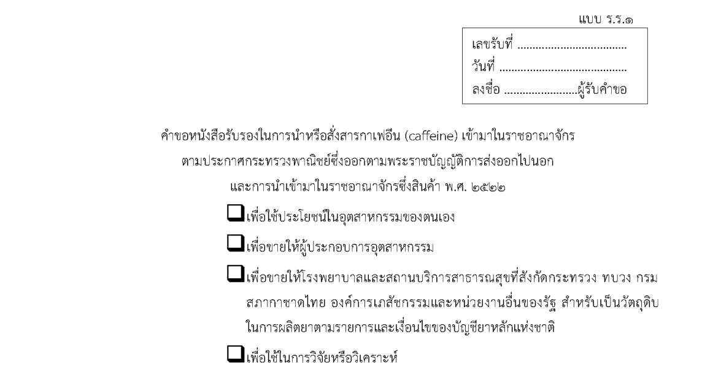


<!-- ```
ผมเพิ่มตารางเดี่ยวกับ กาเฟอีน ให้แล้วนะครับ
- dbo.MasterCaffeine สารกาเฟอีน
  - เพิ่มข้อมูลสารกาเฟอีน แล้ว
- dbo.RequisitionCaffeineItemDetail รายละเอียดสารกาเฟอีนที่ใช้ใน คำขอหนังสือรับรองในการนำหรือสั่งสารกาเฟอีน (caffeine) เข้ามาในราชอาณาจักร
- dbo.LicenseCaffeineItemDetail รายละเอียดสารกาเฟอีนที่ใช้ใน คำขอหนังสือรับรองในการนำหรือสั่งสารกาเฟอีน (caffeine) เข้ามาในราชอาณาจักร ครับ
``` -->

<!-- ```
1. ในหนังสือรับรองนำเข้ากาเฟอีน รร.2
วัตถุประสงค์ เพื่อขายให้ผู้ประกอบการอุตสาหกรรม 1 ฉบับ
สารกาเฟอีนที่นำเข้ามา สามารถแบ่งขายให้ผู้ประกอบการมากกว่า 1 ราย ได้หรือไม่
``` -->

---

### 🛤️ Workflow (Screen Sequence)

### 📥 กรณีนำเข้า (Import) - OperationTypeId = 3

| Step | ขั้นตอน |
|---|---|
| Step 1 | - วัตถุประสงค์ <br> - ประเภทผู้ใช้สาร |
| Step 2 | - เลขที่ใบอนุญาต <br> - ข้อมูลผู้ขอหนังสือรับรองฯ <br> - ข้อมูลผู้ดำเนินการ |
| Step 3 | - ข้อมูลสถานที่เก็บ <br> - ข้อมูลวัตถุดิบกาเฟอีนคงคลัง  |
| Step 4 | - ข้อมูลสารกาเฟอีนที่ขอนำเข้า <br> - ข้อมูลผู้ใช้สารกาเฟอีน <br> - ข้อมูลผลิตภัณฑ์ |
| Step 5 | - ข้อมูลผู้ประสานงาน |
| Step 6 | - เอกสารแนบ |

#### **Step 1: วัตถุประสงค์และประเภทผู้ใช้สาร**

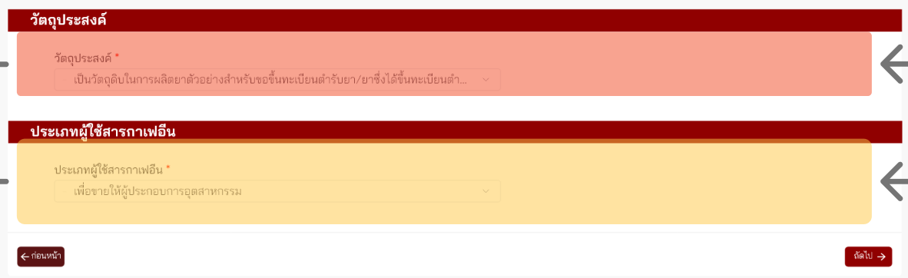

### **วัตถุประสงค์** (Dropdown: ดึงจาก `MasterObjective.ObjectiveNameTh`)

```sql
SELECT Id, ObjectiveNameTh FROM MasterObjective
WHERE RequisitionTypeId = 21 AND Id IN (38, 39, 40, 41, 42, 43)
ORDER BY Ordinal
```

### **ประเภทผู้ใช้สาร** (Dropdown: ดึงจาก `MasterCaffeineUserType.CaffeineUserType`)

```sql
SELECT Id, CaffeineUserType FROM MasterCaffeineUserType
WHERE OperationTypeId = 3 AND ObjectiveId = [Selected_Objective_Id]
ORDER BY Id
```

#### **Step 2: ข้อมูลใบอนุญาตและผู้ขอ**

### 1. **เลขที่ใบอนุญาต**

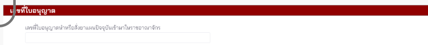

    - เลขที่ใบอนุญาตนำหรือสั่งยาแผนปัจจุบันเข้ามาในราชอาณาจักร (Dropdown: ดึงจาก API ใบอนุญาตด้านยา)
    
```
*API Reference: `[TBD: API URL for Drug License]`*
```

### 1.1. **ข้อมูลผู้ขอหนังสือรับรองฯ**

    - (ดึงจาก DOPA อัตโนมัติด้วยเลขนิติบุคคลที่ได้รับมอบอำนาจ)

### 1.2. **ข้อมูลผู้ดำเนินการ**

    - (กรอกข้อมูลเอง)

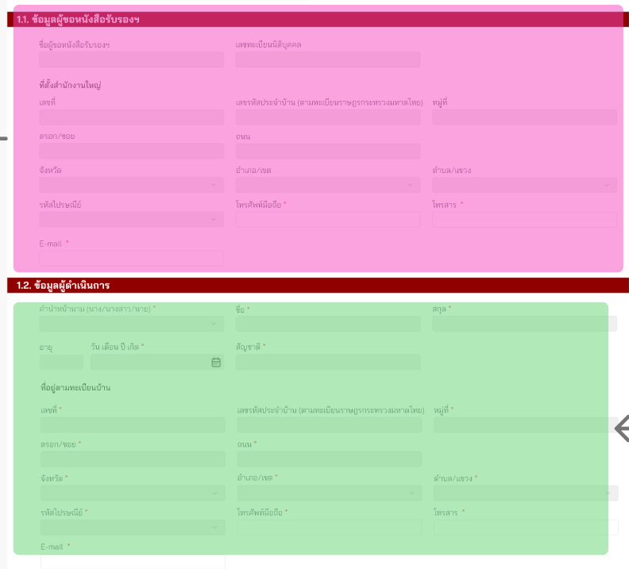

#### **Step 3: สถานที่เก็บและยอดคงคลัง**

### 2. **ข้อมูลสถานที่เก็บ**

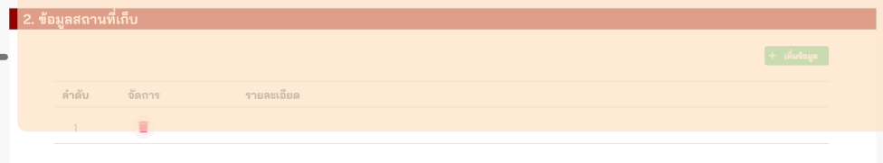

    - ดึงข้อมูลสถานที่เก็บ (เหมือนกับประเภทคำขออื่น ๆ - `RequisitionParticipantTypeId`)


### 3. **ข้อมูลวัตถุดิบกาเฟอีนคงคลัง**

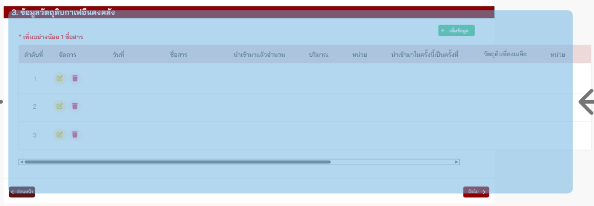

    - แสดงยอดคงเหลือปัจจุบันในระบบ

#### **Step 4: รายละเอียดสารกาเฟอีนที่ขอนำเข้า**

### 4. **ข้อมูลสารกาเฟอีนที่ขอนำเข้า** (ดึงข้อมูลจาก `MasterCaffeine`)

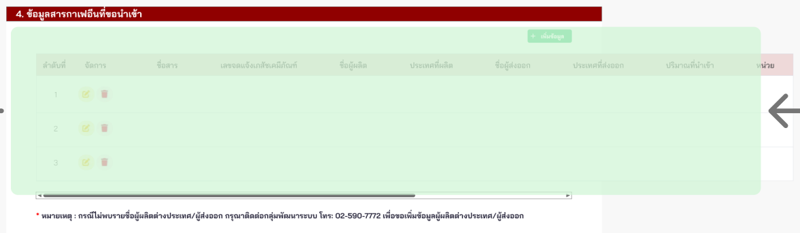

### 5. **ข้อมูลผู้ใช้สารกาเฟอีน**

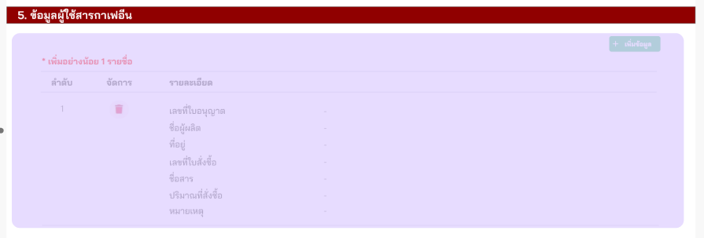

### 6. **ข้อมูลผลิตภัณฑ์**

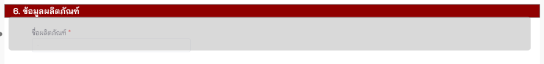

   - กรอกชื่อผลิตภัณฑ์ หรือเลือกจากประวัติการนำเข้า (Dropdown)

#### **Step 5: ข้อมูลผู้ประสานงาน**

### 7. **ข้อมูลผู้ประสานงาน**

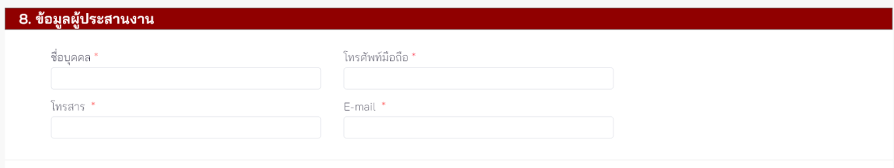

---

### 📤 กรณีส่งออก (Export) - OperationTypeId = 4

| Step | ขั้นตอน |
|---|---|
| Step 1 | - วัตถุประสงค์ |
| Step 2 | - ข้อมูลผู้ขอหนังสือรับรองฯ <br> - ข้อมูลผู้ดำเนินการ |
| Step 3 | - ข้อมูลการส่งออก <br> - ข้อมูลผู้รับสินค้า  |
| Step 4 | - ข้อมูลผู้ประสานงาน |
| Step 5 | - เอกสารแนบ |

#### **Step 1: วัตถุประสงค์**

### **วัตถุประสงค์**

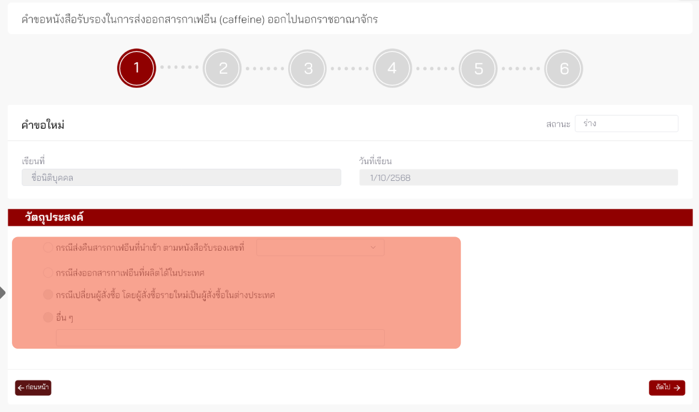

#### **Step 2: ข้อมูลใบอนุญาตและผู้ขอ**

### 1.1. **ข้อมูลผู้ขอหนังสือรับรองฯ**

    - (ดึงจาก DOPA อัตโนมัติด้วยเลขนิติบุคคลที่ได้รับมอบอำนาจ)

### 1.2. **ข้อมูลผู้ดำเนินการ**

    - (กรอกข้อมูลเอง)

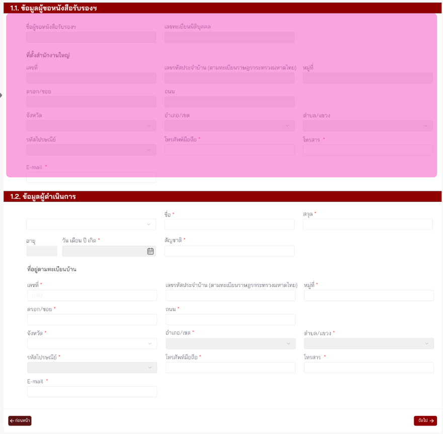

#### **Step 3**

### 2. **ข้อมูลการส่งออก**

### 3. **ข้อมูลผู้รับสินค้า**

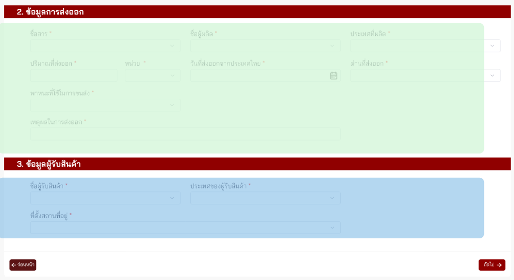

#### **Step 4**

### 4. **ข้อมูลผู้ประสานงาน**


---

### 📊 สรุปขั้นตอนเปรียบเทียบ (Import vs Export)

| 📥 กรณีนำเข้า (Import) (6 steps) | 📤 กรณีส่งออก (Export) (5 Step) |
|---|---|
| **Step 1**: วัตถุประสงค์, ประเภทผู้ใช้สาร | **Step 1**: วัตถุประสงค์ |
| **Step 2**: เลขที่ใบอนุญาต, ข้อมูลผู้ขอ/ผู้ดำเนินการ | **Step 2**: ข้อมูลผู้ขอ/ผู้ดำเนินการ |
| **Step 3**: สถานที่เก็บ, วัตถุดิบกาเฟอีนคงคลัง | **Step 3**: ข้อมูลการส่งออก, ข้อมูลผู้รับสินค้า |
| **Step 4**: รายละเอียดสารกาเฟอีน, ข้อมูลผู้ใช้สาร, ข้อมูลผลิตภัณฑ์ |  |
| **Step 5**: ข้อมูลผู้ประสานงาน | **Step 4**: ข้อมูลผู้ประสานงาน  |
| **Step 6**: เอกสารแนบ | **Step 5**: เอกสารแนบ |

---

### ✏️ กรณีแก้ไข (Edit) - OperationTypeId = 11

| Step | ขั้นตอน |
|---|---|
| Step 1 | - ข้อมูลหนังสือรับรองเดิม และรายละเอียดการแก้ไข |
| Step 2 | - เอกสารแนบ |

#### **Step 1: ข้อมูลหนังสือรับรองเดิมและการแก้ไข**

**ค้นหาหนังสือรับรองเดิม**

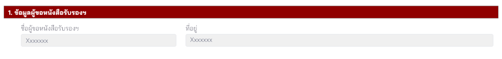

**รายละเอียดการแก้ไข**

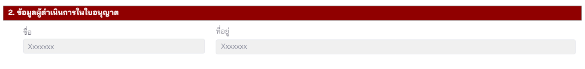

#### **Step 3: ข้อมูลผู้สั่งซื้อรายใหม่ (แบ่งตามเงื่อนไข)**

**Case 1: ผู้สั่งซื้อรายใหม่เป็นผู้สั่งซื้อภายในประเทศ**

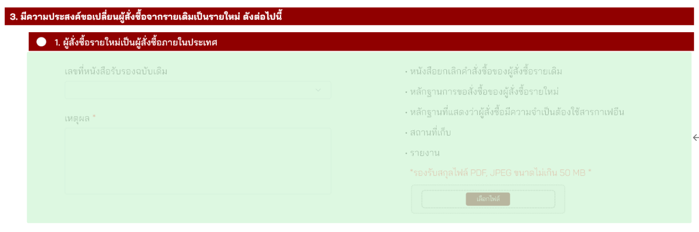

**Case 2: ผู้สั่งซื้อรายใหม่เป็นผู้สั่งซื้อในต่างประเทศ**

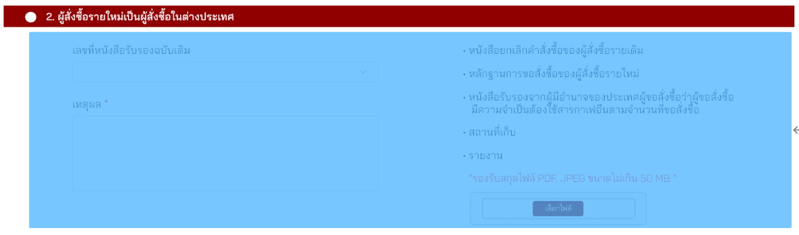

**Case 3: กรณีอื่นๆ (เช่น เพื่อใช้ในกิจการของตนเอง)**

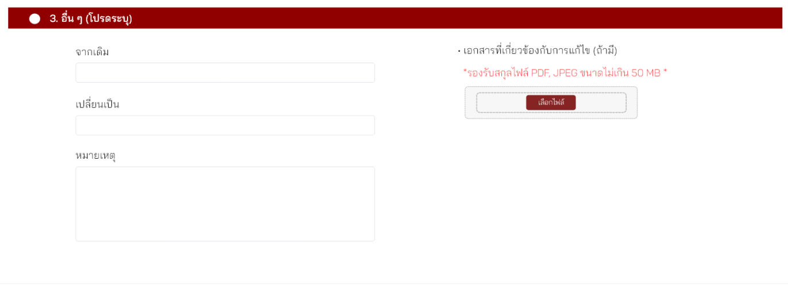

---

<!-- 
Q&A / Notes:
1. ในหนังสือรับรองนำเข้ากาเฟอีน รร.2 วัตถุประสงค์ เพื่อขายให้ผู้ประกอบการอุตสาหกรรม 1 ฉบับ สารกาเฟอีนที่นำเข้ามา สามารถแบ่งขายให้ผู้ประกอบการมากกว่า 1 ราย ได้หรือไม่?
-->