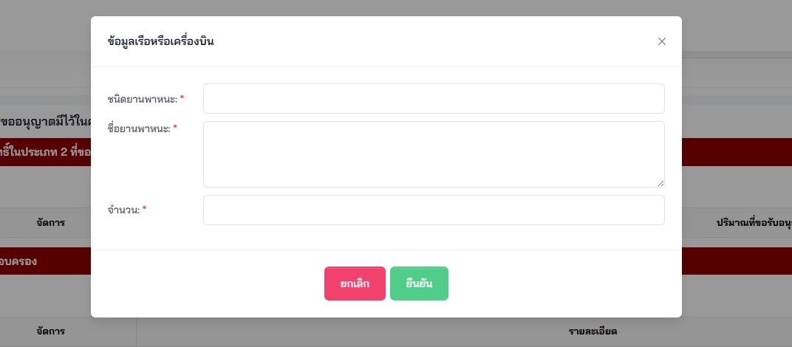
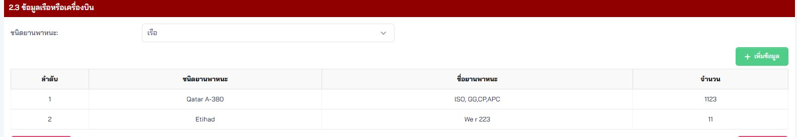
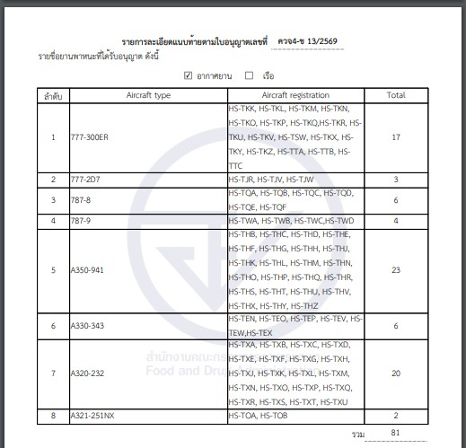

## คำขอรับใบอนุญาต คำขอต่ออายุใบอนุญาต คำขอรับใบแทนใบอนุญาตมีไว้ในครอบครองยาเสพติดให้โทษในประเภท 2 และวัตถุออกฤทธิ์ในประเภท 2 ประเภท  3 หรือประเภท 4 [คค.1-1]

---

#### (dbo.MasterRequisitionType Id = 6)
### Links

- [Figma Group Doc](https://www.figma.com/design/0YEqdcSpC2hZKulzEl54LH/-FDA68--Group-Doc)
- [Data Dic - Master Data real](https://docs.google.com/spreadsheets/d/1WpRC41tmqyOc8zVaxTVuwLxGgmi7inZATo8_LcCTXgE)

- [Figma คค.1-1 (FigJam)]()

### 📊 Tables & Dictionary

#### 📂 dbo.RequisitionVehicle (ข้อมูลยานพาหนะในคำขอ (ใช้กับ คค.1-1))

📂 คลิกเพื่อดู Schema & Sample Data: [RequisitionVehicle]

| ลำดับ | Column Name | Data Type | Allow Nulls | Field Description |
|---|---|---|:---:|---|
| 1 | Id | int | N | รหัสอ้างอิงที่ใช้ในระบบ |
| 2 | CreateBy | int | N | ผู้สร้าง อ้างอิง SystemUser.Id |
| 3 | CreateOn | datetime | N | วันที่สร้าง |
| 4 | UpdateBy | int | Y | ผู้แก้ไข อ้างอิง SystemUser.Id |
| 5 | UpdateOn | datetime | Y | วันที่แก้ไข |
| 6 | RequisitionId | int | N | คำขอ อ้างอิง Requisition.Id |
| 7 | Ordinal | int | Y | ลำดับ |
| 8 | VehicleType | char(1) | Y | ประเภทของยานพาหนะ (A=เครื่องบิน, S=เรือ) |
| 9 | Type | nvarchar(1000) | Y | ประเภท |
| 10 | Registration | nvarchar(2000) | Y | ชื่อยานพาหนะ |
| 11 | Total | int | Y | จำนวนยานพาหนะ |

## ❗ เงื่อนไข คค.1-1

## Form name

| Narcotic Type | Narcotic | Narcotic Type |
|---|---|---|
| Narcotic 2 | NC2 ยส.2 | คำขอรับใบอนุญาตมีไว้ในครอบครองยาเสพติดให้โทษในประเภท 2 |
| Psychotropic 2 | PS2 วจ.2 | คำขอรับใบอนุญาตมีไว้ในครอบครองวัตถุออกฤทธิ์ในประเภท 2 |
| Psychotropic 3 | PS3 วจ.3 | คำขอรับใบอนุญาตมีไว้ในครอบครองวัตถุออกฤทธิ์ในประเภท 3 |
| Psychotropic 4 | PS4 วจ.4 | คำขอรับใบอนุญาตมีไว้ในครอบครองวัตถุออกฤทธิ์ในประเภท 4 |

## ผู้ขออนุญาต

| ผู้ขออนุญาต | Remark |
|---|---|
| ผู้ขอรับอนุญาตเป็นกระทรวง ทบวง กรม สภากาชาดไทย หรือองค์การเภสัชกรรม | เอามาจากเอกสารแนบ |
| ผู้ขอรับอนุญาตเป็นหน่วยงานของรัฐ หรือ สภากาชาดไทย | เอามาจากเอกสารแนบ |

## ยานพาหนะ

## 📄 ส่วนแบบ Print from PDF คำขอ (คค.1-1)

