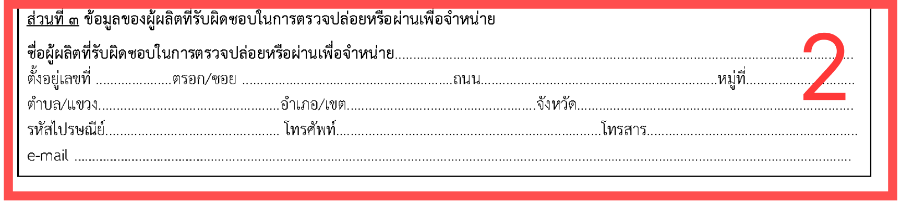
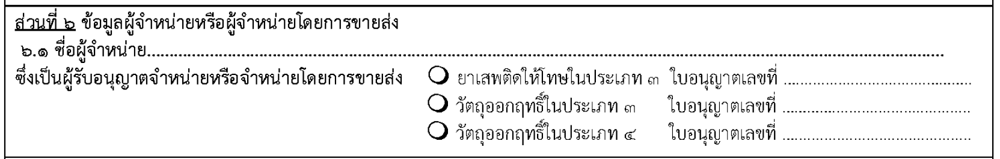
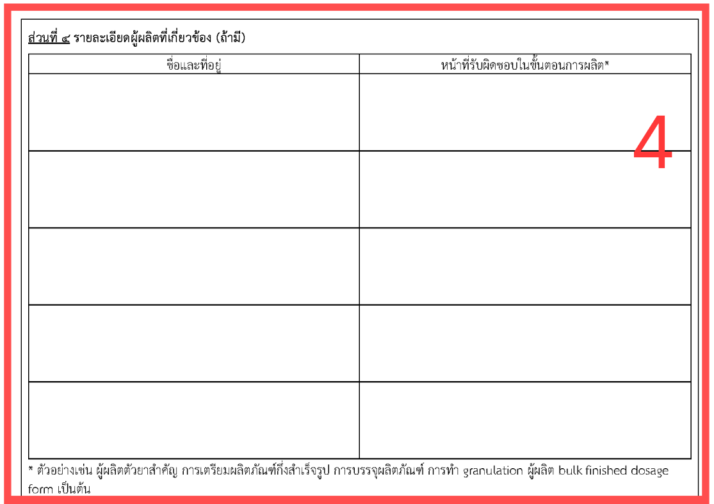

## คำขอขึ้นทะเบียนตำรับ / ใบแทนใบสำคัญการขึ้นทะเบียนตำรับ / ต่ออายุทะเบียนตำรับ ยาเสพติดให้โทษประเภท 3 หรือตำรับวัตถุออกฤทธิ์ในประเภท 3 หรือประภท 4 [ท.บ.1]

---

## (dbo.MasterRequisitionType Id = 49)
### Links

- [Figma Group Doc](https://www.figma.com/design/0YEqdcSpC2hZKulzEl54LH/-FDA68--Group-Doc)
- [Data Dic - Master Data real](https://docs.google.com/spreadsheets/d/1WpRC41tmqyOc8zVaxTVuwLxGgmi7inZATo8_LcCTXgE)
- [Figma ทะเบียน/ตัวอย่าง](https://www.figma.com/board/fs2mIakfyIODQeTHYVgFhU/%E0%B8%97%E0%B8%B0%E0%B9%80%E0%B8%9A%E0%B8%B5%E0%B8%A2%E0%B8%99---%E0%B8%95%E0%B8%B1%E0%B8%A7%E0%B8%AD%E0%B8%A2%E0%B9%88%E0%B8%B2%E0%B8%87)

## 🔷 Field Condition

