## 📑 WORKFLOW

---

### 🔗 Links

- [Figma Group Doc](https://www.figma.com/design/0YEqdcSpC2hZKulzEl54LH/-FDA68--Group-Doc)
- [Data Dic - Master Data real](https://docs.google.com/spreadsheets/d/1WpRC41tmqyOc8zVaxTVuwLxGgmi7inZATo8_LcCTXgE)
- [FDA68_สรุปวัตถุประสงค์ ผู้อนุญาต และผู้อนุมัติ ในใบคำขอ](https://docs.google.com/spreadsheets/d/1B366oiRjTmnY7Jvt0lpH9ORXbmOgJaLXcYDHmDST8Qo)

- [[FDA68] - Flow](https://docs.google.com/spreadsheets/d/1LZHzEPBTc_8n9lTnjJyqDEd8WjPZFZ7As3P_3FNXZO0)
<!-- - [รวมลิ้งค์รายละเอียดของ FDA ](https://docs.google.com/spreadsheets/d/15xbXDS8A34ovKElJu_Avrn6aaK_Xm5cl0arPEnPU77I/edit?gid=1196369628#gid=1196369628)-->
- [14.Flow](https://drive.google.com/drive/u/2/folders/1qkIPvNgaQF1XgsGsJIw5FeD9XzEa84TO)

#### Figma Screen Flow
- [Figma ยส.1](https://www.figma.com/board/2vq44hMBfDujhC8g13qBXC/%E0%B8%A2%E0%B8%AA.1?t=kvjSziK881AvYaUS-6)
- [Figma วจ.1](https://www.figma.com/board/UIPAZvSkDF1152KUElG9Ce/%E0%B8%A2%E0%B8%AA.-1?node-id=0-1&p=f&t=U15rvOevpSTtUH2O-0)
- [Figma ผนส. ยส.2/วจ.2](https://www.figma.com/board/z40hQv1fTsb9ll44MkkUnx/%E0%B8%9C%E0%B8%99%E0%B8%AA.-%E0%B8%A2%E0%B8%AA2---%E0%B8%A7%E0%B8%882?node-id=0-1&p=f&t=LlSyPfz1Ahyt5dXk-00)
- [Figma จ.ย.ส.2/ว.จ.2 จำหน่ายเกินปริมาณ](https://www.figma.com/board/s4SrEArEWbxaanz6cuJ5yD/---จำหน่ายเกินปริมาณ)
- [Figma จ.ย.ส.2/ว.จ.2 ครอบครองเกินปริมาณ](https://www.figma.com/board/g1qjwTqsiMjaq5Oj9GghzW/ครอบครอง---เกินปริมาณ)
- [Figma ยส.3](https://www.figma.com/board/GMDCtXJTmTxrGqjrF2yJl4/ยส.3)
- [Figma วจ.3-4](https://www.figma.com/board/uUEvD4XY2vs6oLVumW8xOp/วจ.3-4)
- **[Figma ยส.4](https://www.figma.com/board/eZAUMG4kub8P4xGJNtzuOF/ยส.4)**
- [Figma ยส.5](https://www.figma.com/board/EWDQbpKKq9Rh4AkENTVOQG/ยส5---ไม่ได้ตามแผน)
- [Figma เฉพาะคราว อื่นๆ](https://www.figma.com/board/8VA6aeLRsleXZW44d0SbsQ/เฉพาะคราว-อื่นๆ)
- [Figma ทะเบียน ตัวอย่าง](https://www.figma.com/board/fs2mIakfyIODQeTHYVgFhU/ทะเบียน---ตัวอย่าง)
- [Figma ยาติดตัว](https://www.figma.com/board/8Dw8uO6ERmYhbAsToiOZgm/ยาติดตัว)
- [Figma กาเฟอีน](https://www.figma.com/board/d5WM3RxuyT44up9RHqlNHt/กาเฟอีน)

#### เอกสารจากเจ้าหน้าที่
- [รวม Link เอกสารแนบ](https://docs.google.com/spreadsheets/d/1Tnz5E6aaWrrCA9C2pav3H_k-QUgSM0WpExkef0Ws-gI)
    - [08 ยส.4_ใบหลัก](https://docs.google.com/spreadsheets/d/1W-Nmzrk8aW3R37V_HB4WWsbxk9M-kjzVqmSzt1CJZlQ)
    - [09 ยส.5_ใบหลัก](https://docs.google.com/spreadsheets/d/101t7PIrUSOWUupRA9zun1rpiM7VyNDPXd1j7yJxnhh8)
- [รวม Link เอกสารแนบ ต่ออายุ ](https://docs.google.com/spreadsheets/d/1_8zL-0d9-UEOXj2bdy1xatfAcml_h1p1P2DHWoM7a8M)

- [เอกสารแนบในแต่ละวัตถุประสงค์ของ ยส. 4](https://drive.google.com/drive/folders/1y3kI2UJyY4YayVMlbP_dlyOjxKeZGECI)

---

### Checklist

| Id | ประเภทคำขอ | คำขอ | คำขอ | อย. | สสจ. | Progress | Status | Remark | Link |
|:---:|:---:|:---:|:---:|:---:|:---:|:---:|:---:|---|:---:|
| 1 | สถานที่ | ขอใหม่ | ยส.1-1 | ✅ มี | ❌ ไม่มี | <b style="color: #27ae60;">100%</b> | ✅ | | [ไปที่รายละเอียด](#-ยส1-1-requisitiontypeid--1) |
| 2 | สถานที่ | ขอใหม่ | วจ.1-1 | ✅ มี | ✅ มี | <b style="color: #f39c12;">50%</b> | 🚧 | **ยังไม่แน่ใจเรื่องการอนุมัติของ สสจ.** | [ไปที่รายละเอียด](#-วจ1-1-requisitiontypeid--2) |
| 3 | สถานที่ | ขอใหม่ | ผนส. ยส.2/วจ.2 | ✅ มี | ❌ ไม่มี | <b style="color: #27ae60;">100%</b> | ✅ | | [ไปที่รายละเอียด](#-ผนส-ยส2วจ2-requisitiontypeid--3) |
| 4 | สถานที่ | ขอใหม่ | จ.ย.ส. 2-1/ว.จ. 2-1 | ✅ มี | ✅ มี | <b style="color: #f39c12;">50%</b> | 🚧 | **ยังไม่แน่ใจเรื่องการอนุมัติของ สสจ.** | [ไปที่รายละเอียด](#-จยส-2-1วจ-2-1-requisitiontypeid--4) |
| 5 | สถานที่ | ขอใหม่ | จก.ย.ส. 2-1 | ✅ มี | ❌ ไม่มี | <b style="color: #27ae60;">100%</b> | ✅ | | [ไปที่รายละเอียด](#-จกยส-2-1-requisitiontypeid--5) |
| 6 | สถานที่ | ขอใหม่ | คค.1-1 | ✅ มี | ✅ มี | <b style="color: #f39c12;">50%</b> | 🚧 | **ยังไม่แน่ใจเรื่องการอนุมัติของ สสจ.** | [ไปที่รายละเอียด](#-คค1-1-requisitiontypeid--6) |
| 7 | สถานที่ | ขอใหม่ | คก.ย.ส. 2-1 | ✅ มี | ❌ ไม่มี | <b style="color: #27ae60;">100%</b> | ✅ | | [ไปที่รายละเอียด](#-คกยส-2-1-requisitiontypeid--7) |
| 19 | สถานที่ | ขอใหม่ | ยส.4-1 | ✅ มี | ❌ ไม่มี | <b style="color: #27ae60;">100%</b> | ✅ | | [ไปที่รายละเอียด](#-ยส4-1-requisitiontypeid--19) |
| 20 | สถานที่ | ขอใหม่ | ยส.5 | ✅ มี | ❌ ไม่มี | <b style="color: #f39c12;">50%</b> | 🚧 | | [ไปที่รายละเอียด](#-ยส5-requisitiontypeid--20) |
|  | สถานที่ | ขอต่ออายุ |  |  |  | <b style="color: #27ae60;">100%</b> | ✅ | | [ไปที่รายละเอียด](#คำขอต่ออายุ) |
|  | สถานที่ | ขอยกเลิก |  |  |  | <b style="color: #27ae60;">100%</b> | ✅ | | [ไปที่รายละเอียด](#คำขอยกเลิก) |
|  | สถานที่ | ขอใบแทน |  |  |  | <b style="color: #27ae60;">100%</b> | ✅ | | [ไปที่รายละเอียด](#คำขอใบแทน) |
| 21 | กาเฟอีน | ขอใหม่ | รร.1 | ✅ มี | ❌ ไม่มี | <b style="color: #27ae60;">100%</b> | ✅ | | [ไปที่รายละเอียด](#-รร1-ขอใหม่) |
| 22 | สารระเหย | ขอใหม่ | ร.ร.ส 1 | ✅ มี | ❌ ไม่มี | <b style="color: #27ae60;">100%</b> | ✅ | | [ไปที่รายละเอียด](#-รรส1-ขอใหม่) |
| 23, 24 | ยาติดตัว | ขอใหม่ | IC-1, OC-1 | ✅ มี | ❌ ไม่มี | <b style="color: #27ae60;">100%</b> | ✅ | | [ไปที่รายละเอียด](#-ยาติดตัว-ขอใหม่) |
| 25-34, 37-44, 45 | เฉพาะคราว | ขอใหม่ | IMP, EXP | ✅ มี | ❌ ไม่มี | <b style="color: #27ae60;">100%</b> | ✅ | | [ไปที่รายละเอียด](#-เฉพาะคราว-imp-exp-requisitiontypeid--25-34-37-44-45) |
| 35-36 | เฉพาะคราว | ขอใหม่ | NAR.5 (กัญชา กัญชง) | ✅ มี | ❌ ไม่มี | 0% | ❌ | **ยังไม่แน่ใจเรื่องการอนุมัติ** | [ไปที่รายละเอียด](#-แต่ละครั้ง-nar5-กัญชา-กัญชง-requisitiontypeid--35-36) |
| 46 | เฉพาะคราว | ขอใหม่ | นำผ่าน นผจ | ✅ มี | ❌ ไม่มี | <b style="color: #27ae60;">100%</b> | ✅ | | [ไปที่รายละเอียด](#-นำผ่าน-นผจ-requisitiontypeid--46) |
| 47 | หนังสือรับรอง | ขอใหม่ | ร.ส.1 | | | 0% | ❌ | รอข้อมูลเพิ่มเติม | [ไปที่รายละเอียด](#-คำขอหนังสือรับรอง) |
| 48 | หนังสือรับรอง | ขอแก้ไข | ร.ส.2 | | | 0% | ❌ | รอข้อมูลเพิ่มเติม | [ไปที่รายละเอียด](#-คำขอหนังสือรับรอง) |
| 49 | ทะเบียน | ขอใหม่ | ทบ.1 | ✅ มี | ❌ ไม่มี | <b style="color: #27ae60;">100%</b> | ✅ | | [ไปที่รายละเอียด](#-คำขอทะเบียน-ขอใหม่-ทบ1) |
| 50 | ทะเบียน | ขอแก้ไข | ทบ.3 | ✅ มี | ❌ ไม่มี | <b style="color: #27ae60;">100%</b> | ✅ | | [ไปที่รายละเอียด](#-คำขอทะเบียน-ขอแก้ไข-ทบ3) |
| 51 | ตัวอย่าง | ขอใหม่ | ต.ย.1 | ✅ มี | ❌ ไม่มี | <b style="color: #27ae60;">100%</b> | ✅ | | [ไปที่รายละเอียด](#-คำขอตัวอย่าง-ขอใหม่) |

---

### Master Table

#### 📂 dbo.MasterRequisition

📂 คลิกเพื่อดูตาราง dbo.MasterRequisition

| Id | ชื่อประเภทใบคำขอ (RequisitionTypeNameTh) | รหัสแบบฟอร์ม |
|:---:|---|:---:|
| 1 | คำขอรับใบอนุญาต คำขอต่ออายุใบอนุญาต คำขอรับใบแทนใบอนุญาตผลิต นำเข้า ส่งออก จำหน่าย หรือมีไว้ในครอบครองยาเสพติดให้โทษในประเภท 1 | ยส.1-1 |
| 2 | คำขอรับใบอนุญาต คำขอต่ออายุใบอนุญาต คำขอรับใบแทนใบอนุญาต ผลิต นำเข้า ส่งออก จำหน่าย หรือมีไว้ในครอบครอง วัตถุออกฤทธิ์ในประเภท 1 | วจ.1-1 |
| 3 | คำขอรับใบอนุญาต คำขอต่อออายุใบอนุญาต และคำขอรับใบแทนใบอนุญาตผลิต ผลิตเพื่อส่งออก นำเข้า หรือส่งออกยาเสพติดให้โทษในประเภท 2 หรือวัตถุออกฤทธิ์ในประเภท 2 | ผนส. ยส.2/วจ.2 |
| 4 | คำขอรับใบอนุญาต คำขอต่ออายุใบอนุญาต และคำขอรับใบแทนอนุญาตจำหน่ายยาเสพติดให้โทษประเภท 2 หรือวัตถุออกฤทธิ์ในประเภท 2 | จ.ย.ส. 2-1/ว.จ. 2-1 |
| 5 | คำขอรับใบอนุญาตจำหน่ายยาเสพติดให้โทษในประเภท 2 เกินปริมาณที่อนุญาตให้ใช้ตามแบบ | จก.ย.ส. 2-1 |
| 6 | คำขอรับใบอนุญาต คำขอต่ออายุใบอนุญาต คำขอรับใบแทนใบอนุญาตมีไว้ในครอบครองยาเสพติดให้โทษในประเภท 2 และวัตถุออกฤทธิ์ในประเภท 2 ประเภท 3 หรือประเภท 4 | คค.1-1 |
| 7 | คำขอรับใบอนุญาตมีไว้ในครอบครองยาเสพติดให้โทษในประเภท 2 เกินปริมาณที่อนุญาต | คก.ย.ส. 2-1 |
| 8 | คำขอรับใบอนุญาต คำขอต่ออายุใบอนุญาต คำขอรับใบแทนใบอนุญาตผลิต ยาเสพติดให้โทษในประเภท 3 | ผ.ย.ส 3-1 |
| 9 | คำขอรับใบอนุญาต คำขอต่อออายุใบอนุญาต คำขอรับใบแทนใบอนุญาตนำเข้ายาเสพติดให้โทษในประเภท 3 | น.ย.ส 3-1 |
| 10 | คำขอรับใบอนุญาต คำขอต่อออายุใบอนุญาต คำขอรับใบแทนใบอนุญาตส่งออกยาเสพติดให้โทษในประเภท 3 | ส.ย.ส. 3-1 |
| 11 | คำขอรับใบอนุญาต คำขอต่ออายุใบอนุญาต คำขอรับใบแทนใบอนุญาตจำหน่าย หรือจำหน่ายโดยการขายส่งยาเสพติดให้โทษในประเภท 3 | จ.ย.ส. 3-1 |
| 12 | คำขอแก้ไขรายการในใบอนุญาตผลิต นำเข้า ส่งออก หรือจำหน่ายยาเสพติดให้โทษในประเภท 3 หรือจำหน่ายยาเสพติดให้โทษในประเภท 3 โดยการขายส่ง | ย.ส. 3 (ก) |
| 13 | คำขอรับใบอนุญาต คำขอต่ออายุใบอนุญาต คำขอรับใบแทนใบอนุญาตผลิตวัตถุออกฤทธิ์ในประเภท 3 หรือประเภท 4 | ผ.ว.จ. 3/4-1 |
| 14 | คำขอรับใบอนุญาต คำขอต่ออายุใบอนุญาต คำขอรับใบแทนใบอนุญาตนำเข้าวัตถุออกฤทธิ์ในประเภท 3 หรือประเภท 4 | น.ว.จ. 3/4-1 |
| 15 | คำขอรับใบอนุญาต คำขอต่ออายุใบอนุญาต คำขอรับใบแทนใบอนุญาตส่งออกวัตถุออกฤทธิ์ในประเภท 3 หรือประเภท 4 | ส.ว.จ. 3/4-1 |
| 16 | คำขอรับใบอนุญาต คำขอต่ออายุใบอนุญาต คำขอรับใบแทนใบอนุญาตจำหน่ายหรือจำหน่ายโดยการขายส่งวัตถุออกฤทธิ์ในประเภท 3 หรือประเภท 4 | ข.ว.จ. 3/4-1 |
| 17 | คำขอแก้ไขรายการในใบอนุญาตผลิต นำเข้า ส่งออก จำหน่าย หรือจำหน่ายโดยการขายส่งวัตถุออกฤทธิ์ในประเภท 3 หรือประเภท 4 | ว.จ. 3/4 (ก) |
| 18 | คำรับรองของเภสัชกรที่อยู่ประจำควบคุมกิจการของสถานที่ผลิต นำเข้า ส่งออกจำหน่าย หรือจำหน่ายโดยการขายส่งวัตถุออกฤทธิ์ในประเภท 3 หรือประเภท 4 | ว.จ. 3/4 (ร) |
| 19 | คำขอรับใบอนุญาต คำขอต่ออายุใบอนุญาต และคำขอรับใบแทนใบอนุญาตผลิต นำเข้า ส่งออก จำหน่าย หรือมีไว้ในครอบครองยาเสพติดให้โทษในประเภท ๔ | ยส.4-1 |
| 20 | คำขอรับใบอนุญาต คำขอต่ออายุใบอนุญาต คำขอรับใบแทนใบอนุญาตผลิต นำเข้า ส่งออก จำหน่าย หรือมีไว้ในครอบครองยาเสพติดให้โทษในประเภท ๕ ที่มิใช่สารสกัดจากทุกส่วนของพืชกัญชาหรือกัญชง | ยส.5 |
| 21 | คำขอหนังสือรับรองในการนำหรือสั่งสารกาเฟอีน (caffeine) เข้ามาในราชอาณาจักรตามประกาศการะทรวงพาณิชย์ซึ่งออกตามพระราชบัญญัติการส่งออกไปนอกและการนำเข้ามาในราชอาณาจักรซึ่งสิ้นค้า พ.ศ. ๒๕๒๒ | รร.1 |
| 22 | คำขอหนังสือรับรองการนำหรือสั่งเข้ามาในราชอาณาจักรซึ่งสารระเหยในกลุ่มโวลาไทล์อัลคิลไนไตรท์ (volatile alkyl nitrite) | ร.ร.ส 1 |
| 23 | Application for an inbound carrying by traveller under treatment of medical preparations containing substances under control of the single convention on narcotic drugs, 1961 and the convention on psychotropic substances, 1971 | IC-1 |
| 24 | Application for an outbound carrying by traveller under treatment of medical preparations containing substances under control of the single convention on narcotic drugs, 1961 and the convention on psychotropic substances, 1971 | OC-1 |
| 25 | แบบคำขอรับใบอนุญาตนำเข้าเฉพาะคราว ยาเสพติดให้โทษประเภท 1 | IMP-N1-1 |
| 26 | แบบคำขอรับใบอนุญาตส่งออกเฉพาะคราวยาเสพติดให้โทษประเภท 1 | EXP-N1-1 |
| 27 | แบบคำขอรับใบอนุญาตนำเข้าเฉพาะคราว ยาเสพติดให้โทษประเภท 2 | IMP-N2-1 |
| 28 | แบบคำขอรับใบอนุญาตส่งออกเฉพาะคราว ยาเสพติดให้โทษประเภท 2 | EXP-N2-1 |
| 29 | แบบคำขอรับใบอนุญาตนำเข้าเฉพาะคราว ยาเสพติดให้โทษประเภท 3 | IMP-N3-1 |
| 30 | แบบคำขอรับใบอนุญาตส่งออกเฉพาะคราว ยาเสพติดให้โทษประเภท 3 | EXP-N3-1 |
| 31 | แบบคำขอรับใบอนุญาตนำเข้าเฉพาะคราว ยาเสพติดให้โทษประเภท 4 | IMP-N4-1 |
| 32 | แบบคำขอรับใบอนุญาตส่งออกเฉพาะคราว ยาเสพติดให้โทษประเภท 4 | EXP-N4-1 |
| 33 | แบบคำขอรับใบอนุญาตนำเข้าเฉพาะคราว ยาเสพติดให้โทษประเภท 5 | IMP-N5-1 |
| 34 | แบบคำขอรับใบอนุญาตส่งออกเฉพาะคราว ยาเสพติดให้โทษประเภท 5 | EXP-N5-1 |
| 35 | แบบคำขอรับใบอนุญาตนำเข้าหรือส่งออกซึ่งกัญชาในแต่ละครั้ง | NAR.5 |
| 36 | แบบคำขอรับใบอนุญาตนำเข้าหรือส่งออกซึ่งกัญชง | NAR.5(HEMP) |
| 37 | แบบคำขอรับใบอนุญาตนำเข้าเฉพาะคราว วัตถุออกฤทธิ์ในประเภท 1 | IMP-P1-1 |
| 38 | แบบคำขอรับใบอนุญาตส่งออกเฉพาะคราว วัตถุออกฤทธิ์ในประเภท 1 | EXP-P1-1 |
| 39 | แบบคำขอรับใบอนุญาตนำเข้าเฉพาะคราว วัตถุออกฤทธิ์ในประเภท 2 | IMP-P2-1 |
| 40 | แบบคำขอรับใบอนุญาตส่งออกเฉพาะคราว วัตถุออกฤทธิ์ในประเภท 2 | EXP-P2-1 |
| 41 | แบบคำขอรับใบอนุญาตนำเข้าเฉพาะคราว วัตถุออกฤทธิ์ในประเภท 3 | IMP-P3-1 |
| 42 | แบบคำขอรับใบอนุญาตส่งออกเฉพาะคราว วัตถุออกฤทธิ์ในประเภท 3 | EXP-P3-1 |
| 43 | แบบคำขอรับใบอนุญาตนำเข้าเฉพาะคราว วัตถุออกฤทธิ์ในประเภท 4 | IMP-P4-1 |
| 44 | แบบคำขอรับใบอนุญาตส่งออกเฉพาะคราว วัตถุออกฤทธิ์ในประเภท 4 | EXP-P4-1 |
| 45 | คำขอรับใบอนุญาตพิเศษเฉพาะคราวเพื่อส่งออกวัตถุออกฤทธิ์ | EXP.SP-1 |
| 46 | คำขอรับใบอนุญาต / ใบแทนใบอนุญาต / แก้ไขรายการในใบอนุญาตนำผ่านวัตถุออกฤทธิ์ | นผ.จ.1 |
| 47 | คำขอรับหนังสือรับรองการประเมินเอกสารทางวิชาการ และคำทบทวนรายการเอกสารตำหรับยาของยาเสพติดให้โทษในประเภท 2 หรือวัตถุออกฤทธิ์ในประเภท 2 | ร.ส.1 |
| 48 | คำขอแก้ไขเปลี่ยนแปลงเอกสารทางวิชาการยาเสพติดให้โทษในประเภท 2 หรือวัตถุออกฤทธิ์ในประเภท 2 | ร.ส.2 |
| 49 | คำขอขึ้นทะเบียนตำรับ / ใบแทนใบสำคัญการขึ้นทะเบียนตำรับ / ต่ออายุทะเบียนตำรับ ยาเสพติดให้โทษประเภท 3 หรือตำรับวัตถุออกฤทธิ์ในประเภท 3 หรือประภท4 | ท.บ.1 |
| 50 | คำขอแก้ไขรายการทะเบียนตำรับ ยาเสพติดให้โทษในประเภท 3 หรือตำรับวัตถุออกฤทธิ์ในประเภท 3 หรือประเภท 4 | ท.บ.3 |
| 51 | คำขอรับใบอนุญาตผลิตหรือนำเข้าตัวอย่าง ของตำรับยาเสพติดให้โทษในประเภท 3 หรือ ตำรับวัตถุออกฤทธิ์ในประเภท 3 หรือประเภท 4 | ต.ย.1 |

#### 📂 dbo.MasterObjective

📂 คลิกเพื่อดูตาราง dbo.MasterObjective

| Id | วัตถุประสงค์ (ObjectiveNameTh) | RequisitionTypeId |
|:---:|---|:---:|
| 1 | เพื่อประโยชน์ของทางราชการในการป้องกันและปราบปรามการกระทำความผิดเกี่ยวกับยาเสพติดหรือความร่วมมือระหว่างประเทศในกรณีจำเป็นเร่งด่วน | 1 |
| 2 | เพื่อการศึกษาวิจัย | 1 |
| 38 | เพื่อประโยชน์ทางการแพทย์ | 1 |
| 39 | เพื่อประโยชน์ทางวิทยาศาสตร์ | 1 |
| 3 | เพื่อใช้เป็นสารมาตรฐานในการตรวจวิเคราะห์ในปริมาณเล็กน้อย | 1 |
| 4 | การบริหารยาเสพติดให้โทษในประเภท ๒ หรือวัตถุออกฤทธิ์ในประเภท ๒ ที่ใช้ในทางการแพทย์ของประเทศ | 3 |
| 5 | การวิเคราะห์ทางการแพทย์หรือวิทยาศาสตร์ | 3 |
| 6 | การศึกษาวิจัยทางการแพทย์หรือวิทยาศาสตร์ | 3 |
| 7 | การป้องกันและปราบปรามการกระทำความผิดเกี่ยวกับยาเสพติด | 3 |
| 8 | การผลิตเพื่อส่งออก | 3 |
| 9 | การรักษาหรือป้องกันโรคให้แก่ผู้ป่วยหรือสัตว์ป่วยในทางการแพทย์ | 4 |
| 10 | การเป็นหน่วยกระจายยา | 4 |
| 11 | การวิเคราะห์ | 4 |
| 12 | การศึกษาวิจัยทางการแพทย์หรือวิทยาศาสตร์ | 4 |
| 13 | การป้องกันและปราบปรามการกระทำความผิดเกี่ยวกับยาเสพติด | 4 |
| 14 | เพื่อประโยชน์ของทางราชการในการป้องกันและปราบปรามการกระทำความผิดเกี่ยวกับยาเสพติดหรือความร่วมมือระหว่างประเทศในกรณีจำเป็นเร่งด่วน | 19 |
| 15 | เพื่อการศึกษาวิจัย | 19 |
| 16 | เพื่อประโยชน์ในทางการแพทย์ | 19 |
| 17 | เพื่อประโยชน์ทางวิทยาศาสตร์ | 19 |
| 18 | เพื่อประโยชน์ทางอุตสาหกรรม | 19 |
| 19 | เพื่อใช้เป็นสารมาตรฐานในการตรวจวิเคราะห์ | 19 |
| 20 | เพื่อประโยชน์ของทางราชการในการป้องกันและปราบปรามการกระทำความผิดเกี่ยวกับยาเสพติด | 20 |
| 21 | เพื่อประโยชน์ในทางการแพทย์หรือการบำบัดหรือรักษาผู้ป่วย | 20 |
| 22 | เพื่อการวิเคราะห์ทางการแพทย์หรือวิทยาศาสตร์ | 20 |
| 23 | เพื่อการศึกษาวิจัยทางการแพทย์หรือวิทยาศาสตร์ | 20 |
| 24 | เพื่อการป้องกันและปราบปรามการกระทำความผิดเกี่ยวกับยาเสพติด | 2 |
| 25 | เพื่อการวิเคราะห์ | 2 |
| 26 | เพื่อการศึกษาวิจัยทางการแพทย์หรือวิทยาศาสตร์ | 2 |
| 27 | เพื่อผลิตยาเสพติดให้โทษในประเภท ๓ | 6 |
| 28 | เพื่อการป้องกันและปราบปรามการกระทำความผิดเกี่ยวกับยาเสพติด | 6 |
| 29 | เพื่อการวิเคราะห์หรือศึกษาวิจัยทางการแพทย์หรือวิทยาศาสตร์ | 6 |
| 30 | เพื่อใช้ประจำในเรือหรือเครื่องบินที่ใช้ในการขนส่งสาธารณะระหว่างประเทศที่จดทะเบียนในราชอาณาจักร สำหรับการปฐมพยาบาลหรือกรณีเกิดเหตุฉุกเฉิน | 6 |
| 31 | เพื่อการบำบัดรักษาหรือป้องกันโรคให้แก่ผู้ป่วยหรือสัตว์ป่วยทางการแพทย์ | 6 |
| 32 | เพื่อประโยชน์ทางอุตสาหกรรม | 6 |
| 33 | นำเข้ามาเป็นวัตถุดิบเพื่อจำหน่าย | 14 |
| 34 | นำเข้ามาเป็นวัตถุดิบเพื่อผลิตวัตถุตำรับ | 14 |
| 35 | นำเข้ามาเป็นผลิตภัณฑ์สำเร็จรูปเพื่อจำหน่าย | 14 |
| 36 | นำเข้ามาเป็นผลิตภัณฑ์สำเร็จรูปเพื่อส่งออก | 14 |
| 37 | อื่นๆ | 14 |

---

## 🏬 คำขอสถานที่

### 📝 ยส.1-1 (RequisitionTypeId = 1)

#### 🔹 ขอใหม่
> • มีแต่ อย. ไม่มี สสจ.

  
📸 คลิกเพื่อดูรูปภาพ Workflow ยส.1-1 ขอใหม่

  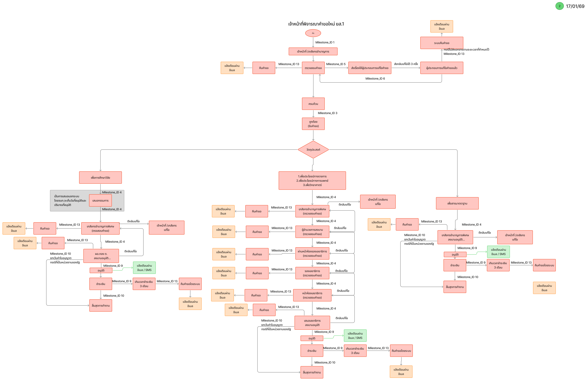

| ลำดับ | กอง | ดำเนินการ | Id คำขอ | คำขอ | วัตถุประสงค์ Id | วัตถุประสงค์ | Level / ขั้นตอนการทำงาน | Flow | Flow Id |
|:---:|:---:|:---:|:---:|:---:|:---:|---|---|:---:|:---:|
| 1 | กอง ต. | ขอใหม่ | 1 | ยส. 1-1 | 1, 38, 39 | 1 เพื่อประโยชน์ของทางราชการ 38 เพื่อประโยชน์ทางการแพทย์ 39 เพื่อประโยชน์ทางวิทยาศาสตร์ | **L1 - เจ้าหน้าที่/เภสัชกรชำนาญการ** • ตรวจสอบคำขอ **• ถ้าครบถ้วน/ถูกต้อง** **L1 - เจ้าหน้าที่/เภสัชกรชำนาญการ** • รับคำขอ **L2 - เภสัชกรชำนาญการพิเศษ** • ตรวจสอบ **L3 - ผอ. กอง ต.** • ตรวจสอบใบอนุญาต • ส่งหน้าห้อง รองเลขา **L4 - หน้าห้องรองเลขาฯ** • ตรวจสอบคำขอ • เสนอ รองเลาฯ **L5 - รองเลขาฯ** • ตรวจสอบคำขอ • ส่งหน้าห้องเลขาฯ **L6 - หน้าห้องเลขาฯ** • ตรวจสอบคำขอ • เสนอ เลขาฯ **L7 - เลขาฯ** • ลงนามอนุมัติ | Flow ยาวมาก | xxx |
| 2 | กอง ต. | ขอใหม่ | 1 | ยส. 1-1 | 2 | 2 เพื่อการศึกษาวิจัย | **L1 - เจ้าหน้าที่/เภสัชกรชำนาญการ** • ตรวจสอบคำขอ **• ถ้าครบถ้วน/ถูกต้อง** **L1 - เจ้าหน้าที่/เภสัชกรชำนาญการ** • รับคำขอ • เสนอ**กรรมการ** **L3 - เภสัชกรชำนาญการพิเศษ** • ตรวจสอบใบอนุญาต • เสนอ ผอ. กอง ต. **L4 - ผอ. กอง ต.** • ลงนามอนุมัติ | Flow ยาว | xxx |
| 3 | กอง ต. | ขอใหม่ | 1 | ยส. 1-1 | 3 | 3 เพื่อใช้เป็นสารมาตรฐานในการตรวจวิเคราะห์ฯ | **L1 - เจ้าหน้าที่/เภสัชกรชำนาญการ** • ตรวจสอบคำขอ **• ถ้าครบถ้วน/ถูกต้อง** **L1 - เจ้าหน้าที่/เภสัชกรชำนาญการ** • รับคำขอ **L2 - เภสัชกรชำนาญการพิเศษ** • ลงนามอนุมัติ | Flow สั้น | FLOW_SHORT |

#### 🔹 ขอเพิ่มชนิด/เพิ่มปริมาณ
> • มีแต่ อย. ไม่มี สสจ. • เพื่อการศึกษาวิจัย ขอเพิ่มชนิด/เพิ่มปริมาณไม่ได้

  
📸 คลิกเพื่อดูรูปภาพ Workflow ยส.1-1 ขอเพิ่มชนิด/เพิ่มปริมาณ

  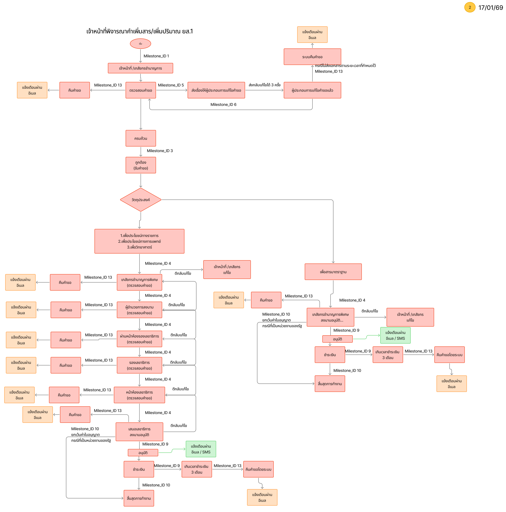

| ลำดับ | กอง | ดำเนินการ | Id คำขอ | คำขอ | วัตถุประสงค์ Id | วัตถุประสงค์ | Level / ขั้นตอนการทำงาน | Flow | Flow Id |
|:---:|:---:|:---:|:---:|:---:|:---:|---|---|:---:|:---:|
| 1 | กอง ต. | ขอเพิ่มชนิด/เพิ่มปริมาณ | 1 | ยส. 1-1 | 1, 38, 39 | 1 เพื่อประโยชน์ของทางราชการ 38 เพื่อประโยชน์ทางการแพทย์ 39 เพื่อประโยชน์ทางวิทยาศาสตร์ | **L1 - เจ้าหน้าที่/เภสัชกรชำนาญการ** • ตรวจสอบคำขอ **• ถ้าครบถ้วน/ถูกต้อง** **L1 - เจ้าหน้าที่/เภสัชกรชำนาญการ** • รับคำขอ • เสนอ ผอ. กอง ต. **L3 - ผอ. กอง ต.** • ตรวจสอบใบอนุญาต • ส่งหน้าห้อง รองเลขา **L4 - หน้าห้องรองเลขาฯ** • ตรวจสอบคำขอ • เสนอ รองเลขาฯ **L5 - รองเลขาฯ** • ตรวจสอบคำขอ • ส่งหน้าห้องเลขาฯ **L6 - หน้าห้องเลขาฯ** • ตรวจสอบคำขอ • เสนอ เลขาฯ **L7 - เลขาฯ** • ลงนามอนุมัติ | Flow ยาวมาก | xxx |
| 2 | กอง ต. | ขอเพิ่มชนิด/เพิ่มปริมาณ | 1 | ยส. 1-1 | 3 | 3 เพื่อใช้เป็นสารมาตรฐานในการตรวจวิเคราะห์ฯ | **L1 - เจ้าหน้าที่/เภสัชกรชำนาญการ** • ตรวจสอบคำขอ **• ถ้าครบถ้วน/ถูกต้อง** **L1 - เจ้าหน้าที่/เภสัชกรชำนาญการ** • รับคำขอ **L2 - เภสัชกรชำนาญการพิเศษ** • ลงนามอนุมัติ | Flow สั้น | FLOW_SHORT |

#### 🔹 ขอแก้ไข
> • มีแต่ อย. ไม่มี สสจ.

  
📸 คลิกเพื่อดูรูปภาพ Workflow ยส.1-1 ขอแก้ไข

  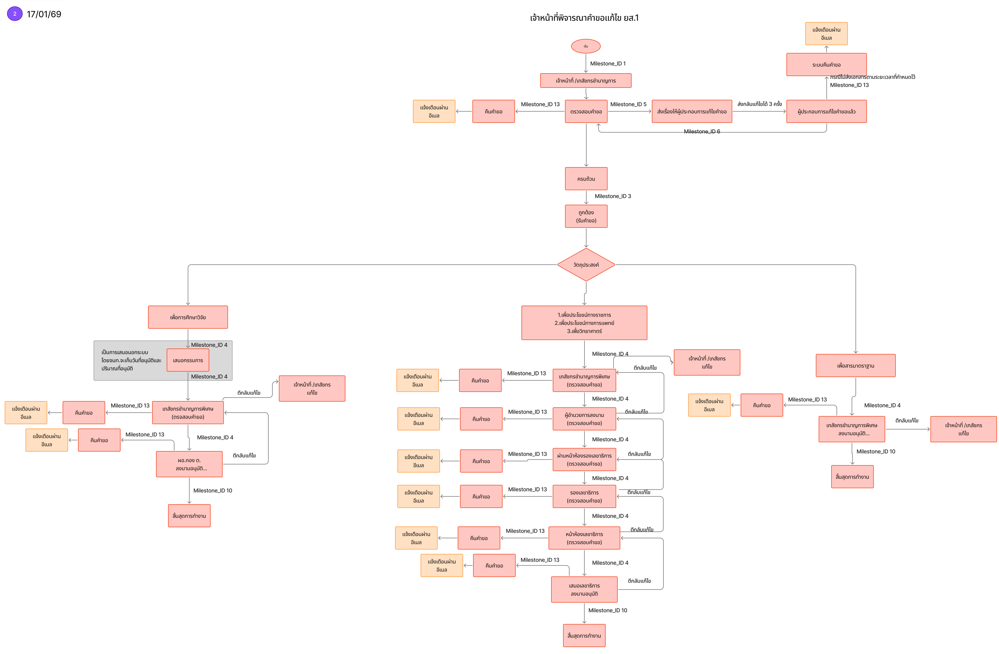

| ลำดับ | กอง | ดำเนินการ | Id คำขอ | คำขอ | วัตถุประสงค์ Id | วัตถุประสงค์ | Level / ขั้นตอนการทำงาน | Flow | Flow Id |
|:---:|:---:|:---:|:---:|:---:|:---:|---|---|:---:|:---:|
| 1 | กอง ต. | ขอแก้ไข | 1 | ยส. 1-1 | 1, 38, 39 | 1 เพื่อประโยชน์ของทางราชการ 38 เพื่อประโยชน์ทางการแพทย์ 39 เพื่อประโยชน์ทางวิทยาศาสตร์ | **L1 - เจ้าหน้าที่/เภสัชกรชำนาญการ** • ตรวจสอบคำขอ **• ถ้าครบถ้วน/ถูกต้อง** **L1 - เจ้าหน้าที่/เภสัชกรชำนาญการ** • รับคำขอ **L2 - เภสัชกรชำนาญการพิเศษ** • ตรวจสอบ **L3 - ผอ. กอง ต.** • ตรวจสอบ **L4 - หน้าห้องรองเลขาฯ** • ตรวจสอบ **L5 - รองเลขาฯ** • ตรวจสอบ **L6 - หน้าห้องเลขาฯ** • ตรวจสอบ **L7 - เลขาธิการ** • ลงนามอนุมัติ | Flow ยาวมาก | xxx |
| 2 | กอง ต. | ขอแก้ไข | 1 | ยส. 1-1 | 2 | 2 เพื่อการศึกษาวิจัย | **L1 - เจ้าหน้าที่/เภสัชกรชำนาญการ** • ตรวจสอบคำขอ **• ถ้าครบถ้วน/ถูกต้อง** **L1 - เจ้าหน้าที่/เภสัชกรชำนาญการ** • รับคำขอ • เสนอกรรมการ **L3 - เภสัชกรชำนาญการพิเศษ** • ตรวจสอบ • เสนอ ผอ. กอง ต. **L4 - ผอ. กอง ต.** • ลงนามอนุมัติ | Flow ยาว | xxx |
| 3 | กอง ต. | ขอแก้ไข | 1 | ยส. 1-1 | 3 | 3 เพื่อใช้เป็นสารมาตรฐานในการตรวจวิเคราะห์ฯ | **L1 - เจ้าหน้าที่/เภสัชกรชำนาญการ** • ตรวจสอบคำขอ **• ถ้าครบถ้วน/ถูกต้อง** **L1 - เจ้าหน้าที่/เภสัชกรชำนาญการ** • รับคำขอ **L2 - เภสัชกรชำนาญการพิเศษ** • ลงนามอนุมัติ | Flow สั้น | FLOW_SHORT |

### 📝 ยส.4-1 (RequisitionTypeId = 19)

#### 🔹 ยส.4-1 ขอใหม่
> • มีแต่ อย. ไม่มี สสจ.

  
📸 คลิกเพื่อดูรูปภาพ Workflow ยส.4-1 ขอใหม่ (17-01-2569)

  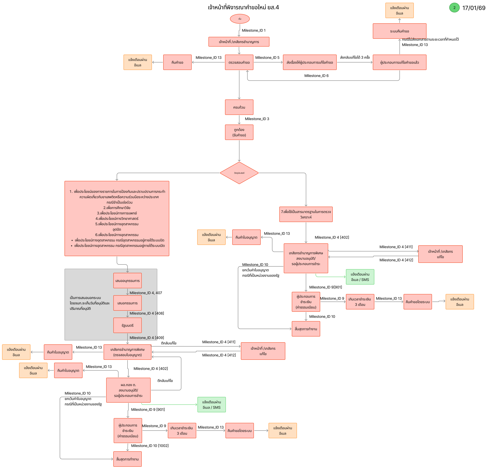

  
📸 คลิกเพื่อดูรูปภาพ Workflow ยส.4-1 ขอใหม่ (20-01-2569)

  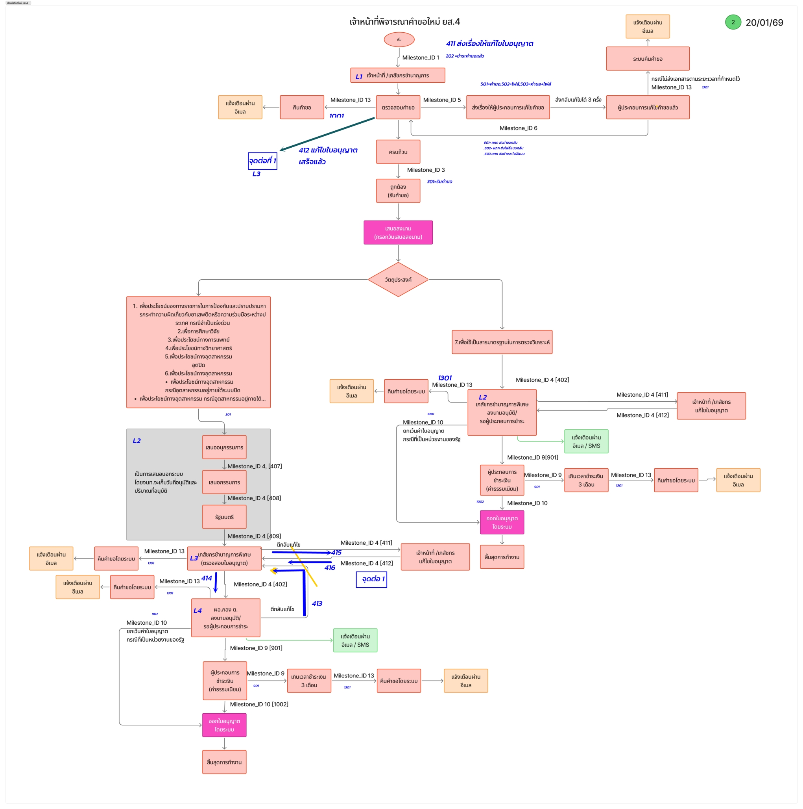

| ลำดับ | กอง | ดำเนินการ | Id คำขอ | คำขอ | วัตถุประสงค์ Id | วัตถุประสงค์ | Level / ขั้นตอนการทำงาน | Flow | Flow Id |
|:---:|:---:|:---:|:---:|:---:|:---:|---|---|:---:|:---:|
| 1 | กอง ต. | ขอใหม่ | 19 | ยส. 4-1 | 14, 15, 16, 17, 18 | 14 เพื่อประโยชน์ของทางราชการฯ 15 เพื่อการศึกษาวิจัย 16 เพื่อประโยชน์ในทางการแพทย์ 17 เพื่อประโยชน์ทางวิทยาศาสตร์ 18 เพื่อประโยชน์ทางอุตสาหกรรม | **L1 - เจ้าหน้าที่/เภสัชกรชำนาญการ** • ตรวจสอบคำขอ **• ถ้าครบถ้วน/ถูกต้อง** **L1 - เจ้าหน้าที่/เภสัชกรชำนาญการ** • รับคำขอ • เสนออนุกรรมการ-กรรมการ-รัฐมนตรี **L3 - เภสัชกรชำนาญการพิเศษ** • ตรวจสอบใบอนุญาต • เสนอ ผอ. กอง ต. **L4 - ผอ. กอง ต.** • ลงนามอนุมัติ | Flow ยาว | xxx |
| 2 | กอง ต. | ขอใหม่ | 19 | ยส. 4-1 | 19 | 19 เพื่อใช้เป็นสารมาตรฐานในการตรวจวิเคราะห์ | **L1 - เจ้าหน้าที่/เภสัชกรชำนาญการ** • ตรวจสอบคำขอ **• ถ้าครบถ้วน/ถูกต้อง** **L1 - เจ้าหน้าที่/เภสัชกรชำนาญการ** • รับคำขอ **L2 - เภสัชกรชำนาญการพิเศษ** • ลงนามอนุมัติ | Flow สั้น | FLOW_SHORT |

#### 🔹 ยส.4-1 ขอต่อเนื่อง
> • มีแต่ อย. ไม่มี สสจ. • การดำเนินการ ผลิต นำเข้า ส่งออก ครอบครอง ขอต่อเนื่องได้ • จำหน่าย ขอต่อเนื่องไม่ได้

  
📸 คลิกเพื่อดูรูปภาพ Workflow ยส.4-1 ขอต่อเนื่อง

  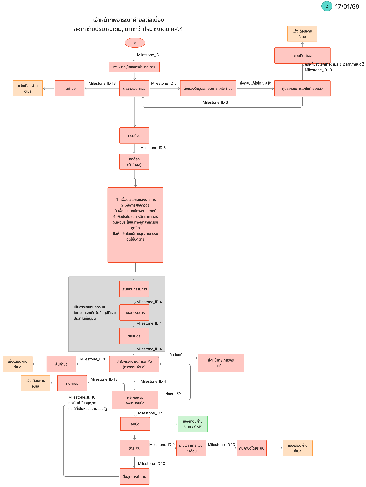

| ลำดับ | กอง | ดำเนินการ | Id คำขอ | คำขอ | วัตถุประสงค์ Id | วัตถุประสงค์ | Level / ขั้นตอนการทำงาน | Flow | Flow Id |
|:---:|:---:|:---:|:---:|:---:|:---:|---|---|:---:|:---:|
| 1 | กอง ต. | ขอต่อเนื่อง | 19 | ยส. 4-1 | 16, 17, 18 | 16 เพื่อประโยชน์ในทางการแพทย์ 17 เพื่อประโยชน์ทางวิทยาศาสตร์ 18 เพื่อประโยชน์ทางอุตสาหกรรม | **L1 - เจ้าหน้าที่/เภสัชกรชำนาญการ** • ตรวจสอบคำขอ **• ถ้าครบถ้วน/ถูกต้อง** **L1 - เจ้าหน้าที่/เภสัชกรชำนาญการ** • รับคำขอ • เสนออนุกรรมการ-กรรมการ-รัฐมนตรี **L3 - เภสัชกรชำนาญการพิเศษ** • ตรวจสอบใบอนุญาต • เสนอ ผอ. กอง ต. **L4 - ผอ. กอง ต.** • ลงนามอนุมัติ | Flow ยาว | xxx |

#### 🔹 ยส.4-1 ขอเพิ่มชนิด/เพิ่มปริมาณ
> • มีแต่ อย. ไม่มี สสจ. • การดำเนินการ ผลิต นำเข้า ส่งออก ครอบครอง ขอเพิ่มชนิด/เพิ่มปริมาณได้ จำหน่าย ขอเพิ่มชนิด/เพิ่มปริมาณไม่ได้ • ผลิต เพื่อใช้เป็นสารมาตรฐานในการตรวจวิเคราะห์ ขอเพิ่มชนิด/เพิ่มปริมาณ ไม่ได้

  
📸 คลิกเพื่อดูรูปภาพ Workflow ยส.4-1 ขอเพิ่มชนิด/เพิ่มปริมาณ

  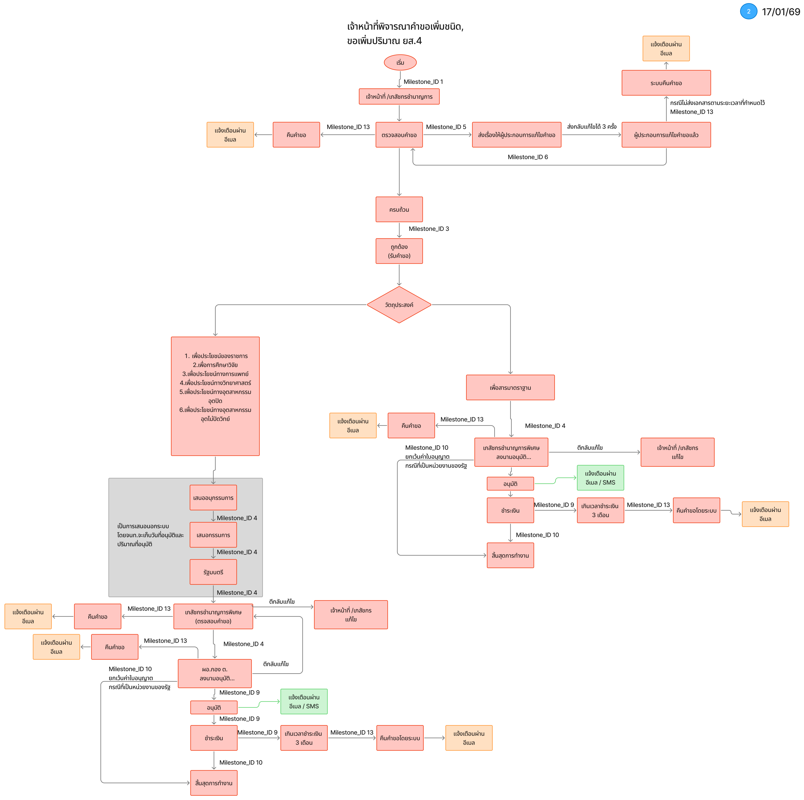

| ลำดับ | กอง | ดำเนินการ | Id คำขอ | คำขอ | วัตถุประสงค์ Id | วัตถุประสงค์ | Level / ขั้นตอนการทำงาน | Flow | Flow Id |
|:---:|:---:|:---:|:---:|:---:|:---:|---|---|:---:|:---:|
| 1 | กอง ต. | ขอเพิ่มชนิด/เพิ่มปริมาณ | 19 | ยส. 4-1 | 16, 17, 18 | 16 เพื่อประโยชน์ในทางการแพทย์ 17 เพื่อประโยชน์ทางวิทยาศาสตร์ 18 เพื่อประโยชน์ทางอุตสาหกรรม | **L1 - เจ้าหน้าที่/เภสัชกรชำนาญการ** • ตรวจสอบคำขอ **• ถ้าครบถ้วน/ถูกต้อง** **L1 - เจ้าหน้าที่/เภสัชกรชำนาญการ** • รับคำขอ • เสนออนุกรรมการ-กรรมการ-รัฐมนตรี **L3 - เภสัชกรชำนาญการพิเศษ** • ตรวจสอบใบอนุญาต • เสนอ ผอ. กอง ต. **L4 - ผอ. กอง ต.** • ลงนามอนุมัติ | Flow ยาว | xxx |

#### 🔹 ยส.4-1 ขอแก้ไข
> • มีแต่ อย. ไม่มี สสจ.

  
📸 คลิกเพื่อดูรูปภาพ Workflow ยส.4-1 ขอแก้ไข

  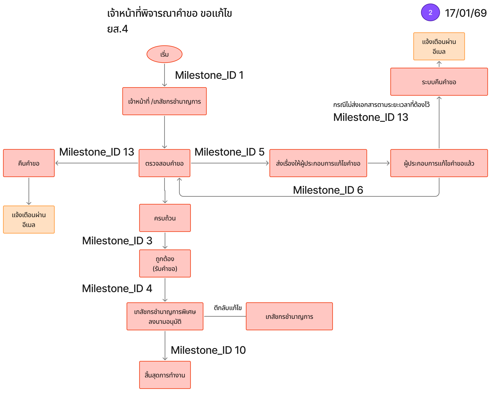

| ลำดับ | กอง | ดำเนินการ | Id คำขอ | คำขอ | วัตถุประสงค์ Id | วัตถุประสงค์ | Level / ขั้นตอนการทำงาน | Flow | Flow Id |
|:---:|:---:|:---:|:---:|:---:|:---:|---|---|:---:|:---:|
| 1 | กอง ต. | ขอแก้ไข | 19 | ยส. 4-1 | - | - | **L1 - เจ้าหน้าที่/เภสัชกรชำนาญการ** • ตรวจสอบคำขอ **• ถ้าครบถ้วน/ถูกต้อง** **L1 - เจ้าหน้าที่/เภสัชกรชำนาญการ** • รับคำขอ **L2 - เภสัชกรชำนาญการพิเศษ** • ลงนามอนุมัติ | Flow สั้น | FLOW_SHORT |

### 📝 ยส.5 (RequisitionTypeId = 20)

#### 🔹 ยส.5 ขอใหม่
> • มีแต่ อย. ไม่มี สสจ.

  
📸 คลิกเพื่อดูรูปภาพ Workflow ยส.5 ขอใหม่

  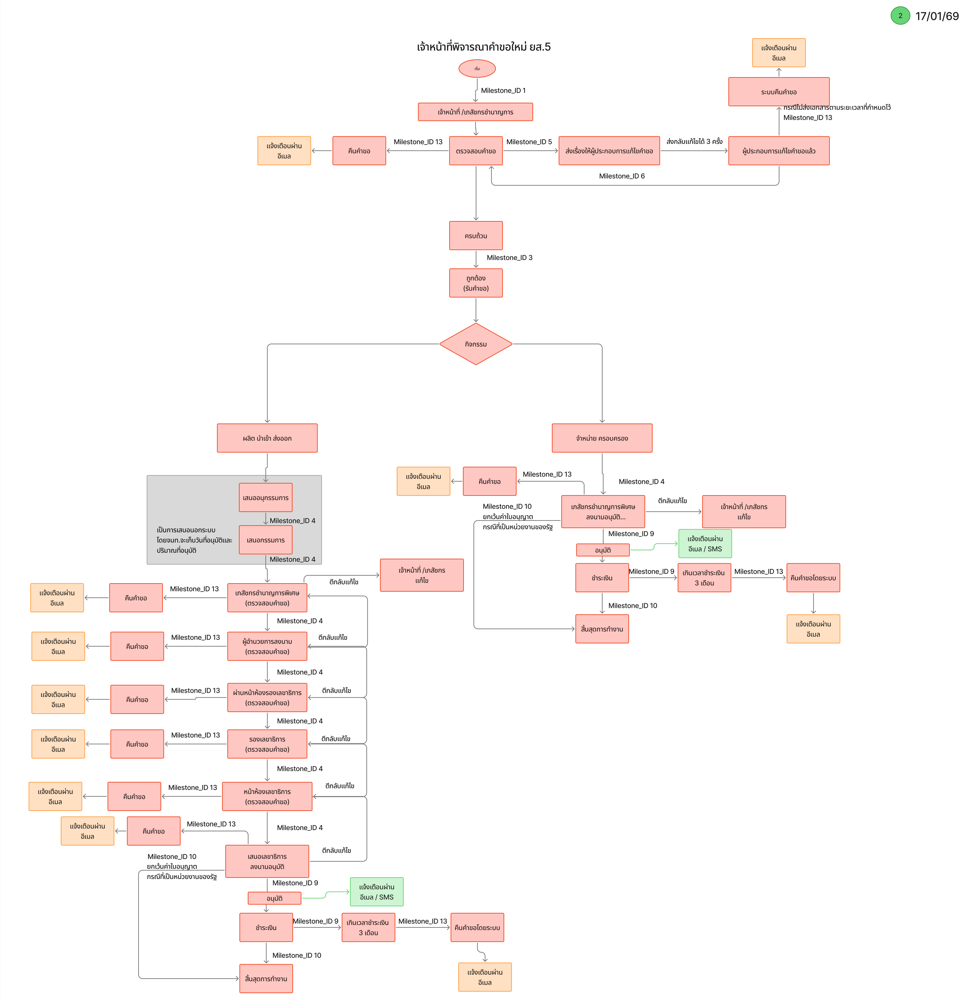

| ลำดับ | กอง | ดำเนินการ | Id คำขอ | คำขอ | วัตถุประสงค์ Id | วัตถุประสงค์ | Level / ขั้นตอนการทำงาน | Flow | Flow Id |
|:---:|:---:|:---:|:---:|:---:|:---:|---|---|:---:|:---:|
| 1 | กอง ต. | ขอใหม่ - ผลิต นำเข้า ส่งออก | 20 | ยส. 5 | - | - | **L1 - เจ้าหน้าที่/เภสัชกรชำนาญการ** • ตรวจสอบคำขอ **• ถ้าครบถ้วน/ถูกต้อง** **L1 - เจ้าหน้าที่/เภสัชกรชำนาญการ** • รับคำขอ • เสนออนุกรรมการ-กรรมการ **L2 - เภสัชกรชำนาญการพิเศษ** • ตรวจสอบใบอนุญาต • เสนอ ผอ. กอง ต. **L3 - ผอ. กอง ต.** • ตรวจสอบใบอนุญาต • ส่งหน้าห้อง รองเลขาฯ **L4 - หน้าห้องรองเลขาฯ** • ตรวจสอบคำขอ • เสนอ รองเลขาฯ **L5 - รองเลขาฯ** • ตรวจสอบคำขอ • ส่งหน้าห้องเลขาฯ **L6 - หน้าห้องเลขาฯ** • ตรวจสอบคำขอ • เสนอ เลขาฯ **L7 - เลขาฯ** • ตรวจสอบคำขอ • ลงนามอนุมัติ | Flow ยาวมาก | xxx |
| 2 | กอง ต. | ขอใหม่ - จำหน่าย ครอบครอง | 20 | ยส. 5 | - | - | **L1 - เจ้าหน้าที่/เภสัชกรชำนาญการ** • ตรวจสอบคำขอ **• ถ้าครบถ้วน/ถูกต้อง** **L1 - เจ้าหน้าที่/เภสัชกรชำนาญการ** • รับคำขอ **L2 - เภสัชกรชำนาญการ / เภสัชกรชำนาญการพิเศษ** • ลงนามอนุมัติ | Flow สั้น | FLOW_SHORT |

#### 🔹 ยส.5 ขอใหม่ ไม่ได้ตามแผน
> • มีแต่ อย. ไม่มี สสจ.

  
📸 คลิกเพื่อดูรูปภาพ Workflow ยส.5 ไม่ได้ตามแผน

  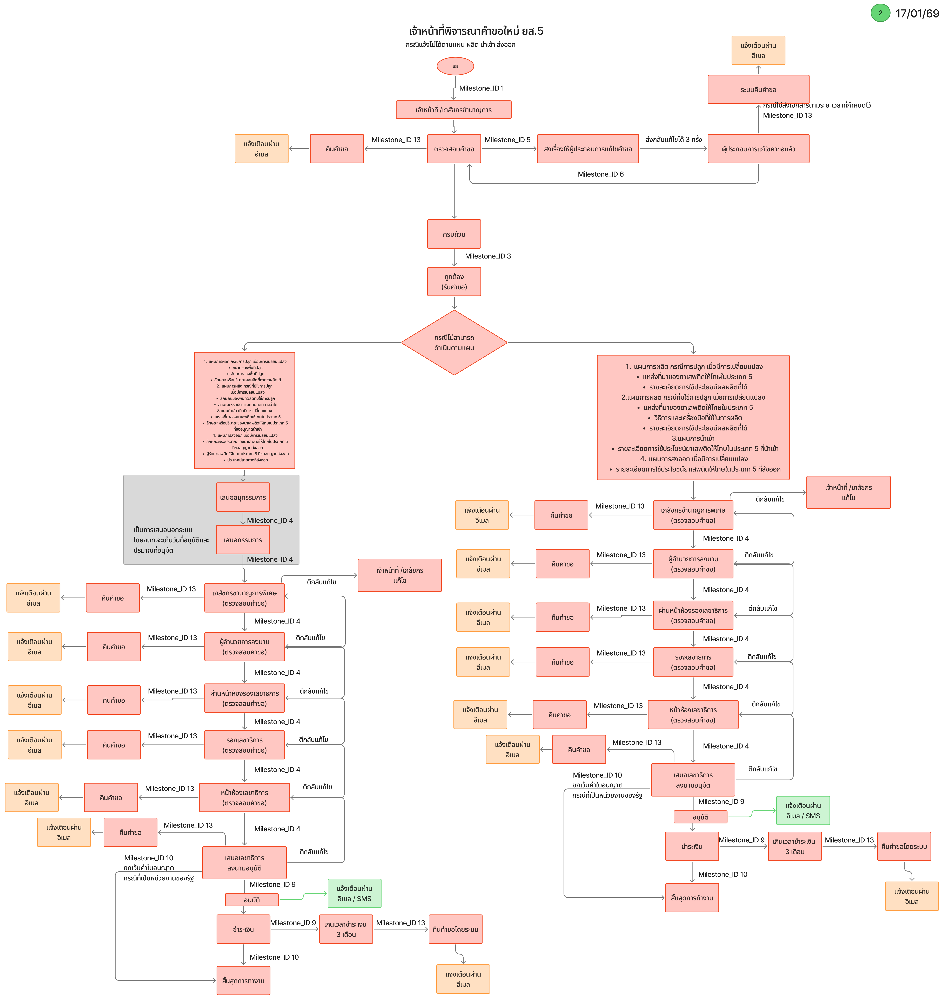

| ลำดับ | กอง | ดำเนินการ | Id คำขอ | คำขอ | วัตถุประสงค์ Id | วัตถุประสงค์ | Level / ขั้นตอนการทำงาน | Flow | Flow Id |
|:---:|:---:|:---:|:---:|:---:|:---:|---|---|:---:|:---:|
| 1 | กอง ต. | ขอใหม่ ไม่ได้ตามแผน - ผลิต / นำเข้า / ส่งออก | 20 | ยส. 5 | - | - | **L1 - เจ้าหน้าที่/เภสัชกรชำนาญการ** • ตรวจสอบคำขอ **• ถ้าครบถ้วน/ถูกต้อง** **L1 - เจ้าหน้าที่/เภสัชกรชำนาญการ** • รับคำขอ **L2 - เภสัชกรชำนาญการ / เภสัชกรชำนาญการพิเศษ** • ลงนามอนุมัติ | Flow สั้น | FLOW_SHORT |

### 📝 วจ.1-1 (RequisitionTypeId = 2)
> • มี อย. และ สสจ. • อย. ได้ทุกกิจกรรม (ผลิต นำเข้า ส่งออก จำหน่าย ครอบครอง) • สสจ. ได้เฉพาะ ครอบครอง

  
📸 คลิกเพื่อดูรูปภาพ Workflow วจ.1-1

  

    
    
  

#### 🔹 วจ.1-1 ขอใหม่ อย.
> • อย. ได้ทุกกิจกรรม (ผลิต นำเข้า ส่งออก จำหน่าย ครอบครอง)

  
📸 คลิกเพื่อดูรูปภาพ Workflow วจ.1-1 ขอใหม่ อย.

  

| ลำดับ | กอง | ดำเนินการ | Id คำขอ | คำขอ | วัตถุประสงค์ Id | วัตถุประสงค์ | Level / ขั้นตอนการทำงาน | Flow | Flow Id |
|:---:|:---:|:---:|:---:|:---:|:---:|---|---|:---:|:---:|
| 1 | กอง ต. | ขอใหม่ - ผลิต นำเข้า ส่งออก จำหน่าย | 2 | วจ.1-1 | 24,25,26 | - | **L1 - เจ้าหน้าที่/เภสัชกรชำนาญการ** • ตรวจสอบคำขอ **• ถ้าครบถ้วน/ถูกต้อง** **L1 - เจ้าหน้าที่/เภสัชกรชำนาญการ** • รับคำขอ **L2 - เภสัชกรชำนาญการพิเศษ** • ลงนามอนุมัติ | Flow สั้น | FLOW_SHORT |
| 2 | กอง ต. | ขอใหม่ - ครอบครอง| 2 | วจ.1-1 | 24,25,26 | - | **L1 - เจ้าหน้าที่/เภสัชกรชำนาญการ** • ตรวจสอบคำขอ **• ถ้าครบถ้วน/ถูกต้อง** **L1 - เจ้าหน้าที่/เภสัชกรชำนาญการ** • รับคำขอ **L2 - เภสัชกรชำนาญการ** • ลงนามอนุมัติ | Flow สั้น | FLOW_SHORT |

#### 🔹 วจ.1-1 ขอใหม่ สสจ.
> • ได้เฉพาะกิจกรรม ครอบครอง

  
📸 คลิกเพื่อดูรูปภาพ Workflow วจ.1-1 ขอใหม่ สสจ.

  

  📌
  ยังไม่ทราบ flow การอนุมัติของ <strong>สสจ.</strong> — รอสอบถามเจ้าหน้าที่เพิ่มเติม

### 📝 ผนส. ยส.2/วจ.2 (RequisitionTypeId = 3)

> • มีแต่ อย. ไม่มี สสจ.

  
📸 คลิกเพื่อดูรูปภาพ Workflow ผนส. ยส.2/วจ.2

  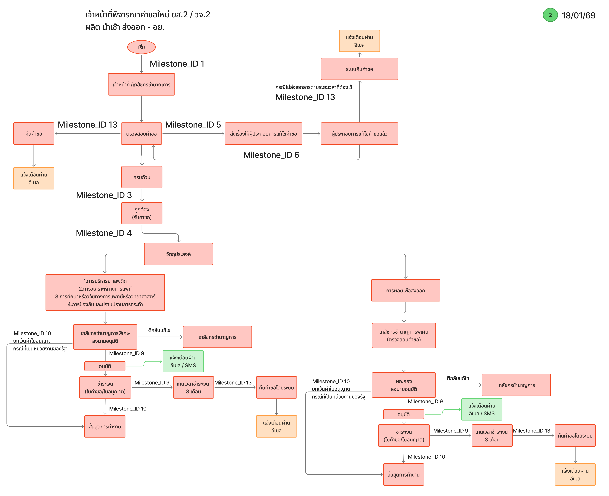

| ลำดับ | กอง | ดำเนินการ | Id คำขอ | คำขอ | วัตถุประสงค์ Id | วัตถุประสงค์ | Level / ขั้นตอนการทำงาน | Flow | Flow Id |
|:---:|:---:|:---:|:---:|:---:|:---:|---|---|:---:|:---:|
| 1 | กอง ต. | ขอใหม่ | 3 | ผนส. ยส.2/วจ.2 | 4,5,6,7 | 4 การบริหารยาเสพติดให้โทษในประเภท ๒ หรือวัตถุออกฤทธิ์ในประเภท ๒ ที่ใช้ในทางการแพทย์ของประเทศ 5 การวิเคราะห์ทางการแพทย์หรือวิทยาศาสตร์ 6 การศึกษาวิจัยทางการแพทย์หรือวิทยาศาสตร์  7 การป้องกันและปราบปรามการกระทำความผิดเกี่ยวกับยาเสพติด | **L1 - เจ้าหน้าที่/เภสัชกรชำนาญการ** • ตรวจสอบคำขอ **• ถ้าครบถ้วน/ถูกต้อง** **L1 - เจ้าหน้าที่/เภสัชกรชำนาญการ** • รับคำขอ **L2 - เภสัชกรชำนาญการพิเศษ** • ลงนามอนุมัติ | Flow สั้น | FLOW_SHORT |
| 2 | กอง ต. | ขอใหม่ | 3 | ผนส. ยส.2/วจ.2 | 8 | 8 การผลิตเพื่อส่งออก | **L1 - เจ้าหน้าที่/เภสัชกรชำนาญการ** • ตรวจสอบคำขอ **• ถ้าครบถ้วน/ถูกต้อง** **L1 - เจ้าหน้าที่/เภสัชกรชำนาญการ** • รับคำขอ **L3 - เภสัชกรชำนาญการพิเศษ** • ตรวจสอบใบอนุญาต • เสนอ ผอ. กอง ต. **L4 - ผอ. กอง ต.** • ลงนามอนุมัติ | Flow ยาว | FLOW_LONG |

### 📝 จ.ย.ส. 2-1/ว.จ. 2-1 (RequisitionTypeId = 4)

> • มี อย. และ สสจ. • สสจ. วัตถุประสงค์ หน่วยกระจายยา ไม่ได้

  
📸 คลิกเพื่อดูรูปภาพ Workflow จ.ย.ส. 2-1/ว.จ. 2-1

  

    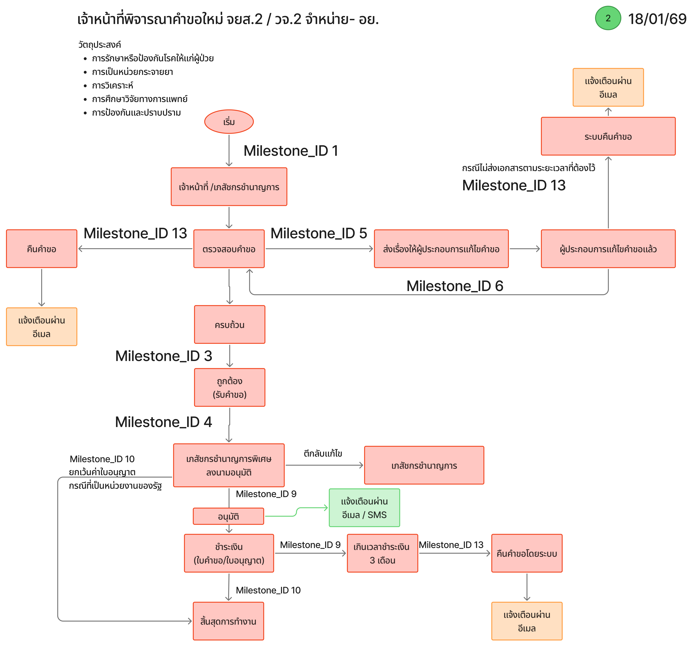
    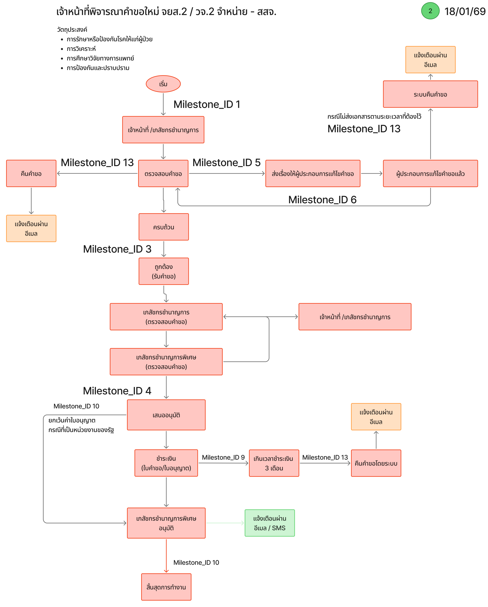
  

#### 🔹 จ.ย.ส. 2-1/ว.จ. 2-1 ขอใหม่ อย.

  
📸 คลิกเพื่อดูรูปภาพ Workflow จ.ย.ส. 2-1/ว.จ. 2-1 อย.

  

| ลำดับ | กอง | ดำเนินการ | Id | คำขอ | วัตถุประสงค์ | Level / ขั้นตอนการทำงาน | Flow | Flow Id |
|:---:|:---:|:---:|:---:|:---:|---|---|:---:|:---:|
| 1 | กอง ต. | ขอใหม่ | 4 | จ.ย.ส. 2-1/ว.จ. 2-1 | - | **L1 - เจ้าหน้าที่/เภสัชกรชำนาญการ** • ตรวจสอบคำขอ **• ถ้าครบถ้วน/ถูกต้อง** **L1 - เจ้าหน้าที่/เภสัชกรชำนาญการ** • รับคำขอ **L2 - เภสัชกรชำนาญการ** • ลงนามอนุมัติ | Flow สั้น | FLOW_SHORT |

#### 🔹 จ.ย.ส. 2-1/ว.จ. 2-1 ขอใหม่ สสจ.

  
📸 คลิกเพื่อดูรูปภาพ Workflow จ.ย.ส. 2-1/ว.จ. 2-1 สสจ.

  

  📌
  ยังไม่ทราบ flow การอนุมัติของ <strong>สสจ.</strong> — รอสอบถามเจ้าหน้าที่เพิ่มเติม

### 📝 จก.ย.ส. 2-1 (RequisitionTypeId = 5)

> • มี อย. และ สสจ.

#### 🔹 จก.ย.ส. 2-1 ขอใหม่

  
📸 คลิกเพื่อดูรูปภาพ Workflow จก.ย.ส. 2-1 อย.

  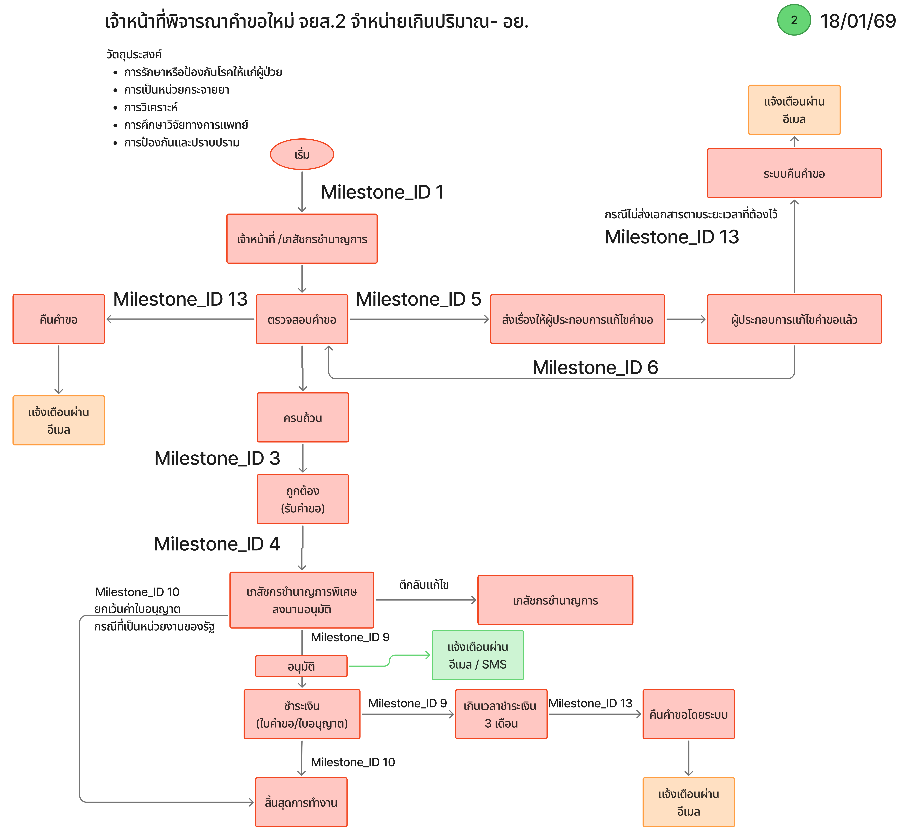

| ลำดับ | กอง | ดำเนินการ | Id คำขอ | คำขอ | วัตถุประสงค์ Id | วัตถุประสงค์ | Level / ขั้นตอนการทำงาน | Flow | Flow Id |
|:---:|:---:|:---:|:---:|:---:|:---:|---|---|:---:|:---:|
| 1 | กอง ต. | ขอใหม่ | 5 | จก.ย.ส. 2-1 | - | การรักษา / หน่วยกระจายยา / วิเคราะห์ / ศึกษาวิจัยทางการแพทย์ / การป้องกันและปราบปราม | **L1 - เจ้าหน้าที่/เภสัชกรชำนาญการ** • ตรวจสอบคำขอ **• ถ้าครบถ้วน/ถูกต้อง** **L1 - เจ้าหน้าที่/เภสัชกรชำนาญการ** • รับคำขอ **L2 - เภสัชกรชำนาญการพิเศษ** • ลงนามอนุมัติ | Flow สั้น | FLOW_SHORT |

#### 🔹 จก.ย.ส. 2-1 ขอแก้ไข

  
📸 คลิกเพื่อดูรูปภาพ Workflow จก.ย.ส. 2-1 ขอแก้ไข อย.

  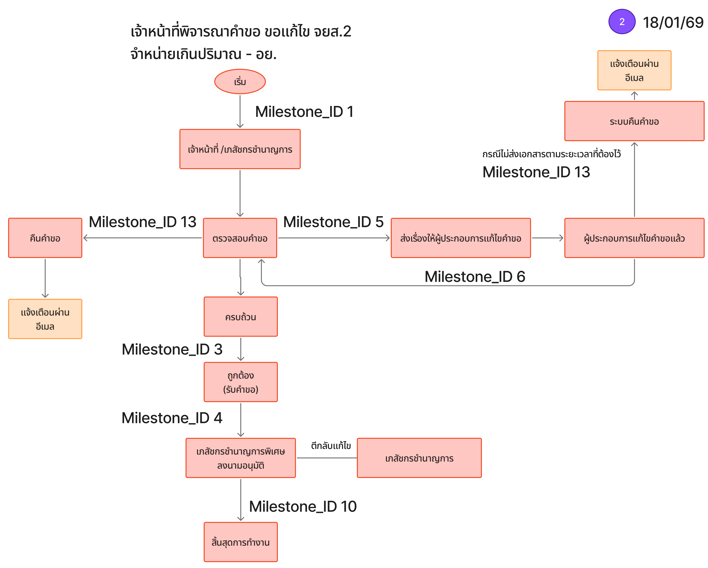

| ลำดับ | กอง | ดำเนินการ | Id คำขอ | คำขอ | วัตถุประสงค์ Id | วัตถุประสงค์ | Level / ขั้นตอนการทำงาน | Flow | Flow Id |
|:---:|:---:|:---:|:---:|:---:|:---:|---|---|:---:|:---:|
| 1 | กอง ต. | ขอแก้ไข | 5 | จก.ย.ส. 2-1 | - | ทุกวัตถุประสงค์ | **L1 - เจ้าหน้าที่/เภสัชกรชำนาญการ** • ตรวจสอบคำขอ **• ถ้าครบถ้วน/ถูกต้อง** **L1 - เจ้าหน้าที่/เภสัชกรชำนาญการ** • รับคำขอ **L2 - เภสัชกรชำนาญการพิเศษ** • ลงนามอนุมัติ | Flow สั้น | FLOW_SHORT |

### 📝 คค.1-1 (RequisitionTypeId = 6)

> • มี อย. และ สสจ. • ใช้กับ ยส.2 วจ.2 วจ.3 วจ.4

  
📸 คลิกเพื่อดูรูปภาพ Workflow คค.1-1

  

    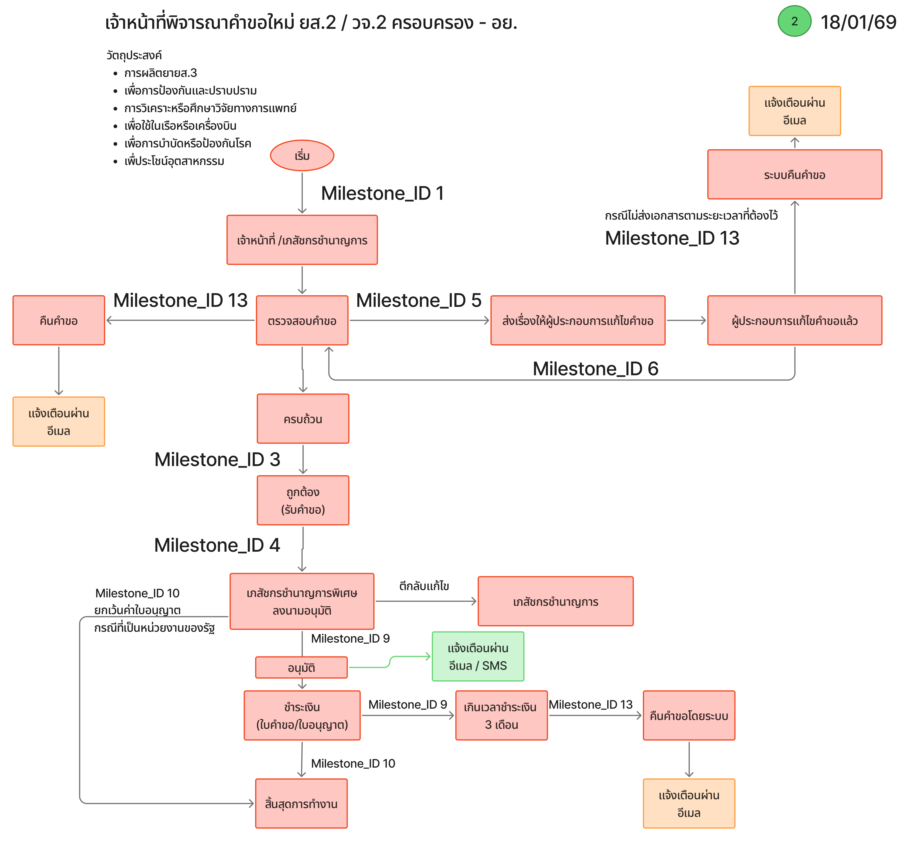
    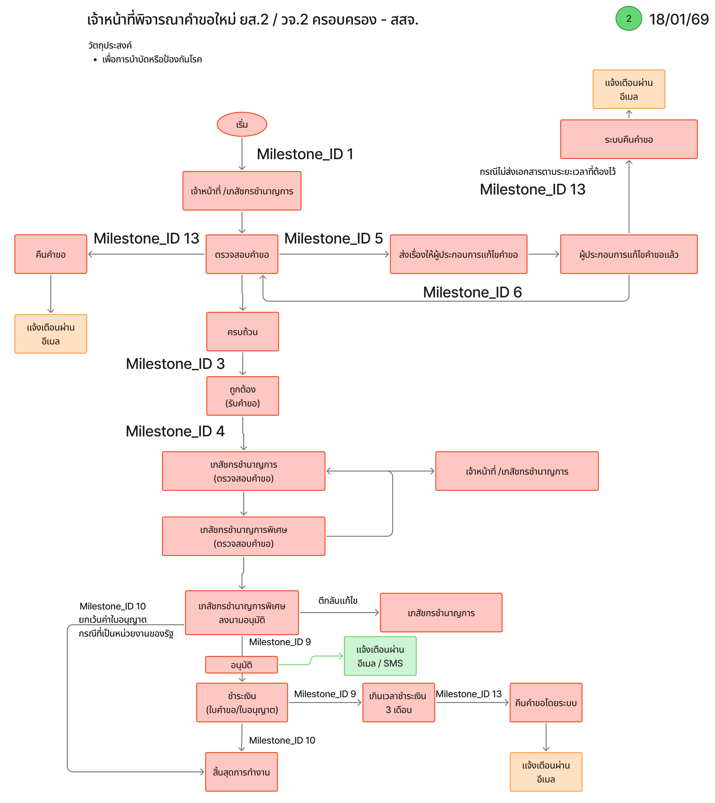
  

#### 🔹 คค.1-1 ขอใหม่ อย.

  
📸 คลิกเพื่อดูรูปภาพ Workflow คค.1-1 อย.

  

| ลำดับ | กอง | ดำเนินการ | Id คำขอ | คำขอ | วัตถุประสงค์ Id | วัตถุประสงค์ | Level / ขั้นตอนการทำงาน | Flow | Flow Id |
|:---:|:---:|:---:|:---:|:---:|:---:|---|---|:---:|:---:|
| 1 | กอง ต. | ขอใหม่ | 6 | คค.1-1 | - | - | **L1 - เจ้าหน้าที่/เภสัชกรชำนาญการ** • ตรวจสอบคำขอ **• ถ้าครบถ้วน/ถูกต้อง** **L1 - เจ้าหน้าที่/เภสัชกรชำนาญการ** • รับคำขอ **L2 - เภสัชกรชำนาญการ** • ลงนามอนุมัติ | Flow สั้น | FLOW_SHORT |

#### 🔹 คค.1-1 ขอใหม่ สสจ.

> • สสจ. ได้เฉพาะ วัตถุประสงค์ **เพื่อการบำบัดรักษาหรือป้องกันโรคให้แก่ผู้ป่วยหรือสัตว์ป่วยในทางการแพทย์**

  
📸 คลิกเพื่อดูรูปภาพ Workflow คค.1-1 สสจ.

  

  📌
  ยังไม่ทราบ flow การอนุมัติของ <strong>สสจ.</strong> — รอสอบถามเจ้าหน้าที่เพิ่มเติม

### 📝 คก.ย.ส. 2-1 (RequisitionTypeId = 7)

> • มีแต่ อย. ไม่มี สสจ.

#### 🔹 คก.ย.ส. 2-1 ขอใหม่

  
📸 คลิกเพื่อดูรูปภาพ Workflow คก.ย.ส. 2-1 อย.

  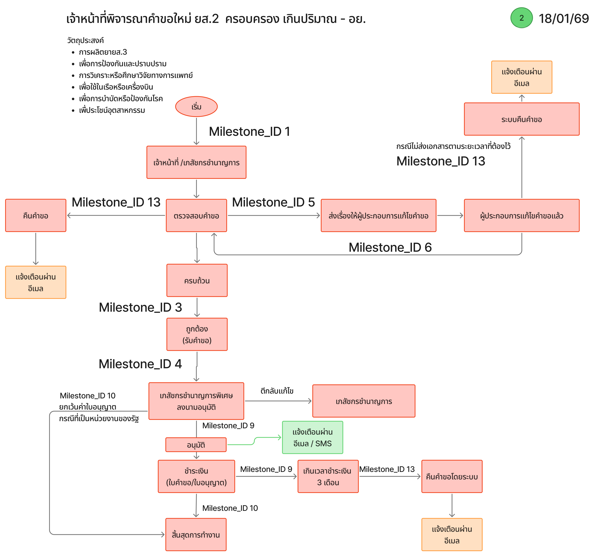

| ลำดับ | กอง | ดำเนินการ | Id คำขอ | คำขอ | วัตถุประสงค์ Id | วัตถุประสงค์ | Level / ขั้นตอนการทำงาน | Flow | Flow Id |
|:---:|:---:|:---:|:---:|:---:|:---:|---|---|:---:|:---:|
| 1 | กอง ต. | ขอใหม่ | 7 | คก.ย.ส. 2-1 | - | การผลิตยาส.3 / ป้องกันและปราบปราม / วิเคราะห์ศึกษาวิจัยทางการแพทย์ / ใช้ในเรือหรือเครื่องบิน / บำบัดหรือป้องกันโรค / ประโยชน์อุตสาหกรรม | **L1 - เจ้าหน้าที่/เภสัชกรชำนาญการ** • ตรวจสอบคำขอ **• ถ้าครบถ้วน/ถูกต้อง** **L1 - เจ้าหน้าที่/เภสัชกรชำนาญการ** • รับคำขอ **L2 - เภสัชกรชำนาญการพิเศษ** • ลงนามอนุมัติ | Flow สั้น | FLOW_SHORT |

#### 🔹 คก.ย.ส. 2-1 ขอแก้ไข

  
📸 คลิกเพื่อดูรูปภาพ Workflow คก.ย.ส. 2-1 ขอแก้ไข อย.

  

| ลำดับ | กอง | ดำเนินการ | Id คำขอ | คำขอ | วัตถุประสงค์ Id | วัตถุประสงค์ | Level / ขั้นตอนการทำงาน | Flow | Flow Id |
|:---:|:---:|:---:|:---:|:---:|:---:|---|---|:---:|:---:|
| 1 | กอง ต. | ขอแก้ไข | 7 | คก.ย.ส. 2-1 | - | ทุกวัตถุประสงค์ | **L1 - เจ้าหน้าที่/เภสัชกรชำนาญการ** • ตรวจสอบคำขอ **• ถ้าครบถ้วน/ถูกต้อง** **L1 - เจ้าหน้าที่/เภสัชกรชำนาญการ** • รับคำขอ **L2 - เภสัชกรชำนาญการพิเศษ** • ลงนามอนุมัติ | Flow สั้น | FLOW_SHORT |

---

### คำขอต่ออายุ (สถานที่)

> • Auto Approve

#### คำขอที่ต่ออายุได้

| ลำดับ | คำขอ | วัตถุประสงค์ |
|:---:|---|---|
| 1 | 1 ยส.1-1 | 3 เพื่อใช้เป็นสารมาตรฐานในการตรวจวิเคราะห์ในปริมาณเล็กน้อย |
| 2 | 2 วจ.1-1 | All |
| 3 | 4 จ.ย.ส. 2-1/ว.จ. 2-1 | All |
| 4 | 6 คค.1-1 | All |
| 5 | 19 ยส.4-1 | 19 เพื่อใช้เป็นสารมาตรฐานในการตรวจวิเคราะห์ |
| 6 | 20 ยส.5 | All |

  
📸 คลิกเพื่อดูรูปภาพ Workflow ยส.1-1 ต่ออายุ อย.

  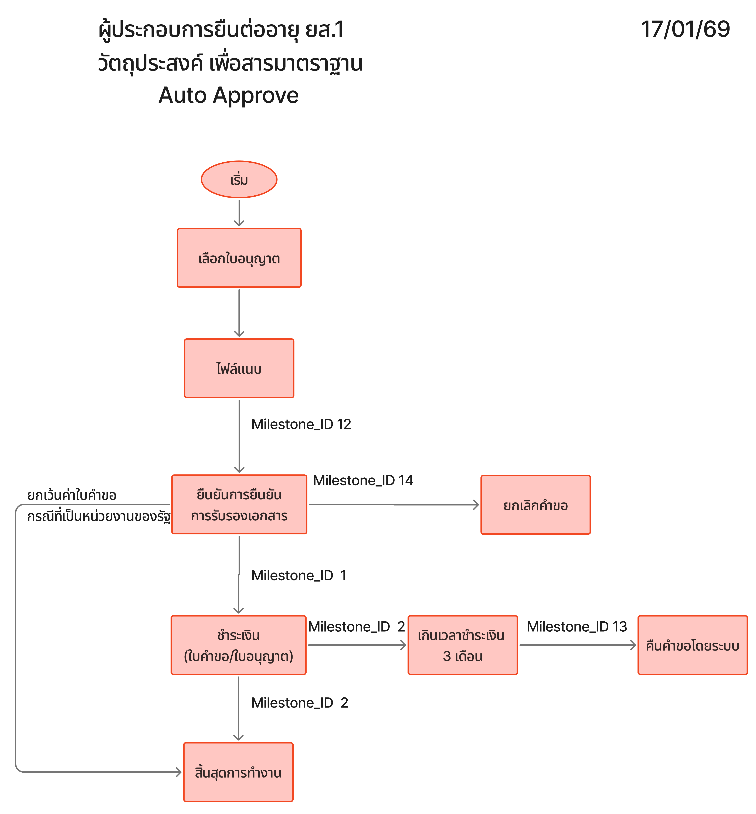

| ลำดับ | กอง | ดำเนินการ | Id คำขอ | คำขอ | วัตถุประสงค์ Id | วัตถุประสงค์ | Level / ขั้นตอนการทำงาน | Flow | Flow Id |
|:---:|:---:|:---:|:---:|:---:|:---:|---|---|:---:|:---:|
| 1 | กอง ต. | ต่ออายุ | 1 | ยส. 1-1 | 3 | 3 เพื่อใช้เป็นสารมาตรฐานในการตรวจวิเคราะห์ฯ | **Auto Approve** • เลือกใบอนุญาต • ไฟล์แนบ • ยืนยันเอกสาร • ชำระเงิน • สิ้นสุด | Auto Approve | AUTO |

### คำขอยกเลิก

  
📸 คลิกเพื่อดูรูปภาพ Workflow ยส.1-1 ขอยกเลิก อย.

  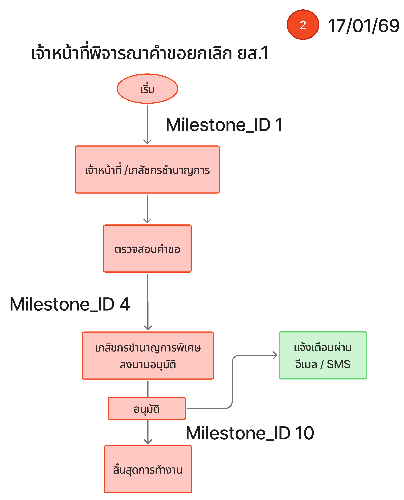

| ลำดับ | กอง | ดำเนินการ | Id คำขอ | คำขอ | วัตถุประสงค์ Id | วัตถุประสงค์ | Level / ขั้นตอนการทำงาน | Flow | Flow Id |
|:---:|:---:|:---:|:---:|:---:|:---:|---|---|:---:|:---:|
| 1 | กอง ต. | ขอยกเลิก | 1 | ยส. 1-1 | - | ทุกวัตถุประสงค์ | **L1 - เจ้าหน้าที่/เภสัชกรชำนาญการ** • ตรวจสอบคำขอ **L2 - เภสัชกรชำนาญการพิเศษ** • ลงนามอนุมัติ | Flow สั้น | FLOW_SHORT |

### คำขอใบแทน

> • Auto Approve

  
📸 คลิกเพื่อดูรูปภาพ Workflow ยส.1-1 ขอใบแทน อย.

  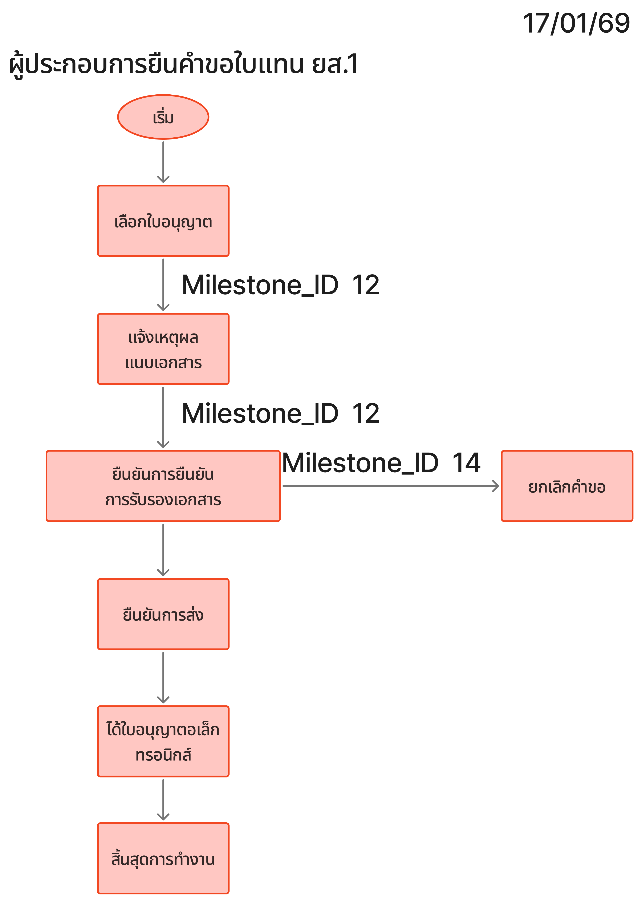

| ลำดับ | กอง | ดำเนินการ | Id คำขอ | คำขอ | วัตถุประสงค์ Id | วัตถุประสงค์ | Level / ขั้นตอนการทำงาน | Flow | Flow Id |
|:---:|:---:|:---:|:---:|:---:|:---:|---|---|:---:|:---:|
| 1 | กอง ต. | ขอใบแทน | 1 | ยส. 1-1 | - | ทุกวัตถุประสงค์ | **Auto Approve** • เลือกใบอนุญาต • แจ้งเหตุผล/แนบเอกสาร • ยืนยันเอกสาร • ยืนยันการส่ง • ได้ใบอนุญาตอิเล็กทรอนิกส์ • สิ้นสุด | Auto Approve | AUTO |

---

## 📦 คำขอเฉพาะคราว

### 📝 เฉพาะคราว IMP, EXP (RequisitionTypeId = 25-34, 37-44, 45)

> • มีแต่ อย. ไม่มี สสจ.

  
📸 คลิกเพื่อดูรูปภาพ Workflow IMP, EXP

    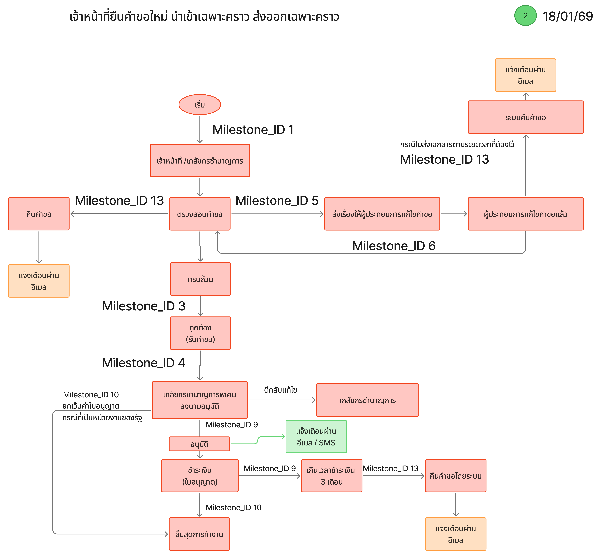

| ลำดับ | กอง | ดำเนินการ | Id คำขอ | คำขอ | วัตถุประสงค์ Id | วัตถุประสงค์ | Level / ขั้นตอนการทำงาน | Flow | Flow Id |
|:---:|:---:|:---:|:---:|:---:|:---:|---|---|:---:|:---:|
| 1 | กอง ต. | ขอใหม่ | 25-34, 37-44 | เฉพาะคราว | - | - | **L1 - เจ้าหน้าที่/เภสัชกรชำนาญการ** • ตรวจสอบคำขอ **• ถ้าครบถ้วน/ถูกต้อง** **L1 - เจ้าหน้าที่/เภสัชกรชำนาญการ** • รับคำขอ **L2 - เภสัชกรชำนาญการพิเศษ** • ลงนามอนุมัติ | Flow สั้น | FLOW_SHORT |

### 📝 แต่ละครั้ง NAR.5 (กัญชา กัญชง) (RequisitionTypeId = 35, 36)

  📌
  ยังไม่ทราบ flow การอนุมัติ — รอสอบถามเจ้าหน้าที่เพิ่มเติม

### 📝 นำผ่าน นผจ (RequisitionTypeId = 46)

> • มีแต่ อย. ไม่มี สสจ.

  
📸 คลิกเพื่อดูรูปภาพ Workflow นำผ่าน นผจ

    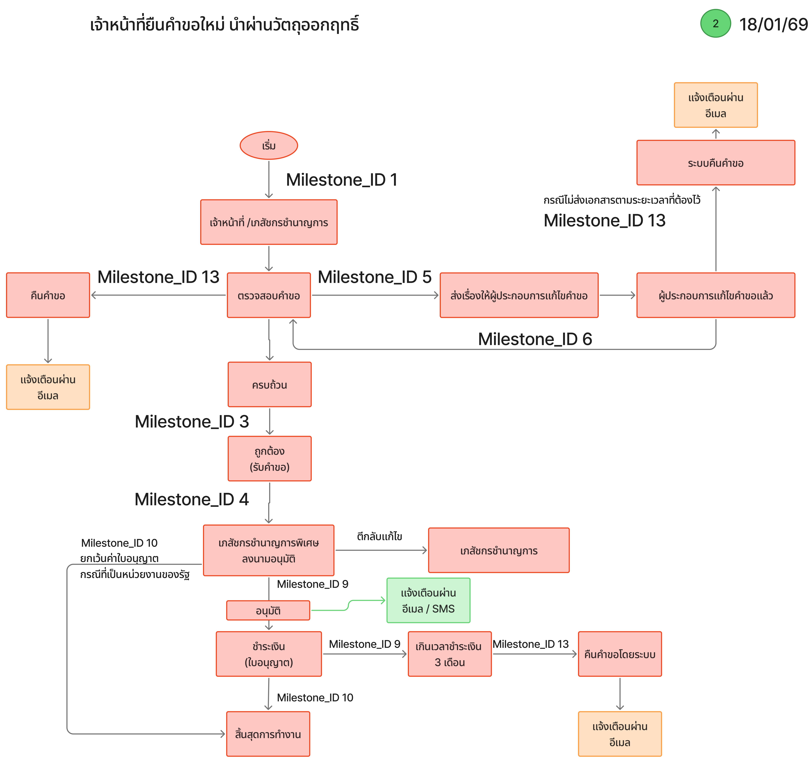

| ลำดับ | กอง | ดำเนินการ | Id คำขอ | คำขอ | วัตถุประสงค์ Id | วัตถุประสงค์ | Level / ขั้นตอนการทำงาน | Flow | Flow Id |
|:---:|:---:|:---:|:---:|:---:|:---:|---|---|:---:|:---:|
| 1 | กอง ต. | ขอใหม่ | 46 | นำผ่าน | - | - | **L1 - เจ้าหน้าที่/เภสัชกรชำนาญการ** • ตรวจสอบคำขอ **• ถ้าครบถ้วน/ถูกต้อง** **L1 - เจ้าหน้าที่/เภสัชกรชำนาญการ** • รับคำขอ **L2 - เภสัชกรชำนาญการพิเศษ** • ลงนามอนุมัติ | Flow สั้น | FLOW_SHORT |

---

## 📄 คำขอทะเบียน

### 📝 คำขอทะเบียน ขอใหม่ ทบ.1

> • มีแต่ อย. ไม่มี สสจ.

คำขอทะเบียนตำรับ คือ แบบ ทบ.1
- ค่าคำขอขึ้นทะเบียนตำรับ ยส.3, วจ.3/4
  - กรณียาใหม่ = 2,500 บาท
  - กรณียาสามัญ = 1,000 บาท

ค่าประเมินเอกสารทางวิชาการ
- ค่าประเมินเอกสารทางวิชาการ การขอขึ้นทะเบียนตำรับ ยส.3, วจ.3/4
  - กรณียาใหม่ = 2,500 บาท
    - ที่เป็นตัวยาสำคัญใหม่ = 182,500 บาท
    - ที่มิใช่ตัวยาสำคัญใหม่ = 155,000 บาท
  - กรณียาสามัญ = 39,000 บาท

ใบสำคัญการขึ้นทะเบียนตำรับ คือ ทบ.2
- ค่าใบสำคัญการขึ้นทะเบียนตำรับ 5,000 บาท
- การต่ออายุใบสำคัญการขึ้นทะเบียนตำรับ 2,500 บาท

  
📸 คลิกเพื่อดูรูปภาพ Workflow ผู้ประกอบการ ขอใหม่ ทะเบียน ทบ.1

  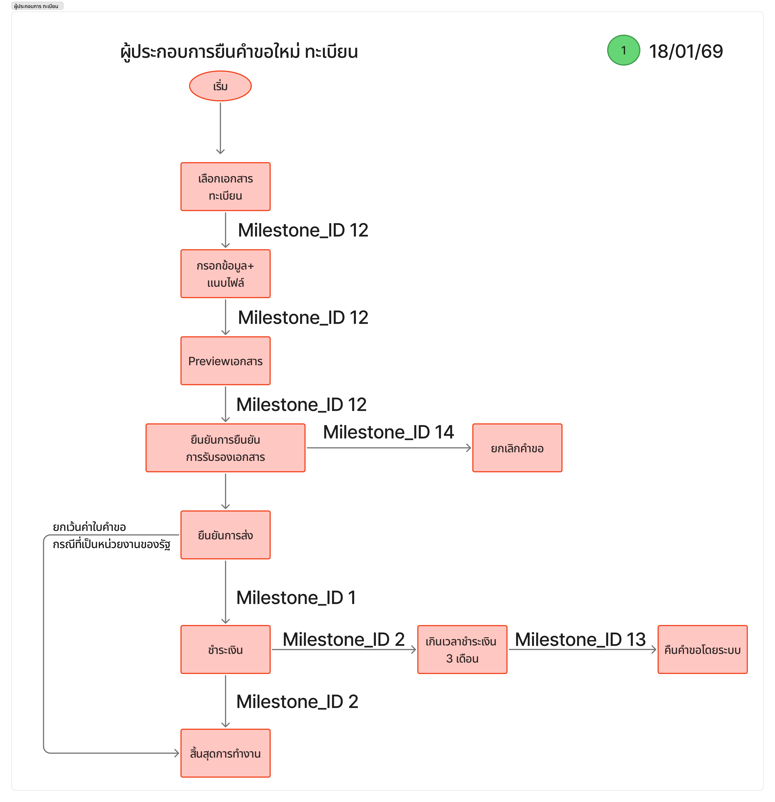

 

  
📸 คลิกเพื่อดูรูปภาพ Workflow เจ้าหน้าที่ ขอใหม่ ทะเบียน ทบ.1

  

| ลำดับ | ผปก./กอง | ดำเนินการ | Id คำขอ | คำขอ | วัตถุประสงค์ Id | วัตถุประสงค์ | Level / ขั้นตอนการทำงาน | Flow | Flow Id |
|:---:|:---:|:---:|:---:|:---:|:---:|---|---|:---:|:---:|
| 1 | ผู้ประกอบการ | ขอใหม่ | - | ทะเบียน | - | - | **• เลือกเอกสารทะเบียน** **• กรอกข้อมูล+แนบไฟล์** **• Previewเอกสาร** **• ยืนยันการยืนยันการรับรองเอกสาร** **• ยืนยันการส่ง** | - | - |
| 2 | เจ้าหน้าที่ กอง ต. | ขอใหม่ | - | ทะเบียน | - | - | **L1 - เจ้าหน้าที่/เภสัชกรชำนาญการ** • ตรวจสอบคำขอ **• ถ้าครบถ้วน/ถูกต้อง** **L1 - เจ้าหน้าที่/เภสัชกรชำนาญการ** • รับคำขอ / ชำระเงิน (ผู้เชี่ยวชาญ) **L2 - เจ้าหน้าที่/เภสัชกร** • เสนอผู้เชี่ยวชาญ **L3 - เภสัชกรชำนาญการพิเศษ** • ตรวจสอบคำขอ **L4 - ผู้อำนวยการลงนาม** • ตรวจสอบคำขอ **L5 - ผ่านหน้าห้องรองเลขาธิการ** • ตรวจสอบคำขอ **L6 - รองเลขาธิการ** • ลงนามอนุมัติ | Flow ยาว | FLOW_LONG |

### 📝 คำขอทะเบียน ขอแก้ไข ทบ.3

> • มีแต่ อย. ไม่มี สสจ.

  
📸 คลิกเพื่อดูรูปภาพ Workflow ผู้ประกอบการ ขอแก้ไข ทะเบียน ทบ.3

  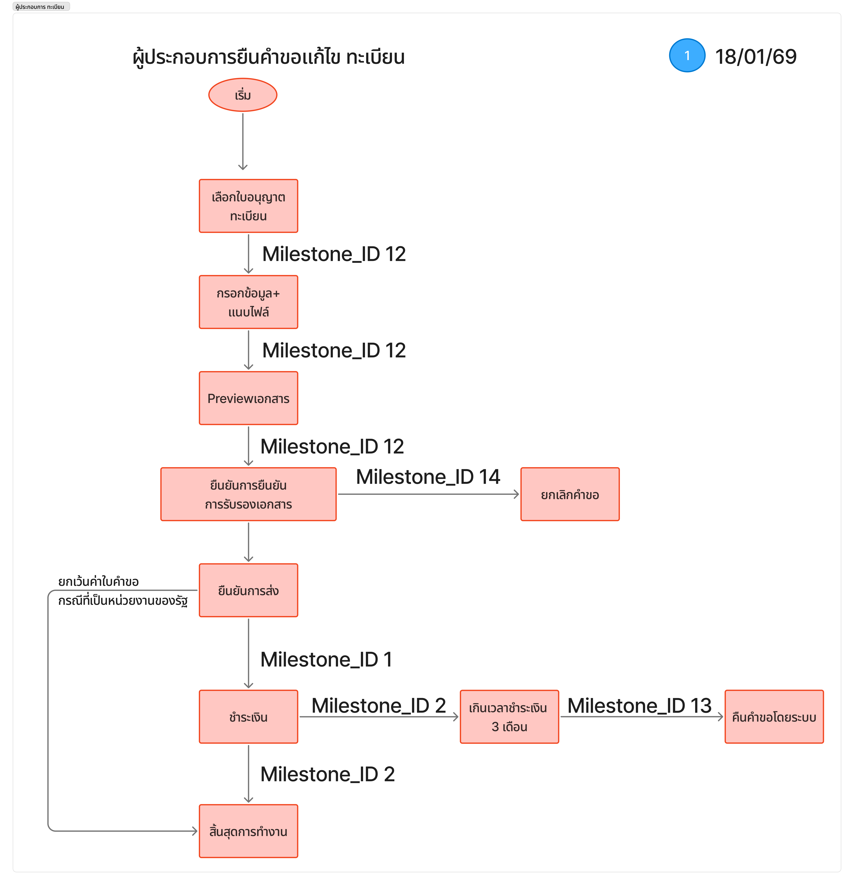

 

  
📸 คลิกเพื่อดูรูปภาพ Workflow เจ้าหน้าที่ ขอแก้ไข ทะเบียน ทบ.3

  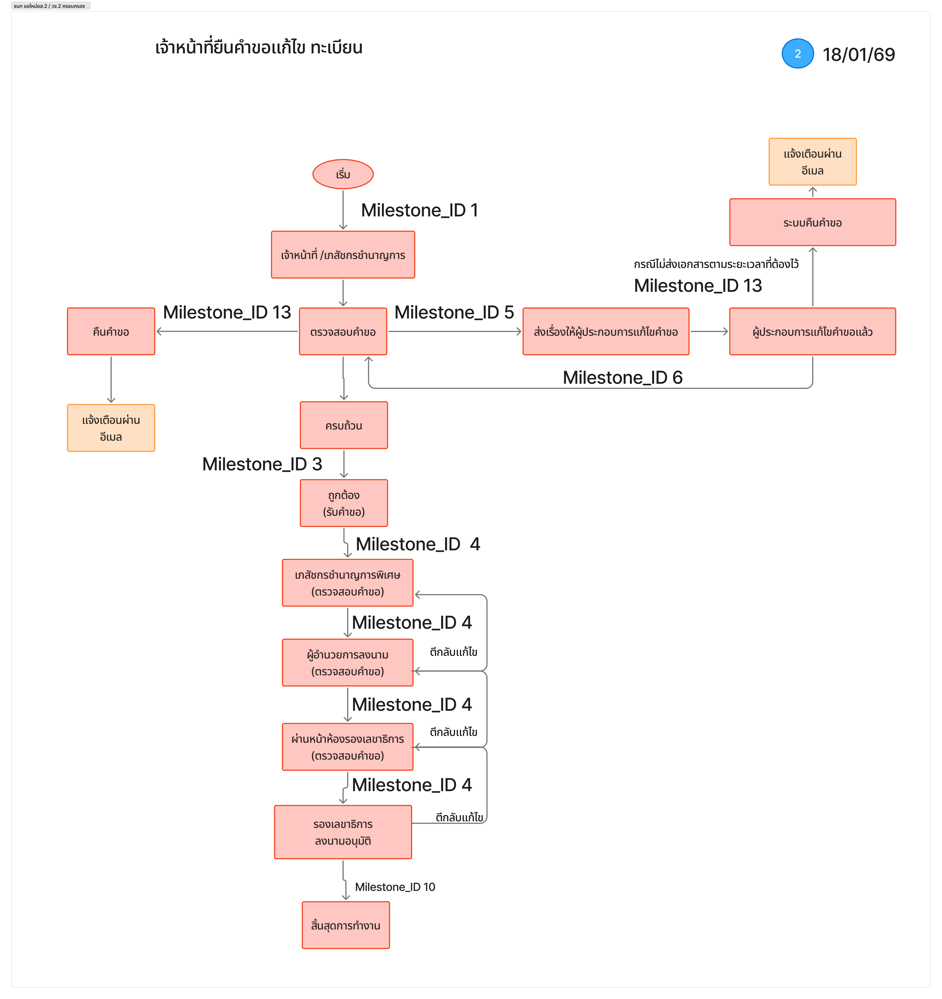

| ลำดับ | ผปก./กอง | ดำเนินการ | Id คำขอ | คำขอ | วัตถุประสงค์ Id | วัตถุประสงค์ | Level / ขั้นตอนการทำงาน | Flow | Flow Id |
|:---:|:---:|:---:|:---:|:---:|:---:|---|---|:---:|:---:|
| 1 | ผู้ประกอบการ | ขอแก้ไข | - | ทะเบียน | - | - | **• เลือกใบอนุญาต ทะเบียน** **• กรอกข้อมูล+แนบไฟล์** **• Previewเอกสาร** **• ยืนยันการยืนยันการรับรองเอกสาร** **• ยืนยันการส่ง** | - | - |
| 2 | เจ้าหน้าที่ กอง ต. | ขอแก้ไข | - | ทะเบียน | - | - | **L1 - เจ้าหน้าที่/เภสัชกรชำนาญการ** • ตรวจสอบคำขอ **• ถ้าครบถ้วน/ถูกต้อง** **L1 - เจ้าหน้าที่/เภสัชกรชำนาญการ** • รับคำขอ **L2 - เภสัชกรชำนาญการพิเศษ** • ตรวจสอบคำขอ **L3 - ผู้อำนวยการลงนาม** • ตรวจสอบคำขอ **L4 - ผ่านหน้าห้องรองเลขาธิการ** • ตรวจสอบคำขอ **L5 - รองเลขาธิการ** • ลงนามอนุมัติ | Flow ยาว | FLOW_LONG |

---

## 📜 คำขอหนังสือรับรอง

---

## ☕ กาเฟอีน

### 📝 รร.1 ขอใหม่
> • มีแต่ อย. ไม่มี สสจ.

  
📸 คลิกเพื่อดูรูปภาพ Workflow ผู้ประกอบการ ขอใหม่ กาเฟอีน

  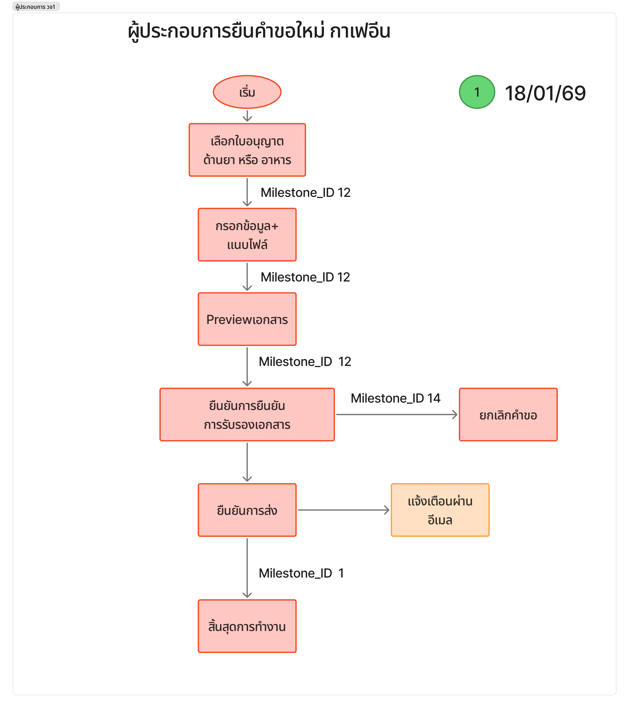

 

  
📸 คลิกเพื่อดูรูปภาพ Workflow เจ้าหน้าที่ ขอใหม่ กาเฟอีน

  

 

| ลำดับ | ผปก./กอง | ดำเนินการ | Id คำขอ | คำขอ | วัตถุประสงค์ Id | วัตถุประสงค์ | Level / ขั้นตอนการทำงาน | Flow | Flow Id |
|:---:|:---:|:---:|:---:|:---:|:---:|---|---|:---:|:---:|
| 1 | ผู้ประกอบการ | ขอใหม่ | 21 | รร.1 | - | - | **• เลือกเอกสาร รร.1** **• กรอกข้อมูล+แนบไฟล์** **• Previewเอกสาร** **• ยืนยันการยืนยันการรับรองเอกสาร** **• ยืนยันการส่ง** | - | - |
| 2 | เจ้าหน้าที่ กอง ต. | ขอใหม่ | 21 | รร.1 | - | - | **L1 - เจ้าหน้าที่/เภสัชกรชำนาญการ** • ตรวจสอบคำขอ **• ถ้าครบถ้วน/ถูกต้อง** **L1 - เจ้าหน้าที่/เภสัชกรชำนาญการ** • รับคำขอ **L2 - เภสัชกรชำนาญการพิเศษ** • ลงนามอนุมัติ (ไม่มีการชำระเงินทุกกรณี) | Flow สั้น | FLOW_SHORT |

---

## 💨 สารระเหย

### 📝 รรส.1 ขอใหม่
> • มีแต่ อย. ไม่มี สสจ.

  
📸 คลิกเพื่อดูรูปภาพ Workflow ผู้ประกอบการ ขอใหม่ สารระเหย

  

 

  
📸 คลิกเพื่อดูรูปภาพ Workflow เจ้าหน้าที่ ขอใหม่ สารระเหย

  

 

| ลำดับ | ผปก./กอง | ดำเนินการ | Id คำขอ | คำขอ | วัตถุประสงค์ Id | วัตถุประสงค์ | Level / ขั้นตอนการทำงาน | Flow | Flow Id |
|:---:|:---:|:---:|:---:|:---:|:---:|---|---|:---:|:---:|
| 1 | ผู้ประกอบการ | ขอใหม่ | 22 | รรส.1 | - | - | **• เลือกเอกสาร รร.1** **• กรอกข้อมูล+แนบไฟล์** **• Previewเอกสาร** **• ยืนยันการยืนยันการรับรองเอกสาร** **• ยืนยันการส่ง** | - | - |
| 2 | เจ้าหน้าที่ กอง ต. | ขอใหม่ | 22 | รรส.1 | - | - | **L1 - เจ้าหน้าที่/เภสัชกรชำนาญการ** • ตรวจสอบคำขอ **• ถ้าครบถ้วน/ถูกต้อง** **L1 - เจ้าหน้าที่/เภสัชกรชำนาญการ** • รับคำขอ **L2 - เภสัชกรชำนาญการพิเศษ** • ลงนามอนุมัติ (ไม่มีการชำระเงินทุกกรณี) | Flow สั้น | FLOW_SHORT |

---

## 🧪 คำขอตัวอย่าง

### 📝 คำขอตัวอย่าง ขอใหม่

> • มีแต่ อย. ไม่มี สสจ.

  
📸 คลิกเพื่อดูรูปภาพ Workflow ผู้ประกอบการ ขอใหม่ ตัวอย่าง

  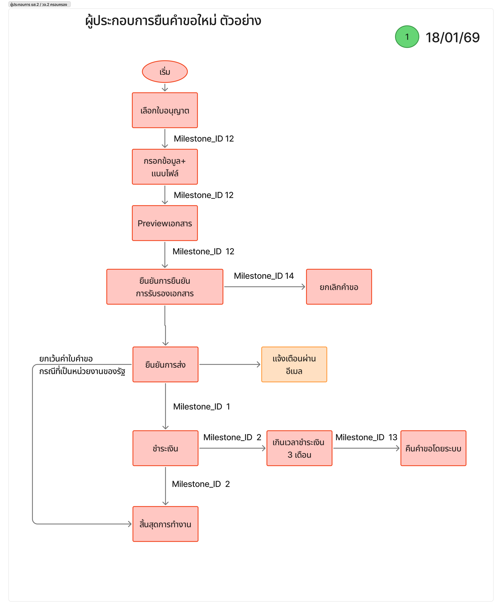

 

  
📸 คลิกเพื่อดูรูปภาพ Workflow เจ้าหน้าที่ ขอใหม่ ตัวอย่าง

  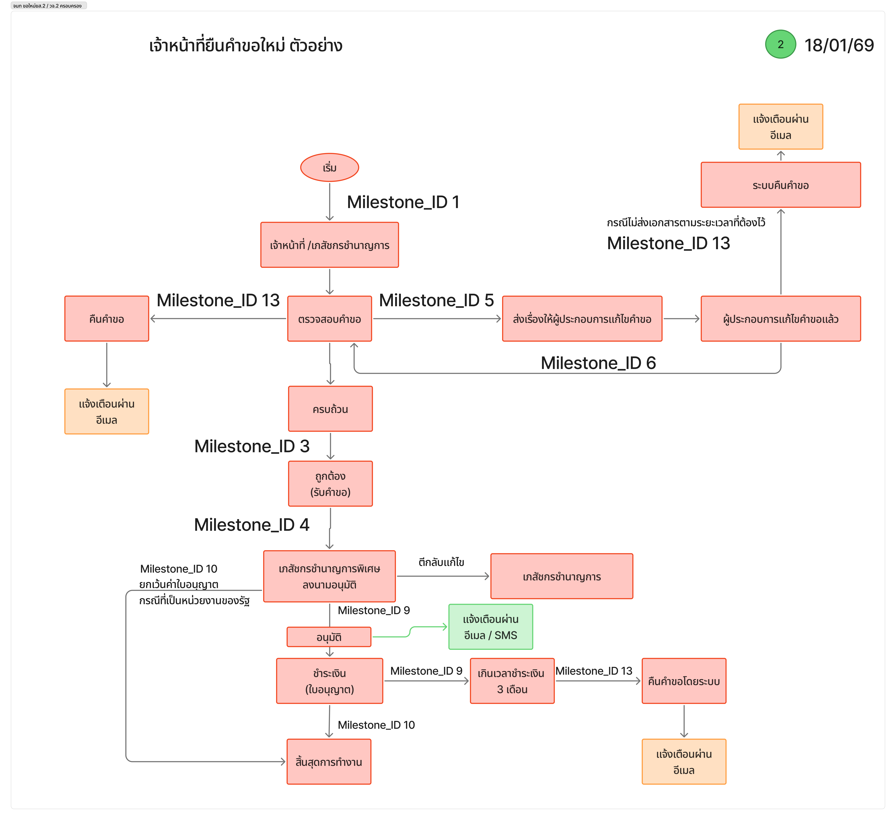

| ลำดับ | ผปก./กอง | ดำเนินการ | Id คำขอ | คำขอ | วัตถุประสงค์ Id | วัตถุประสงค์ | Level / ขั้นตอนการทำงาน | Flow | Flow Id |
|:---:|:---:|:---:|:---:|:---:|:---:|---|---|:---:|:---:|
| 1 | ผู้ประกอบการ | ขอใหม่ | - | ตัวอย่าง | - | - | **• เลือกใบอนุญาต** **• กรอกข้อมูล+แนบไฟล์** **• Previewเอกสาร** **• ยืนยันการยืนยันการรับรองเอกสาร** **• ยืนยันการส่ง** | - | - |
| 2 | เจ้าหน้าที่ กอง ต. | ขอใหม่ | - | ตัวอย่าง | - | - | **L1 - เจ้าหน้าที่/เภสัชกรชำนาญการ** • ตรวจสอบคำขอ **• ถ้าครบถ้วน/ถูกต้อง** **L1 - เจ้าหน้าที่/เภสัชกรชำนาญการ** • รับคำขอ **L2 - เภสัชกรชำนาญการพิเศษ** • ลงนามอนุมัติ | Flow สั้น | FLOW_SHORT |

---

## 💊 คำขอยาติดตัว

#### 🔹 ยาติดตัว ขอใหม่

  
📸 คลิกเพื่อดูรูปภาพ Workflow ยาติดตัว ขอใหม่

  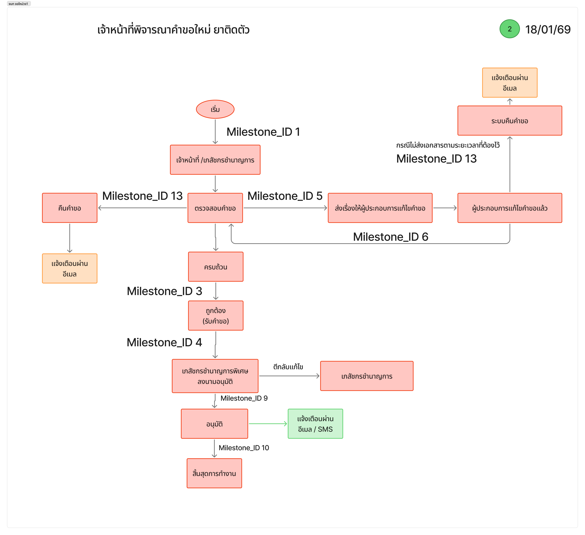

| ลำดับ | กอง | ดำเนินการ | Id คำขอ | คำขอ | วัตถุประสงค์ Id | วัตถุประสงค์ | Level / ขั้นตอนการทำงาน | Flow | Flow Id |
|:---:|:---:|:---:|:---:|:---:|:---:|:---:|---|:---:|:---:|
| 1 | กอง ต. | ขอใหม่ | 23,24 | ยาติดตัว | - | - | **L1 - เจ้าหน้าที่/เภสัชกรชำนาญการ** • ตรวจสอบคำขอ **• ถ้าครบถ้วน/ถูกต้อง** **L1 - เจ้าหน้าที่/เภสัชกรชำนาญการ** • รับคำขอ **L2 - เภสัชกรชำนาญการพิเศษ** • ลงนามอนุมัติ (ไม่มีการชำระเงินทุกกรณี) | Flow สั้น | FLOW_SHORT |

---

<!-- ## ตาราง WorkflowDefinition
### กองยา -->

<!-- | ลำดับ | กอง | สาร | คำขอ | ดำเนินการ | Flow Id |
|:---:|:---:|:---:|---|:---:|:---:|
| 1 | กองยา | ยส.3 | ผลิต ผยส.3 | ขอใหม่ | 201 |
| 2 | กองยา | ยส.3 | นำเข้า นยส.3 | ขอใหม่ | 201 |
| 3 | กองยา | ยส.3 | ส่งออก สยส.3 | ขอใหม่ | 201 |
| 4 | กองยา | ยส.3 | จำหน่าย จยส.3 | ขอใหม่ | 201 |
| 5 | กองยา | ยส.3 | จำหน่ายโดยการขายส่ง ขตยส.3 | ขอใหม่ | 201 |
| 6 | กองยา | วจ.3 | ผลิต ผวจ.3 | ขอใหม่ | 201 |
| 7 | กองยา | วจ.3 | นำเข้า นวจ.3 | ขอใหม่ | 201 |
| 8 | กองยา | วจ.3 | ส่งออก สวจ.3 | ขอใหม่ | 201 |
| 9 | กองยา | วจ.3 | จำหน่าย จวจ.3 | ขอใหม่ | 201 |
| 10 | กองยา | วจ.3 | จำหน่ายโดยการขายส่ง ขตวจ.3 | ขอใหม่ | 201 |
| 11 | กองยา | วจ.4 | ผลิต ผวจ.4 | ขอใหม่ | 201 |
| 12 | กองยา | วจ.4 | นำเข้า นวจ.4 | ขอใหม่ | 201 |
| 13 | กองยา | วจ.4 | ส่งออก สวจ.4 | ขอใหม่ | 201 |
| 14 | กองยา | วจ.4 | จำหน่าย จวจ.4 | ขอใหม่ | 201 |
| 15 | กองยา | วจ.4 | จำหน่ายโดยการขายส่ง ขตวจ.4 | ขอใหม่ | 201 | -->

<!-- | ลำดับ | กอง | สาร | คำขอ | ดำเนินการ | Flow Id |
|:---:|---|---|---|---|---|
| 1 | กอง ต. | ยส.1 | ยส. 1-1 | ขอใหม่ | 11 | -->

<!-- | 3 | กอง ต. | ย.ส 4 | ขอใหม่ | 180 |
| 4 | กอง ต. | ย.ส 5 | ขอใหม่ | 190 |
| 5 | กอง ต. | วจ. 1 | ขอใหม่ | 120 |
| 6 | กอง ต. | วจ. 2 | ขอใหม่ | 130 |
| 7 | กอง ต. | วจ. 3 | ขอใหม่ | 140 | -->