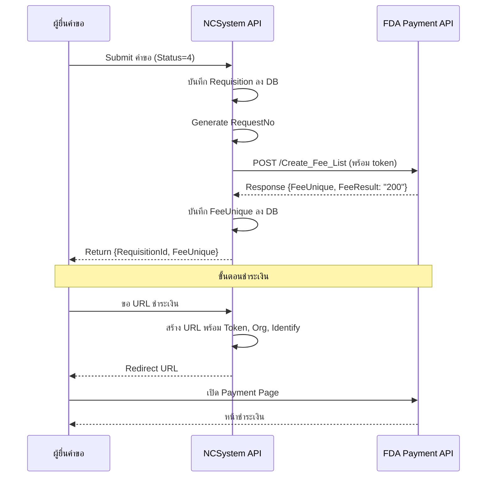

# การวิเคราะห์: การเชื่อมโยงระบบการชำระเงิน (FDA Payment API)

## สรุปเนื้อหา PDF

เอกสารอธิบาย **3 API หลัก** สำหรับเชื่อมต่อระบบชำระเงินของ FDA ผ่าน platform `platba.fda.moph.go.th`

---

## API ที่ต้อง Implement

### 1. ตรวจสอบการลงทะเบียนการชำระเงิน (Check Fee Registration)

```
POST https://platba.fda.moph.go.th/fda_payment_new/fdafee/Create_Fee_List
```

**Request Body (เพื่อตรวจสอบ):**
```json
{
  "ProcessId": "string",
  "ProcessSubId": "string",
  "Org": 0,
  "FeeSubCode": "string",
  "FeeAmt": 0,
  "FeeAcc": 0,
  "FeeRefStatus": 0
}
```

| Field | Type | Req | คำอธิบาย |
|-------|------|-----|---------|
| ProcessId | String | Y | หมายเลขกระบวนงานหลัก |
| ProcessSubId | String | N | หมายเลขกระบวนงานย่อย (ถ้ามี) |
| Org | Integer | Y | รหัสหน่วยงาน |
| FeeSubCode | String | Y | รหัสอ้างอิงประเภทการชำระเงิน |
| FeeAmt | Decimal | Y | จำนวนเงิน |
| FeeAcc | Integer | Y | ประเภทบัญชี |
| FeeRefStatus | Integer | Y | สถานะ |

**Response:**
```json
{
  "FeeCode": "string",
  "FeeResult": "string",
  "FeeErrorMsg": "string"
}
```

| Field | Type | คำอธิบาย |
|-------|------|---------|
| FeeCode | String | รหัสสถานะตอบกลับ |
| FeeResult | String | 200: Success / 300: Error / 400: Error |
| FeeErrorMsg | String | ข้อความผลลัพธ์ |

---

### 2. ส่งข้อมูลเข้ารายการชำระเงิน (Create Fee List)

```
POST https://platba.fda.moph.go.th/fda_payment_new/fdafee/Create_Fee_List
```

**Request Body (เต็มรูปแบบ):**
```json
{
  "ProcessId": "string",
  "ProcessSubId": "string",
  "Org": 0,
  "FeeSubCode": "string",
  "FeeAmt": 0,
  "FeeAcc": 0,
  "FeeDescription": "string",
  "FeeExpDate": "2026-03-09T13:38:41.327Z",
  "FeeRefStatus": 0,
  "FeeRefRcvno": "string",
  "FeeRefLcnno": "string",
  "FeeRefIda": 0,
  "FeePvncd": "string",
  "FeeAbbr": "string",
  "TRANSACTION_FULL_NO": "string",
  "IsGroup": 0,
  "AutoCreate": true,
  "CompanyIdentify": "string",
  "CompanyName": "string",
  "CreateIdentify": "string",
  "CreateName": "string",
  "StaffIdentify": "string",
  "StaffName": "string",
  "token": "string",
  "FeeDetail": [
    {
      "FeeDescription": "string",
      "FeeAmt": 0,
      "FeeRefIda": 0,
      "TRANSACTION_FULL_NO": "string",
      "Org": 0,
      "FeeRefRcvno": "string",
      "FeeRefLcnno": "string"
    }
  ]
}
```

| Field | Type | Req | คำอธิบาย |
|-------|------|-----|---------|
| ProcessId | String | Y | หมายเลขกระบวนงานหลัก |
| ProcessSubId | String | N | หมายเลขกระบวนงานย่อย |
| Org | Integer | Y | รหัสหน่วยงาน |
| FeeSubCode | String | Y | รหัสอ้างอิงประเภทการชำระเงิน |
| FeeAmt | Decimal | Y | จำนวนเงิน |
| FeeAcc | Integer | Y | ประเภทบัญชี |
| FeeDescription | String | Y | รายละเอียดการชำระเงิน |
| FeeExpDate | Date | Y | วันที่หมดอายุ |
| FeeRefStatus | Integer | Y | สถานะ |
| FeeRefRcvno | String | Y | เลขรับ |
| FeeRefLcnno | String | N | เลขใบอนุญาต |
| FeeRefIda | Integer | Y | รหัสอ้างอิงต้นเรื่อง |
| FeePvncd | Integer | Y | รหัสจังหวัด |
| FeeAbbr | String | N | รหัสอ้างอิงการเงิน (ถ้ามี) |
| TRANSACTION_FULL_NO | String | Y | รหัสดำเนินการ |
| IsGroup | Integer | Y | สถานะการออกใบสั่งแบบกลุ่ม (0=ไม่กลุ่ม, 1=กลุ่ม) |
| AutoCreate | Boolean | Y | ออกใบสั่งอัตโนมัติ (true/false) |
| CompanyIdentify | String | Y | เลขนิติบุคคล |
| CompanyName | String | Y | ชื่อนิติบุคคล |
| CreateIdentify | String | Y | เลขบัตรผู้สร้างรายการ |
| CreateName | String | Y | ชื่อผู้สร้างรายการ |
| StaffIdentify | String | N | เลขบัตรเจ้าหน้าที่กรณีทำแทน |
| StaffName | String | N | ชื่อเจ้าหน้าที่กรณีทำแทน |
| token | String | Y | รหัส Token |
| FeeDetail | List | Y (เมื่อ IsGroup=1) | รายการย่อย (กรณีกลุ่ม) |

**Response:**
```json
{
  "FeeUnique": "00000000-0000-0000-0000-000000000000",
  "FeeCode": "string",
  "FeeResult": "string",
  "FeeErrorMsg": "string"
}
```

| Field | Type | คำอธิบาย |
|-------|------|---------|
| FeeUnique | Guid | รหัสอ้างอิงการบันทึกรายการ |
| FeeCode | String | รหัสสถานะตอบกลับ |
| FeeResult | String | 200: Success / 300: Error / 400: Error |
| FeeErrorMsg | String | ข้อความผลลัพธ์ |

---

### 3. เรียกรายการชำระเงิน/รายการใบสั่ง (Redirect to Payment Page)

```
GET https://platba.fda.moph.go.th/fda_payment?Token={Token}&Org={Org}&identify={Identify}
```

> ✅ เป็น **URL redirect** ให้ผู้ใช้ไปหน้าชำระเงิน ไม่ใช่ API call แบบ REST

---

## การวิเคราะห์ Current Code

### สิ่งที่มีอยู่แล้ว ([IFeePayment](file:///D:/GIT/NCSystem/NCSystem.API/Services/Narcotic3/Narcotic3RequisitionService.cs#1425-1438) เดิม)

ปัจจุบันมี class [IFeePayment](file:///D:/GIT/NCSystem/NCSystem.API/Services/Narcotic3/Narcotic3RequisitionService.cs#1425-1438) ใน [Narcotic3RequisitionService.cs](file:///D:/GIT/NCSystem/NCSystem.API/Services/Narcotic3/Narcotic3RequisitionService.cs) และ [NarcoticStatusRequestService.cs](file:///D:/GIT/NCSystem/NCSystem.API/Services/NarcoticStatusRequest/NarcoticStatusRequestService.cs):

```csharp
// โครงสร้าง เดิม (ใช้ระบบ Jumpoint)
public class IFeePayment
{
    public int process_id { get; set; } = 0;
    public decimal fee_price { get; set; } = 0;
    public int PAYMENT_TYPE { get; set; } = 0;
    public int? lcnsid { get; set; } = 0;
    public int status { get; set; } = 0;
    public string pvncd { get; set; } = "";
    public string DESCRIPTIONS { get; set; } = "";
    public int lcnno { get; set; } = 0;
    public string LCNNO_DISPLAY { get; set; } = "";
    public string CITIZEN_REQUEST { get; set; } = "";
}
```

ปัจจุบัน call ไปที่ `{jumpointService.BaseUrl}/fee-payment/create` ซึ่งเป็น **internal Jumpoint service** ไม่ใช่ FDA API โดยตรง

---

## ช่องว่าง (Gap Analysis)

| สิ่งที่ต้องการ (PDF) | สิ่งที่มีอยู่ (Code) | สถานะ |
|---------------------|---------------------|--------|
| ProcessId | process_id | ⚠️ ชื่อต่างกัน |
| FeeAmt | fee_price | ⚠️ ชื่อต่างกัน |
| FeeRefStatus | status | ⚠️ ชื่อต่างกัน |
| Org | ❌ ไม่มี | ❌ ต้องเพิ่ม |
| FeeSubCode | ❌ ไม่มี | ❌ ต้องเพิ่ม |
| FeeAcc | ❌ ไม่มี | ❌ ต้องเพิ่ม |
| FeeDescription | DESCRIPTIONS | ⚠️ ชื่อต่างกัน |
| FeeExpDate | ❌ ไม่มี | ❌ ต้องเพิ่ม |
| FeeRefRcvno | ❌ ไม่มี | ❌ ต้องเพิ่ม |
| FeeRefLcnno | ❌ ไม่มี | ❌ ต้องเพิ่ม |
| FeeRefIda | ❌ ไม่มี | ❌ ต้องเพิ่ม |
| FeePvncd | pvncd | ⚠️ ชื่อต่างกัน |
| TRANSACTION_FULL_NO | LCNNO_DISPLAY | ⚠️ ชื่อต่างกัน |
| IsGroup | ❌ ไม่มี | ❌ ต้องเพิ่ม |
| AutoCreate | ❌ ไม่มี | ❌ ต้องเพิ่ม |
| CompanyIdentify | ❌ ไม่มี | ❌ ต้องเพิ่ม |
| CompanyName | ❌ ไม่มี | ❌ ต้องเพิ่ม |
| CreateIdentify | CITIZEN_REQUEST | ⚠️ ชื่อต่างกัน |
| CreateName | ❌ ไม่มี | ❌ ต้องเพิ่ม |
| StaffIdentify | ❌ ไม่มี | ❌ ต้องเพิ่ม |
| StaffName | ❌ ไม่มี | ❌ ต้องเพิ่ม |
| token | ❌ (inject จาก GetTokenJP) | ⚠️ ต้อง include ใน body |
| FeeDetail (List) | ❌ ไม่มี | ❌ ต้องเพิ่ม (กรณี IsGroup=1) |

> [!IMPORTANT]
> **สิ่งสำคัญ:** architecture เดิมส่งผ่าน **Jumpoint Service** (internal proxy) การ implement ใหม่ต้องชัดเจนว่าจะ **เรียก FDA API โดยตรง** หรือยังคง pass ผ่าน Jumpoint แต่เปลี่ยน payload format

---

## แผน Implementation

### Step 1: สร้าง Model ใหม่ตาม FDA API Spec

สร้างไฟล์ `NCSystem.Models/Payment/FdaPaymentModels.cs`:

```csharp
// ============================================================
// Request Models
// ============================================================

/// <summary>
/// Model สำหรับ ส่งข้อมูลเข้ารายการชำระเงิน
/// POST: /fda_payment_new/fdafee/Create_Fee_List
/// </summary>
public class FdaCreateFeeListRequest
{
    public string ProcessId { get; set; }          // Y - หมายเลขกระบวนงานหลัก
    public string? ProcessSubId { get; set; }       // N - หมายเลขกระบวนงานย่อย
    public int Org { get; set; }                   // Y - รหัสหน่วยงาน
    public string FeeSubCode { get; set; }         // Y - รหัสอ้างอิงประเภทการชำระเงิน
    public decimal FeeAmt { get; set; }            // Y - จำนวนเงิน
    public int FeeAcc { get; set; }                // Y - ประเภทบัญชี
    public string FeeDescription { get; set; }     // Y - รายละเอียดการชำระเงิน
    public DateTime FeeExpDate { get; set; }       // Y - วันที่หมดอายุ
    public int FeeRefStatus { get; set; }          // Y - สถานะ
    public string FeeRefRcvno { get; set; }        // Y - เลขรับ
    public string? FeeRefLcnno { get; set; }       // N - เลขใบอนุญาต
    public int FeeRefIda { get; set; }             // Y - รหัสอ้างอิงต้นเรื่อง
    public int FeePvncd { get; set; }              // Y - รหัสจังหวัด
    public string? FeeAbbr { get; set; }           // N - รหัสอ้างอิงการเงิน
    public string TRANSACTION_FULL_NO { get; set; } // Y - รหัสดำเนินการ
    public int IsGroup { get; set; } = 0;          // Y - 0=ไม่กลุ่ม, 1=กลุ่ม
    public bool AutoCreate { get; set; } = true;   // Y - ออกใบสั่งอัตโนมัติ
    public string CompanyIdentify { get; set; }    // Y - เลขนิติบุคคล
    public string CompanyName { get; set; }        // Y - ชื่อนิติบุคคล
    public string CreateIdentify { get; set; }     // Y - เลขบัตรผู้สร้างรายการ
    public string CreateName { get; set; }         // Y - ชื่อผู้สร้างรายการ
    public string? StaffIdentify { get; set; }     // N - เลขบัตรเจ้าหน้าที่กรณีทำแทน
    public string? StaffName { get; set; }         // N - ชื่อเจ้าหน้าที่กรณีทำแทน
    public string token { get; set; }              // Y - รหัส Token
    public List<FdaFeeDetail>? FeeDetail { get; set; } // กรณี IsGroup = 1
}

/// <summary>
/// รายละเอียดการชำระเงินย่อย (กรณี IsGroup = 1)
/// </summary>
public class FdaFeeDetail
{
    public string FeeDescription { get; set; }
    public decimal FeeAmt { get; set; }
    public int FeeRefIda { get; set; }
    public string TRANSACTION_FULL_NO { get; set; }
    public int Org { get; set; }
    public string FeeRefRcvno { get; set; }
    public string? FeeRefLcnno { get; set; }
}

// ============================================================
// Response Models
// ============================================================

/// <summary>
/// Response จาก Create Fee List
/// </summary>
public class FdaCreateFeeListResponse
{
    public Guid FeeUnique { get; set; }    // รหัสอ้างอิงการบันทึกรายการ
    public string FeeCode { get; set; }    // รหัสสถานะตอบกลับ
    public string FeeResult { get; set; }  // 200: Success, 300: Error, 400: Error
    public string FeeErrorMsg { get; set; } // ข้อความผลลัพธ์
}

/// <summary>
/// Response จาก Check Fee Registration (API 1)
/// </summary>
public class FdaCheckFeeResponse
{
    public string FeeCode { get; set; }
    public string FeeResult { get; set; }
    public string FeeErrorMsg { get; set; }
}
```

---

### Step 2: สร้าง Service Interface และ Implementation

สร้างไฟล์ `NCSystem.API/Services/Payment/IFdaPaymentService.cs`:

```csharp
public interface IFdaPaymentService
{
    /// <summary>
    /// API 1: ตรวจสอบการลงทะเบียนการชำระเงิน
    /// </summary>
    Task<FdaCheckFeeResponse> CheckFeeRegistration(string processId, int org, string feeSubCode, decimal feeAmt, int feeAcc, int feeRefStatus);

    /// <summary>
    /// API 2: ส่งข้อมูลเข้ารายการชำระเงิน
    /// </summary>
    Task<FdaCreateFeeListResponse> CreateFeeList(FdaCreateFeeListRequest request);

    /// <summary>
    /// API 3: สร้าง URL สำหรับ redirect ไปหน้าชำระเงิน
    /// </summary>
    string GetPaymentPageUrl(string token, int org, string identify);
}
```

สร้างไฟล์ `NCSystem.API/Services/Payment/FdaPaymentService.cs`:

```csharp
public class FdaPaymentService : IFdaPaymentService
{
    private readonly HttpClient _httpClient;
    private readonly IDrugParentLCNService _drugParentLCNService;
    private readonly IOptions<FdaPaymentSettings> _settings;

    // Base URL: https://platba.fda.moph.go.th
    private const string FDA_PAYMENT_BASE = "https://platba.fda.moph.go.th";
    private const string CREATE_FEE_LIST_PATH = "/fda_payment_new/fdafee/Create_Fee_List";
    private const string PAYMENT_PAGE_PATH = "/fda_payment";

    public async Task<FdaCreateFeeListResponse> CreateFeeList(FdaCreateFeeListRequest request)
    {
        var token = await _drugParentLCNService.GetTokenJP();
        request.token = token; // inject token เข้า body

        var url = $"{FDA_PAYMENT_BASE}{CREATE_FEE_LIST_PATH}";
        var jsonBody = JsonConvert.SerializeObject(request);

        var httpRequest = new HttpRequestMessage(HttpMethod.Post, url)
        {
            Content = new StringContent(jsonBody, Encoding.UTF8, "application/json")
        };
        // หากต้องการ Authorization header ด้วย:
        httpRequest.Headers.Authorization = new AuthenticationHeaderValue("Bearer", token);

        var response = await _httpClient.SendAsync(httpRequest);
        var responseBody = await response.Content.ReadAsStringAsync();

        if (!response.IsSuccessStatusCode)
            throw new Exception($"FDA Payment API error: {response.StatusCode} - {responseBody}");

        var result = JsonConvert.DeserializeObject<FdaCreateFeeListResponse>(responseBody);

        if (result.FeeResult != "200")
            throw new Exception($"FDA Payment rejected: {result.FeeResult} - {result.FeeErrorMsg}");

        return result;
    }

    public string GetPaymentPageUrl(string token, int org, string identify)
    {
        return $"{FDA_PAYMENT_BASE}{PAYMENT_PAGE_PATH}?Token={token}&Org={org}&identify={identify}";
    }
}
```

---

### Step 3: ปรับ CreateFeePayment ใน Narcotic Services

ปรับ method [CreateFeePayment](file:///D:/GIT/NCSystem/NCSystem.API/Services/Narcotic3/Narcotic3RequisitionService.cs#386-408) ใน [Narcotic3RequisitionService.cs](file:///D:/GIT/NCSystem/NCSystem.API/Services/Narcotic3/Narcotic3RequisitionService.cs):

```csharp
private async Task<string> CreateFeePayment(string requisitionNo, string companyIdentify, string companyName, string createIdentify, string createName)
{
    // ดึงข้อมูลคำขอจาก DB
    var requisition = await dbcontext.Requisitions
        .FirstOrDefaultAsync(r => r.RequestNo == requisitionNo);

    var request = new FdaCreateFeeListRequest
    {
        ProcessId = requisitionNo,              // หมายเลขกระบวนงานหลัก = RequestNo
        ProcessSubId = null,
        Org = 22,                               // รหัสหน่วยงาน อย. (ต้องกำหนดค่า)
        FeeSubCode = "NC001",                   // รหัสประเภทการชำระเงิน (ต้องกำหนดค่า)
        FeeAmt = 500.00m,                       // จำนวนเงินค่าธรรมเนียม
        FeeAcc = 1,                             // ประเภทบัญชี
        FeeDescription = "ค่าธรรมเนียมคำขอยาเสพติด",
        FeeExpDate = DateTime.Now.AddDays(30),  // วันหมดอายุ 30 วัน
        FeeRefStatus = 1,
        FeeRefRcvno = requisitionNo,            // เลขรับ = RequestNo
        FeeRefLcnno = null,
        FeeRefIda = requisition?.Id ?? 0,
        FeePvncd = 10,                          // กรุงเทพฯ
        FeeAbbr = null,
        TRANSACTION_FULL_NO = requisitionNo,
        IsGroup = 0,
        AutoCreate = true,
        CompanyIdentify = companyIdentify,      // เลขนิติบุคคล จากผู้ยื่น
        CompanyName = companyName,              // ชื่อนิติบุคคล จากผู้ยื่น
        CreateIdentify = createIdentify,        // เลขบัตรประชาชนผู้สร้าง
        CreateName = createName,                // ชื่อผู้สร้าง
    };

    var result = await _fdaPaymentService.CreateFeeList(request);
    
    // บันทึก FeeUnique ลง DB เพื่อ tracking
    // TODO: บันทึก result.FeeUnique ไว้ใน Requisition หรือ BillPayment table
    
    return result.FeeUnique.ToString();
}
```

---

### Step 4: เพิ่ม Column เก็บ FeeUnique ใน Database

เพิ่ม column ใน [Requisition](file:///D:/GIT/NCSystem/NCSystem.API/Services/Narcotic3/Narcotic3RequisitionService.cs#981-993) table หรือสร้าง table `RequisitionBillPayment` ใหม่:

```sql
-- Option A: เพิ่ม column ใน Requisition
ALTER TABLE Requisition ADD FdaFeeUnique NVARCHAR(50) NULL;
ALTER TABLE Requisition ADD FdaFeeCode NVARCHAR(50) NULL;
ALTER TABLE Requisition ADD FdaFeeResult NVARCHAR(10) NULL;
ALTER TABLE Requisition ADD FdaFeeCreatedOn DATETIME NULL;

-- Option B: สร้าง table ใหม่ (แนะนำ เพราะ normalize กว่า)
CREATE TABLE RequisitionBillPayment (
    Id INT IDENTITY(1,1) PRIMARY KEY,
    RequisitionId INT NOT NULL,
    FeeUnique UNIQUEIDENTIFIER NULL,
    FeeCode NVARCHAR(50) NULL,
    FeeResult NVARCHAR(10) NULL,
    FeeErrorMsg NVARCHAR(500) NULL,
    RequestPayload NVARCHAR(MAX) NULL,  -- เก็บ JSON ที่ส่งไป
    CreatedOn DATETIME DEFAULT GETDATE(),
    FOREIGN KEY (RequisitionId) REFERENCES Requisition(Id)
);
```

---

### Step 5: Register Service ใน DI Container

ใน `Program.cs` หรือ `Startup.cs`:

```csharp
// Register FDA Payment Service
builder.Services.AddHttpClient<IFdaPaymentService, FdaPaymentService>();
builder.Services.Configure<FdaPaymentSettings>(
    builder.Configuration.GetSection("FdaPayment"));
```

ใน `appsettings.json`:

```json
{
  "FdaPayment": {
    "BaseUrl": "https://platba.fda.moph.go.th",
    "Org": 22
  }
}
```

---

## Flow การทำงานทั้งหมด



---

## สิ่งที่ต้องขอข้อมูลเพิ่มเติม

> [!NOTE]
> ต้องการค่า configuration เพิ่มเติมจากทีม FDA:

1. **Org** = รหัสหน่วยงาน อย. ที่ใช้ในระบบ FDA Payment
2. **FeeSubCode** = รหัสประเภทการชำระเงินสำหรับยาเสพติดแต่ละประเภท
3. **FeeAcc** = รหัสประเภทบัญชี
4. **Token endpoint** = ปัจจุบัน `GetTokenJP()` ใช้ token Jumpoint อยู่ ต้องตรวจสอบว่าใช้ token เดียวกันกับ FDA Payment หรือต้องขอ token แยก
5. **CompanyIdentify และ CompanyName** = ดึงมาจากไหนในระบบ (จาก RequisitionParticipant?)

> [!WARNING]
> ปัจจุบัน code ใน [CreateFeePayment()](file:///D:/GIT/NCSystem/NCSystem.API/Services/Narcotic3/Narcotic3RequisitionService.cs#386-408) hardcode ค่าหลายอย่าง (`process_id = 1`, `pvncd = "10"`, `CITIZEN_REQUEST = "000000000000"`)
> ต้องแก้ให้ดึงค่าจริงจาก Requisition และ User profile แทน

---

## ไฟล์ที่ต้องแก้ไข/สร้างใหม่

| ไฟล์ | Action | Priority |
|------|--------|----------|
| `NCSystem.Models/Payment/FdaPaymentModels.cs` | สร้างใหม่ | 🔴 High |
| `NCSystem.API/Services/Payment/IFdaPaymentService.cs` | สร้างใหม่ | 🔴 High |
| `NCSystem.API/Services/Payment/FdaPaymentService.cs` | สร้างใหม่ | 🔴 High |
| [Narcotic3RequisitionService.cs](file:///D:/GIT/NCSystem/NCSystem.API/Services/Narcotic3/Narcotic3RequisitionService.cs) | ปรับ CreateFeePayment + IFeePayment class | 🔴 High |
| [NarcoticStatusRequestService.cs](file:///D:/GIT/NCSystem/NCSystem.API/Services/NarcoticStatusRequest/NarcoticStatusRequestService.cs) | ปรับ CreateFeePayment + IFeePayment class | 🔴 High |
| [Narcotic1RequisitionService.cs](file:///D:/GIT/NCSystem/NCSystem.API/Services/Nacrotic1/Narcotic1RequisitionService.cs) | ปรับ IFeePaymentNarcotic1 | 🟡 Medium |
| DB Migration | สร้าง RequisitionBillPayment หรือเพิ่ม column | 🔴 High |
| `appsettings.json` | เพิ่ม FdaPayment config section | 🟡 Medium |
| `Program.cs` | Register IFdaPaymentService ใน DI | 🟡 Medium |
