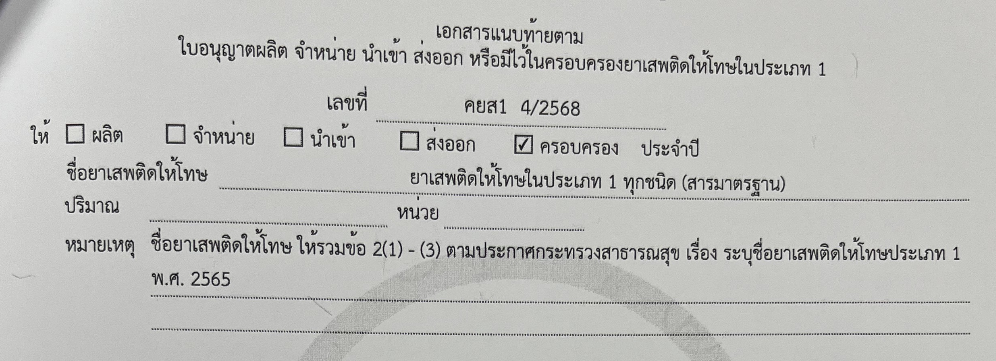

## คำขอรับใบอนุญาต คำขอต่ออายุใบอนุญาต และคำขอรับใบแทนใบอนุญาตผลิต นำเข้า ส่งออก จำหน่าย หรือมีไว้ไว้ในครอบครองยาเสพติดให้โทษในประเภท ๑ [ยส.1-1]
---

## (dbo.MasterRequisitionType Id = 1)
### Links

- [Figma Group Doc](https://www.figma.com/design/0YEqdcSpC2hZKulzEl54LH/-FDA68--Group-Doc)
- [Data Dic - Master Data real](https://docs.google.com/spreadsheets/d/1WpRC41tmqyOc8zVaxTVuwLxGgmi7inZATo8_LcCTXgE)

- [Figma ยส.1](https://www.figma.com/board/2vq44hMBfDujhC8g13qBXC/%E0%B8%A2%E0%B8%AA.1)

### [เงื่อนไข ยส.1]
## ประเภทการขอ

| ประเภทการขอ |
|---|
| 1. ขอใหม่ |
| 2. ขอเพิ่มสาร (เพิ่มชนิด) |
| 3. ขอเพิ่มปริมาณ |
| 4. ขอแก้ไข |
| 5. ขอต่ออายุ |
| 6. ขอยกเลิก |
| 7. ขอใบแทน |

## วัตถุประสงค์ในการขออนุญาต + การดำเนินการ

| วัตถุประสงค์/การดำเนินการ | ผลิต | นำเข้า | ส่งออก | จำหน่าย | ครอบครอง |
|---|---|---|---|---|---|
| 1. เพื่อประโยชน์ของทางราชการฯ |  | ✅ | ✅ |  | ✅ |
| 2. เพื่อการศึกษาวิจัย หรือเพื่อประโยชน์ในทางการแพทย์ หรือวิทยาศาสตร์ | ✅ | ✅ | ✅ | ✅ | ✅ |
| 3. เพื่อใช้เป็นสารมาตรฐานในการตรวจวิเคราะห์ในปริมาณเล็กน้อย |  | ✅ | ✅ |  | ✅ |

## วัตถุประสงค์ในการขออนุญาต + ประเภทผู้ขอ

| วัตถุประสงค์/ประเภทผู้ขอ | หน่วยงานของรัฐที่เป็นนิติบุคคล | สภากาชาดไทย | สถาบันอุดมศึกษา | ผู้รับอนุญาตตามกฎหมาย |
|---|---|---|---|---|
| 1. เพื่อประโยชน์ของทางราชการฯ | ✅ | ✅ | | |
| 2. เพื่อการศึกษาวิจัย หรือเพื่อประโยชน์ในทางการแพทย์ หรือวิทยาศาสตร์ | ✅ | ✅ | | |
| 3. เพื่อใช้เป็นสารมาตรฐานในการตรวจวิเคราะห์ในปริมาณเล็กน้อย | ✅ | ✅ | ✅ | ✅ |

*ต้องมีแยกแบบ ยส.4 (รัฐวิสาหกิจ, สถาบันอุดมศึกษาของรัฐ, สถาบันอุดมศึกษาเอกชน) หรือไม่*

## วัตถุประสงค์ + เงื่อนไขสาร
**ใช้ที่ 2.1 ข้อมูลยาเสพติดให้โทษในประเภท 1 ที่ขอรับอนุญาต**

| วัตถุประสงค์ (Objective) /   สาร | ประเภทสาร (NarcoticTypeId) | เงื่อนไขสาร   ([dbo].[MasterNarcoticEster]) | เงื่อนไขหน่วย (MasterNarcoticUnit) |
|---|---|---|---|
| 1. เพื่อประโยชน์ของทางราชการฯ | 1 | ยส.1 | IsNCUnit |
| 2. เพื่อการศึกษาวิจัย หรือเพื่อประโยชน์ในทางการแพทย์ หรือวิทยาศาสตร์ | 1 | ยส.1 | IsNCUnit |
| 3. เพื่อใช้เป็นสารมาตรฐานในการตรวจวิเคราะห์ในปริมาณเล็กน้อย | 1 | ยส.1 **ที่เป็นสารมาตรฐาน** | IsNC4StandardUnit |

**ยาเสพติดให้โทษในประเภท 1 ทุกชนิด**

| วัตถุประสงค์ (Objective) /   สาร | ประเภทสาร (NarcoticTypeId) | เงื่อนไขสาร   ([dbo].[MasterNarcoticEster]) | เงื่อนไขหน่วย (MasterNarcoticUnit) |
|---|---|---|---|
| x. [วัตถุประสงค์ xxxx] | 1 | ยาเสพติดให้โทษในประเภท 1 ทุกชนิด (สารมาตรฐาน) | IsNC4StandardUnit |

## วัตถุประสงค์ในการขออนุญาต + ประเภทการขอ + flow

