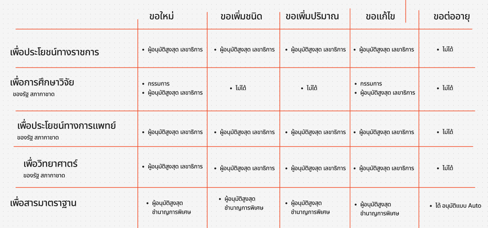

## คำขอรับใบอนุญาต คำขอต่ออายุใบอนุญาต และคำขอรับใบแทนใบอนุญาตผลิต นำเข้า ส่งออก จำหน่าย หรือมีไว้ไว้ในครอบครองยาเสพติดให้โทษในประเภท ๑ [ยส.1-1]
---

## (dbo.MasterRequisitionType Id = 1)
### [เงื่อนไข ยส.1]

## ประเภทการขอ

| ประเภทการขอ |
|---|
| 1. ขอใหม่ |
| 2. ขอเพิ่มสาร (เพิ่มชนิด) |
| 3. ขอเพิ่มปริมาณ |
| 4. ขอแก้ไข |
| 5. ขอต่ออายุ |
| 6. ขอยกเลิก |
| 7. ขอใบแทน |

## วัตถุประสงค์ในการขออนุญาต + การดำเนินการ

| วัตถุประสงค์/การดำเนินการ | ผลิต | นำเข้า | ส่งออก | จำหน่าย | ครอบครอง |
|---|---|---|---|---|---|
| 1. เพื่อประโยชน์ของทางราชการฯ          |  | ✅ | ✅ |  | ✅ |
| 2. เพื่อการศึกษาและวิจัย                 | ✅ | ✅ | ✅ | ✅ | ✅ |
| 3. เพื่อประโยชน์ทางการแพทย์             | ✅ | ✅ | ✅ | ✅ | ✅ |
| 4. เพื่อใช้เป็นสารมาตรฐานในการตรวจวิเคราะห์ |  | ✅ | ✅ |  | ✅ |

## วัตถุประสงค์ในการขออนุญาต + ประเภทการขอ + flow

### Links

- [Figma Group Doc](https://www.figma.com/design/0YEqdcSpC2hZKulzEl54LH/-FDA68--Group-Doc)
- [Data Dic - Master Data real](https://docs.google.com/spreadsheets/d/1WpRC41tmqyOc8zVaxTVuwLxGgmi7inZATo8_LcCTXgE)

- [Figma ยส.1](https://www.figma.com/board/2vq44hMBfDujhC8g13qBXC/%E0%B8%A2%E0%B8%AA.1)
