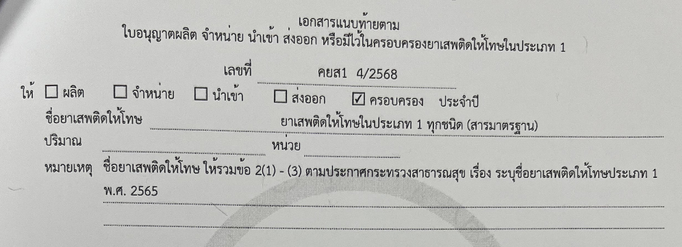
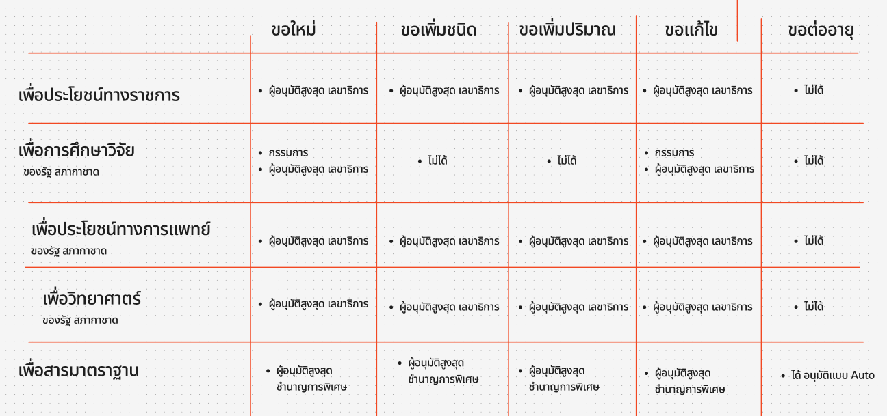
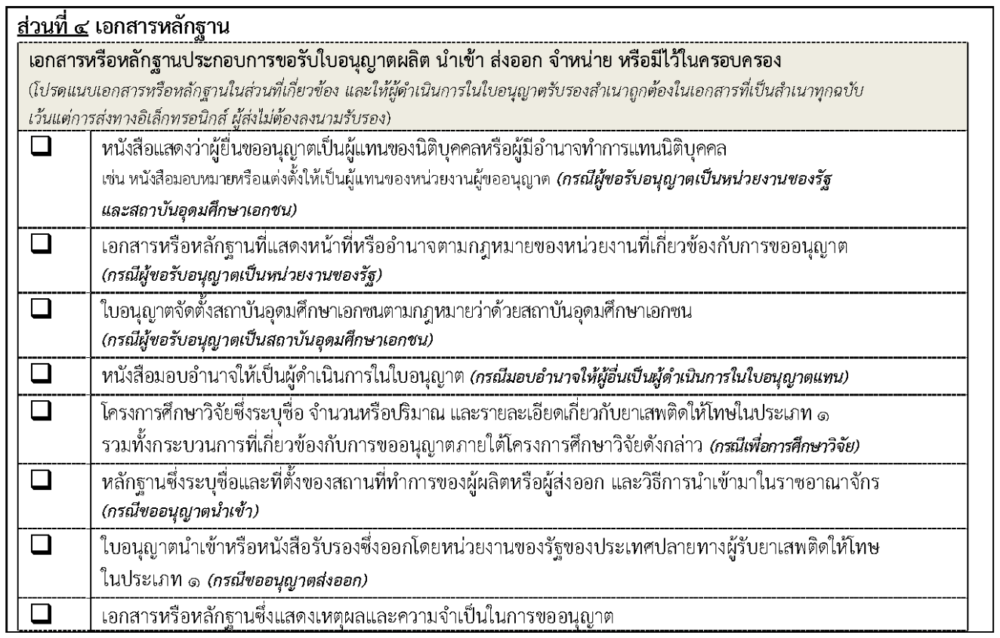

## คำขอรับใบอนุญาต คำขอต่ออายุใบอนุญาต และคำขอรับใบแทนใบอนุญาตผลิต นำเข้า ส่งออก จำหน่าย หรือมีไว้ไว้ในครอบครองยาเสพติดให้โทษในประเภท ๑ [ยส.1-1]

---

#### (dbo.MasterRequisitionType Id = 1)
### Links

- [Figma Group Doc](https://www.figma.com/design/0YEqdcSpC2hZKulzEl54LH/-FDA68--Group-Doc)
- [Data Dic - Master Data real](https://docs.google.com/spreadsheets/d/1WpRC41tmqyOc8zVaxTVuwLxGgmi7inZATo8_LcCTXgE)
- [FDA68_สรุปวัตถุประสงค์ ผู้อนุญาต และผู้อนุมัติ ในใบคำขอ](https://docs.google.com/spreadsheets/d/1B366oiRjTmnY7Jvt0lpH9ORXbmOgJaLXcYDHmDST8Qo)

- [Figma ยส.1](https://www.figma.com/board/2vq44hMBfDujhC8g13qBXC/%E0%B8%A2%E0%B8%AA.1)
- [ตย.เอกสาร ยส.1](https://drive.google.com/drive/u/1/folders/18Uv9_RM7pVDIbb-KoMh64jt6tfDQgVFa)

## ❗ เงื่อนไข ยส.1
### ประเภทการขอ (ยส.1-1)

| ลำดับ | ประเภทการขอ | LicenseGetById |
|:---:|---|:---:|
| 1 | ขอใหม่ |  |
| 2 | ขอเพิ่มสาร (เพิ่มชนิด) | ✅ |
| 3 | ขอเพิ่มปริมาณ | ✅ |
| 4 | ขอแก้ไข | ✅ |
| 5 | ขอต่ออายุ | ✅ |
| 6 | ขอยกเลิก | ✅ |
| 7 | ขอใบแทน | ✅ |

### วัตถุประสงค์ในการขออนุญาต + การดำเนินการ (ยส.1-1)

| วัตถุประสงค์/การดำเนินการ | ผลิต | นำเข้า | ส่งออก | จำหน่าย | ครอบครอง |
|---|:---:|:---:|:---:|:---:|:---:|
| 1. เพื่อประโยชน์ของทเพื่อประโยชน์ของทางราชการในการป้องกันและปราบปรามการกระทำความผิดเกี่ยวกับยาเสพติดหรือความร่วมมือระหว่างประเทศ กรณีจำเป็นเร่งด่วน |  | ✅ | ✅ |  | ✅ |
| 2. เพื่อการศึกษาวิจัย หรือเพื่อประโยชน์ในทางการแพทย์ หรือวิทยาศาสตร์ | ✅ | ✅ | ✅ | ✅ | ✅ |
| 3. เพื่อใช้เป็นสารมาตรฐานในการตรวจวิเคราะห์ในปริมาณเล็กน้อย |  | ✅ | ✅ |  | ✅ |

### วัตถุประสงค์ในการขออนุญาต + ประเภทผู้ขอ(ยส.1-1)

| วัตถุประสงค์/ประเภทผู้ขอ | หน่วยงานของรัฐที่เป็นนิติบุคคล | สภากาชาดไทย | สถาบันอุดมศึกษา | ผู้รับอนุญาตตามกฎหมาย |
|---|:---:|:---:|:---:|:---:|
| 1. เพื่อประโยชน์ของทางราชการฯ | ✅ | ✅ | | |
| 2. เพื่อการศึกษาวิจัย หรือเพื่อประโยชน์ในทางการแพทย์ หรือวิทยาศาสตร์ | ✅ | ✅ | | |
| 3. เพื่อใช้เป็นสารมาตรฐานในการตรวจวิเคราะห์ในปริมาณเล็กน้อย | ✅ | ✅ | ✅ | ✅ |

*ต้องมีแยกแบบ ยส.4 (รัฐวิสาหกิจ, สถาบันอุดมศึกษาของรัฐ, สถาบันอุดมศึกษาเอกชน) หรือไม่*

### วัตถุประสงค์ + เงื่อนไขสาร (ยส.1-1)
**ใช้ที่ 2.1 ข้อมูลยาเสพติดให้โทษในประเภท 1 ที่ขอรับอนุญาต**

| วัตถุประสงค์ (Objective) /   สาร | ประเภทสาร (NarcoticTypeId) | เงื่อนไขสาร   ([dbo].[MasterNarcoticEster]) | เงื่อนไขหน่วย (MasterNarcoticUnit) |
|---|:---:|---|:---:|
| 1. เพื่อประโยชน์ของทางราชการฯ | 1 | ยส.1 | IsNCUnit |
| 2. เพื่อการศึกษาวิจัย หรือเพื่อประโยชน์ในทางการแพทย์ หรือวิทยาศาสตร์ | 1 | ยส.1 | IsNCUnit |
| 3. เพื่อใช้เป็นสารมาตรฐานในการตรวจวิเคราะห์ในปริมาณเล็กน้อย | 1 | ยส.1 **ที่เป็นสารมาตรฐาน** | IsNC4StandardUnit |

**ยาเสพติดให้โทษในประเภท 1 ทุกชนิด**

| วัตถุประสงค์ (Objective) /   สาร | ประเภทสาร (NarcoticTypeId) | เงื่อนไขสาร   ([dbo].[MasterNarcoticEster]) | เงื่อนไขหน่วย (MasterNarcoticUnit) |
|---|:---:|:---:|:---:|
| เพื่อใช้เป็นสารมาตรฐานในการตรวจวิเคราะห์ในปริมาณเล็กน้อย | 1 | ยาเสพติดให้โทษในประเภท 1 ทุกชนิด (สารมาตรฐาน) | - |

### วัตถุประสงค์ในการขออนุญาต + ประเภทการขอ + flow (ยส.1-1)

## 🔷 Field Condition (ยส.1-1)
### 1.1 ข้อมูลผู้ขออนุญาต (ยส.1-1)

| ลำดับ | Label | Table.Field | Condition | Remark |
|:---:|---|---|---|---|
| x | - | `RequisitionParticipant`.`RequisitionId` |  |  |
| 0 | - | `Requisition`.`ParticipantTypeId` | ส่ง 1 - ผู้ขออนุญาต ตาม `MasterParticipantType`.`Id` | |
| 1 | ชื่อผู้ขออนุญาต | `Requisition`.`FullName`  `Requisition`.`JuristicName` | | - ลงคู่กับ juristicName |
| 2 | เลขทะเบียนนิติบุคคล | `Requisition`.`TaxId` | | - กองยาลง TaxId |
| 3 | เลขที่ (ที่ตั้งสำนักงานใหญ่) | `RequisitionParticipantAddress`.`HouseNo` | | |
| 4 | เลขรหัสประจำบ้านตามทะเบียนบ้าน (สำนักงานใหญ่) | `RequisitionParticipantAddress`.`HouseCode` | - Cannot over 11 digits | - Need separator `(0000-000000-0)` |
| 5 | หมู่ที่ | `RequisitionParticipantAddress`.`VillageNo` | | |
| 6 | ตรอก/ซอย | `RequisitionParticipantAddress`.`Lane` | | |
| 7 | ถนน | `RequisitionParticipantAddress`.`Street` | | |
| 8 | จังหวัด | `RequisitionParticipantAddress`.`ProvinceId` | | |
| 9 | อำเภอ/เขต | `RequisitionParticipantAddress`.`AmphurId` | | |
| 10 | ตำบล/แขวง | `RequisitionParticipantAddress`.`TambonId` | | |
| 11 | รหัสไปรษณีย์ | `RequisitionParticipantAddress`.`Postcode` | | |
| 12 | โทรศัพท์มือถือ | `RequisitionParticipantAddress`.`Phone` | | |
| 13 | โทรสาร | `RequisitionParticipantAddress`.`Fax` | | |
| 14 | อีเมล | `RequisitionParticipantAddress`.`Email` | | |
| X | ที่อยู่แบบเต็ม | `RequisitionParticipant`.`FullAddress` | | - เอา ParticipantAddress ทุกอันมาต่อกันแล้วคั่นด้วยคำว่า "และ" |
| Z | ที่อยู่แบบเต็ม | `RequisitionParticipantAddress`.`FullAddress` | | - เอาทุก field มา concat กัน, ถ้าไม่มีค่าให้เป็น ชื่อหัวข้อ + '-' |

### 1.2 ข้อมูลผู้ดำเนินการใบอนุญาต (ยส.1-1)

*** (ยส.1-1) ไม่เก็บ Work permit no. ***

| ลำดับ | Label | Table.Field | Condition | Remark |
|:---:|---|---|---|---|
| x | - | `RequisitionParticipant`.`RequisitionId` |  |  |
| 0 | - | `RequisitionParticipant`.`ParticipantTypeId` | ส่ง 2 - ผู้ดำเนินการ ตาม `MasterParticipantType`.`Id` | |
| 1 | คำนำหน้านาม | `RequisitionParticipant`.`PrefixId` | | |
| 2 | ชื่อจริง | `RequisitionParticipant`.`FirstName` | | |
| 3 | นามสกุล | `RequisitionParticipant`.`LastName` | | |
| 4 | อายุ | `RequisitionParticipant`.`Age` | | |
| 5 | วัน เดือน ปี เกิด | `RequisitionParticipant`.`BirthDate` | | |
| 6 | สัญชาติ | `RequisitionParticipant`.`NationalityId` | | |
| 7 | เลขประจำตัวประชาชน | `RequisitionParticipant`.`IdentificationNo` | เก็บเฉพาะเลขบัตรประชาชนเท่านั้น | - Cannot over 13 digits   - Need separator (0-0000-00000-00-0) |
| 8 | หนังสือเดินทางเลขที่ | `RequisitionParticipant`.`NumberOtherIdcard` | (กอง ต.) แต่ OtherIdCard ไม่ต้องส่งอะไรไป | |
| ~~9~~ | ~~ใบอนุญาตทำงานเลขที่ (Work Permit No.) กรณีชาวต่างชาติ~~ | ~~`RequisitionParticipant`.`WorkPermit`~~ |  |  |
| 10 | เลขที่ | `RequisitionParticipantAddress`.`HouseNo` | - Can type text เพื่อให้รองรับ อาคาร ชั้น ห้อง | |
| 11 | เลขการมอบอำนาจ | `RequisitionParticipant`.`PowerOfAttorneyNo` | | |
| 12 | เลขรหัสประจำบ้านตามทะเบียนบ้าน (ตามทะเบียนราษฎร์ กระทรวงมหาดไทย) | `RequisitionParticipantAddress`.`HouseCode` | - Cannot over 11 digits | - Need separator (0000-000000-0) |
| 13 | หมู่ที่ | `RequisitionParticipantAddress`.`VillageNo` | | |
| 14 | ตรอก/ซอย | `RequisitionParticipantAddress`.`Lane` | | |
| 15 | ถนน | `RequisitionParticipantAddress`.`Street` | | |
| 16 | จังหวัด | `RequisitionParticipantAddress`.`ProvinceId` | | |
| 17 | อำเภอ/เขต | `RequisitionParticipantAddress`.`AmphurId` | | |
| 18 | ตำบล/แขวง | `RequisitionParticipantAddress`.`TambonId` | | |
| 19 | รหัสไปรษณีย์ | `RequisitionParticipantAddress`.`Postcode` | | |
| 20 | โทรศัพท์มือถือ | `RequisitionParticipantAddress`.`Phone` | | |
| 21 | โทรสาร | `RequisitionParticipantAddress`.`Fax` | | |
| 22 | อีเมล | `RequisitionParticipantAddress`.`Email` | | |

<!-- ### 2.1 ข้อมูลยาเสพติดให้โทษในประเภท 1 ที่ขอรับอนุญาต -->

### 2.2 ข้อมูลสถานที่ผลิต นำเข้า ส่งออก จำหน่าย หรือมีไว้ในครอบครอง (ยส.1-1)

| ลำดับ | Label | Table.Field | Condition | Remark |
|:---:|---|---|---|---|
| x | - | `RequisitionParticipant`.`RequisitionId` |  |  |
| 0 | - | `RequisitionParticipant`.`ParticipantTypeId` | ส่ง 3 - สถานที่ขออนุญาต ตาม `MasterParticipantType`.`Id` | |
| 1 | ชื่อสถานที่ | `RequisitionParticipant`.`LocationName` | | |
| 2 | เลขที่ | `RequisitionParticipantAddress`.`HouseNo` | - Can type text เพื่อให้รองรับ อาคาร ชั้น ห้อง | |
| 3 | เลขรหัสประจำบ้านตามทะเบียนบ้าน (ตามทะเบียนราษฎร์ กระทรวงมหาดไทย) | `RequisitionParticipantAddress`.`HouseCode` | - Cannot over 11 digits | - Need separator `(0000-000000-0)` |
| 4 | หมู่ที่ | `RequisitionParticipantAddress`.`VillageNo` | | |
| 5 | ตรอก/ซอย | `RequisitionParticipantAddress`.`Lane` | | |
| 6 | ถนน | `RequisitionParticipantAddress`.`Street` | | |
| 7 | จังหวัด | `RequisitionParticipantAddress`.`ProvinceId` | | |
| 8 | อำเภอ/เขต | `RequisitionParticipantAddress`.`AmphurId` | | |
| 9 | ตำบล/แขวง | `RequisitionParticipantAddress`.`TambonId` | | |
| 10 | รหัสไปรษณีย์ | `RequisitionParticipantAddress`.`Postcode` | | |
| 11 | โทรศัพท์มือถือ | `RequisitionParticipantAddress`.`Phone` | | |
| 12 | โทรสาร | `RequisitionParticipantAddress`.`Fax` | | |
| 13 | อีเมล | `RequisitionParticipantAddress`.`Email` | | |

### 2.3 ข้อมูลของ<u>ผู้รับมอบ</u>ผลิตยาเสพติดให้โทษในประเภท 1 (กรณีขออนุญาตจำหน่าย) (ยส.1-1)

*** แสดงเมื่อเลือก OperationType เป็น **จำหน่าย** ***

<ul>
  <li>ค้นหาจาก
    <ul>
      <li>เลขที่ใบอนุญาต ผลิต นำเข้า ส่งออก หรือมีไว้ในครอบครอง ยาเสพติดให้โทษในประเภท 1</li>
      หรือ
      <li>เลขที่ใบอนุญาต **ระหว่างการขออนุญาต** ผลิต นำเข้า ส่งออก หรือมีไว้ในครอบครอง
      ยาเสพติดให้โทษในประเภท 1 ในระบบ</li>
    </ul>
  </li>
</ul>

| ลำดับ | Label | Table.Field | Condition | Remark |
|:---:|---|---|---|---|
| x | - | `RequisitionParticipant`.`RequisitionId` |  |  |
| 0 | - | `RequisitionParticipant`.`ParticipantTypeId` | ส่ง 5 - ผู้รับมอบ ตาม `MasterParticipantType`.`Id` | |
| 1 | ชื่อผู้รับอนุญาตที่รับมอบ | `RequisitionParticipant`.`JuristicName` | - ตอนดึงให้ดึงจาก RequisitionParticipant | |
| 2 | ใบอนุญาตเลขที่ | `RequisitionParticipant`.`RecipientLicenseNo` | | |
| 3 | ชื่อผู้ประสงค์ทีจะรับมอบ | `RequisitionParticipant`.`JuristicName` | | |
| 4 | เลขที่ | `RequisitionParticipantAddress`.`HouseNo` | - Can type text เพื่อให้รองรับ อาคาร ชั้น ห้อง | |
| 5 | เลขรหัสประจำบ้านตามทะเบียนบ้าน (ตามทะเบียนราษฎร์ กระทรวงมหาดไทย) | `RequisitionParticipantAddress`.`HouseCode` | - Cannot over 11 digits | - Need separator `(0000-000000-0)` |
| 6 | หมู่ที่ | `RequisitionParticipantAddress`.`VillageNo` | | |
| 7 | ตรอก/ซอย | `RequisitionParticipantAddress`.`Lane` | | |
| 8 | ถนน | `RequisitionParticipantAddress`.`Street` | | |
| 9 | จังหวัด | `RequisitionParticipantAddress`.`ProvinceId` | | |
| 10 | อำเภอ/เขต | `RequisitionParticipantAddress`.`AmphurId` | | |
| 11 | ตำบล/แขวง | `RequisitionParticipantAddress`.`TambonId` | | |
| 12 | รหัสไปรษณีย์ | `RequisitionParticipantAddress`.`Postcode` | | |
| 13 | โทรศัพท์มือถือ | `RequisitionParticipantAddress`.`Phone` | | |
| 14 | โทรสาร | `RequisitionParticipantAddress`.`Fax` | | |
| 15 | อีเมล | `RequisitionParticipantAddress`.`Email` | | |

### 2.4 ข้อมูลผู้ส่งออกหรือผู้นำเข้าในต่างประเทศ (กรณีขออนุญาตนำเข้าหรือส่งออก)

*** แสดงเมื่อเลือก OperationType เป็น **นำเข้า** หรือ **ส่งออก** ***

| ลำดับ | Label | Table.Field | Condition | Remark |
|:---:|---|---|---|---|
| x | - | `RequisitionForeignEntity`.`RequisitionId` |  |  |
| y | ForeignEntityId ผู้ส่งออกหรือผู้นำเข้าในต่างประเทศ | `RequisitionForeignEntity`.`ForeignEntityId` | เอามาจาก `MasterForeignEntity`.`Id` |  |
| z | ForeignEntityType | `RequisitionForeignEntity`.`ForeignEntityType` | ประเภทผู้ผลิต/ผู้นำเข้า/ผู้ส่งออก (M=ผู้ผลิต, I=ผู้นำเข้า, E=ผู้ส่งออก) | ถ้าเป็นคำขอ**ส่งออก** ส่ง 'I'   ถ้าเป็นคำขอ**นำเข้า** ส่ง 'E' |
| 1 | ชื่อผู้ส่งออกหรือผู้นำเข้าในต่างประเทศ | `RequisitionForeignEntity`.`ForeignEntityName` |  | เอามาจาก `MasterForeignEntity`.`Id` ที่เลือก แล้วหา `MasterForeignEntity`.`ForeignEntityName` |
| 2 | ที่อยู่ของสถานที่ทำการ | `RequisitionForeignEntity`.`ForeignEntityAddress` |  | เอามาจาก `MasterForeignEntity`.`Id` ที่เลือก แล้วหา `MasterForeignEntity`.`FullAddress` |
| 3.1 | (Id) ประเทศ | `RequisitionForeignEntity`.`CountryId` |  | เอามาจาก `MasterForeignEntity`.`Id` ที่เลือก แล้วหา `MasterForeignEntity`.`CountryId` |
| 3.2 | (ชื่อ) ประเทศ | `RequisitionForeignEntity`.`CountryName` |  | เอามาจาก `MasterForeignEntity`.`Id` ที่เลือก แล้วหา `MasterForeignEntity`.`CountryName` |
| 4 | วิธีการนำเข้าหรือส่งออก | `RequisitionForeignEntity`.`TransportTypeId` |  | เอามาจาก `MasterTransportType`.`Id` |

### ส่วนที่ 3 สถานที่สำหรับติดต่อจัดส่งเอกสาร (ยส.1-1)

| ลำดับ | Label | Table.Field | Condition | Remark |
|:---:|---|---|---|---|
| 0 | - | `RequisitionParticipant`.`ParticipantTypeId` | ส่ง 7 - สถานที่จัดส่งเอกสาร ตาม `MasterParticipantType`.`Id` | |
| 1 | การจัดส่งเอกสาร | `Requisition`.`DocumentDeliveryAddress` | การจัดส่งเอกสาร (1=ตามที่อยู่ผู้ขอรับใบอนุญาต, 2=ตามที่อยู่สถานที่ขอรับใบอนุญาต) | 1.1 ตามที่อยู่ผู้ขอรับใบอนุญาต, 2.2 ตามที่อยู่สถานที่ขอรับใบอนุญาต |
| 2 | ชื่อสถานที่ | `RequisitionParticipant`.`LocationName` | | |
| 3 | เลขที่ | `RequisitionParticipantAddress`.`HouseNo` | - Can type text เพื่อให้รองรับ อาคาร ชั้น ห้อง | |
| 4 | เลขรหัสประจำบ้านตามทะเบียนบ้าน (ตามทะเบียนราษฎร์ กระทรวงมหาดไทย) | `RequisitionParticipantAddress`.`HouseCode` | - Cannot over 11 digits | - Need separator `(0000-000000-0)` |
| 5 | หมู่ที่ | `RequisitionParticipantAddress`.`VillageNo` | | |
| 6 | ตรอก/ซอย | `RequisitionParticipantAddress`.`Lane` | | |
| 7 | ถนน | `RequisitionParticipantAddress`.`Street` | | |
| 8 | จังหวัด | `RequisitionParticipantAddress`.`ProvinceId` | | |
| 9 | อำเภอ/เขต | `RequisitionParticipantAddress`.`AmphurId` | | |
| 10 | ตำบล/แขวง | `RequisitionParticipantAddress`.`TambonId` | | |
| 11 | รหัสไปรษณีย์ | `RequisitionParticipantAddress`.`Postcode` | | |
| 12 | โทรศัพท์มือถือ | `RequisitionParticipantAddress`.`Phone` | | |
| 13 | โทรสาร | `RequisitionParticipantAddress`.`Fax` | | |
| 14 | อีเมล | `RequisitionParticipantAddress`.`Email` | | |

#### 3.1 ข้อมูลผู้ประสานงาน (ยส.1-1)

| ลำดับ | Label | Table.Field | Condition | Remark |
|:---:|---|---|---|---|
| 0 | - | `RequisitionParticipant`.`ParticipantTypeId` | ส่ง 6 - ผู้ประสานงาน ตาม `MasterParticipantType`.`Id` | |
| 1 | ชื่อ-นามสกุล | `RequisitionParticipant`.`FullName` | | |
| 2 | โทรศัพท์มือถือ | `RequisitionParticipant`.`Phone` | | |
| 3 | โทรสาร | `RequisitionParticipant`.`Fax` | | |
| 4 | อีเมล | `RequisitionParticipant`.`Email` | | |

### 4 เอกสารหลักฐาน (ยส.1-1)

#### เอกสารแนบในแต่ละวัตถุประสงค์ของ ยส.1-1

## 📄 ส่วนแบบ Print from PDF คำขอ (ยส.1-1)