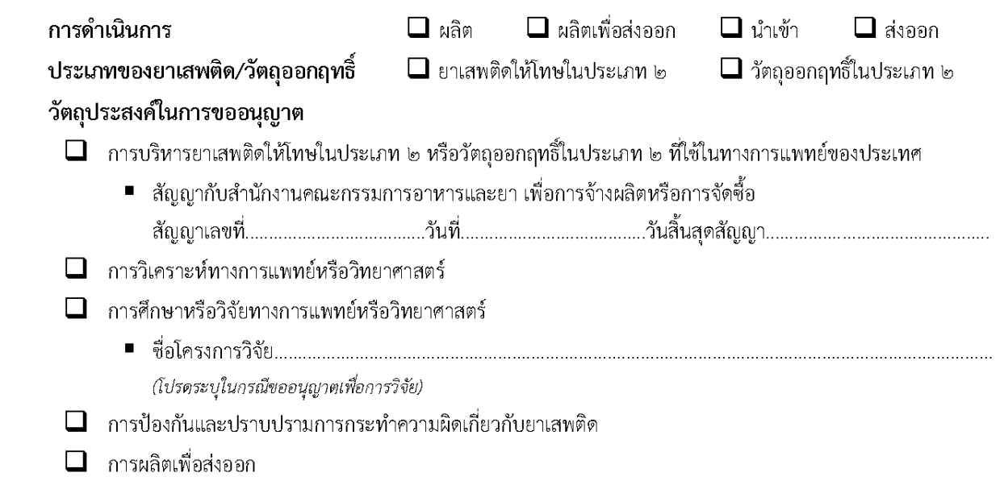
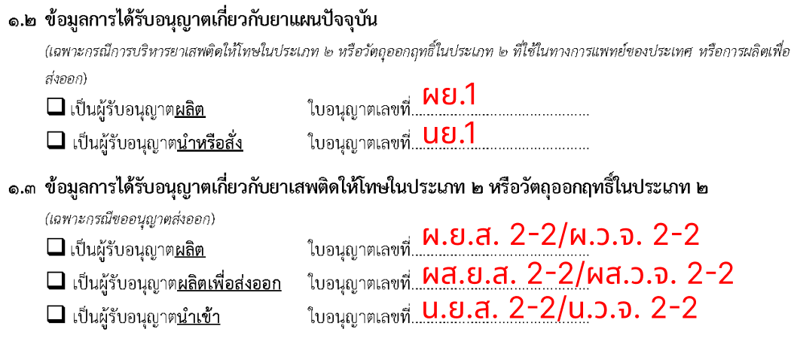

## คำขอรับใบอนุญาต คำขอต่อออายุใบอนุญาต และคำขอรับใบแทนใบอนุญาตผลิต ผลิตเพื่อส่งออก นำเข้า หรือส่งออกยาเสพติดให้โทษในประเภท 2 หรือวัตถุออกฤทธิ์ในประเภท 2 [ผนส. ยส.2/วจ.2]
---

## (dbo.MasterRequisitionType Id = 3)
### [เงื่อนไข ผนส. ยส.2/วจ.2]

## วัตถุประสงค์ในการขออนุญาต + การดำเนินการ

| วัตถุประสงค์/การดำเนินการ | ผลิต | ผลิตเพื่อส่งออก | นำเข้า | ส่งออก |
|---|---|---|---|---|
| การบริหารยาเสพติดให้โทษในประเภท 2   หรือ วัตถุออกฤทธิ์ในประเภท 2 ที่ใช้ในทางการแพทย์ของประเทศ | ✅ | ✅ | ✅ | ✅ |
| การวิเคราะห์ทางการแพทย์หรือวิทยาศาสตร์ | ✅ | ✅ | ✅ | ✅ |
| การศึกษาหรือวิจัยทางการแพทย์หรือวิทยาศาสตร์ | ✅ | ✅ | ✅ | ✅ |
| การป้องกันและปราบปามการกระทำความผิดเกี่ยวกับยาเสพติด | ✅ | ✅ | ✅ | ✅ |
| การผลิตเพื่อส่งออก | ✅ | ✅ | ✅ | ✅ |

## ใบอนุญาต + วัตถุประสงค์ในการขออนุญาต, การดำเนินการ for section 1.2 and 1.3

| การดำเนินการ/ใบอนุญาต | ผย.1 | นย.1 | ผยส.2 / ผวจ.2 | ผลิตเพื่อส่งออก ผยส.2 / ผวจ.2 | นยส.2 / นวจ.2 |
|---|---|---|---|---|---|
| 1.2 การบริหารยาเสพติดให้โทษในประเภท 2   หรือ วัตถุออกฤทธิ์ในประเภท 2 ที่ใช้ในทางการแพทย์ของประเทศ | ✅ | ✅ |  |  |  |
| 1.2 การผลิตเพื่อส่งออก | ✅ | ✅ |  |  |  |
| 1.3 ขอส่งออก |  |  | ✅ | ✅ | ✅ |

### Links

- [Figma Group Doc](https://www.figma.com/design/0YEqdcSpC2hZKulzEl54LH/-FDA68--Group-Doc)
- [Data Dic - Master Data real](https://docs.google.com/spreadsheets/d/1WpRC41tmqyOc8zVaxTVuwLxGgmi7inZATo8_LcCTXgE)

- [Figma ผนส. ยส.2/วจ.2](https://www.figma.com/board/z40hQv1fTsb9ll44MkkUnx/%E0%B8%9C%E0%B8%99%E0%B8%AA.-%E0%B8%A2%E0%B8%AA2---%E0%B8%A7%E0%B8%882)
