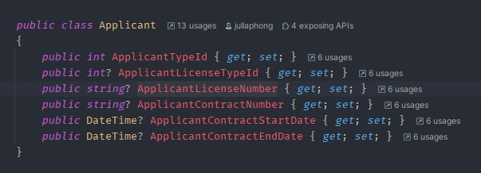
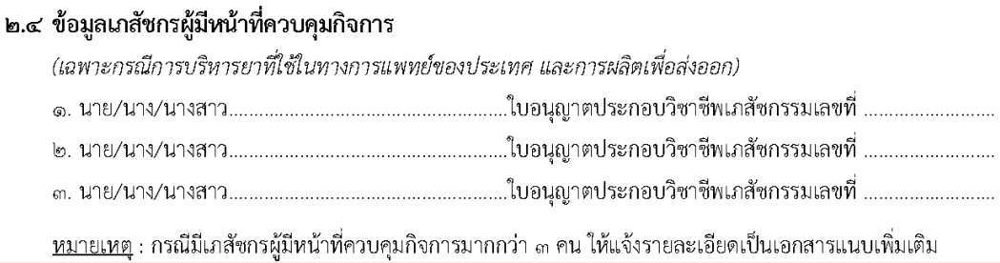

## คำขอรับใบอนุญาต คำขอต่อออายุใบอนุญาต และคำขอรับใบแทนใบอนุญาต**ผลิต ผลิตเพื่อส่งออก นำเข้า หรือส่งออก**ยาเสพติดให้โทษในประเภท 2 หรือวัตถุออกฤทธิ์ในประเภท 2 [ผนส. ยส.2/วจ.2]
---

## (dbo.MasterRequisitionType Id = 3)
### Links

- [Figma Group Doc](https://www.figma.com/design/0YEqdcSpC2hZKulzEl54LH/-FDA68--Group-Doc)
- [Data Dic - Master Data real](https://docs.google.com/spreadsheets/d/1WpRC41tmqyOc8zVaxTVuwLxGgmi7inZATo8_LcCTXgE)

- [Figma ผนส. ยส.2/วจ.2](https://www.figma.com/board/z40hQv1fTsb9ll44MkkUnx/%E0%B8%9C%E0%B8%99%E0%B8%AA.-%E0%B8%A2%E0%B8%AA2---%E0%B8%A7%E0%B8%882)

### [เงื่อนไข ผนส. ยส.2/วจ.2]
## ผู้ขออนุญาต

| ผู้ขออนุญาต | Remark |
|---|---|
| ผู้ขอรับอนุญาตเป็นหน่วยงานรัฐหรือสภากาชาดไทย | เอามาจากเอกสารแนบ |

## วัตถุประสงค์ในการขออนุญาต + การดำเนินการ

| วัตถุประสงค์ (Objective)/การดำเนินการ | ผลิต | ผลิตเพื่อส่งออก | นำเข้า | ส่งออก |
|---|---|---|---|---|
| 1. การบริหารยาเสพติดให้โทษในประเภท 2   หรือ วัตถุออกฤทธิ์ในประเภท 2 ที่ใช้ในทางการแพทย์ของประเทศ | ✅ | ✅ | ✅ | ✅ |
| 2. การวิเคราะห์ทางการแพทย์หรือวิทยาศาสตร์ | ✅ | ✅ | ✅ | ✅ |
| 3. การศึกษาหรือวิจัยทางการแพทย์หรือวิทยาศาสตร์ | ✅ | ✅ | ✅ | ✅ |
| 4. การป้องกันและปราบปามการกระทำความผิดเกี่ยวกับยาเสพติด | ✅ | ✅ | ✅ | ✅ |
| 5. การผลิตเพื่อส่งออก | ✅ | ✅ | ✅ | ✅ |

## ใบอนุญาต + วัตถุประสงค์ในการขออนุญาต, การดำเนินการ for section 1.2 and 1.3

| วัตถุประสงค์, การดำเนินการ/ใบอนุญาต | ผย.1 | นย.1 | ผลิต   ผยส.2 / ผวจ.2 | ผลิตเพื่อส่งออก   ผส.ยส.2-2 / ผส.วจ. 2-2 | นยส.2-2 / นวจ.2-2 |
|---|---|---|---|---|---|
| (วัตถุประสงค์ Objective) 1.2 การบริหารยาเสพติดให้โทษในประเภท 2   หรือ วัตถุออกฤทธิ์ในประเภท 2 ที่ใช้ในทางการแพทย์ของประเทศ | ✅ | ✅ |  |  |  |
| (วัตถุประสงค์ Objective) 1.2 การผลิตเพื่อส่งออก | ✅ | ✅ |  |  |  |
| (การดำเนินการ Operation) 1.3 ขอส่งออก |  |  | ✅ | ✅ | ✅ |

## วัตถุประสงค์ + เงื่อนไขสาร
**ใช้ที่ 2.1 ข้อมูลยาเสพติดให้โทษในประเภท 2 ที่ขอรับอนุญาต**

| วัตถุประสงค์ (Objective) /   สาร | ประเภทสาร (NarcoticTypeId) | เงื่อนไขสาร   ([dbo].[MasterNarcoticEster]) | เงื่อนไขหน่วย (MasterNarcoticUnit) |
|---|---|---|---|
| **ทุกวัตถุประสงค์**  | 2 | ยส.2 | IsNCUnit |

## Field Condition
## 1.2 and 1.3

<!--  -->

| Lable | Condition | Remark |
|---|---|
| เป็นผู้รับอนุญาต... | Checkbox |  |
| ใบอนุญาตเลขที่ | Dropdown | LicenseNo. save to  ??? |

## 2.4 ข้อมูลเภสัชกร

For objective
*- 1. การบริหารยาเสพติดให้โทษในประเภท 2 หรือ วัตถุออกฤทธิ์ในประเภท 2 ที่ใช้ในทางการแพทย์ของประเทศ*
*- 5. การผลิตเพื่อส่งออก*

