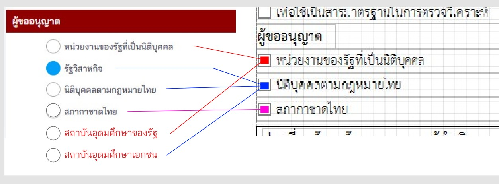
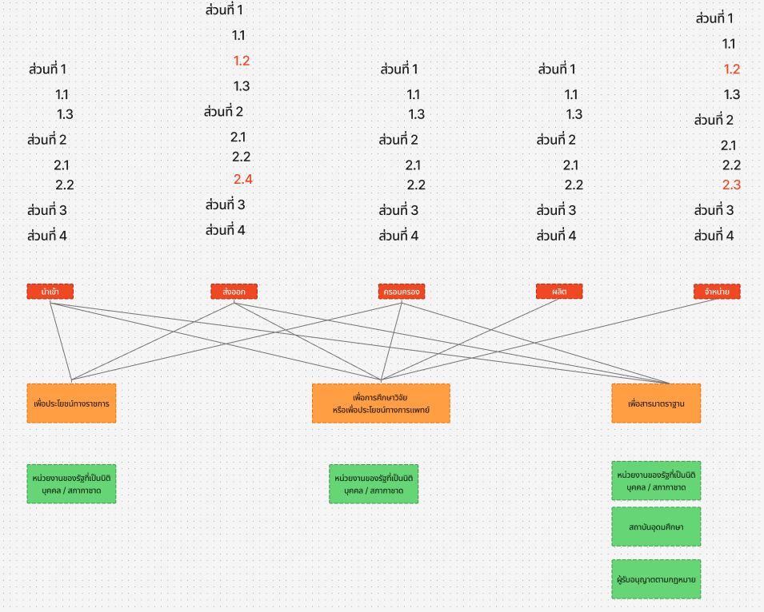

## คำขอรับใบอนุญาต คำขอต่ออายุใบอนุญาต และคำขอรับใบแทนใบอนุญาตผลิต นำเข้า ส่งออก จำหน่าย หรือมีไว้ไว้ในครอบครองยาเสพติดให้โทษในประเภท ๔ [ยส.4-1]
---

## (dbo.MasterRequisitionType Id = 19)
### Links

- [Figma Group Doc](https://www.figma.com/design/0YEqdcSpC2hZKulzEl54LH/-FDA68--Group-Doc)
- [Data Dic - Master Data real](https://docs.google.com/spreadsheets/d/1WpRC41tmqyOc8zVaxTVuwLxGgmi7inZATo8_LcCTXgE)

- [Figma ยส.4](https://www.figma.com/board/eZAUMG4kub8P4xGJNtzuOF/%E0%B8%A2%E0%B8%AA.4)

### [เงื่อนไข ยส.4]
## ประเภทการขอ

| ประเภทการขอ |
|---|
| 1. ขอใหม่ |
| 2. ขอเพิ่มสาร (เพิ่มชนิด) |
| 3. ขอเพิ่มปริมาณ |
| 4. ขอต่อเนื่อง **คค. เท่าเดิม** |
| 5. ขอต่อเนื่อง **คค. > เดิม** |
| 6. ขอแก้ไข |
| 7. ขอต่ออายุ |
| 8. ขอยกเลิก |
| 9. ขอใบแทน |

## วัตถุประสงค์ในการขออนุญาต + การดำเนินการ

| วัตถุประสงค์/การดำเนินการ | ผลิต | นำเข้า | ส่งออก | จำหน่าย | ครอบครอง |
|---|---|---|---|---|---|
| 1. เพื่อประโยชน์ของทางราชการฯ |  | ✅ | ✅ |  | ✅ |
| 2. เพื่อการศึกษาและวิจัย | ✅ | ✅ | ✅ |  | ✅ |
| 3. เพื่อประโยชน์ทางการแพทย์ | ✅ | ✅ | ✅ | ✅ | ✅ |
| 4. เพื่อประโยชน์ทางวิทยาศาสตร์ | ✅ | ✅ | ✅ | ✅ | ✅ |
| 5. เพื่อประโยชน์ทางอุตสาหกรรม | ✅ | ✅ | ✅ | ✅ |  |
| 6. เพื่อใช้เป็นสารมาตรฐานในการตรวจวิเคราะห์ |  | ✅ | ✅ |  | ✅ |

## วัตถุประสงค์ในการขออนุญาต + ประเภทผู้ขอ

| วัตถุประสงค์/ประเภทผู้ขอ | หน่วยงานของรัฐที่เป็นนิติบุคคล | รัฐวิสาหกิจ | นิติบุคคลตามกฎหมายไทย | สภากาชาดไทย | สถาบันอุดมศึกษาของรัฐ | สถาบันอุดมศึกษาเอกชน |
|---|---|---|---|---|---|
| 1. เพื่อประโยชน์ของทางราชการฯ | ✅ |  | ✅ | ✅ | ✅ |  |
| 2. เพื่อการศึกษาและวิจัย | ✅ |✅ | ✅ | ✅ | ✅ | ✅ |
| 3. เพื่อประโยชน์ทางการแพทย์ | ✅ | ✅ | ✅ | ✅ | ✅ | ✅ |
| 4. เพื่อประโยชน์ทางวิทยาศาสตร์ | ✅ | ✅ | ✅ | ✅ | ✅ | ✅ |
| 5. เพื่อประโยชน์ทางอุตสาหกรรม | ✅ | ✅ | ✅ | ✅ | ✅ | ✅ |
| 6. เพื่อใช้เป็นสารมาตรฐานในการตรวจวิเคราะห์ | ✅ | ✅ | ✅ | ✅ | ✅ | ✅ |

<!-- หน่วยงานของรัฐที่เป็นนิติบุคคล
รัฐวิสาหกิจ
นิติบุคคลตามกฎหมายไทย
สภากาชาดไทย
สถาบันอุดมศึกษาของรัฐ
สถาบันอุดมศึกษาเอกชน -->

## วัตถุประสงค์ + เงื่อนไขสาร
**ใช้ที่ 2.1 ข้อมูลยาเสพติดให้โทษในประเภท 4 ที่ขอรับอนุญาต**

| วัตถุประสงค์ (Objective) /   สาร | ประเภทสาร (NarcoticTypeId) | เงื่อนไขสาร   ([dbo].[MasterNarcoticEster]) | เงื่อนไขหน่วย (MasterNarcoticUnit) |
|---|---|---|---|
| 1. เพื่อประโยชน์ของทางราชการฯ  | 4 | ยส.4 | IsNCUnit |
| 2. เพื่อการศึกษาวิจัย | 4 | ยส.4 | IsNCUnit |
| 3. เพื่อประโยชน์ในทางการแพทย์ | 4 | ยส.4 | IsNCUnit |
| 4. เพื่อประโยชน์ทางวิทยาศาสตร์ | 4 | ยส.4 | IsNCUnit |
| 5. เพื่อประโยชน์ทางอุตสาหกรรม **ภายใต้ระบบปิด** | 4 | ยส.4 **มีแต่ Acetic Anhydride ให้เลือก** | IsNC4ClosedSystemIndustryUnit **มีเฉพาะหน่วย กิโลกรัม ให้เลือก** |
| 6. เพื่อประโยชน์ทางอุตสาหกรรม **ไม่อยู่ภายใต้ระบบปิด** | 4 | ยส.4 | IsNC4OpenSystemIndustryUnit |
| 7. เพื่อใช้เป็นสารมาตรฐานในการตรวจวิเคราะห์ | 4 | ยส.4  **ที่เป็นสารมาตรฐาน** | IsNC4StandardUnit |

## วัตถุประสงค์ในการขออนุญาต + ประเภทการขอ + flow

## 1.2 ข้อมูลผู้ดำเนินการใบอนุญาต

| Lable | Condition | Remark |
|---|---|
| เลขประจำตัวประชาชน | - Cannot over 13 digits | - Need sperator (0-0000-00000-00-0) |
| เลขรหัสประจำบ้านตามทะเบียนบ้าน (ตามทะเบียนราษฏร์ กระทรวงมหาดไทย) | - Cannot over 11 digits | - Need sperator (0000-000000-0) |
| เลขที่ | - Can type text |  |