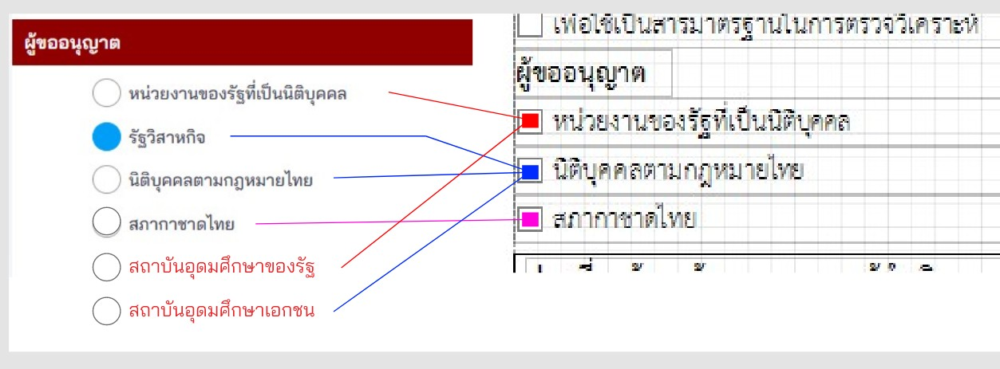
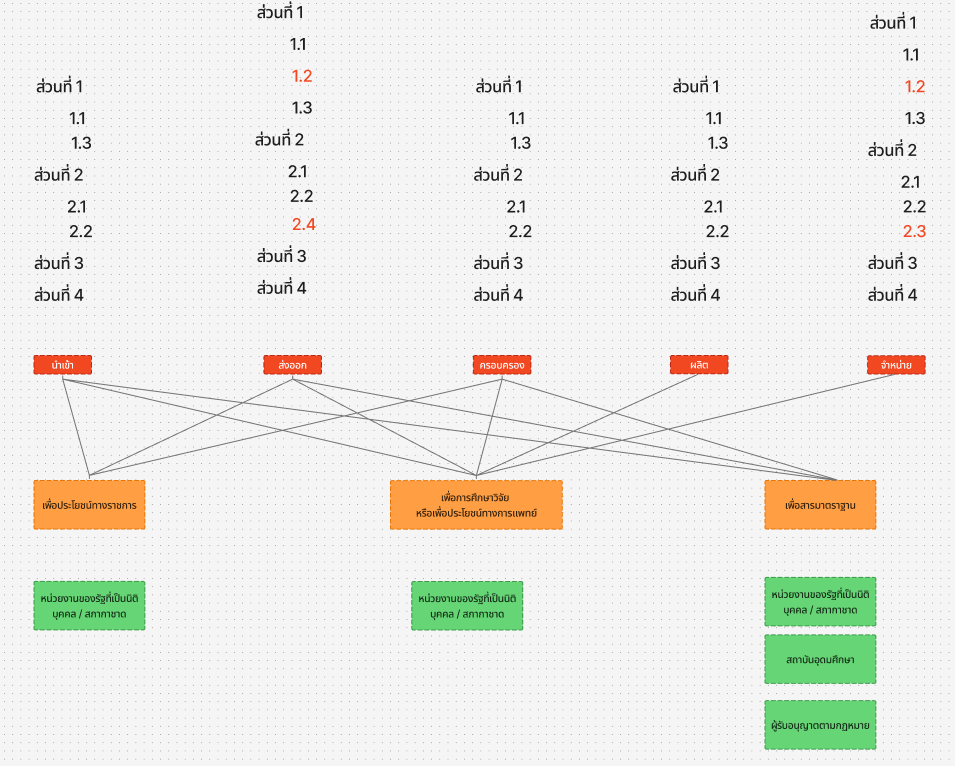
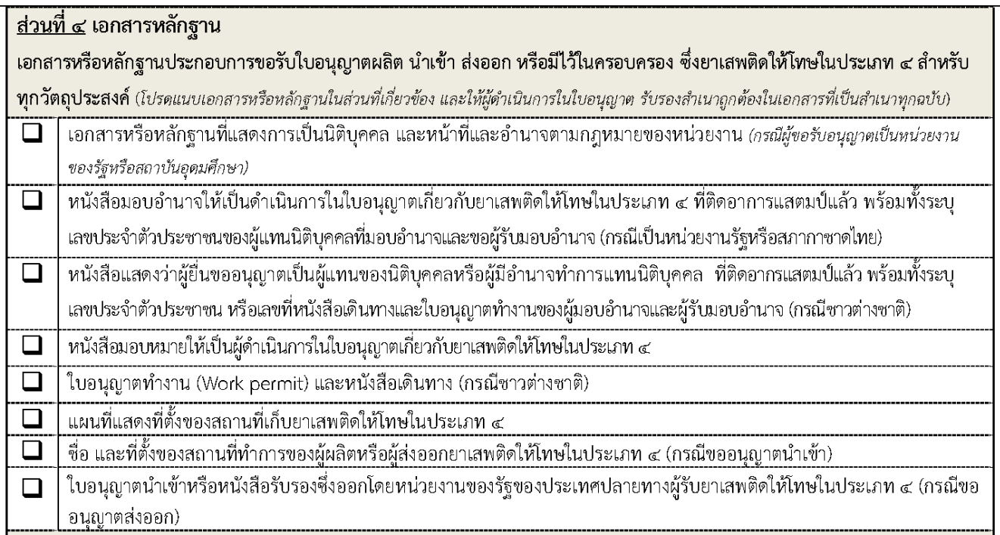
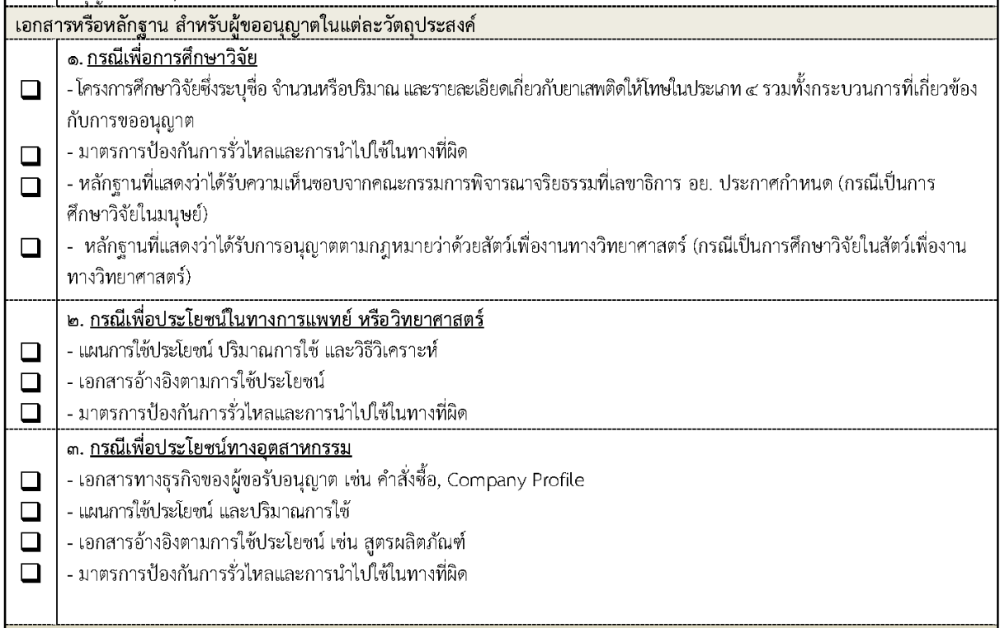
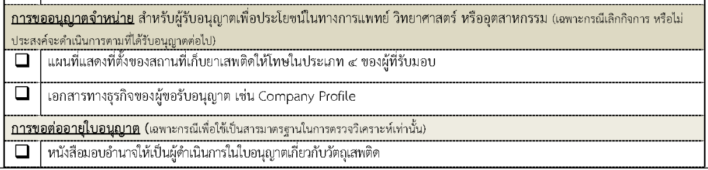

## คำขอรับใบอนุญาต คำขอต่ออายุใบอนุญาต และคำขอรับใบแทนใบอนุญาตผลิต นำเข้า ส่งออก จำหน่าย หรือมีไว้ไว้ในครอบครองยาเสพติดให้โทษในประเภท ๔ [ยส.4-1]

---

#### (dbo.MasterRequisitionType Id = 19)

### Links

- [Figma Group Doc](https://www.figma.com/design/0YEqdcSpC2hZKulzEl54LH/-FDA68--Group-Doc)
- [Data Dic - Master Data real](https://docs.google.com/spreadsheets/d/1WpRC41tmqyOc8zVaxTVuwLxGgmi7inZATo8_LcCTXgE)
- [FDA68_สรุปวัตถุประสงค์ ผู้อนุญาต และผู้อนุมัติ ในใบคำขอ](https://docs.google.com/spreadsheets/d/1B366oiRjTmnY7Jvt0lpH9ORXbmOgJaLXcYDHmDST8Qo)

- [Figma ยส.4](https://www.figma.com/board/eZAUMG4kub8P4xGJNtzuOF/%E0%B8%A2%E0%B8%AA.4)
- [เอกสารแนบในแต่ละวัตถุประสงค์ของ ยส. 4](https://drive.google.com/drive/folders/1y3kI2UJyY4YayVMlbP_dlyOjxKeZGECI)

<!-- ### API
```
ติดตามสถานะคำขอ
StatusRequest
``` -->

<style scoped>
table {
  font-size: 13px;
}
li {
  font-size: 13px;
}
</style>

## ❗ เงื่อนไข ยส.4
### ประเภทการขอ (ยส.4-1)

| ลำดับ | ประเภทการขอ | LicenseGetById |
|:---:|---|:---:|
| 1 | ขอใหม่ |  |
| 2 | ขอเพิ่มสาร (เพิ่มชนิด) | ✅ |
| 3 | ขอเพิ่มปริมาณ | ✅ |
| 4 | ขอต่อเนื่อง **คค. เท่าเดิม** | ✅ |
| 5 | ขอต่อเนื่อง **คค. มากกว่า ปริมาณเดิม** | ✅ |
| 6 | ขอแก้ไข | ✅ |
| 7 | ขอต่ออายุ | ✅ |
| 8 | ขอยกเลิก | ✅ |
| 9 | ขอใบแทน | ✅ |

### วัตถุประสงค์ในการขออนุญาต + ประเภทการขอ (ยส.4-1)

| วัตถุประสงค์/ประเภทการขอ | 1. ขอใหม่ | 2. ขอเพิ่มสาร (เพิ่มชนิด) | 3. ขอเพิ่มปริมาณ | 4. ขอต่อเนื่อง <br> คค. เท่าเดิม | 5. ขอต่อเนื่อง <br> คค. มากกว่าปริมาณเดิม |
|---|:---:|:---:|:---:|:---:|:---:|
| 1. เพื่อประโยชน์ของทางราชการในการป้องกันและปราบปรามการกระทำความผิดเกี่ยวกับยาเสพติดหรือความร่วมมือระหว่างประเทศ กรณีจำเป็นเร่งด่วน                     | ✅ | ✅ | ✅ | ✅ | ✅ |
| 2. เพื่อการศึกษาและวิจัย                             | ✅ | ✅ | ✅ | ไม่มีขอต่อเนื่อง | ไม่มีขอต่อเนื่อง |
| 3. เพื่อประโยชน์ทางการแพทย์                        | ✅ | ✅ | ✅ | ✅ | ✅ |
| 4. เพื่อประโยชน์ทางวิทยาศาสตร์                       | ✅ | ✅ | ✅ | ✅ | ✅ |
| 5. เพื่อประโยชน์ทางอุตสาหกรรม **ภายใต้ระบบปิด**     | ✅ | ✅ | ✅ | ✅ | ✅ |
| 6. เพื่อประโยชน์ทางอุตสาหกรรม **ไม่อยู่ภายใต้ระบบปิด** | ✅ | ✅ | ✅ | ✅ | ✅ |
| 7. เพื่อใช้เป็นสารมาตรฐานในการตรวจวิเคราะห์             | ✅ | ✅ | ✅ | ไม่มีขอต่อเนื่อง | ไม่มีขอต่อเนื่อง |

#### ***ขอต่อเนื่อง***
<ul>
  <li>ได้เฉพาะการดำเนินการ ผลิต นำเข้า ส่งออก ครอบครอง</li>
  <li>อ้างอิง Ref. ใบอนุญาต ยส.4 ตามวัตถุประสงค์ 3. 4. 5. 6. ดังนี้
    <ul>
      <li>3. เพื่อประโยชน์ทางการแพทย์ </li>
      <li>4. เพื่อประโยชน์ทางวิทยาศาสตร์</li>
      <li>5. เพื่อประโยชน์ทางอุตสาหกรรม ภายใต้ระบบปิด</li>
      <li>6. เพื่อประโยชน์ทางอุตสาหกรรม ไม่อยู่ภายใต้ระบบปิด</li>
    </ul>
  </li>
</ul>

#### ***ขอเพิ่มชนิด / ขอเพิ่มปริมาณ (ยส.4-1)***

| วัตถุประสงค์/การดำเนินการ | ผลิต | นำเข้า | ส่งออก | ~~จำหน่าย~~ | ครอบครอง |
|---|:---:|:---:|:---:|:---:|:---:|
| ~~1. เพื่อประโยชน์ของทางราชการฯ~~ |  |  |  |  |  |
| ~~2. เพื่อการศึกษาและวิจัย~~ | |  | |  | |
| 3. เพื่อประโยชน์ทางการแพทย์ | ✅ | ✅ | ✅ |  | ✅ |
| 4. เพื่อประโยชน์ทางวิทยาศาสตร์ | ✅ | ✅ | ✅ |  | ✅ |
| 5. เพื่อประโยชน์ทางอุตสาหกรรม | ✅ | ✅ | ✅ |  | ✅ |
| 6. เพื่อใช้เป็นสารมาตรฐานในการตรวจวิเคราะห์ |  | ✅ | ✅ |  | ✅ |

<ul>
  <li>ได้เฉพาะการดำเนินการ ผลิต นำเข้า ส่งออก ครอบครอง</li>
  <li>อ้างอิง Ref. ใบอนุญาต ยส.4 ตามวัตถุประสงค์ 3. 4. 5. 6. ดังนี้
    <ul>
      <li>3. เพื่อประโยชน์ทางการแพทย์ </li>
      <li>4. เพื่อประโยชน์ทางวิทยาศาสตร์</li>
      <li>5. เพื่อประโยชน์ทางอุตสาหกรรม ภายใต้ระบบปิด</li>
      <li>6. เพื่อประโยชน์ทางอุตสาหกรรม ไม่อยู่ภายใต้ระบบปิด</li>
    </ul>
  </li>
</ul>

### วัตถุประสงค์ในการขออนุญาต + การดำเนินการ (ยส.4-1)


| วัตถุประสงค์/การดำเนินการ | ผลิต | นำเข้า | ส่งออก | จำหน่าย | ครอบครอง |
|---|:---:|:---:|:---:|:---:|:---:|
| 1. เพื่อประโยชน์ของทางราชการฯ |  | ✅ | ✅ |  | ✅ |
| 2. เพื่อการศึกษาและวิจัย | ✅ | ✅ | ✅ |  | ✅ |
| 3. เพื่อประโยชน์ทางการแพทย์ | ✅ | ✅ | ✅ | ✅ | ✅ |
| 4. เพื่อประโยชน์ทางวิทยาศาสตร์ | ✅ | ✅ | ✅ | ✅ | ✅ |
| 5. เพื่อประโยชน์ทางอุตสาหกรรม | ✅ | ✅ | ✅ | ✅ | ✅ |
| 6. เพื่อใช้เป็นสารมาตรฐานในการตรวจวิเคราะห์ |  | ✅ | ✅ |  | ✅ |

### วัตถุประสงค์ในการขออนุญาต + ประเภทผู้ขอ



| วัตถุประสงค์/ประเภทผู้ขอ | หน่วยงานของรัฐที่เป็นนิติบุคคล | รัฐวิสาหกิจ | นิติบุคคลตามกฎหมายไทย | สภากาชาดไทย | สถาบันอุดมศึกษาของรัฐ | สถาบันอุดมศึกษาเอกชน |
|---|:---:|:---:|:---:|:---:|:---:|:---:|
| 1. เพื่อประโยชน์ของทางราชการฯ | ✅ |  |  | ✅ | ✅ |  |
| 2. เพื่อการศึกษาและวิจัย | ✅ |✅ | ✅ | ✅ | ✅ | ✅ |
| 3. เพื่อประโยชน์ทางการแพทย์ | ✅ | ✅ | ✅ | ✅ | ✅ | ✅ |
| 4. เพื่อประโยชน์ทางวิทยาศาสตร์ | ✅ | ✅ | ✅ | ✅ | ✅ | ✅ |
| 5. เพื่อประโยชน์ทางอุตสาหกรรม | ✅ | ✅ | ✅ | ✅ | ✅ | ✅ |
| 6. เพื่อใช้เป็นสารมาตรฐานในการตรวจวิเคราะห์ | ✅ | ✅ | ✅ | ✅ | ✅ | ✅ |

<!-- หน่วยงานของรัฐที่เป็นนิติบุคคล
รัฐวิสาหกิจ
นิติบุคคลตามกฎหมายไทย
สภากาชาดไทย
สถาบันอุดมศึกษาของรัฐ
สถาบันอุดมศึกษาเอกชน -->

### วัตถุประสงค์ + เงื่อนไขสาร
**ใช้ที่ 2.1 ข้อมูลยาเสพติดให้โทษในประเภท 4 ที่ขอรับอนุญาต**

| วัตถุประสงค์ (Objective) / <br> สาร | ประเภทสาร (NarcoticTypeId) | เงื่อนไขสาร <br> ([dbo].[MasterNarcoticEster]) | เงื่อนไขหน่วย (MasterNarcoticUnit) |
|---|:---:|---|:---:|
| 1. เพื่อประโยชน์ของทางราชการฯ  | 4 | ยส.4 | IsNCUnit |
| 2. เพื่อการศึกษาวิจัย | 4 | ยส.4 | IsNCUnit |
| 3. เพื่อประโยชน์ในทางการแพทย์ | 4 | ยส.4 | IsNCUnit |
| 4. เพื่อประโยชน์ทางวิทยาศาสตร์ | 4 | ยส.4 | IsNCUnit |
| 5. เพื่อประโยชน์ทางอุตสาหกรรม **ภายใต้ระบบปิด** | 4 | ยส.4 **มีแต่ Acetic Anhydride ให้เลือก** | IsNC4ClosedSystemIndustryUnit **มีเฉพาะหน่วย กิโลกรัม ให้เลือก** |
| 6. เพื่อประโยชน์ทางอุตสาหกรรม **ไม่อยู่ภายใต้ระบบปิด** | 4 | ยส.4 | IsNC4OpenSystemIndustryUnit |
| 7. เพื่อใช้เป็นสารมาตรฐานในการตรวจวิเคราะห์ | 4 | ยส.4  **ที่เป็นสารมาตรฐาน** | IsNC4StandardUnit |

**ยาเสพติดให้โทษในประเภท 4 ทุกชนิด**

| วัตถุประสงค์ (Objective) / <br> สาร | ประเภทสาร (NarcoticTypeId) | เงื่อนไขสาร <br> ([dbo].[MasterNarcoticEster]) | เงื่อนไขหน่วย (MasterNarcoticUnit) |
|---|:---:|:---:|:---:|
| x. [วัตถุประสงค์ xxxx] | 4 | ยาเสพติดให้โทษในประเภท 4 ทุกชนิด | IsNCUnit |

### วัตถุประสงค์ในการขออนุญาต + ประเภทการขอ + flow



## 🔷 Field Condition
### วันที่

| ลำดับ | ประเภทวันที่ | Field | เงื่อนไข |
|:---:|---|---|---|
| 1 | วันที่สร้าง | `Requisition`.`CreateON` |  |
| 2 | วันที่เขียน | `Requisition`.`WriteDate` |  |
| 3 | วันที่ยื่น | `Requisition`.`FillingDate` |  |
| 4 | วันที่รับ | (เพิ่ม) `Requisition`.`SubmitDate` |  |
| 5 | วันที่อนุมัติ | `ApproveDate` |  |
| 6 | วันที่ | `License`.`IssueDate` |  |
| 7 | วันที่ | `License`.`ExpireDate` |  |

### 1.1 ข้อมูลผู้ขออนุญาต


| ลำดับ | Label | Table.Field | Condition | Remark |
|:---:|---|---|---|---|
| 0 | - | `Requisition`.`ParticipantTypeId` | ส่ง 1 - ผู้ขออนุญาต ตาม `MasterParticipantType`.`Id` | |
| 1 | ชื่อผู้ขออนุญาต | `Requisition`.`FullName` <br>`Requisition`.`JuristicName` | | - ลงคู่กับ juristicName |
| 2 | เลขทะเบียนนิติบุคคล | `Requisition`.`TaxId` | | - กองยาลง TaxId |
| 3 | เลขที่ (ที่ตั้งสำนักงานใหญ่) | `RequisitionParticipantAddress`.`HouseNo` | | |
| 4 | เลขรหัสประจำบ้านตามทะเบียนบ้าน (สำนักงานใหญ่) | `RequisitionParticipantAddress`.`HouseCode` | - Cannot over 11 digits | - Need separator `(0000-000000-0)` |
| 5 | หมู่ที่ | `RequisitionParticipantAddress`.`VillageNo` | | |
| 6 | ตรอก/ซอย | `RequisitionParticipantAddress`.`Lane` | | |
| 7 | ถนน | `RequisitionParticipantAddress`.`Street` | | |
| 8 | จังหวัด | `RequisitionParticipantAddress`.`ProvinceId` | | |
| 9 | อำเภอ/เขต | `RequisitionParticipantAddress`.`AmphurId` | | |
| 10 | ตำบล/แขวง | `RequisitionParticipantAddress`.`TambonId` | | |
| 11 | รหัสไปรษณีย์ | `RequisitionParticipantAddress`.`Postcode` | | |
| 12 | โทรศัพท์มือถือ | `RequisitionParticipantAddress`.`Phone` | | |
| 13 | โทรสาร | `RequisitionParticipantAddress`.`Fax` | | |
| 14 | อีเมล | `RequisitionParticipantAddress`.`Email` | | |
| X | ที่อยู่แบบเต็ม | `RequisitionParticipant`.`FullAddress` | | - เอา ParticipantAddress ทุกอันมาต่อกันแล้วคั่นด้วยคำว่า "และ" |
| Z | ที่อยู่แบบเต็ม | `RequisitionParticipantAddress`.`FullAddress` | | - เอาทุก field มา concat กัน, ถ้าไม่มีค่าให้เป็น ชื่อหัวข้อ + '-' |

### 1.2 ข้อมูลผู้ดำเนินการใบอนุญาต


| ลำดับ | Label | Table.Field | Condition | Remark |
|:---:|---|---|---|---|
| 0 | - | `RequisitionParticipant`.`ParticipantTypeId` | ส่ง 2 - ผู้ดำเนินการ ตาม `MasterParticipantType`.`Id` | |
| 1 | คำนำหน้านาม | `RequisitionParticipant`.`PrefixId` | | |
| 2 | ชื่อจริง | `RequisitionParticipant`.`FirstName` | | |
| 3 | นามสกุล | `RequisitionParticipant`.`LastName` | | |
| 4 | อายุ | `RequisitionParticipant`.`Age` | | |
| 5 | วัน เดือน ปี เกิด | `RequisitionParticipant`.`BirthDate` | | |
| 6 | สัญชาติ | `RequisitionParticipant`.`NationalityId` | | |
| 7 | เลขประจำตัวประชาชน | `RequisitionParticipant`.`IdentificationNo` | เก็บเฉพาะเลขบัตรประชาชนเท่านั้น | - Cannot over 13 digits <br> - Need separator `(0-0000-00000-00-0)` |
| 8 | หนังสือเดินทางเลขที่ | `RequisitionParticipant`.`NumberOtherIdcard` | (กอง ต.) แต่ OtherIdCard ไม่ต้องส่งอะไรไป | |
| 9 | ใบอนุญาตทำงานเลขที่ (กรณีชาวต่างชาติ) | `RequisitionParticipant`.`WorkPermit` | | |
| 10 | เลขที่ | `RequisitionParticipantAddress`.`HouseNo` | - Can type text เพื่อให้รองรับ อาคาร ชั้น ห้อง | |
| 11 | เลขการมอบอำนาจ | `RequisitionParticipant`.`PowerOfAttorneyNo` | | |
| 12 | เลขรหัสประจำบ้านตามทะเบียนบ้าน (ตามทะเบียนราษฎร์ กระทรวงมหาดไทย) | `RequisitionParticipantAddress`.`HouseCode` | - Cannot over 11 digits | - Need separator `(0000-000000-0)` |
| 13 | หมู่ที่ | `RequisitionParticipantAddress`.`VillageNo` | | |
| 14 | ตรอก/ซอย | `RequisitionParticipantAddress`.`Lane` | | |
| 15 | ถนน | `RequisitionParticipantAddress`.`Street` | | |
| 16 | จังหวัด | `RequisitionParticipantAddress`.`ProvinceId` | | |
| 17 | อำเภอ/เขต | `RequisitionParticipantAddress`.`AmphurId` | | |
| 18 | ตำบล/แขวง | `RequisitionParticipantAddress`.`TambonId` | | |
| 19 | รหัสไปรษณีย์ | `RequisitionParticipantAddress`.`Postcode` | | |
| 20 | โทรศัพท์มือถือ | `RequisitionParticipantAddress`.`Phone` | | |
| 21 | โทรสาร | `RequisitionParticipantAddress`.`Fax` | | |
| 22 | อีเมล | `RequisitionParticipantAddress`.`Email` | | |

### 2.2 ข้อมูลสถานที่ผลิต นำเข้า ส่งออก จำหน่าย หรือมีไว้ในครอบครอง


| ลำดับ | Label | Table.Field | Condition | Remark |
|:---:|---|---|---|---|
| 0 | - | `RequisitionParticipant`.`ParticipantTypeId` | ส่ง 3 - สถานที่ขออนุญาต ตาม `MasterParticipantType`.`Id` | |
| 1 | ชื่อสถานที่ | `RequisitionParticipant`.`LocationName` | | |
| 2 | เลขที่ | `RequisitionParticipantAddress`.`HouseNo` | - Can type text เพื่อให้รองรับ อาคาร ชั้น ห้อง | |
| 3 | เลขรหัสประจำบ้านตามทะเบียนบ้าน (ตามทะเบียนราษฎร์ กระทรวงมหาดไทย) | `RequisitionParticipantAddress`.`HouseCode` | - Cannot over 11 digits | - Need separator `(0000-000000-0)` |
| 4 | หมู่ที่ | `RequisitionParticipantAddress`.`VillageNo` | | |
| 5 | ตรอก/ซอย | `RequisitionParticipantAddress`.`Lane` | | |
| 6 | ถนน | `RequisitionParticipantAddress`.`Street` | | |
| 7 | จังหวัด | `RequisitionParticipantAddress`.`ProvinceId` | | |
| 8 | อำเภอ/เขต | `RequisitionParticipantAddress`.`AmphurId` | | |
| 9 | ตำบล/แขวง | `RequisitionParticipantAddress`.`TambonId` | | |
| 10 | รหัสไปรษณีย์ | `RequisitionParticipantAddress`.`Postcode` | | |
| 11 | โทรศัพท์มือถือ | `RequisitionParticipantAddress`.`Phone` | | |
| 12 | โทรสาร | `RequisitionParticipantAddress`.`Fax` | | |
| 13 | อีเมล | `RequisitionParticipantAddress`.`Email` | | |

### 2.3 ข้อมูลสถานที่เก็บ


| ลำดับ | Label | Table.Field | Condition | Remark |
|:---:|---|---|---|---|
| 0 | - | `RequisitionParticipant`.`ParticipantTypeId` | ส่ง 4 - สถานที่เก็บ ตาม `MasterParticipantType`.`Id` | |

### 2.4 ข้อมูลของผู้รับมอบผลิตยาเสพติดให้โทษในประเภท 4 (กรณีขออนุญาตจำหน่าย)

*** แสดงเมื่อเลือก OperationType เป็น **จำหน่าย** ***


| ลำดับ | Label | Table.Field | Condition | Remark |
|:---:|---|---|---|---|
| 0 | - | `RequisitionParticipant`.`ParticipantTypeId` | ส่ง ?? | |
| 1 | ชื่อผู้รับอนุญาตที่รับมอบ | `RequisitionParticipant`.`JuristicName` | - ตอนดึงให้ดึงจาก RequisitionParticipant | |
| 2 | ใบอนุญาตเลขที่ | `RequisitionParticipant`.`RecipientLicenseNo` | | |
| 3 | ชื่อผู้ประสงค์ทีจะรับมอบ | `RequisitionParticipant`.`JuristicName` | | |
| 4 | เลขที่ | `RequisitionParticipantAddress`.`HouseNo` | - Can type text เพื่อให้รองรับ อาคาร ชั้น ห้อง | |
| 5 | เลขรหัสประจำบ้านตามทะเบียนบ้าน (ตามทะเบียนราษฎร์ กระทรวงมหาดไทย) | `RequisitionParticipantAddress`.`HouseCode` | - Cannot over 11 digits | - Need separator `(0000-000000-0)` |
| 6 | หมู่ที่ | `RequisitionParticipantAddress`.`VillageNo` | | |
| 7 | ตรอก/ซอย | `RequisitionParticipantAddress`.`Lane` | | |
| 8 | ถนน | `RequisitionParticipantAddress`.`Street` | | |
| 9 | จังหวัด | `RequisitionParticipantAddress`.`ProvinceId` | | |
| 10 | อำเภอ/เขต | `RequisitionParticipantAddress`.`AmphurId` | | |
| 11 | ตำบล/แขวง | `RequisitionParticipantAddress`.`TambonId` | | |
| 12 | รหัสไปรษณีย์ | `RequisitionParticipantAddress`.`Postcode` | | |
| 13 | โทรศัพท์มือถือ | `RequisitionParticipantAddress`.`Phone` | | |
| 14 | โทรสาร | `RequisitionParticipantAddress`.`Fax` | | |
| 15 | อีเมล | `RequisitionParticipantAddress`.`Email` | | |

<ul>
  <li>ค้นหาจาก
    <ul>
      <li>เลขที่ใบอนุญาต ผลิต นำเข้า ส่งออก หรือมีไว้ในครอบครอง ยาเสพติดให้โทษในประเภท 4</li>
      หรือ
      <li>เลขที่ใบอนุญาต **ระหว่างการขออนุญาต** ผลิต นำเข้า ส่งออก หรือมีไว้ในครอบครอง
      ยาเสพติดให้โทษในประเภท 4 ในระบบ</li>
    </ul>
  </li>
</ul>

### ส่วนที่ 3 สถานที่สำหรับติดต่อจัดส่งเอกสาร


| ลำดับ | Label | Table.Field | Condition | Remark |
|:---:|---|---|---|---|
| 0 | - | `RequisitionParticipant`.`ParticipantTypeId` | ส่ง 7 - สถานที่จัดส่งเอกสาร ตาม `MasterParticipantType`.`Id` | |

#### 3.1 ข้อมูลผู้ประสานงาน


| ลำดับ | Label | Table.Field | Condition | Remark |
|:---:|---|---|---|---|
| 0 | - | `RequisitionParticipant`.`ParticipantTypeId` | ส่ง 6 - ผู้ประสานงาน ตาม `MasterParticipantType`.`Id` | |
| 1 | ชื่อ-นามสกุล | `RequisitionParticipant`.`FullName` | | |
| 2 | โทรศัพท์มือถือ | `RequisitionParticipant`.`Phone` | | |
| 3 | โทรสาร | `RequisitionParticipant`.`Fax` | | |
| 4 | อีเมล | `RequisitionParticipant`.`Email` | | |

### 4 เอกสารหลักฐาน


#### เอกสารแนบในแต่ละวัตถุประสงค์ของ ยส. 4
- [https://drive.google.com/drive/folders/1y3kI2UJyY4YayVMlbP_dlyOjxKeZGECI](https://drive.google.com/drive/folders/1y3kI2UJyY4YayVMlbP_dlyOjxKeZGECI)





## 📄 ส่วนแบบ Print from PDF คำขอ
### เอกสารแนบท้าย กรณีเลือกสารมากกว่า 2 ชนิด

`เอกสารแนบท้ายคำ[ขอใหม่, ขอเพิ่มชนิด, ขอเพิ่มปริมาณ] ใบอนุญาต[ผลิต, นำเข้า, ส่งออก, จำหน่าย, ครอบครอง] เพื่อ[วัตถุประสงค์] ของ [ชื่อนิติบุคลคล]`

```
ตัวอย่าง 1

เอกสารแนบท้ายคำขอใหม่ ใบอนุญาตผลิต เพื่อประโยชน์ทางอุตสาหกรรม ของ บริษัท อินกริดิออน (ประเทศไทย) จำกัด

๒.๑ ข้อมูลยาเสพติดให้โทษในประเภท 4 ที่ขอรับอนุญาต
     ๑. ชื่อยาเสพติดให้โทษในประเภท 4 ........[ชื่อยาเสพติดให้โทษในประเภท 4 + (สารมาตรฐาน [ถ้าเป็น])]........
        ปริมาณที่ขอรับอนุญาต ................[ปริมาณ หน่วย].............................................
     ๒. ชื่อยาเสพติดให้โทษในประเภท 4 ........[ชื่อยาเสพติดให้โทษในประเภท 4 + (สารมาตรฐาน [ถ้าเป็น])]........
        ปริมาณที่ขอรับอนุญาต ................[ปริมาณ หน่วย].............................................
```

```
ตัวอย่าง 2

เอกสารแนบท้ายคำขอเพิ่มชนิด ใบอนุญาตครอบครอง เพื่อประโยชน์ทางวิทยาศาสตร์ ของ สภากาชาดไทย

๒.๑ ข้อมูลยาเสพติดให้โทษในประเภท 4 ที่ขอรับอนุญาต
     ๑. ชื่อยาเสพติดให้โทษในประเภท 4 ........[ชื่อยาเสพติดให้โทษในประเภท 4 + (สารมาตรฐาน [ถ้าเป็น])]........
        ปริมาณที่ขอรับอนุญาต ................[ปริมาณ หน่วย].............................................
     ๒. ชื่อยาเสพติดให้โทษในประเภท 4 ........[ชื่อยาเสพติดให้โทษในประเภท 4 + (สารมาตรฐาน [ถ้าเป็น])]........
        ปริมาณที่ขอรับอนุญาต ................[ปริมาณ หน่วย].............................................

```