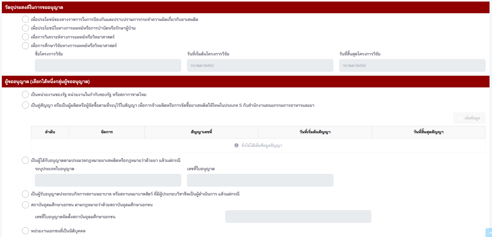
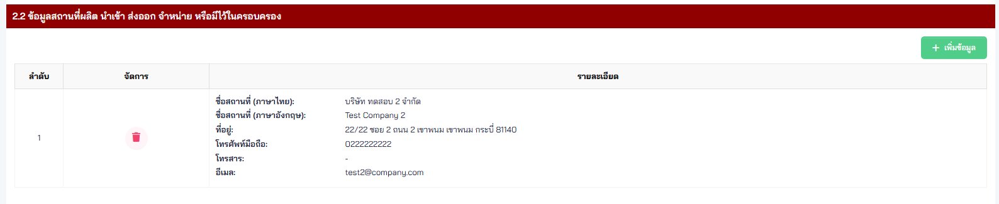
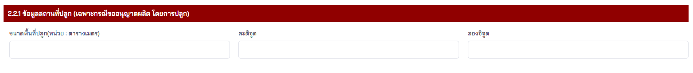
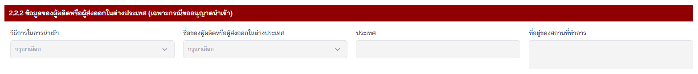

## คำขอรับใบอนุญาต คำขอต่ออายุใบอนุญาต คำขอรับใบแทนใบอนุญาตผลิต นำเข้าส่งออก จำหน่าย หรือมีไว้ในครอบครองยาเสพติดให้โทษในประเภท ๕ ที่มิใช่สารสกัดจากทุกส่วนของพืชกัญชาหรือกัญชง [ยส.5-1]

---

#### (dbo.MasterRequisitionType Id = 20)
### Links

- [Figma Group Doc](https://www.figma.com/design/0YEqdcSpC2hZKulzEl54LH/-FDA68--Group-Doc)
- [Data Dic - Master Data real](https://docs.google.com/spreadsheets/d/1WpRC41tmqyOc8zVaxTVuwLxGgmi7inZATo8_LcCTXgE)
- [FDA68_สรุปวัตถุประสงค์ ผู้อนุญาต และผู้อนุมัติ ในใบคำขอ](https://docs.google.com/spreadsheets/d/1B366oiRjTmnY7Jvt0lpH9ORXbmOgJaLXcYDHmDST8Qo)

- [Figma ยส.5](https://www.figma.com/board/EWDQbpKKq9Rh4AkENTVOQG/%E0%B8%A2%E0%B8%AA5---%E0%B9%84%E0%B8%A1%E0%B9%88%E0%B9%84%E0%B8%94%E0%B9%89%E0%B8%95%E0%B8%B2%E0%B8%A1%E0%B9%81%E0%B8%9C%E0%B8%99?t=kvjSziK881AvYaUS-6)

## ❗ เงื่อนไข ยส.5    
### ประเภทการขอ (ยส.5)

| ลำดับ | ประเภทการขอ | LicenseGetById |
|:---:|---|:---:|
| 1 | ขอใหม่ |  |
| 2 | ขอแก้ไข | ✅ |
| 3 | ขอต่ออายุ | ✅ |
| 4 | ขอยกเลิก | ✅ |
| 5 | ขอใบแทน | ✅ |

## 🔷 Field Condition

### Step 1 (ยส.5-1)

| ลำดับ | Label | Table.Field | Condition | Remark |
|:---:|---|---|---|---|
| 1 | การดำเนินการ | `Requisition`.`OperationTypeId` |  | `MasterOperationType`.`Id` |
| 1 | การดำเนินการ | `Requisition`.`OperationType` |  | ประเภทการดำเนินการ (00 - อื่น ๆ, 01 - ผลิต, 02 - ผลิตส่งออก, 03 - นำเข้า,   04 - ส่งออก, 05 - จำหน่าย, 06 - จำหน่ายขายส่ง, 07 - ครอบครอง) |
| 2 | ชนิดของยาเสพติดให้โทษในประเภท 5 | `Requisition`.`NarcoticPlantId` |  | ประเภทของพืชเสพติด อ้างอิง `MasterNarcoticPlantType`.`Id`   ส่ง 1 - ฝิ่น   ส่ง 2 - เห็ดขี้ควาย   ส่ง 99 - อื่นๆ |
| 3 | ชนิดของพืชเสพติดประเภท 5 กรณีเป็นอื่นๆ | `Requisition`.`NarcoticPlantRemark` |  |  |
| 4 | วัตถุประสงค์ในการขออนุญาต |  |  |  |
| 5 | ผู้ขออนุญาต |  |  |  |

### 1.1 ข้อมูลผู้ขอรับใบอนุญาต (ยส.5-1)

### 1.2 ข้อมูลผู้ดำเนินการใบอนุญาต

| ลำดับ | Label | Table.Field | Condition | Remark |
|:---:|---|---|---|---|
| 0 | - | `RequisitionParticipant`.`ParticipantTypeId` | ส่ง 2 - ผู้ดำเนินการ ตาม `MasterParticipantType`.`Id` | |
| 1 | คำนำหน้านาม | `RequisitionParticipant`.`PrefixId` | | |
| 2 | ชื่อจริง | `RequisitionParticipant`.`FirstName` | | |
| 3 | นามสกุล | `RequisitionParticipant`.`LastName` | | |
| 4 | อายุ | `RequisitionParticipant`.`Age` | | |
| 5 | วัน เดือน ปี เกิด | `RequisitionParticipant`.`BirthDate` | | |
| 6 | สัญชาติ | `RequisitionParticipant`.`NationalityId` | | |
| 7 | เลขประจำตัวประชาชน | `RequisitionParticipant`.`IdentificationNo` | เก็บเฉพาะเลขบัตรประชาชนเท่านั้น | - Cannot over 13 digits   - Need separator `(0-0000-00000-00-0)` |
| 8 | หนังสือเดินทางเลขที่ | `RequisitionParticipant`.`NumberOtherIdcard` | (กอง ต.) แต่ OtherIdCard ไม่ต้องส่งอะไรไป | |
| 9 | ใบอนุญาตทำงานเลขที่ (กรณีชาวต่างชาติ) | `RequisitionParticipant`.`WorkPermit` | | |
| 10 | เลขที่ | `RequisitionParticipantAddress`.`HouseNo` | - Can type text เพื่อให้รองรับ อาคาร ชั้น ห้อง | |
| 11 | เลขการมอบอำนาจ | `RequisitionParticipant`.`PowerOfAttorneyNo` | | |
| 12 | เลขรหัสประจำบ้านตามทะเบียนบ้าน (ตามทะเบียนราษฎร์ กระทรวงมหาดไทย) | `RequisitionParticipantAddress`.`HouseCode` | - Cannot over 11 digits | - Need separator `(0000-000000-0)` |
| 13 | หมู่ที่ | `RequisitionParticipantAddress`.`VillageNo` | | |
| 14 | ตรอก/ซอย | `RequisitionParticipantAddress`.`Lane` | | |
| 15 | ถนน | `RequisitionParticipantAddress`.`Street` | | |
| 16 | จังหวัด | `RequisitionParticipantAddress`.`ProvinceId` | | |
| 17 | อำเภอ/เขต | `RequisitionParticipantAddress`.`AmphurId` | | |
| 18 | ตำบล/แขวง | `RequisitionParticipantAddress`.`TambonId` | | |
| 19 | รหัสไปรษณีย์ | `RequisitionParticipantAddress`.`Postcode` | | |
| 20 | โทรศัพท์มือถือ | `RequisitionParticipantAddress`.`Phone` | | |
| 21 | โทรสาร | `RequisitionParticipantAddress`.`Fax` | | |
| 22 | อีเมล | `RequisitionParticipantAddress`.`Email` | | |

### 2.2 ข้อมูลสถานที่ผลิต นำเข้า ส่งออก จำหน่าย หรือมีไว้ในครอบครอง

| ลำดับ | Label | Table.Field | Condition | Remark |
|:---:|---|---|---|---|
| 0 | - | `RequisitionParticipant`.`ParticipantTypeId` | ส่ง 3 - สถานที่ขออนุญาต ตาม `MasterParticipantType`.`Id` | |
| 1 | ชื่อสถานที่ | `RequisitionParticipant`.`LocationName` | | |
| 2 | เลขที่ | `RequisitionParticipantAddress`.`HouseNo` | - Can type text เพื่อให้รองรับ อาคาร ชั้น ห้อง | |
| 3 | เลขรหัสประจำบ้านตามทะเบียนบ้าน (ตามทะเบียนราษฎร์ กระทรวงมหาดไทย) | `RequisitionParticipantAddress`.`HouseCode` | - Cannot over 11 digits | - Need separator `(0000-000000-0)` |
| 4 | หมู่ที่ | `RequisitionParticipantAddress`.`VillageNo` | | |
| 5 | ตรอก/ซอย | `RequisitionParticipantAddress`.`Lane` | | |
| 6 | ถนน | `RequisitionParticipantAddress`.`Street` | | |
| 7 | จังหวัด | `RequisitionParticipantAddress`.`ProvinceId` | | |
| 8 | อำเภอ/เขต | `RequisitionParticipantAddress`.`AmphurId` | | |
| 9 | ตำบล/แขวง | `RequisitionParticipantAddress`.`TambonId` | | |
| 10 | รหัสไปรษณีย์ | `RequisitionParticipantAddress`.`Postcode` | | |
| 11 | โทรศัพท์มือถือ | `RequisitionParticipantAddress`.`Phone` | | |
| 12 | โทรสาร | `RequisitionParticipantAddress`.`Fax` | | |
| 13 | อีเมล | `RequisitionParticipantAddress`.`Email` | | |

#### 2.2.1 ข้อมูลสถานที่ปลูก (เฉพาะกรณีขออนุญาตผลิต โดยการปลูก)
*Show on (เฉพาะกรณีขออนุญาตผลิต โดยการปลูก) only*

| Label | Condition | Remark |
|---|---|---|
| ขนาดพื้นที่ปลูก (หน่วย : ตารางเมตร) | - Decimal with 4 digits (100.5432) |  |
| ละติจูด |- Decimal with 6 digits (100.654321) |  |
| ลองจิจูด | - Decimal with 6 digits (100.654321) |  |

#### 2.2.2 ข้อมูลของผู้ผลิตหรือผู้ส่งออกในต่างประเทศ (เฉพาะกรณีขออนุญาตนำเข้า)
*Show on (เฉพาะกรณีขออนุญาตนำเข้า) only*

## 📄 ส่วนแบบ Print from PDF คำขอ

