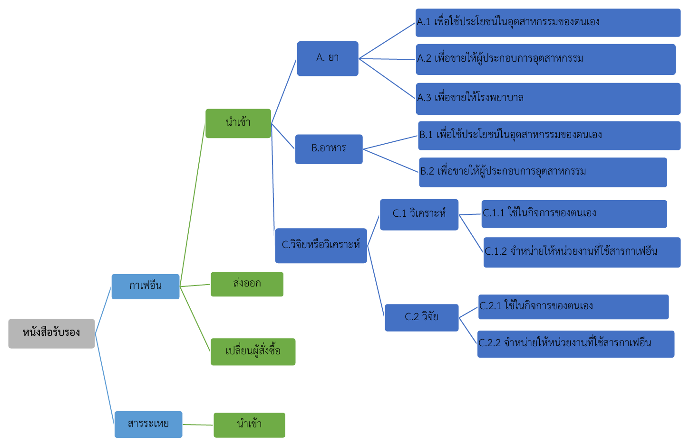
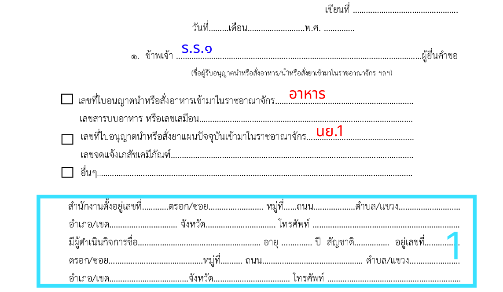
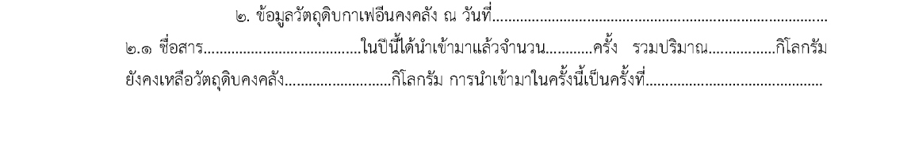
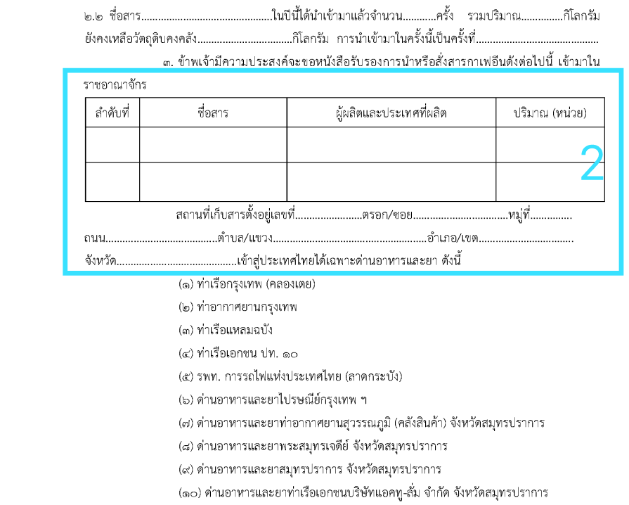

## คำขอหนังสือรับรองในการนำหรือสั่งสารกาเฟอีน (caffeine) เข้ามาในราชอาณาจักรตามประกาศการะทรวงพาณิชย์ซึ่งออกตามพระราชบัญญัติการส่งออกไปนอกและการนำเข้ามาในราชอาณาจักรซึ่งสินค้า พ.ศ. ๒๕๒๒ [รร.1]
---

## (dbo.MasterRequisitionType Id = 21)
### Links

- [Figma Group Doc](https://www.figma.com/design/0YEqdcSpC2hZKulzEl54LH/-FDA68--Group-Doc)
- [Data Dic - Master Data real](https://docs.google.com/spreadsheets/d/1WpRC41tmqyOc8zVaxTVuwLxGgmi7inZATo8_LcCTXgE)
- [FDA68_สรุปวัตถุประสงค์ ผู้อนุญาต และผู้อนุมัติ ในใบคำขอ](https://docs.google.com/spreadsheets/d/1B366oiRjTmnY7Jvt0lpH9ORXbmOgJaLXcYDHmDST8Qo)
- [กาเฟอีน ใบอนุญาต](https://drive.google.com/drive/u/1/folders/1dbYUDlUx0aj62PgCXdX1xmSx9-n9yEqb)
- [0805_เช้า_คาเฟอีน](https://drive.google.com/drive/u/1/folders/1uXXIs5kYpTz8Hf87K30mYiky2Tyqdxqa)
- [4.18_กาเฟอีน](https://docs.google.com/spreadsheets/d/1PKGw-iSZ9UJVXOrG8POJR3BIkxjnRDIG/edit?gid=471906968#gid=471906968)
- [ส่งไฟล์_SS](https://drive.google.com/drive/u/1/folders/1MBhdkp39h6eJoDIuIvbAnHjFcAN3BJTW)
- [ส่งไฟล์_SS-เอกสารรายงานทั้งหมด_200169-ตัวอย่างรายงานจากอย.](https://drive.google.com/drive/folders/1M8B9Y9OGr7jEQrMdSfUB_rQjz1NDGrlQ)

```
คำขอกาเฟอีน
สารของกาเฟอีน
ใบอนุญาต
```



## ตาราง

### dbo.MasterNarcoticCaffeine สารกาเฟอีน

| ลำดับ | Column Name | Data Type | Allow Nulls | Field Description |
|---|---|---|:---:|---|
| 1 | Id | int | N | รหัสอ้างอิงที่ใช้ในระบบ | Id |
| 2 | CreateBy | int | N | ผู้สร้าง อ้างอิง `SystemUser`.`Id` | CreateBy |
| 3 | CreateOn | datetime | N | วันที่สร้าง | CreateOn |
| 4 | UpdateBy | int | Y | ผู้แก้ไข อ้างอิง `SystemUser`.`Id` | UpdateBy |
| 5 | UpdateOn | datetime | Y | วันที่แก้ไข | UpdateOn |
| 6 | NarcoticCaffeineNameEN | nvarchar(500) | Y | ชื่อสารกาเฟอีนภาษาอังกฤษ |
| 7 | NarcoticCaffeineNameTH | nvarchar(500) | Y | ชื่อสารกาเฟอีนภาษาไทย |
| 8 | NarcoticTypeId | int | Y |  |
| 9 | Active | bit | Y |  |

#### ตัวอย่าง Data

| Id | CreateBy | CreateOn | UpdateBy | UpdateOn | NarcoticCaffeineNameEN | NarcoticCaffeineNameTH | NarcoticTypeId | Active |
|---|---|---|---|---|---|---|---|---|
| 1 | 1 | 2026-04-06 15:00:00.000 | NULL | NULL | Caffeine | กาเฟอีน | 1 | 1 |
| 2 | 1 | 2026-04-06 15:00:00.000 | NULL | NULL | Caffeine Anhydrous | กาเฟอีน แอนไฮดรัส | 1 | 1 |
| 3 | 1 | 2026-04-06 15:00:00.000 | NULL | NULL | Methyltheobromine | เมททิลทีโอโบรมีน | 1 | 1 |

## ❗ เงื่อนไขรร.1    
## 🔷 Field Condition





