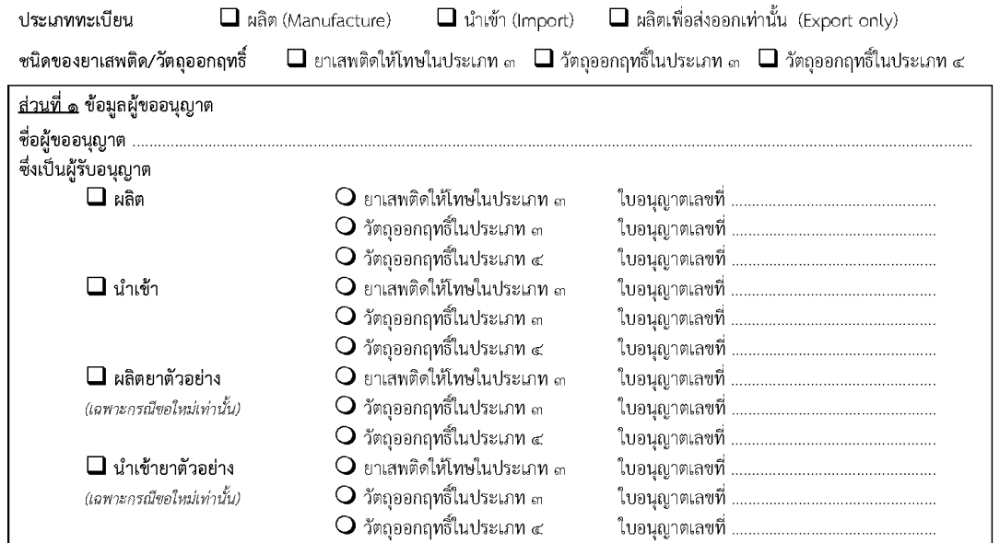
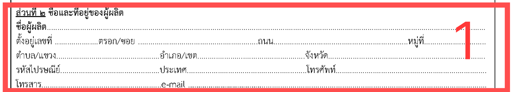
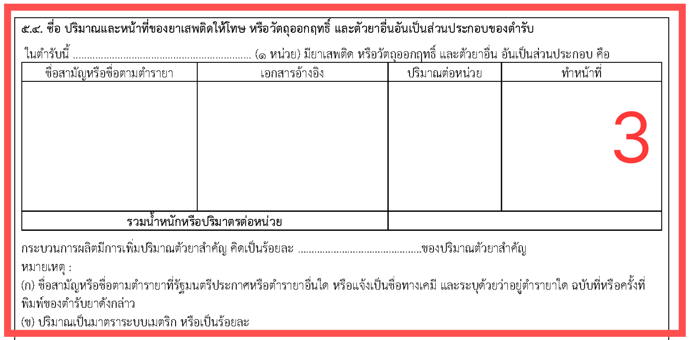
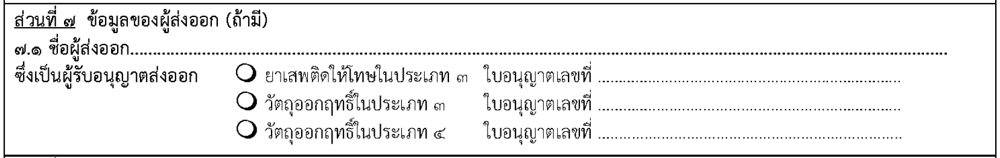
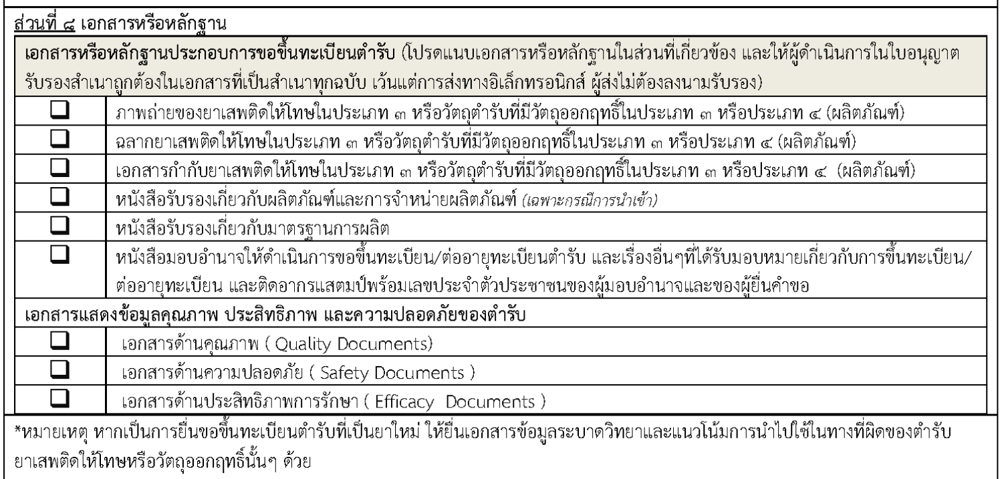
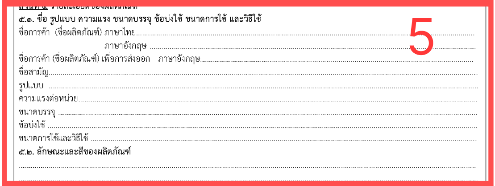
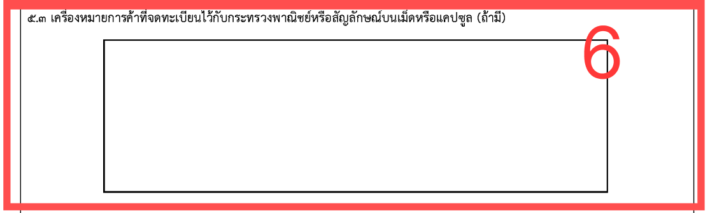

## คำขอขึ้นทะเบียนตำรับ / ใบแทนใบสำคัญการขึ้นทะเบียนตำรับ / ต่ออายุทะเบียนตำรับ ยาเสพติดให้โทษประเภท 3 หรือตำรับวัตถุออกฤทธิ์ในประเภท 3 หรือประภท 4 [ท.บ.1]
---

## (dbo.MasterRequisitionType Id = 49)
### Links

- [Figma Group Doc](https://www.figma.com/design/0YEqdcSpC2hZKulzEl54LH/-FDA68--Group-Doc)
- [Data Dic - Master Data real](https://docs.google.com/spreadsheets/d/1WpRC41tmqyOc8zVaxTVuwLxGgmi7inZATo8_LcCTXgE)

## Field Condition

