## คำขอรับใบอนุญาต นำเข้าส่งออก เฉพาะคราว (IMP/EXP)
---

#### (dbo.MasterRequisitionType Id = 25-46)
### Links

- [Figma Group Doc](https://www.figma.com/design/0YEqdcSpC2hZKulzEl54LH/-FDA68--Group-Doc)
- [Data Dic - Master Data real](https://docs.google.com/spreadsheets/d/1WpRC41tmqyOc8zVaxTVuwLxGgmi7inZATo8_LcCTXgE)
- [FDA68_สรุปวัตถุประสงค์ ผู้อนุญาต และผู้อนุมัติ ในใบคำขอ](https://docs.google.com/spreadsheets/d/1B366oiRjTmnY7Jvt0lpH9ORXbmOgJaLXcYDHmDST8Qo)

- [Figma เฉพาะคราว](https://www.figma.com/board/8VA6aeLRsleXZW44d0SbsQ/%E0%B9%80%E0%B8%89%E0%B8%9E%E0%B8%B2%E0%B8%B0%E0%B8%84%E0%B8%A3%E0%B8%B2%E0%B8%A7-%E0%B8%AD%E0%B8%B7%E0%B9%88%E0%B8%99%E0%B9%86)

Google sheets
- [0814_เช้า_เฉพาะคราว](https://drive.google.com/drive/u/1/folders/1-fokyPQafi1DZUz0fhKw9hQdhPOYRkUc)
- [ปี2568 ใบอนุญาตเฉพาะคราว_นำเข้า](https://docs.google.com/spreadsheets/d/1hsVTwo9gI1xk8cmZ979OnQ61cjUX9-j4)
- [ปี2568 ใบอนุญาตเฉพาะคราว_ส่งออก](https://docs.google.com/spreadsheets/d/18vAB_xg1Pc-C6s9N1GJ0enrd2k2lw8Y5)
- [[FDA68] นำเข้า-ส่งออก เฉพาะคราว](https://docs.google.com/spreadsheets/d/1EEyq1PUJTJK2qtROfoRSZogiT5DKpjLyWeONZb2c9ws)
- [คำนวนสูตร](https://docs.google.com/spreadsheets/d/1Y2ASf2KcLwmI0fgnfOaGgkTIYQm18GzMcrpJMt6Vobc/edit?gid=176943539#gid=176943539)

#### Screen
- [XD 4.14_เฉพาะคราว ยส วจ_5_11](https://drive.google.com/drive/u/2/folders/1INdaxWNeOMnv9bv0R42WvYN9UayTdAGr)

### สรุปจาก ไฟล์ db_design.html (07-04-2026) [db_design.html](db_design_07-04-2026.html)

1. ใช้ตาม Option A
2. ไม่ต้องเพิ่ม Column

### ประเภท
#### 1️⃣ ประเภท เฉพาะคราว (นำเข้าเฉพาะคราว/EXP ส่งออกเฉพาะคราว)

| ลำดับ | MasterRequisitionType.Id | ประเภท | ชื่อประเภท | นำเข้า | ส่งออก |
|:---:|:---:|:---:|---|:---:|:---:|
| 1  | 25 | เฉพาะคราว | IMP-N1-1 นำเข้า เฉพาะคราว ยส.1 | ✅ |  |
| 2  | 27 | เฉพาะคราว | IMP-N2-1 นำเข้า เฉพาะคราว ยส.2 | ✅ |  |
| 3  | 29 | เฉพาะคราว | IMP-N3-1 นำเข้า เฉพาะคราว ยส.3 | ✅ |  |
| 4  | 31 | เฉพาะคราว | IMP-N4-1 นำเข้า เฉพาะคราว ยส.4 | ✅ |  |
| 5  | 33 | เฉพาะคราว | IMP-N5-1 นำเข้า เฉพาะคราว ยส.5 | ✅ |  |
| 6  | 37 | เฉพาะคราว | IMP-P1-1 นำเข้า เฉพาะคราว วจ.1 | ✅ |  |
| 7  | 39 | เฉพาะคราว | IMP-P2-1 นำเข้า เฉพาะคราว วจ.2 | ✅ |  |
| 8  | 41/43 | เฉพาะคราว | IMP-P3/4-1 นำเข้า เฉพาะคราว วจ.3/4 | ✅ |  |
| 9  | 26 | เฉพาะคราว | EXP-N1-1 ส่งออก เฉพาะคราว ยส.1 |  | ✅ |
| 10 | 28 | เฉพาะคราว | EXP-N2-1 ส่งออก เฉพาะคราว ยส.2 |  | ✅ |
| 11 | 30 | เฉพาะคราว | EXP-N3-1 ส่งออก เฉพาะคราว ยส.3 |  | ✅ |
| 12 | 32 | เฉพาะคราว | EXP-N4-1 ส่งออก เฉพาะคราว ยส.4 |  | ✅ |
| 13 | 34 | เฉพาะคราว | EXP-N5-1 ส่งออก เฉพาะคราว ยส.5 |  | ✅ |
| 14 | 38 | เฉพาะคราว | EXP-P1-1 ส่งออก เฉพาะคราว วจ.1 |  | ✅ |
| 15 | 40 | เฉพาะคราว | EXP-P2-1 ส่งออก เฉพาะคราว วจ.2 |  | ✅ |
| 16 | 42/44 | เฉพาะคราว | EXP-P3/4-1 ส่งออก เฉพาะคราว วจ.3/4 |  | ✅ |

#### 2️⃣ ประเภท พิเศษ เฉพาะคราว

| ลำดับ | MasterRequisitionType.Id | ประเภท | ชื่อประเภท | นำเข้า | ส่งออก |
|:---:|:---:|:---:|---|:---:|:---:|
| 17 | 45 | พิเศษเฉพาะคราว | EXP.SP-1 พิเศษเฉพาะคราว ส่งออก วจ. |  | ✅ |

#### 3️⃣ ประเภท แต่ละครั้ง (ก็คือ เฉพาะคราว)

| ลำดับ | MasterRequisitionType.Id | ประเภท | ชื่อประเภท | นำเข้า | ส่งออก |
|:---:|:---:|:---:|---|:---:|:---:|
| 18 | 35 | แต่ละครั้ง | NAR.5 นำเข้า ส่งออก ซึ่ง**กัญชา** แต่ละครั้ง | ✅ | ✅ |
| 19 | 36 | แต่ละครั้ง | NAR.5(HEMP) นำเข้า ส่งออก ซึ่ง**กัญชง** แต่ละครั้ง | ✅ | ✅ |

#### 4️⃣ ประเภท นำผ่าน

| ลำดับ | MasterRequisitionType.Id | ประเภท | ชื่อประเภท | นำเข้า | ส่งออก |
|:---:|:---:|:---:|---|:---:|:---:|
| 20 | 46 | นำผ่าน | นผ.จ.1 คำขอรับใบอนุญาต / ใบแทนใบอนุญาต / แก้ไขรายการในใบอนุญาตนำผ่านวัตถุออกฤทธิ์ ***ใช้กับ วจ. 1 2 3 4*** |  |  |

## List field
### IMP นำเข้าเฉพาะคราว

| ลำดับ / รายการ | รายละเอียด | IMP-N1 นำเข้าเฉพาะคราว ยส.1 | IMP-N2 นำเข้าเฉพาะคราว ยส.2 | IMP-N3 นำเข้าเฉพาะคราว ยส.3 | IMP-N4 นำเข้าเฉพาะคราว ยส.4 | IMP-N5 นำเข้าเฉพาะคราว ยส.5 | IMP-P1 วจ.1 | IMP-P2 วจ.2 | IMP-P3/4 วจ.3 หรือ 4 |
|---|---|---|---|---|---|---|---|---|---|
| ส่วนที่ ๑ ข้อมูลผู้ขออนุญาต | | | | | | | | | |
| ๑.๑ | ชื่อผู้ขออนุญาต | ✅ | ✅ | ✅ | ✅ | ✅ | ✅ | ✅ | ✅ |
| | เลขทะเบียนนิติบุคคล | ✅ | ✅ | ✅ | ✅ | ✅ | ✅ | ✅ | ✅ |
| | ซึ่งเป็นผู้รับอนุญาตนำเข้ายาเสพติดให้โทษ ใบอนุญาตเลขที่ | ✅ | ✅ | ✅ | ✅ | ✅ | ✅ | ✅ | ✅ |
| | วัตถุประสงค์ในการนำเข้า | | ✅ | | | ✅ | | ✅ | |
| | ใบสำคัญการขึ้นทะเบียนตำรับเลขที่ | | | ✅ | | | ✅ | | |
| | ซึ่งเป็นผู้รับอนุญาตนำเข้าวัตถุออกฤทธิ์ (เลือกได้ ๑ ประเภท) ประเภท ๓ หรือประเภท ๔ ใบอนุญาตเลขที่ | | | | | | | | ✅ |
| | ผู้ได้รับการยกเว้นไม่ต้องขออนุญาตตามมาตรา ๓๒ | | | | | | | | ✅ |
| | กรณีนำเข้าวัตถุตำรับ ใบสำคัญการขึ้นทะเบียนวัตถุตำรับที่มีวัตถุออกฤทธิ์ประเภท ๓ หรือ ๔ เลขที่ | | | | | | | | ✅ |
| ๑.๒ | เหตุผลในการขออนุญาตครั้งนี้ | ✅ | ✅ | ✅ | ✅ | ✅ | ✅ | ✅ | ✅ |

| ลำดับ / รายการ | รายละเอียด | IMP-N1 นำเข้าเฉพาะคราว ยส.1 | IMP-N2 นำเข้าเฉพาะคราว ยส.2 | IMP-N3 นำเข้าเฉพาะคราว ยส.3 | IMP-N4 นำเข้าเฉพาะคราว ยส.4 | IMP-N5 นำเข้าเฉพาะคราว ยส.5 | IMP-P1 วจ.1 | IMP-P2 วจ.2 | IMP-P3/4 วจ.3 หรือ 4 |
|---|---|---|---|---|---|---|---|---|---|
| ส่วนที่ ๒ ข้อมูลการนำเข้า (โปรดกรอกข้อมูลเป็นภาษาอังกฤษ) | | | | | | | | | |
| ๒.๑ | ชื่อและที่อยู่ของผู้นำเข้า (Name and address of Importer) | ✅ | ✅ | ✅ | ✅ | ✅ | ✅ | ✅ | ✅ |
| ๒.๒ | ชื่อและที่อยู่ของผู้ส่งออก (Name and address of Exporter) | ✅ | ✅ | ✅ | ✅ | ✅ | ✅ | ✅ | ✅ |
| ๒.๓ | ชื่อและที่อยู่ของผู้ผลิต (Name and address of Manufacturer) | ✅ | ✅ | ✅ | ✅ | ✅ | ✅ | ✅ | ✅ |
| ๒.๔ | ช่องทางการนำเข้า (Transported by: Air freight / Sea freight) | ✅ | ✅ | ✅ | ✅ | ✅ | ✅ | ✅ | ✅ |
| ๒.๕ | ระบุด่านตรวจขาเข้า (Port of Entry) | ✅ | ✅ | ✅ | ✅ | ✅ | ✅ | ✅ | ✅ |
| ๒.๖ | ยาเสพติดให้โทษที่ขอนำเข้า (Substances to be imported) | ✅ | ✅ | ✅ | ✅ | ✅ | ✅ | ✅ | ✅ |

| ลำดับ / รายการ | รายละเอียด | IMP-N1 นำเข้าเฉพาะคราว ยส.1 | IMP-N2 นำเข้าเฉพาะคราว ยส.2 | IMP-N3 นำเข้าเฉพาะคราว ยส.3 | IMP-N4 นำเข้าเฉพาะคราว ยส.4 | IMP-N5 นำเข้าเฉพาะคราว ยส.5 | IMP-P1 วจ.1 | IMP-P2 วจ.2 | IMP-P3/4 วจ.3 หรือ 4 |
|---|---|---|---|---|---|---|---|---|---|
| ส่วนที่ ๓ เอกสารหลักฐาน | | | | | | | | | |
| ๑ | การบริหารยาเสพติดให้โทษในประเภท ๑ | | ✅ | | | | | | |
| | ใบวิเคราะห์คุณภาพ COA (กรณีนำเข้าสารมาตรฐาน) | | ✅ | | | | | | |
| ๒ | ที่ใช้ในทางการแพทย์ของประเทศ | | ✅ | | | | | | |
| | ใบวิเคราะห์คุณภาพ COA หรือข้อมูลผลิตภัณฑ์ | | ✅ | | | | | | |
| ๓ | การป้องกันและปราบปรามการกระทำความผิดเกี่ยวกับยาเสพติด | | ✅ | | | | | | |
| | หนังสือแจ้งความประสงค์ในการนำเข้าจากหัวหน้าส่วนราชการซึ่งเป็นนิติบุคคล และเอกสารอื่นที่เกี่ยวข้อง | | ✅ | | | | | | |
| ๔ | การผลิตเพื่อส่งออก | | ✅ | | | | | | |
| | ใบวิเคราะห์คุณภาพ COA ของข้อมูลวัตถุดิบหรือสารมาตรฐานที่เกี่ยวข้อง | | ✅ | | | | | | |

| ลำดับ / รายการ | รายละเอียด | IMP-N1 นำเข้าเฉพาะคราว ยส.1 | IMP-N2 นำเข้าเฉพาะคราว ยส.2 | IMP-N3 นำเข้าเฉพาะคราว ยส.3 | IMP-N4 นำเข้าเฉพาะคราว ยส.4 | IMP-N5 นำเข้าเฉพาะคราว ยส.5 | IMP-P1 วจ.1 | IMP-P2 วจ.2 | IMP-P3/4 วจ.3 หรือ 4 |
|---|---|---|---|---|---|---|---|---|---|
| ส่วนที่ ๔ การรับรองตนเองและการยินยอมการเปิดเผยข้อมูลของผู้ขออนุญาต หรือผู้ที่ได้รับมอบหมายให้ดำเนินการ | | | | | | | | | |
| | | ✅ | ✅ | ✅ | ✅ | ✅ | ✅ | ✅ | ✅ |

### EXP ส่งออกเฉพาะคราว

| ลำดับ / รายการ | รายละเอียด | EXP-N1 ส่งออกเฉพาะคราว ยส.1 | EXP-N2 ส่งออกเฉพาะคราว ยส.2 | EXP-N3 ส่งออกเฉพาะคราว ยส.3 | EXP-N4 ส่งออกเฉพาะคราว ยส.4 | EXP-N5 ส่งออกเฉพาะคราว ยส.5 | EXP-P1 วจ.1 | EXP-P2 วจ.2 | EXP-P3/4 วจ.3 หรือ 4 |
|---|---|---|---|---|---|---|---|---|---|
| ส่วนที่ ๑ ข้อมูลผู้ขออนุญาต | | | | | | | | | |
| ๑.๑ | ชื่อผู้ขออนุญาต | ✅ | ✅ | ✅ | ✅ | ✅ | ✅ | ✅ | ✅ |
| | เลขทะเบียนนิติบุคคล | ✅ | ✅ | ✅ | ✅ | ✅ | ✅ | ✅ | ✅ |
| | ซึ่งเป็นผู้รับอนุญาตส่งออกยาเสพติดให้โทษ ใบอนุญาตเลขที่ | ✅ | ✅ | ✅ | ✅ | ✅ | ✅ | ✅ | ✅ |
| | วัตถุประสงค์ในการส่งออก | | ✅ | | | ✅ | | ✅ | |
| | ใบสำคัญการขึ้นทะเบียนตำรับเลขที่ | | | ✅ | | | ✅ | | |
| | ซึ่งเป็นผู้รับอนุญาตส่งออกวัตถุออกฤทธิ์ (เลือกได้ ๑ ประเภท) ประเภท ๓ หรือประเภท ๔ ใบอนุญาตเลขที่ | | | | | | | | ✅ |
| | ผู้ได้รับการยกเว้นไม่ต้องขออนุญาตตามมาตรา ๓๒ | | | | | | | | ✅ |
| | กรณีส่งออกวัตถุตำรับ ใบสำคัญการขึ้นทะเบียนวัตถุตำรับที่มีวัตถุออกฤทธิ์ประเภท ๓ หรือ ๔ เลขที่ | | | | | | | | ✅ |
| ๑.๒ | เหตุผลในการขออนุญาตครั้งนี้ | ✅ | ✅ | ✅ | ✅ | ✅ | ✅ | ✅ | ✅ |

| ลำดับ / รายการ | รายละเอียด | EXP-N1 ส่งออกเฉพาะคราว ยส.1 | EXP-N2 ส่งออกเฉพาะคราว ยส.2 | EXP-N3 ส่งออกเฉพาะคราว ยส.3 | EXP-N4 ส่งออกเฉพาะคราว ยส.4 | EXP-N5 ส่งออกเฉพาะคราว ยส.5 | EXP-P1 วจ.1 | EXP-P2 วจ.2 | EXP-P3/4 วจ.3 หรือ 4 |
|---|---|---|---|---|---|---|---|---|---|
| ส่วนที่ ๒ ข้อมูลการส่งออก (โปรดกรอกข้อมูลเป็นภาษาอังกฤษ) | | | | | | | | | |
| ๒.๑ | ชื่อและที่อยู่ของผู้ส่งออก (Name and address of Exporter) | ✅ | ✅ | ✅ | ✅ | ✅ | ✅ | ✅ | ✅ |
| ๒.๒ | ชื่อและที่อยู่ของผู้นำเข้า (Name and address of Importer) | ✅ | ✅ | ✅ | ✅ | ✅ | ✅ | ✅ | ✅ |
| ๒.๓ | ชื่อและที่อยู่ของผู้ผลิต (Name and address of Manufacturer) | ✅ | ✅ | ✅ | ✅ | ✅ | ✅ | ✅ | ✅ |
| ๒.๔ | ช่องทางการส่งออก (Transported by: Air freight / Sea freight) | ✅ | ✅ | ✅ | ✅ | ✅ | ✅ | ✅ | ✅ |
| ๒.๕ | ระบุด่านตรวจขาออก (Port of Exit) | ✅ | ✅ | ✅ | ✅ | ✅ | ✅ | ✅ | ✅ |
| ๒.๖ | ยาเสพติดให้โทษที่ขอส่งออก (Substances to be exported) | ✅ | ✅ | ✅ | ✅ | ✅ | ✅ | ✅ | ✅ |

| ลำดับ / รายการ | รายละเอียด | EXP-N1 ส่งออกเฉพาะคราว ยส.1 | EXP-N2 ส่งออกเฉพาะคราว ยส.2 | EXP-N3 ส่งออกเฉพาะคราว ยส.3 | EXP-N4 ส่งออกเฉพาะคราว ยส.4 | EXP-N5 ส่งออกเฉพาะคราว ยส.5 | EXP-P1 วจ.1 | EXP-P2 วจ.2 | EXP-P3/4 วจ.3 หรือ 4 |
|---|---|---|---|---|---|---|---|---|---|
| ส่วนที่ ๓ เอกสารหลักฐาน | | | | | | | | | |
| ๑ | การบริหารยาเสพติดให้โทษในประเภท ๑ | | ✅ | | | | | | |
| | ใบอนุญาตนำเข้าหรือหนังสือรับรองจากประเทศปลายทาง | | ✅ | | | | | | |
| | ใบวิเคราะห์คุณภาพ COA หรือข้อมูลผลิตภัณฑ์ | | ✅ | | | | | | |
| ๒ | การวิเคราะห์หรือการศึกษาวิจัยทางการแพทย์หรือวิทยาศาสตร์ | | | | | | | | |
| | ใบอนุญาตนำเข้าหรือหนังสือรับรองจากประเทศปลายทาง | | | | | | | | |
| | ใบวิเคราะห์คุณภาพ COA หรือข้อมูลผลิตภัณฑ์ | | | | | | | | |
| ๓ | การป้องกันและปราบปรามการกระทำความผิดเกี่ยวกับยาเสพติด | | | | | | | | |
| | หนังสือจากหน่วยงานภาครัฐของประเทศปลายทางที่แสดงความจำนง | | | | | | | | |
| | หนังสือแจ้งความประสงค์ในการส่งออกจากหัวหน้าส่วนราชการ | | | | | | | | |
| ๔ | การผลิตเพื่อส่งออก | | | | | | | | |
| | ใบอนุญาตนำเข้าจากประเทศปลายทาง | | | | | | | | |
| | ใบวิเคราะห์คุณภาพ COA ของวัตถุดิบหรือสารมาตรฐานที่เกี่ยวข้อง | | | | | | | | |

| ลำดับ / รายการ | รายละเอียด | EXP-N1 ส่งออกเฉพาะคราว ยส.1 | EXP-N2 ส่งออกเฉพาะคราว ยส.2 | EXP-N3 ส่งออกเฉพาะคราว ยส.3 | EXP-N4 ส่งออกเฉพาะคราว ยส.4 | EXP-N5 ส่งออกเฉพาะคราว ยส.5 | EXP-P1 วจ.1 | EXP-P2 วจ.2 | EXP-P3/4 วจ.3 หรือ 4 |
|---|---|---|---|---|---|---|---|---|---|
| ส่วนที่ ๔ การรับรองตนเองและการยินยอมการเปิดเผยข้อมูลของผู้ขออนุญาต หรือผู้ที่ได้รับมอบหมายให้ดำเนินการ | | | | | | | | | |
| | | ✅ | ✅ | ✅ | ✅ | ✅ | ✅ | ✅ | ✅ |

## 🔷 Field Condition
### ส่วนที่ ๑ ข้อมูลผู้ขออนุญาต
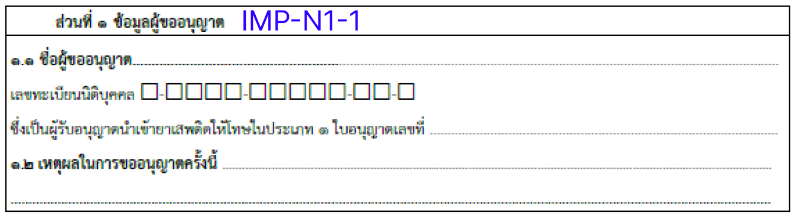
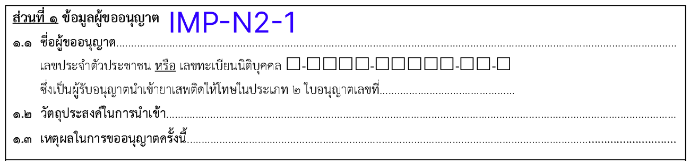
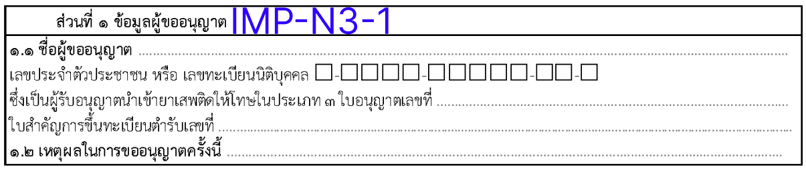
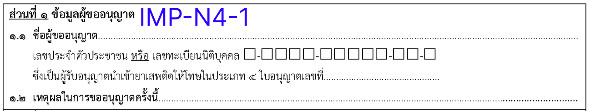
<!-- 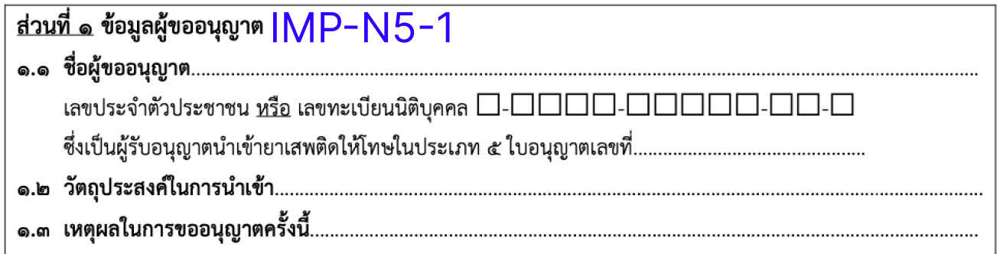 -->
<!-- 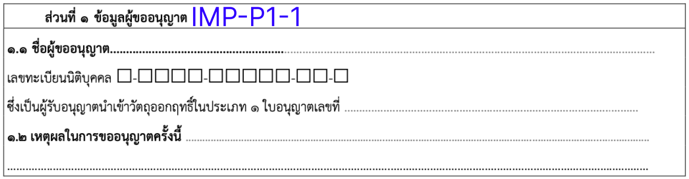 -->
<!-- 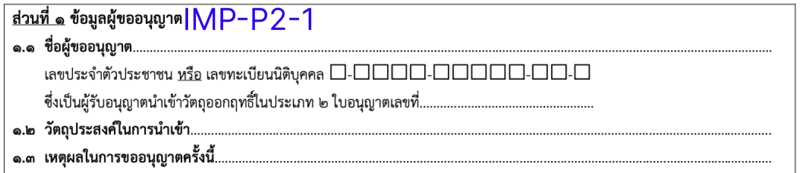 -->
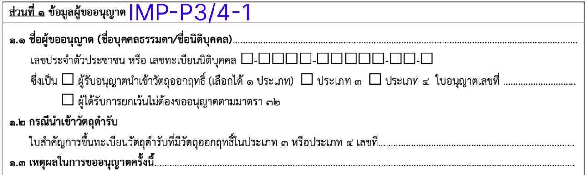
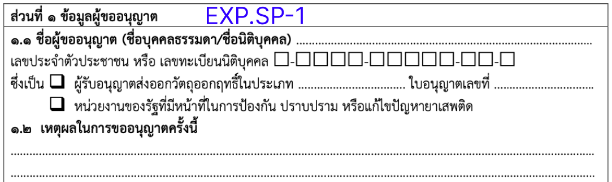

<!-- #### 1.1 ชื่อผู้ขออนุญาต -->
<!-- #### 1.2 กรณีนำเข้าวัตถุดิบ -->
<!-- #### 1.3 เหตุผลในการขออนุญาตครั้งนี้ -->

| ลำดับ | Label | Table.Field | Condition | Remark |
|:---:|---|---|---|---|
| x | เลขที่ใบอนุญาต (dropdown) | `Requisition`.`LicenseRefId` | เอามาจาก `License`.`Id` |  |
| y | เลขที่ใบอนุญาต (dropdown) | `Requisition`.`LicenseRefNo` | เอามาจาก `License`.`LicenseNo` |  |
| 0 | ชื่อผู้ขออนุญาต | `RequisitionParticipant`.`ParticipantName` | เอามาจาก |  |
| 0 | ที่ตั้งสำนักงานใหญ่ | `RequisitionParticipant`.`FullAddress` | เอามาจาก `License`.`FullAddress` |  |

| 0 | เลขประจำตัวประชาชน/เลขทะเบียนนิติบุคคล | `RequisitionParticipant`.`ParticipantId` |  |  |
| 0 | ใบอนุญาตเลขที่ | `Requisition`.`xx` |  |  |
| 0 | ประเภทใบอนุญาต | `Requisition`.`xx` |  |  |
| 0 | ผู้ได้รับการยกเว้นไม่ต้องขออนุญาตตามมาตรา ๓๒ | `Requisition`.`xx` |  | เฉพาะ IMP-P3_4-1 (ยส.3 วจ.3/4) |
| 0 | ใบสำคัญการขึ้นทะเบียนตำรับ | `Requisition`.`xx` |  | เฉพาะ IMP-N3-1, IMP-P3_4-1 (ยส.3 วจ.3/4) |
| 0 | หน่วยงานของรัฐที่มีหน้าที่มนการป้องกัน ปราบปราม หรือแก้ไขปัญหายาเสพติด | `Requisition`.`xx` |  | เฉพาะ EXP-SP-1 |
| 0 | วัตถุประสงค์ในการนำเข้า | `Requisition`.`xx` |  | เฉพาะ IMP-N2-1, IMP-N5-1, IMP-P2-1 |
| 0 | เหตุผลในการขออนุญาตครั้งนี้ | `Requisition`.`xx` |  |  |

### ส่วนที่ ๒ (IMP นำเข้าเฉพาะคราว) ข้อมูลการนำเข้า (โปรดกรอกข้อมูลเป็นภาษาอังกฤษ)
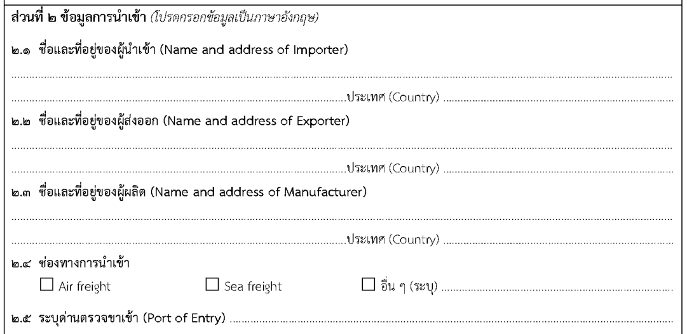

#### 2.1 ชื่อและที่อยู่ของผู้นำเข้า (Name and address of Importer)

| ลำดับ | Label | Table.Field | Condition | Remark |
|:---:|---|---|---|---|
| 0 | - | `RequisitionParticipant`.`ParticipantTypeId` | ส่ง xx - สถานที่ xx ตาม `MasterParticipantType`.`Id` | |

#### 2.2 ชื่อและที่อยู่ของผู้ส่งออก (Name and address of Exporter)

| ลำดับ | Label | Table.Field | Condition | Remark |
|:---:|---|---|---|---|
| 0 | - | `RequisitionParticipant`.`ParticipantTypeId` | ส่ง xx - สถานที่ xx ตาม `MasterParticipantType`.`Id` | |

#### 2.3 ชื่อและที่อยู่ของผู้ผลิต (Name and address of Manufacturer)

| ลำดับ | Label | Table.Field | Condition | Remark |
|:---:|---|---|---|---|
| 0 | - | `RequisitionParticipant`.`ParticipantTypeId` | ส่ง xx - สถานที่ xx ตาม `MasterParticipantType`.`Id` | |

#### 2.4 ช่องทางการนำเข้า

| ลำดับ | Label | Table.Field | Condition | Remark |
|:---:|---|---|---|---|
| 0 | - |  |  |  |

#### 2.5 ระบุด่านตรวจขาเข้า

| ลำดับ | Label | Table.Field | Condition | Remark |
|:---:|---|---|---|---|
| 0 | - |  |  |  |

### ส่วนที่ ๒ (EXP ส่งออกเฉพาะคราว) ข้อมูลการส่งออก (โปรดกรอกข้อมูลเป็นภาษาอังกฤษ)
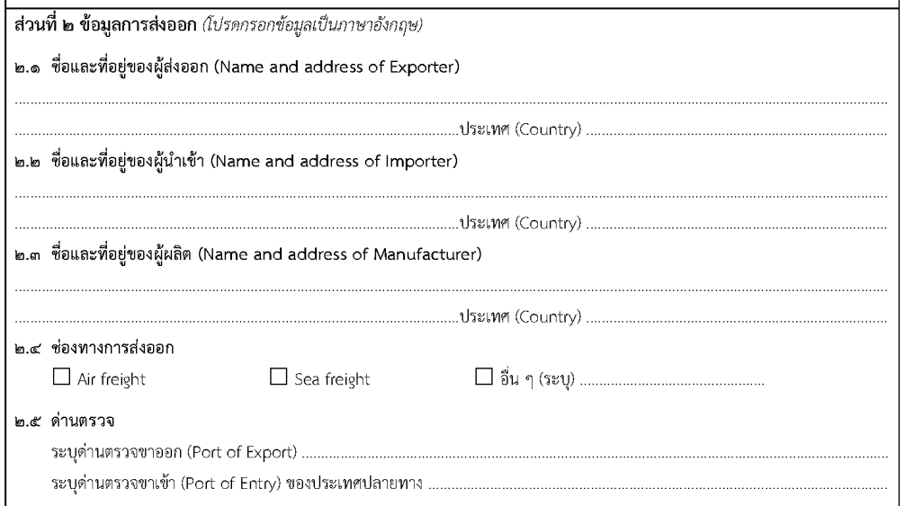

#### 2.1 ชื่อและที่อยู่ของผู้ส่งออก (Name and address of Exporter)

| ลำดับ | Label | Table.Field | Condition | Remark |
|:---:|---|---|---|---|
| 0 | - | `RequisitionParticipant`.`ParticipantTypeId` | ส่ง xx - สถานที่ xx ตาม `MasterParticipantType`.`Id` | |

#### 2.2 ชื่อและที่อยู่ของผู้นำเข้า (Name and address of Importer)

| ลำดับ | Label | Table.Field | Condition | Remark |
|:---:|---|---|---|---|
| 0 | - | `RequisitionParticipant`.`ParticipantTypeId` | ส่ง xx - สถานที่ xx ตาม `MasterParticipantType`.`Id` | |

#### 2.3 ชื่อและที่อยู่ของผู้ผลิต (Name and address of Manufacturer)

| ลำดับ | Label | Table.Field | Condition | Remark |
|:---:|---|---|---|---|
| 0 | - | `RequisitionParticipant`.`ParticipantTypeId` | ส่ง xx - สถานที่ xx ตาม `MasterParticipantType`.`Id` | |

#### 2.4 ช่องทางการส่งออก

| ลำดับ | Label | Table.Field | Condition | Remark |
|:---:|---|---|---|---|
| 0 | - |  |  |  |

#### 2.5 ด่านตรวจ

| ลำดับ | Label | Table.Field | Condition | Remark |
|:---:|---|---|---|---|
| 0 | - |  |  |  |

#### 2.6 ใบอนุญาตนำเข้า ***(เฉพาะ วจ.1 วจ.3 วจ.4)***

| ลำดับ | Label | Table.Field | Condition | Remark |
|:---:|---|---|---|---|
| 0 | - |  |  |  |

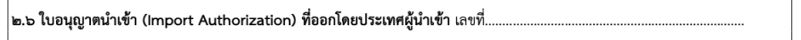

#### 2.(6/7) ยาเสพติด / วัตถุออกฤทธิ์ ที่ขอนำเข้า / ส่งออก   Substance / Narcotic Drug to imported / exported

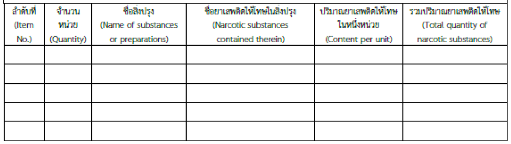

#### Table RequisitionTemporaryItemDetail
รายะเอียดของยาเสพติด / วัตถุออกฤทธิ์ ที่ขอนำเข้า / ส่งออก

| ลำดับ | Field_name | Data type | Allow Nulls | Description | Remark |
|:---:|---|---|:---:|---|---|
| 1 | Id | int | N | รหัสอ้างอิงที่ใช้ในระบบ | Id |
| 2 | CreateBy | int | N | ผู้สร้าง อ้างอิง `SystemUser`.`Id` | CreateBy |
| 3 | CreateOn | datetime | N | วันที่สร้าง | CreateOn |
| 4 | UpdateBy | int | Y | ผู้แก้ไข อ้างอิง `SystemUser`.`Id` | UpdateBy |
| 5 | UpdateOn | datetime | Y | วันที่แก้ไข | UpdateOn |
| 6 | RequisitionId | int | N | คำขอ อ้างอิง `Requisition`.`Id` |  |
| 7 | Quantity | decimal(18,4) | Y | จำนวน | Quantity |
| 8 | Type | char(1) | Y | ประเภท (S=ตัวอย่าง Sample, R=สารมาตรฐาน Reference Standard, M=วัตถุดิบ Raw Material, P=ผลิตภัณฑ์ Finished Product) | Type |
| 9 | UnitOfQuantity | int | Y | หน่วยของจำนวน อ้างอิง `MasterNarcoticUnit`.`Id` | Unit of quantity |
| 10 | ContentPerQuantity | decimal(18,4) | Y | ปริมาณต่อจำนวน | Content per quantity |
| 11 | UnitOfContentPerQuantity | int | Y | หน่วยของปริมาณต่อจำนวน อ้างอิง `MasterNarcoticUnit`.`Id` | Unit of content per quantity |
| 12 | NameOfSubstanceOrPreparations | nvarchar(500) | Y | ชื่อสิ่งปรุง | Name of substance or preparations (free text) |  
| 13 | NarcoticSubstancesContainedTherein | int | Y | ชื่อยาเสพติดให้โทษในสิ่งปรุง อ้างอิง `MasterNarcoticEster`.`Id` | Narcotic substances contained therein |
| 14 | ContentPerUnit | decimal(18,4) | Y | ปริมาณยาเสพติดให้โทษในหนึ่งหน่วย | Content per unit |
| 15 | UnitOfContentPerUnit | int | Y | หน่วยของปริมาณยาเสพติดให้โทษในหนึ่งหน่วย อ้างอิง `MasterNarcoticUnit`.`Id` | Unit of content per unit |
| 16 | TotalQuantityOfNarcoticSubstances | decimal(18,4) | Y | รวมปริมาณยาเสพติดให้โทษ | Total quantity of narcotic substances |

<!-- ### 2️⃣ พิเศษ เฉพาะคราว
<!--### 3️⃣ ประเภท แต่ละครั้ง (ก็คือ เฉพาะคราว)-->
<!--### 4️⃣ ประเภท นำผ่าน -->
<!-- ## 🔷 Field Condition พิเศษ เฉพาะคราว -->

<!-- #### ส่วนที่ ๓ เอกสารหลักฐาน -->

<!-- ## 📄 ส่วนแบบ Print from PDF คำขอ -->

<!-- Temporary -->
