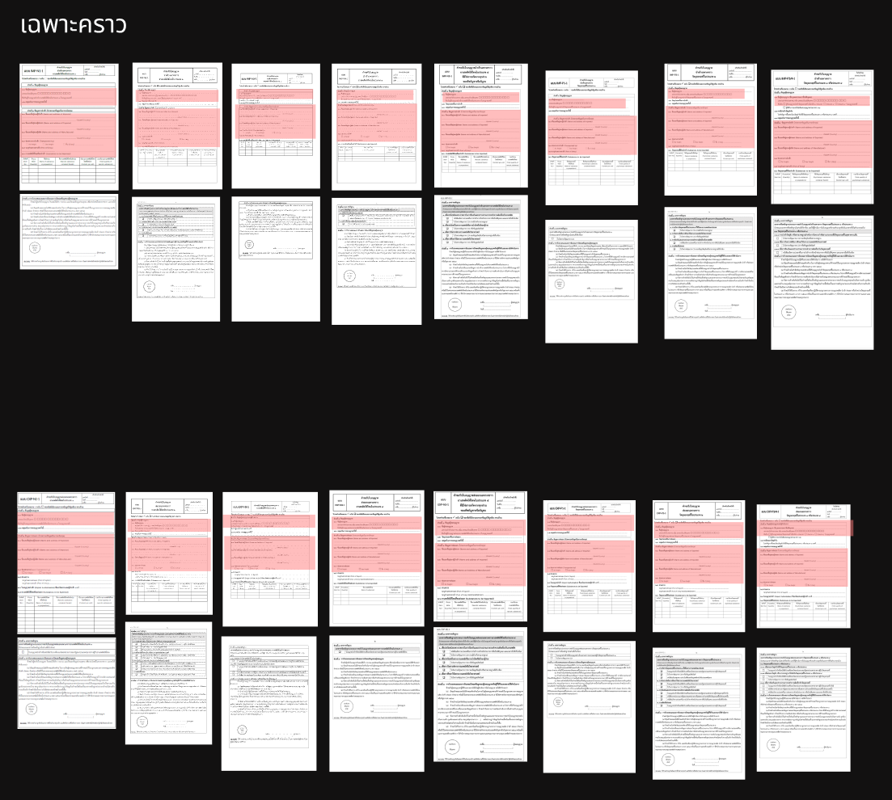

## คำขอรับใบอนุญาต นำเข้าส่งออก เฉพาะคราว
---

## (dbo.MasterRequisitionType Id = xx)
### Links

- [Figma Group Doc](https://www.figma.com/design/0YEqdcSpC2hZKulzEl54LH/-FDA68--Group-Doc)
- [Data Dic - Master Data real](https://docs.google.com/spreadsheets/d/1WpRC41tmqyOc8zVaxTVuwLxGgmi7inZATo8_LcCTXgE)

## ประเภท
### ประเภท เฉพาะคราว

| ลำดับ | ประเภท | ชื่อประเภท | นำเข้า | ส่งออก |
|---|---|---|---|---|
| 1  | เฉพาะคราว | IMP-N1-1 นำเข้า เฉพาะคราว ยส.1 | ✅ |  |
| 2  | เฉพาะคราว | IMP-N2-1 นำเข้า เฉพาะคราว ยส.2 | ✅ |  |
| 3  | เฉพาะคราว | IMP-N3-1 นำเข้า เฉพาะคราว ยส.3 | ✅ |  |
| 4  | เฉพาะคราว | IMP-N4-1 นำเข้า เฉพาะคราว ยส.4 | ✅ |  |
| 5  | เฉพาะคราว | IMP-N5-1 นำเข้า เฉพาะคราว ยส.5 | ✅ |  |
| 6  | เฉพาะคราว | IMP-P1-1 นำเข้า เฉพาะคราว วจ.1 | ✅ |  |
| 7  | เฉพาะคราว | IMP-P2-1 นำเข้า เฉพาะคราว วจ.2 | ✅ |  |
| 8  | เฉพาะคราว | IMP-P3/4-1 นำเข้า เฉพาะคราว วจ.3/4 | ✅ |  |
| 9  | เฉพาะคราว | EXP-N1-1 ส่งออก เฉพาะคราว ยส.1 |  | ✅ |
| 10 | เฉพาะคราว | EXP-N2-1 ส่งออก เฉพาะคราว ยส.2 |  | ✅ |
| 11 | เฉพาะคราว | EXP-N3-1 ส่งออก เฉพาะคราว ยส.3 |  | ✅ |
| 12 | เฉพาะคราว | EXP-N4-1 ส่งออก เฉพาะคราว ยส.4 |  | ✅ |
| 13 | เฉพาะคราว | EXP-N5-1 ส่งออก เฉพาะคราว ยส.5 |  | ✅ |
| 14 | เฉพาะคราว | EXP-P1-1 ส่งออก เฉพาะคราว วจ.1 |  | ✅ |
| 15 | เฉพาะคราว | EXP-P2-1 ส่งออก เฉพาะคราว วจ.2 |  | ✅ |
| 16 | เฉพาะคราว | EXP-P3/4-1 ส่งออก เฉพาะคราว วจ.3/4 |  | ✅ |

### ประเภท พิเศษ เฉพาะคราว
| ลำดับ | ประเภท | ชื่อประเภท | นำเข้า | ส่งออก |
|---|---|---|---|---|
| 17 | พิเศษเฉพาะคราว | EXP.SP-1 พิเศษเฉพาะคราว ส่งออก วจ. |  | ✅ |

### ประเภท แต่ละครั้ง (ก็คือ เฉพาะคราว)
| ลำดับ | ประเภท | ชื่อประเภท | นำเข้า | ส่งออก |
|---|---|---|---|---|
| 18 | แต่ละครั้ง | NAR.5 นำเข้า ส่งออก ซึ่ง**กัญชา** แต่ละครั้ง | ✅ | ✅ |
| 19 | แต่ละครั้ง | NAR.5(HEMP) นำเข้า ส่งออก ซึ่ง**กัญชง** แต่ละครั้ง | ✅ | ✅ |

### ประเภท นำผ่าน
| ลำดับ | ประเภท | ชื่อประเภท | นำเข้า | ส่งออก |
|---|---|---|---|---|
| 20 | นำผ่าน | คำขอรับใบอนุญาต / ใบแทนใบอนุญาต / แก้ไขรายการในใบอนุญาตนำผ่านวัตถุออกฤทธิ์ |  |  |

## List field
### IMP นำเข้า

| ลำดับ | ชื่อ field | IMP-N1-1 นำเข้า เฉพาะคราว ยส.1 | IMP-N2-1 นำเข้า เฉพาะคราว ยส.2 | IMP-N3-1 นำเข้า เฉพาะคราว ยส.3 | IMP-N4-1 นำเข้า เฉพาะคราว ยส.4 | IMP-N5-1 นำเข้า เฉพาะคราว ยส.5 | IMP-P1-1 นำเข้า เฉพาะคราว วจ.1 | IMP-P2-1 นำเข้า เฉพาะคราว วจ.2 | IMP-P3/4-1 นำเข้า เฉพาะคราว วจ.3/4 |
|---|---|---|---|---|---|---|---|---|
| 1.  | 1.1 ชื่อผู้ขอรับอนุญาต | ✅ | ✅ | ✅ | ✅ | ✅ | ✅ | ✅ | ✅ |
| 2.  | เลขทะเบียนนิติบุคคล | ✅ | ✅ | ✅ | ✅ | ✅ | ✅ | ✅ | ✅ |

### EXP ส่งออก

| ลำดับ | ชื่อ field | EXP-N1-1 ส่งออก เฉพาะคราว ยส.1 | EXP-N2-1 ส่งออก เฉพาะคราว ยส.2 | EXP-N3-1 ส่งออก เฉพาะคราว ยส.3 | EXP-N4-1 ส่งออก เฉพาะคราว ยส.4 | EXP-N5-1 ส่งออก เฉพาะคราว ยส.5 | EXP-P1-1 ส่งออก เฉพาะคราว วจ.1 | EXP-P2-1 ส่งออก เฉพาะคราว วจ.2 | EXP-P3/4-1 ส่งออก เฉพาะคราว วจ.3/4 |
|---|---|---|---|---|---|---|---|---|
| 1.  | 1.1 ชื่อผู้ขอรับอนุญาต | ✅ | ✅ | ✅ | ✅ | ✅ | ✅ | ✅ | ✅ |
| 2.  | เลขทะเบียนนิติบุคคล | ✅ | ✅ | ✅ | ✅ | ✅ | ✅ | ✅ | ✅ |

## Field Condition

| ประเภท | นำเข้า | ส่งออก |
|---|---|---|
| 1.  | ✅ | ✅ |
| 2.  | ✅ | ✅ |

## 📄 ส่วนแบบ Print from PDF คำขอ