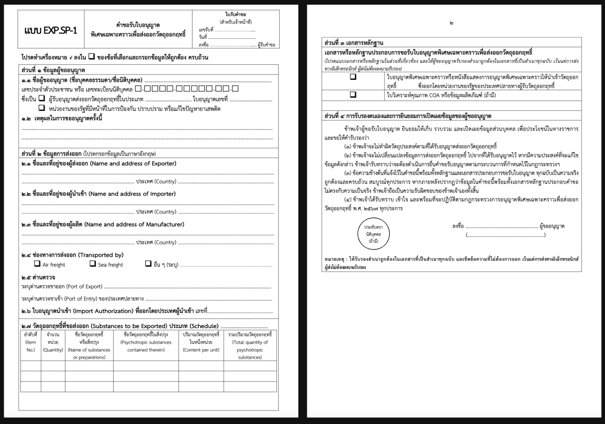
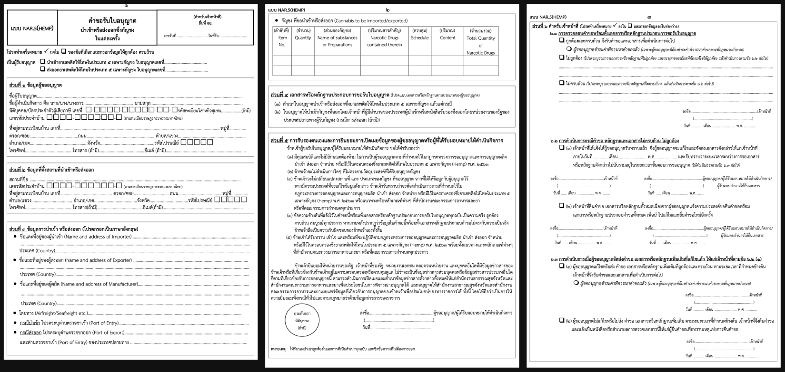
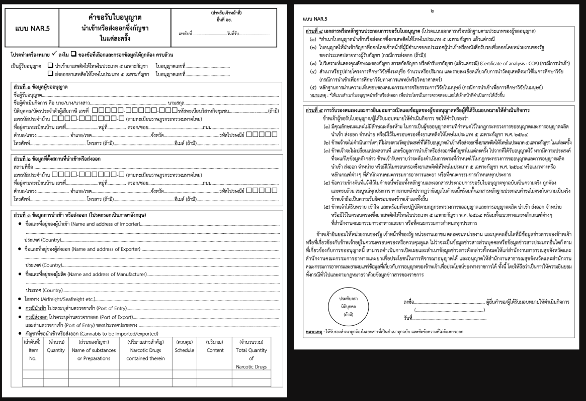
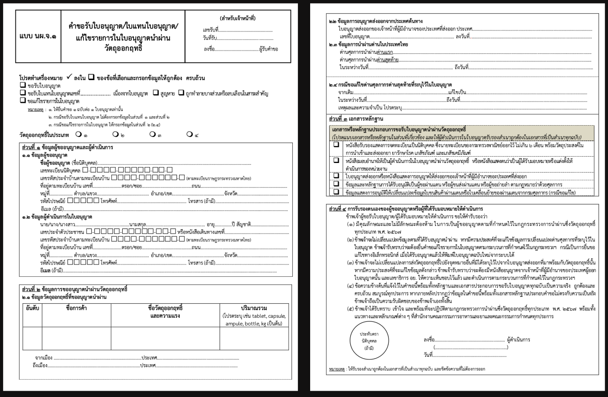

## คำขอรับใบอนุญาต นำเข้าส่งออก เฉพาะคราว
---

## (dbo.MasterRequisitionType Id = 25-46)
### Links

- [Figma Group Doc](https://www.figma.com/design/0YEqdcSpC2hZKulzEl54LH/-FDA68--Group-Doc)
- [Data Dic - Master Data real](https://docs.google.com/spreadsheets/d/1WpRC41tmqyOc8zVaxTVuwLxGgmi7inZATo8_LcCTXgE)
- [FDA68_สรุปวัตถุประสงค์ ผู้อนุญาต และผู้อนุมัติ ในใบคำขอ](https://docs.google.com/spreadsheets/d/1B366oiRjTmnY7Jvt0lpH9ORXbmOgJaLXcYDHmDST8Qo)

## ประเภท
### ประเภท เฉพาะคราว

| ลำดับ | MasterRequisitionType.Id | ประเภท | ชื่อประเภท | นำเข้า | ส่งออก |
|---|---|---|---|---|
| 1  | 25 | เฉพาะคราว | IMP-N1-1 นำเข้า เฉพาะคราว ยส.1 | ✅ |  |
| 2  | 27 | เฉพาะคราว | IMP-N2-1 นำเข้า เฉพาะคราว ยส.2 | ✅ |  |
| 3  | 29 | เฉพาะคราว | IMP-N3-1 นำเข้า เฉพาะคราว ยส.3 | ✅ |  |
| 4  | 31 | เฉพาะคราว | IMP-N4-1 นำเข้า เฉพาะคราว ยส.4 | ✅ |  |
| 5  | 33 | เฉพาะคราว | IMP-N5-1 นำเข้า เฉพาะคราว ยส.5 | ✅ |  |
| 6  | 37 | เฉพาะคราว | IMP-P1-1 นำเข้า เฉพาะคราว วจ.1 | ✅ |  |
| 7  | 39 | เฉพาะคราว | IMP-P2-1 นำเข้า เฉพาะคราว วจ.2 | ✅ |  |
| 8  | 41/43 | เฉพาะคราว | IMP-P3/4-1 นำเข้า เฉพาะคราว วจ.3/4 | ✅ |  |
| 9  | 26 | เฉพาะคราว | EXP-N1-1 ส่งออก เฉพาะคราว ยส.1 |  | ✅ |
| 10 | 28 | เฉพาะคราว | EXP-N2-1 ส่งออก เฉพาะคราว ยส.2 |  | ✅ |
| 11 | 30 | เฉพาะคราว | EXP-N3-1 ส่งออก เฉพาะคราว ยส.3 |  | ✅ |
| 12 | 32 | เฉพาะคราว | EXP-N4-1 ส่งออก เฉพาะคราว ยส.4 |  | ✅ |
| 13 | 34 | เฉพาะคราว | EXP-N5-1 ส่งออก เฉพาะคราว ยส.5 |  | ✅ |
| 14 | 38 | เฉพาะคราว | EXP-P1-1 ส่งออก เฉพาะคราว วจ.1 |  | ✅ |
| 15 | 40 | เฉพาะคราว | EXP-P2-1 ส่งออก เฉพาะคราว วจ.2 |  | ✅ |
| 16 | 42/44 | เฉพาะคราว | EXP-P3/4-1 ส่งออก เฉพาะคราว วจ.3/4 |  | ✅ |

### ประเภท พิเศษ เฉพาะคราว

| ลำดับ | MasterRequisitionType.Id | ประเภท | ชื่อประเภท | นำเข้า | ส่งออก |
|---|---|---|---|---|
| 17 | 45 | พิเศษเฉพาะคราว | EXP.SP-1 พิเศษเฉพาะคราว ส่งออก วจ. |  | ✅ |

### ประเภท แต่ละครั้ง (ก็คือ เฉพาะคราว)

| ลำดับ | MasterRequisitionType.Id | ประเภท | ชื่อประเภท | นำเข้า | ส่งออก |
|---|---|---|---|---|
| 18 | 35 | แต่ละครั้ง | NAR.5 นำเข้า ส่งออก ซึ่ง**กัญชา** แต่ละครั้ง | ✅ | ✅ |
| 19 | 36 | แต่ละครั้ง | NAR.5(HEMP) นำเข้า ส่งออก ซึ่ง**กัญชง** แต่ละครั้ง | ✅ | ✅ |

### ประเภท นำผ่าน

| ลำดับ | MasterRequisitionType.Id | ประเภท | ชื่อประเภท | นำเข้า | ส่งออก |
|---|---|---|---|---|
| 20 | 46 | นำผ่าน | นผ.จ.1 คำขอรับใบอนุญาต / ใบแทนใบอนุญาต / แก้ไขรายการในใบอนุญาตนำผ่านวัตถุออกฤทธิ์ ***ใช้กับ วจ. 1 2 3 4*** |  |  |

## List field
### IMP นำเข้าเฉพาะคราว

| ลำดับ / รายการ | รายละเอียด | IMP-N1 นำเข้าเฉพาะคราว ยส.1 | IMP-N2 นำเข้าเฉพาะคราว ยส.2 | IMP-N3 นำเข้าเฉพาะคราว ยส.3 | IMP-N4 นำเข้าเฉพาะคราว ยส.4 | IMP-N5 นำเข้าเฉพาะคราว ยส.5 | IMP-P1 วจ.1 | IMP-P2 วจ.2 | IMP-P3/4 วจ.3 หรือ 4 |
|---|---|---|---|---|---|---|---|---|---|
| ส่วนที่ ๑ ข้อมูลผู้ขออนุญาต | | | | | | | | | |
| ๑.๑ | ชื่อผู้ขออนุญาต | ✅ | ✅ | ✅ | ✅ | ✅ | ✅ | ✅ | ✅ |
| | เลขทะเบียนนิติบุคคล | ✅ | ✅ | ✅ | ✅ | ✅ | ✅ | ✅ | ✅ |
| | ซึ่งเป็นผู้รับอนุญาตนำเข้ายาเสพติดให้โทษ ใบอนุญาตเลขที่ | ✅ | ✅ | ✅ | ✅ | ✅ | ✅ | ✅ | ✅ |
| | วัตถุประสงค์ในการนำเข้า | | ✅ | | | ✅ | | ✅ | |
| | ใบสำคัญการขึ้นทะเบียนตำรับเลขที่ | | | ✅ | | | ✅ | | |
| | ซึ่งเป็นผู้รับอนุญาตนำเข้าวัตถุออกฤทธิ์ (เลือกได้ ๑ ประเภท) ประเภท ๓ หรือประเภท ๔ ใบอนุญาตเลขที่ | | | | | | | | ✅ |
| | ผู้ได้รับการยกเว้นไม่ต้องขออนุญาตตามมาตรา ๓๒ | | | | | | | | ✅ |
| | กรณีนำเข้าวัตถุตำรับ ใบสำคัญการขึ้นทะเบียนวัตถุตำรับที่มีวัตถุออกฤทธิ์ประเภท ๓ หรือ ๔ เลขที่ | | | | | | | | ✅ |
| ๑.๒ | เหตุผลในการขออนุญาตครั้งนี้ | ✅ | ✅ | ✅ | ✅ | ✅ | ✅ | ✅ | ✅ |

| ลำดับ / รายการ | รายละเอียด | IMP-N1 นำเข้าเฉพาะคราว ยส.1 | IMP-N2 นำเข้าเฉพาะคราว ยส.2 | IMP-N3 นำเข้าเฉพาะคราว ยส.3 | IMP-N4 นำเข้าเฉพาะคราว ยส.4 | IMP-N5 นำเข้าเฉพาะคราว ยส.5 | IMP-P1 วจ.1 | IMP-P2 วจ.2 | IMP-P3/4 วจ.3 หรือ 4 |
|---|---|---|---|---|---|---|---|---|---|
| ส่วนที่ ๒ ข้อมูลการนำเข้า (โปรดกรอกข้อมูลเป็นภาษาอังกฤษ) | | | | | | | | | |
| ๒.๑ | ชื่อและที่อยู่ของผู้นำเข้า (Name and address of Importer) | ✅ | ✅ | ✅ | ✅ | ✅ | ✅ | ✅ | ✅ |
| ๒.๒ | ชื่อและที่อยู่ของผู้ส่งออก (Name and address of Exporter) | ✅ | ✅ | ✅ | ✅ | ✅ | ✅ | ✅ | ✅ |
| ๒.๓ | ชื่อและที่อยู่ของผู้ผลิต (Name and address of Manufacturer) | ✅ | ✅ | ✅ | ✅ | ✅ | ✅ | ✅ | ✅ |
| ๒.๔ | ช่องทางการนำเข้า (Transported by: Air freight / Sea freight) | ✅ | ✅ | ✅ | ✅ | ✅ | ✅ | ✅ | ✅ |
| ๒.๕ | ระบุด่านตรวจขาเข้า (Port of Entry) | ✅ | ✅ | ✅ | ✅ | ✅ | ✅ | ✅ | ✅ |
| ๒.๖ | ยาเสพติดให้โทษที่ขอนำเข้า (Substances to be imported) | ✅ | ✅ | ✅ | ✅ | ✅ | ✅ | ✅ | ✅ |

| ลำดับ / รายการ | รายละเอียด | IMP-N1 นำเข้าเฉพาะคราว ยส.1 | IMP-N2 นำเข้าเฉพาะคราว ยส.2 | IMP-N3 นำเข้าเฉพาะคราว ยส.3 | IMP-N4 นำเข้าเฉพาะคราว ยส.4 | IMP-N5 นำเข้าเฉพาะคราว ยส.5 | IMP-P1 วจ.1 | IMP-P2 วจ.2 | IMP-P3/4 วจ.3 หรือ 4 |
|---|---|---|---|---|---|---|---|---|---|
| ส่วนที่ ๓ เอกสารหลักฐาน | | | | | | | | | |
| ๑ | การบริหารยาเสพติดให้โทษในประเภท ๑ | | ✅ | | | | | | |
| | ใบวิเคราะห์คุณภาพ COA (กรณีนำเข้าสารมาตรฐาน) | | ✅ | | | | | | |
| ๒ | ที่ใช้ในทางการแพทย์ของประเทศ | | ✅ | | | | | | |
| | ใบวิเคราะห์คุณภาพ COA หรือข้อมูลผลิตภัณฑ์ | | ✅ | | | | | | |
| ๓ | การป้องกันและปราบปรามการกระทำความผิดเกี่ยวกับยาเสพติด | | ✅ | | | | | | |
| | หนังสือแจ้งความประสงค์ในการนำเข้าจากหัวหน้าส่วนราชการซึ่งเป็นนิติบุคคล และเอกสารอื่นที่เกี่ยวข้อง | | ✅ | | | | | | |
| ๔ | การผลิตเพื่อส่งออก | | ✅ | | | | | | |
| | ใบวิเคราะห์คุณภาพ COA ของข้อมูลวัตถุดิบหรือสารมาตรฐานที่เกี่ยวข้อง | | ✅ | | | | | | |

| ลำดับ / รายการ | รายละเอียด | IMP-N1 นำเข้าเฉพาะคราว ยส.1 | IMP-N2 นำเข้าเฉพาะคราว ยส.2 | IMP-N3 นำเข้าเฉพาะคราว ยส.3 | IMP-N4 นำเข้าเฉพาะคราว ยส.4 | IMP-N5 นำเข้าเฉพาะคราว ยส.5 | IMP-P1 วจ.1 | IMP-P2 วจ.2 | IMP-P3/4 วจ.3 หรือ 4 |
|---|---|---|---|---|---|---|---|---|---|
| ส่วนที่ ๔ การรับรองตนเองและการยินยอมการเปิดเผยข้อมูลของผู้ขออนุญาต หรือผู้ที่ได้รับมอบหมายให้ดำเนินการ | | | | | | | | | |
| | | ✅ | ✅ | ✅ | ✅ | ✅ | ✅ | ✅ | ✅ |

### EXP ส่งออกเฉพาะคราว

| ลำดับ / รายการ | รายละเอียด | EXP-N1 ส่งออกเฉพาะคราว ยส.1 | EXP-N2 ส่งออกเฉพาะคราว ยส.2 | EXP-N3 ส่งออกเฉพาะคราว ยส.3 | EXP-N4 ส่งออกเฉพาะคราว ยส.4 | EXP-N5 ส่งออกเฉพาะคราว ยส.5 | EXP-P1 วจ.1 | EXP-P2 วจ.2 | EXP-P3/4 วจ.3 หรือ 4 |
|---|---|---|---|---|---|---|---|---|---|
| ส่วนที่ ๑ ข้อมูลผู้ขออนุญาต | | | | | | | | | |
| ๑.๑ | ชื่อผู้ขออนุญาต | ✅ | ✅ | ✅ | ✅ | ✅ | ✅ | ✅ | ✅ |
| | เลขทะเบียนนิติบุคคล | ✅ | ✅ | ✅ | ✅ | ✅ | ✅ | ✅ | ✅ |
| | ซึ่งเป็นผู้รับอนุญาตส่งออกยาเสพติดให้โทษ ใบอนุญาตเลขที่ | ✅ | ✅ | ✅ | ✅ | ✅ | ✅ | ✅ | ✅ |
| | วัตถุประสงค์ในการส่งออก | | ✅ | | | ✅ | | ✅ | |
| | ใบสำคัญการขึ้นทะเบียนตำรับเลขที่ | | | ✅ | | | ✅ | | |
| | ซึ่งเป็นผู้รับอนุญาตส่งออกวัตถุออกฤทธิ์ (เลือกได้ ๑ ประเภท) ประเภท ๓ หรือประเภท ๔ ใบอนุญาตเลขที่ | | | | | | | | ✅ |
| | ผู้ได้รับการยกเว้นไม่ต้องขออนุญาตตามมาตรา ๓๒ | | | | | | | | ✅ |
| | กรณีส่งออกวัตถุตำรับ ใบสำคัญการขึ้นทะเบียนวัตถุตำรับที่มีวัตถุออกฤทธิ์ประเภท ๓ หรือ ๔ เลขที่ | | | | | | | | ✅ |
| ๑.๒ | เหตุผลในการขออนุญาตครั้งนี้ | ✅ | ✅ | ✅ | ✅ | ✅ | ✅ | ✅ | ✅ |

| ลำดับ / รายการ | รายละเอียด | EXP-N1 ส่งออกเฉพาะคราว ยส.1 | EXP-N2 ส่งออกเฉพาะคราว ยส.2 | EXP-N3 ส่งออกเฉพาะคราว ยส.3 | EXP-N4 ส่งออกเฉพาะคราว ยส.4 | EXP-N5 ส่งออกเฉพาะคราว ยส.5 | EXP-P1 วจ.1 | EXP-P2 วจ.2 | EXP-P3/4 วจ.3 หรือ 4 |
|---|---|---|---|---|---|---|---|---|---|
| ส่วนที่ ๒ ข้อมูลการส่งออก (โปรดกรอกข้อมูลเป็นภาษาอังกฤษ) | | | | | | | | | |
| ๒.๑ | ชื่อและที่อยู่ของผู้ส่งออก (Name and address of Exporter) | ✅ | ✅ | ✅ | ✅ | ✅ | ✅ | ✅ | ✅ |
| ๒.๒ | ชื่อและที่อยู่ของผู้นำเข้า (Name and address of Importer) | ✅ | ✅ | ✅ | ✅ | ✅ | ✅ | ✅ | ✅ |
| ๒.๓ | ชื่อและที่อยู่ของผู้ผลิต (Name and address of Manufacturer) | ✅ | ✅ | ✅ | ✅ | ✅ | ✅ | ✅ | ✅ |
| ๒.๔ | ช่องทางการส่งออก (Transported by: Air freight / Sea freight) | ✅ | ✅ | ✅ | ✅ | ✅ | ✅ | ✅ | ✅ |
| ๒.๕ | ระบุด่านตรวจขาออก (Port of Exit) | ✅ | ✅ | ✅ | ✅ | ✅ | ✅ | ✅ | ✅ |
| ๒.๖ | ยาเสพติดให้โทษที่ขอส่งออก (Substances to be exported) | ✅ | ✅ | ✅ | ✅ | ✅ | ✅ | ✅ | ✅ |

| ลำดับ / รายการ | รายละเอียด | EXP-N1 ส่งออกเฉพาะคราว ยส.1 | EXP-N2 ส่งออกเฉพาะคราว ยส.2 | EXP-N3 ส่งออกเฉพาะคราว ยส.3 | EXP-N4 ส่งออกเฉพาะคราว ยส.4 | EXP-N5 ส่งออกเฉพาะคราว ยส.5 | EXP-P1 วจ.1 | EXP-P2 วจ.2 | EXP-P3/4 วจ.3 หรือ 4 |
|---|---|---|---|---|---|---|---|---|---|
| ส่วนที่ ๓ เอกสารหลักฐาน | | | | | | | | | |
| ๑ | การบริหารยาเสพติดให้โทษในประเภท ๑ | | ✅ | | | | | | |
| | ใบอนุญาตนำเข้าหรือหนังสือรับรองจากประเทศปลายทาง | | ✅ | | | | | | |
| | ใบวิเคราะห์คุณภาพ COA หรือข้อมูลผลิตภัณฑ์ | | ✅ | | | | | | |
| ๒ | การวิเคราะห์หรือการศึกษาวิจัยทางการแพทย์หรือวิทยาศาสตร์ | | | | | | | | |
| | ใบอนุญาตนำเข้าหรือหนังสือรับรองจากประเทศปลายทาง | | | | | | | | |
| | ใบวิเคราะห์คุณภาพ COA หรือข้อมูลผลิตภัณฑ์ | | | | | | | | |
| ๓ | การป้องกันและปราบปรามการกระทำความผิดเกี่ยวกับยาเสพติด | | | | | | | | |
| | หนังสือจากหน่วยงานภาครัฐของประเทศปลายทางที่แสดงความจำนง | | | | | | | | |
| | หนังสือแจ้งความประสงค์ในการส่งออกจากหัวหน้าส่วนราชการ | | | | | | | | |
| ๔ | การผลิตเพื่อส่งออก | | | | | | | | |
| | ใบอนุญาตนำเข้าจากประเทศปลายทาง | | | | | | | | |
| | ใบวิเคราะห์คุณภาพ COA ของวัตถุดิบหรือสารมาตรฐานที่เกี่ยวข้อง | | | | | | | | |

| ลำดับ / รายการ | รายละเอียด | EXP-N1 ส่งออกเฉพาะคราว ยส.1 | EXP-N2 ส่งออกเฉพาะคราว ยส.2 | EXP-N3 ส่งออกเฉพาะคราว ยส.3 | EXP-N4 ส่งออกเฉพาะคราว ยส.4 | EXP-N5 ส่งออกเฉพาะคราว ยส.5 | EXP-P1 วจ.1 | EXP-P2 วจ.2 | EXP-P3/4 วจ.3 หรือ 4 |
|---|---|---|---|---|---|---|---|---|---|
| ส่วนที่ ๔ การรับรองตนเองและการยินยอมการเปิดเผยข้อมูลของผู้ขออนุญาต หรือผู้ที่ได้รับมอบหมายให้ดำเนินการ | | | | | | | | | |
| | | ✅ | ✅ | ✅ | ✅ | ✅ | ✅ | ✅ | ✅ |

## Field Condition

## 📄 ส่วนแบบ Print from PDF คำขอ
