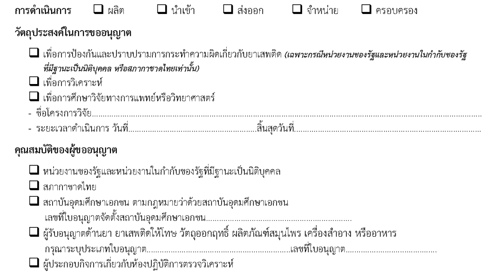
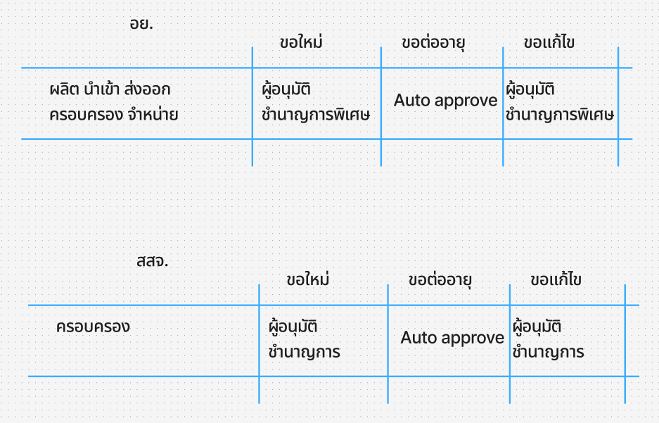
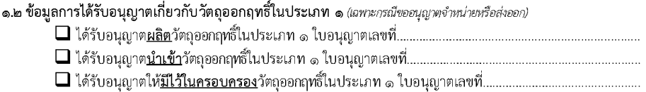

## คำขอรับใบอนุญาต คำขอต่ออายุใบอนุญาต คำขอรับใบแทนใบอนุญาต ผลิต นำเข้า ส่งออก จำหน่าย หรือมีไว้ในครอบครอง วัตถุออกฤทธิ์ในประเภท 1 [วจ.1-1]
---

## (dbo.MasterRequisitionType Id = 2)
### [เงื่อนไข วจ.1]

### Links

- [Figma Group Doc](https://www.figma.com/design/0YEqdcSpC2hZKulzEl54LH/-FDA68--Group-Doc)
- [Data Dic - Master Data real](https://docs.google.com/spreadsheets/d/1WpRC41tmqyOc8zVaxTVuwLxGgmi7inZATo8_LcCTXgE)

- [Figma วจ.1](https://www.figma.com/board/UIPAZvSkDF1152KUElG9Ce/%E0%B8%A7%E0%B8%88-1)

## ประเภทการขอ

| ประเภทการขอ |
|---|
| 1. ขอใหม่ |
| 2. ขอแก้ไข |
| 3. ขอต่ออายุ |
| 4. ขอยกเลิก |
| 5. ขอใบแทน |

## วัตถุประสงค์ในการขออนุญาต + การดำเนินการ (วจ.1-1)

| วัตถุประสงค์/การดำเนินการ | ผลิต | นำเข้า | ส่งออก | จำหน่าย | ครอบครอง |
|---|---|---|---|---|---|
| 1. เพื่อการป้องกันฯ |  |  |  |  |  |
| 2. เพื่อวิเคราะห์ |  |  |  |  |  |
| 3. เพื่อการศึกษาวิจัยทางการแพทย์ หรือวิทยาศาสตร์ |  |  |  |  |  |

## วัตถุประสงค์ในการขออนุญาต + ประเภทผู้ขอ (วจ.1-1)

| วัตถุประสงค์/ประเภทผู้ขอ | หน่วยงานของรัฐและหน่วยงานในกำกับของรัฐที่มีฐานะเป็นนิติบุคคล | สภากาชาดไทย | สถาบันอุดมศึกษาเอกชน | ผู้รับอนุญาตด้านยา | ผู้ประกอบกิจการเกี่ยวกับห้องปฏิบัติการตรวจวิเคราะห์ |
|---|---|---|---|---|---|
| 1. เพื่อการป้องกันฯ | ✅ | ✅ |  |  |  |
| 2. เพื่อวิเคราะห์ | ✅ | ✅ | ✅ | ✅ | ✅ |
| 3. เพื่อการศึกษาวิจัยทางการแพทย์ หรือวิทยาศาสตร์ | ✅ | ✅ | ✅ | ✅ | ✅ |

## วัตถุประสงค์ + เงื่อนไขสาร (วจ.1-1)
**ใช้ที่ 2.1 ข้อมูลยาเสพติดให้โทษในประเภท 1 ที่ขอรับอนุญาต**

| วัตถุประสงค์ (Objective) /   สาร | ประเภทสาร (NarcoticTypeId) | เงื่อนไขสาร   ([dbo].[MasterNarcoticEster]) | เงื่อนไขหน่วย (MasterNarcoticUnit) |
|---|---|---|---|
| 1. เพื่อการป้องกันฯ | 6 | วจ.1 | IsNCUnit |
| 2. เพื่อวิเคราะห์ | 6 | วจ.1 | IsNCUnit |
| 3. เพื่อการศึกษาวิจัยทางการแพทย์ หรือวิทยาศาสตร์ | 6 | วจ.1 | IsNCUnit |

## วัตถุประสงค์ในการขออนุญาต + ประเภทการขอ + flow

## Field Condition
## 1.2

