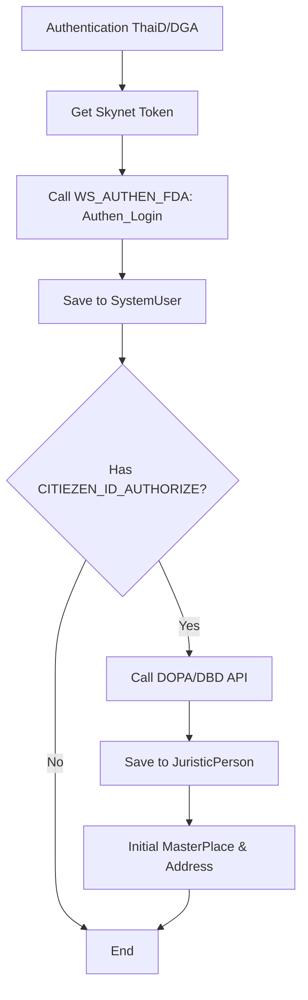

# 🛡️ FDA AUTHEN (SKYNET)

---

## 📋 การบันทึกข้อมูลลงระบบ NCSYSTEM

### 🔄 ขั้นตอนหลังจาก Authentication (ThaiD/DGA)
1. **รับ Skynet Token:** เมื่อทำการ Authentication เรียบร้อยแล้ว ให้นำ Token ที่ได้ไปเรียกข้อมูลจาก `WS_AUTHEN_FDA` ในส่วนของ Service `Authen_Login` เพื่อดึงข้อมูลรายละเอียดผู้ใช้งาน
2. **บันทึกข้อมูล:** นำข้อมูลที่ได้รับมาบันทึกลงฐานข้อมูล `NCSYSTEM` ตามลำดับขั้นตอนดังนี้

---

### 🗂️ 2. ขั้นตอนการบันทึกลงฐานข้อมูล

#### 👤 2.1 ตาราง `dbo.SystemUser`
ใช้สำหรับบันทึกข้อมูลผู้ใช้งานพื้นฐานและ Token สำหรับการใช้งานในครั้งถัดไป แต่ถ้าตรวจสอบข้อมูลแล้วพบว่ามีข้อมูลอยู่แล้ว ให้นำข้อมูลมา Update `SkynetToken`, `SkynetTokenExpiresAt` อย่างเดียว

| ลำดับ | Label | Table.Field | Field จาก API | Remark |
|:---:|---|---|---|---|
| 1 | - | `SystemUser.Username` | `Authen_Login` จาก `Citizen_ID` | |
| 2 | - | `SystemUser.FirstName` | `Authen_Login` จาก `Name` | |
| 3 | - | `SystemUser.SkynetToken` | | |
| 4 | - | `SystemUser.SkynetTokenExpiresAt` | | |

> [!IMPORTANT]
> **การ Initial ข้อมูลนิติบุคคลและสถานที่**
> นำเลขนิติบุคคลที่ได้รับมอบอำนาจ (จาก Field `CITIEZEN_ID_AUTHORIZE`) ไปเรียก API **DOPA/DBD** เพื่อดึงข้อมูลนิติบุคคล จากนั้นนำข้อมูลมาบันทึกลงตาราง `JuristicPerson`, `MasterPlace` และ `MappingPlacePlaceAddress` เพื่อตั้งค่าข้อมูลสถานที่เริ่มต้น

#### 🏢 2.2 ตาราง `dbo.JuristicPerson`
ข้อมูลเลขนิติบุคคลและชื่อนิติบุคคล
ถ้าตรวจสอบข้อมูลแล้วพบว่ามีข้อมูลอยู่แล้ว ไม่ต้องดำเนินการใด ๆ

| ลำดับ | Label/Field name | Table.Field | Field จาก API | Remark |
|:---:|---|---|---|---|
| 1 | - | `JuristicPerson.TaxNumer` | | |
| 2 | - | `JuristicPerson.JuristicName` | | |

#### 📍 2.3 ตาราง `dbo.MasterPlace`
ข้อมูลสถานที่เบื้องต้น อ้างอิงตามนิติบุคคล
ถ้าตรวจสอบข้อมูลแล้วพบว่ามีข้อมูลอยู่แล้ว ไม่ต้องดำเนินการใด ๆ

| ลำดับ | Label/Field name | Table.Field | Field จาก API | Remark |
|:---:|---|---|---|---|
| 1 | นิติบุคคล อ้างอิง `JuristicPerson.Id` | `MasterPlace.JuristicPersonId` | | |
| 2 | - | `MasterPlace.PlaceNameTh` | | |
| 3 | - | `MasterPlace.PlaceNameEn` | | |
| 4 | - | `MasterPlace.Active` | | Set เป็น `1` |

#### 🗺️ 2.4 ตาราง `dbo.MappingPlacePlaceAddress`
รายละเอียดที่ตั้งของสถานที่ (Address Details)
ถ้าตรวจสอบข้อมูลแล้วพบว่ามีข้อมูลอยู่แล้ว ไม่ต้องดำเนินการใด ๆ

| ลำดับ | Label/Field name | Table.Field | Field จาก API | Remark |
|:---:|---|---|---|---|
| 1 | สถานที่ อ้างอิง `MasterPlace.Id` | `MappingPlacePlaceAddress.PlaceId` | | |
| 2 | - | `MappingPlacePlaceAddress.HouseCode` | | |
| 3 | - | `MappingPlacePlaceAddress.HouseNo` | | |
| 4 | - | `MappingPlacePlaceAddress.VillageNo` | | |
| 5 | - | `MappingPlacePlaceAddress.VillageName` | | |
| 6 | - | `MappingPlacePlaceAddress.Lane` | | |
| 7 | - | `MappingPlacePlaceAddress.Street` | | |
| 8 | - | `MappingPlacePlaceAddress.ProvinceId` | | |
| 9 | - | `MappingPlacePlaceAddress.ProvinceName` | | |
| 10 | - | `MappingPlacePlaceAddress.AmphurId` | | |
| 11 | - | `MappingPlacePlaceAddress.AmphurName` | | |
| 12 | - | `MappingPlacePlaceAddress.TambonId` | | |
| 13 | - | `MappingPlacePlaceAddress.TambonName` | | |
| 14 | - | `MappingPlacePlaceAddress.Postcode` | | |
| 15 | - | `MappingPlacePlaceAddress.FullAddress` | | |
| 16 | - | `MappingPlacePlaceAddress.Phone` | | |
| 17 | - | `MappingPlacePlaceAddress.Fax` | | |
| 18 | - | `MappingPlacePlaceAddress.Email` | | |
| 19 | - | `MappingPlacePlaceAddress.Active` | | Set เป็น `1` |

