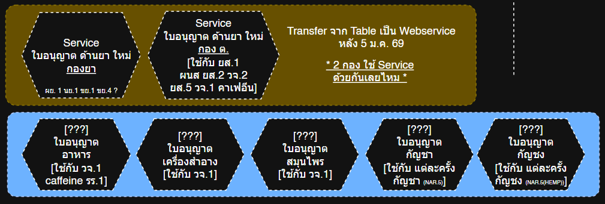
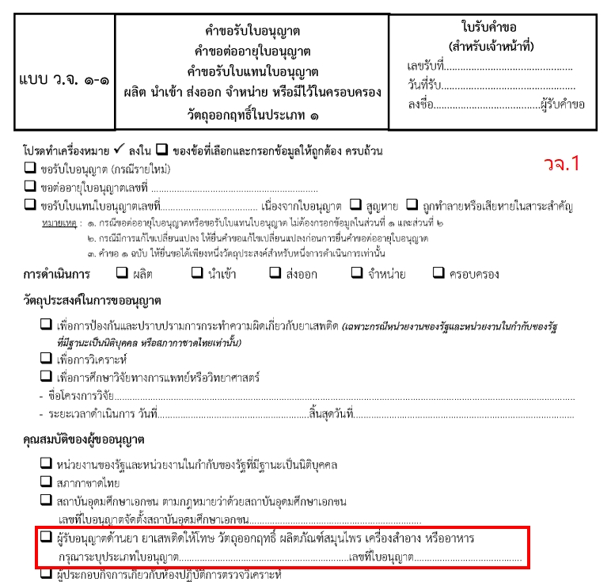
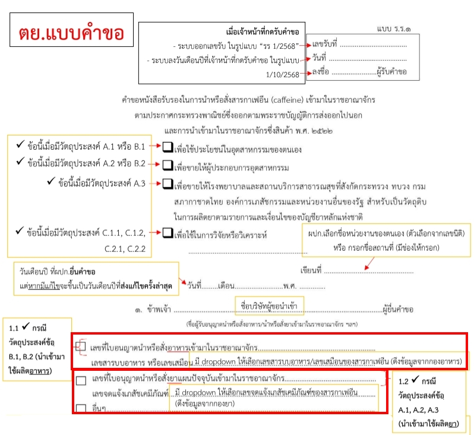
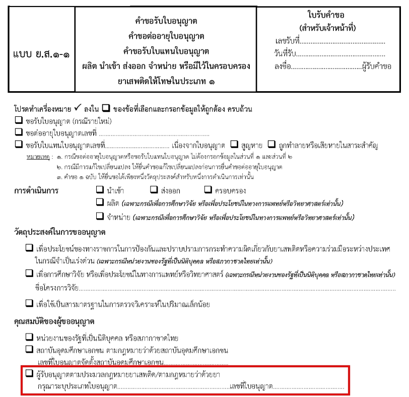
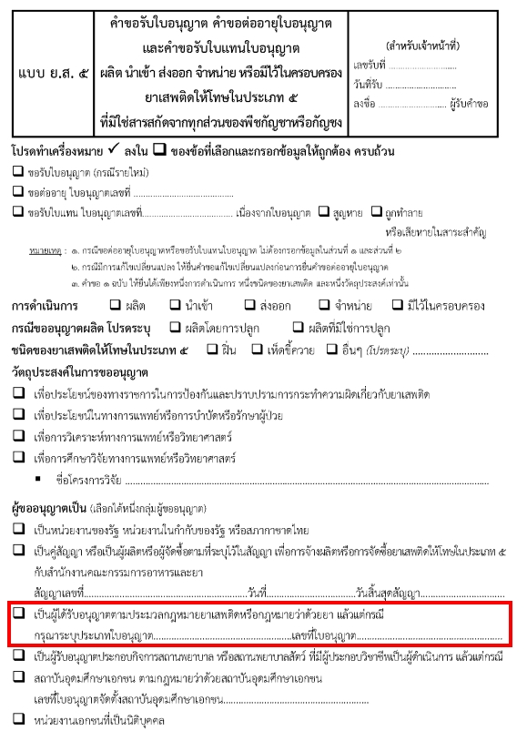
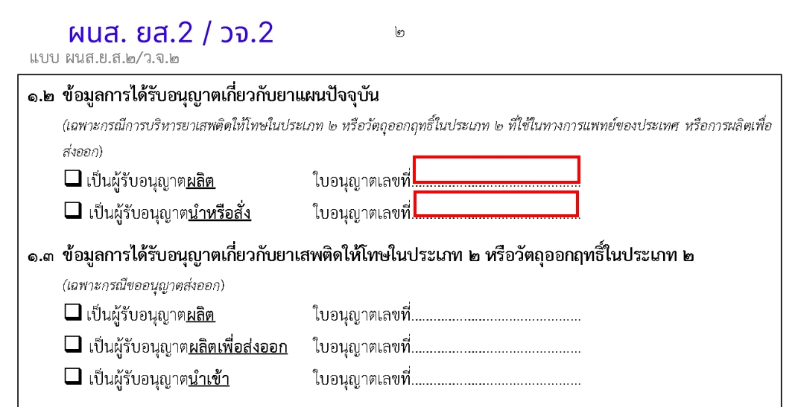
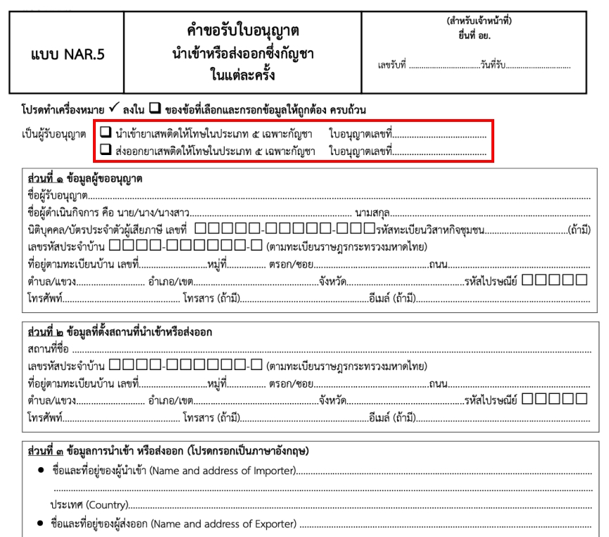
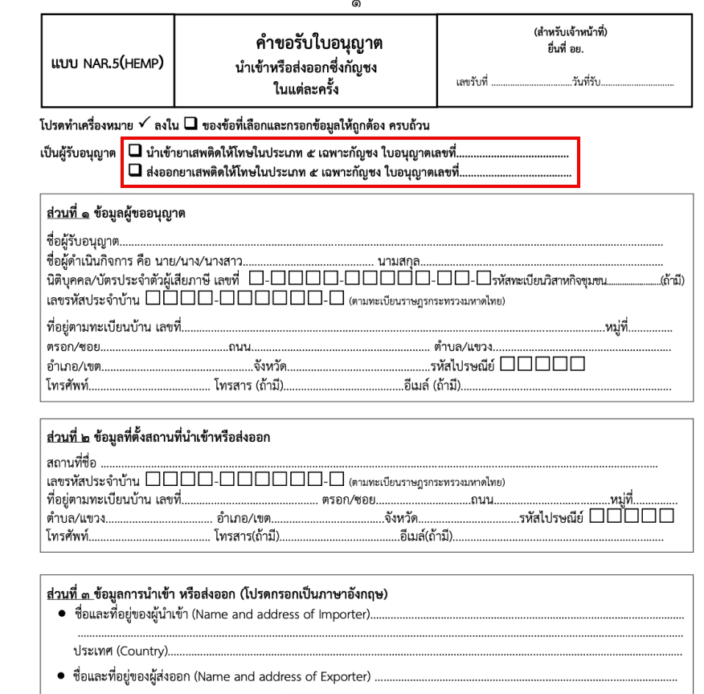

### เชื่อมโยงใบอนุญาต ยา อาหาร สมุนไพร เครื่องสำอาง กัญชา กัญชง

| ลำดับ | ใบอนุญาต | Endpoint | กองยา (ยส.3 วจ.3/4) | ยส.1-1 | วจ.1-1 | ผนส ยส.2/วจ.2 | ยส.5 | กาเฟอีน รร.1 | แต่ละครั้ง กัญชา (NAR.5) | แต่ละครั้ง กัญชง (NAR.5 (HEMP)) |
| :---: | :---: | --- | :---: | :---: | :---: | :---: | :---: | :---: | :---: | :---: |
| 1 | ใบอนุญาตยา   (ผย.1 นย.1 ขย.1 ขย.4) | | ✅ | ✅ | ✅ | ✅ | ✅ | ✅ | | |
| 2 | ใบอนุญาตอาหาร | | | | ✅ | | | ✅ | | |
| 3 | ใบอนุญาตเครื่องสำอาง | | | | ✅ | | | | | |
| 4 | ใบอนุญาตสมุนไพร | | | | ✅ | | | | | |
| 5 | ใบอนุญาตกัญชา (Mrjn) | /FdaNctAPI/GetList_Mrjn   /FdaNctAPI/GetData_Mrjn | | | | | | | ✅ | |
| 6 | ใบอนุญาตกัญชง (Hemp) | /FdaNctAPI/GetList_Hemp   /FdaNctAPI/GetData_Hemp | | | | | | | | ✅ |

---

#### วจ.1-1 (ใบอนุญาตอาหาร ใบอนุญาตเครื่องสำอาง ใบอนุญาตสมุนไพร)
 

#### รร.1 กาเฟอีน (ใบอนุญาตอาหาร ใบอนุญาตยา)

ใบอนุญาตนำเข้าหรือสั่งอาหาร (ใบอนุญาตอาหาร)
- การดึงข้อมูลเลขที่ใบอนุญาตอาหาร
- การดึงข้อมูล เลขสารบบอาหาร หรือเลขเสมือน (ทราบได้อย่างไรว่า เลขไหนมีกาเฟอีน)

ใบอนุญาตนำเข้ายา (นย.1)
- การดึงข้อมูลเลขที่ใบอนุญาตนำเข้ายา (นย.1) (ดึงได้แล้ว)
- การดึงข้อมูล เลขจดแจ้งเภสัชเคมีภัณฑ์ (ทราบอย่างไรว่า เลขไหนมีกาเฟอีน)

<!-- - ถ้า Provide เลขจดแจ้งเภสัชเคมีภัณฑ์ มาทั้งหมด จะกรองเลขจดแจ้งที่มีกาเฟอีน อย่างไร หรือ Provide เฉพาะที่มีกาเฟอีน -->

---

#### ยส.1-1 (ใบอนุญาตยา ได้รับแล้ว)
 

#### ยส.5 (ใบอนุญาตยา ได้รับแล้ว)
 

#### ผนส ยส.2 (ใบอนุญาตยา ได้รับแล้ว)
 

#### นำเข้า ส่งออก ในแต่ละครั้ง กัญชา (NAR.5) (ใบอนุญาตกัญชา/กัญชง ได้รับแล้ว)
 

#### นำเข้า ส่งออก ในแต่ละครั้ง กัญชง (NAR.5 (HEMP)) (ใบอนุญาตกัญชา/กัญชง ได้รับแล้ว)
 

