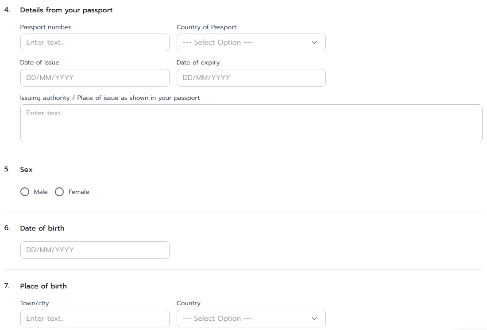
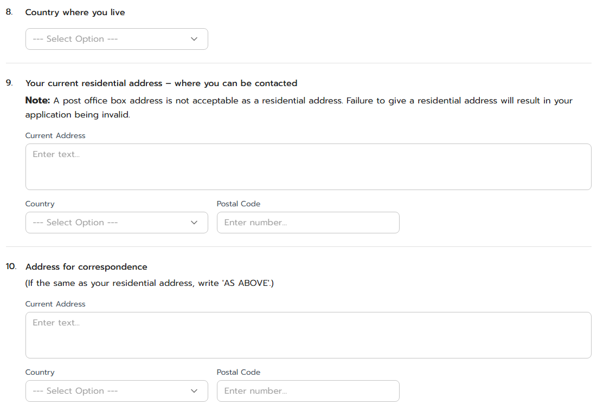

## Application for an **inbound carrying** by traveller under treatment of medical preparations containing substances under control of the single convention on narcotic drugs, 1961 and the convention on psychotropic substances, 1971 [IC-1]
## Application for an **outbound carrying** by traveller under treatment of medical preparations containing substances under control of the single convention on narcotic drugs, 1961 and the convention on psychotropic substances, 1971 [OC-1]
---

## (dbo.MasterRequisitionType Id = 23, 24)
### Links

- [Figma Group Doc](https://www.figma.com/design/0YEqdcSpC2hZKulzEl54LH/-FDA68--Group-Doc)
- [Data Dic - Master Data real](https://docs.google.com/spreadsheets/d/1WpRC41tmqyOc8zVaxTVuwLxGgmi7inZATo8_LcCTXgE)
- [FDA68 ScreenList Permit](https://docs.google.com/spreadsheets/d/1uKgx0P44X8NDJTdI_bmBAwMmZmILhjkv0fHYKaZywnI/)
- [FDA68 Data Dic - Permit real](https://docs.google.com/spreadsheets/d/12esKmz91FjovuOuxEVzF6tZDfe5Rdw_e_PAKkgL0ksU/)

- [Figma ยาติดตัว](https://www.figma.com/board/8Dw8uO6ERmYhbAsToiOZgm/%E0%B8%A2%E0%B8%B2%E0%B8%95%E0%B8%B4%E0%B8%94%E0%B8%95%E0%B8%B1%E0%B8%A7)

- [UAT URL - https://permitfortraveler.vercel.app](https://permitfortraveler.vercel.app)

## ประเภทการขอ

| ประเภทการขอ |
|---|
| 1. IC |
| 2. OC |

## 🔷 Field Condition (ยส.4-1)

| ลำดับ | Label | Table.Field | Condition | Remark |
|:---:|---|---|---|---|
| x | - | `RequisitionTraveler`.`RequisitionId` |  |  |
| 1 | ชื่อผู้รับอนุญาตที่รับมอบ | `RequisitionTraveler`.`TravelerPermitUserId` | | |
| 2 | นามสกุลของผู้เดินทาง | `RequisitionTraveler`.`FamilyName` | | |
| 3 | ชื่อตัวของผู้เดินทาง | `RequisitionTraveler`.`GivenName` | | |